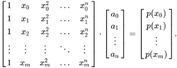

# Table of Contents

- [**MATH TOOLS**](#**math-tools**)
- [**PART 1**](#**part-1**)
  - [Libraries](#libraries)
  - [Basics](#basics)
    - [Change of bases](#change-of-bases)
    - [Plotting](#plotting)
    - [Lambda](#lambda)
    - [Lambda (map)](#lambda-(map))
    - [Lambda (filter)](#lambda-(filter))
    - [Lambda (reduce)](#lambda-(reduce))
    - [Closure & List functions](#closure-&-list-functions)
  - [Solving Equations](#solving-equations)
    - [Root Finding: Newton's Method](#root-finding:-newton's-method)
    - [Root finding: Quadratic formula](#root-finding:-quadratic-formula)
    - [Root finding: Bisection method](#root-finding:-bisection-method)
    - [Root finding: fsolve, root_scalar](#root-finding:-fsolve-root_scalar)
  - [Arrays/Matrices](#arrays/matrices)
    - [Matrix](#matrix)
    - [Matrix op's](#matrix-op's)
    - [Matrix multiplication](#matrix-multiplication)
    - [Ex: SIR model, graph wrt time](#ex:-sir-model-graph-wrt-time)
  - [Difference Equations](#difference-equations)
    - [Generic difference equation solver](#generic-difference-equation-solver)
    - [Ex: Logistic equation, periodicity & graphing attractors](#ex:-logistic-equation-periodicity-&-graphing-attractors)
    - [Higher-order difference equations***](#higher-order-difference-equations***)
    - [Fixed points](#fixed-points)
    - [T - periodic orbits](#t---periodic-orbits)
  - [Numerical differentiation](#numerical-differentiation)
    - [Newton's method](#newton's-method)
    - [Euler's method (Initial val problems)](#euler's-method-(initial-val-problems))
    - [Implicit (backwards) Euler's method](#implicit-(backwards)-euler's-method)
    - [Local extrema](#local-extrema)
    - [Point of inflection](#point-of-inflection)
    - [Ex: Maximizing $x_5$ ($f(f(f(f(f(x)))))$)](#ex:-maximizing-$x_5$-($f(f(f(f(f(x)))))$))
    - [Numdifftools](#numdifftools)
  - [Classes & Objects](#classes-&-objects)
- [**PART 2**](#**part-2**)
  - [Libraries](#libraries)
  - [Basics (More in Part 1)](#basics-(more-in-part-1))
    - [Plotting](#plotting)
    - [Matrix rows, columns](#matrix-rows-columns)
  - [Linear Algebra](#linear-algebra)
    - [Solving linear systems](#solving-linear-systems)
    - [Norm (magnitude) of a vector](#norm-(magnitude)-of-a-vector)
    - [Ex: nonlinear Newton's Method for solving linear systems](#ex:-nonlinear-newton's-method-for-solving-linear-systems)
    - [Polynomials](#polynomials)
    - [Vandermonde](#vandermonde)
    - [Ex: Polynomial interpolation 2](#ex:-polynomial-interpolation-2)
    - [Ex: Polynomial interpolation function](#ex:-polynomial-interpolation-function)
    - [EX: Linear Least Square Fitting, exponential growth rate](#ex:-linear-least-square-fitting-exponential-growth-rate)
    - [Eigenvectors/values](#eigenvectors/values)
    - [Ex: Find eigenvectors, values of matrix](#ex:-find-eigenvectors-values-of-matrix)
    - [Ex: Primary component analysis, height-weight](#ex:-primary-component-analysis-height-weight)
      - [Primary component](#primary-component)
      - [Secondary component](#secondary-component)
      - [Relate to variance](#relate-to-variance)
    - [Matrix transpose](#matrix-transpose)
    - [Matrix products](#matrix-products)
    - [Ex: Linear regression using matrix product](#ex:-linear-regression-using-matrix-product)
    - [Inverse matrix](#inverse-matrix)
    - [Ex: Solving multiple of linear system w same coefficient matrix using inverse](#ex:-solving-multiple-of-linear-system-w-same-coefficient-matrix-using-inverse)
    - [Change coordinate systems](#change-coordinate-systems)
    - [Ex: Change coordinate systems](#ex:-change-coordinate-systems)
    - [Ex2: Change coordinate system, lab Oct.12](#ex2:-change-coordinate-system-lab-oct12)
    - [Ex: Graph shape in coordinate system under regular coordinates](#ex:-graph-shape-in-coordinate-system-under-regular-coordinates)
    - [Diagonalization](#diagonalization)
    - [Example: Diagonalization, double/half along direction](#example:-diagonalization-double/half-along-direction)
    - [Spectral radius](#spectral-radius)
  - [Plotting](#plotting)
    - [The `plot` function](#the-`plot`-function)
    - [Adjusting axis](#adjusting-axis)
    - [Animation](#animation)
    - [Ex: Animating SIR curve as $\beta$ changes](#ex:-animating-sir-curve-as-$\beta$-changes)
    - [Ex: Animating a dot circling a curve](#ex:-animating-a-dot-circling-a-curve)
  - [Reading data](#reading-data)
    - [Opening a file](#opening-a-file)
    - [Alternative: `with` statement](#alternative:-`with`-statement)
    - [`split`](#`split`)
    - [`csv` module - reader](#`csv`-module---reader)
    - [Dictionaries](#dictionaries)
    - [`DictReader`](#`dictreader`)
    - [Best method: Pandas](#best-method:-pandas)
    - [DataFrame object](#dataframe-object)
    - [Read excel](#read-excel)
    - [Read from webpage](#read-from-webpage)
    - [Ex: Markov process/transition matrix](#ex:-markov-process/transition-matrix)
    - [Ex: Plot w primary components, $Z$ as measure of overweightness relative to pop.](#ex:-plot-w-primary-components-$z$-as-measure-of-overweightness-relative-to-pop)
  - [Random nums/stochastic processes](#random-nums/stochastic-processes)
    - [Probability, distributions & RV's](#probability-distributions-&-rv's)
    - [`random` function](#`random`-function)
    - [`seed` function](#`seed`-function)
    - [Ex: Coin flip (Bernoulli)](#ex:-coin-flip-(bernoulli))
    - [`choice` function](#`choice`-function)
    - [`cumsum` function](#`cumsum`-function)
    - [Ex: Random walk](#ex:-random-walk)
    - [Ex: 2-dim random walk](#ex:-2-dim-random-walk)
    - [Ex: 10 particles taking 2d random walk (Discrete brownian motion)](#ex:-10-particles-taking-2d-random-walk-(discrete-brownian-motion))
    - [Ex: Rain drops in lake](#ex:-rain-drops-in-lake)
    - [`binomial` random variables](#`binomial`-random-variables)
    - [Ex: SIR model w binomials](#ex:-sir-model-w-binomials)
    - [Ex: 100 paths random walk](#ex:-100-paths-random-walk)
    - [Ex: Population of bacteria](#ex:-population-of-bacteria)
    - [`normal` random variables](#`normal`-random-variables)
    - [`diff` function](#`diff`-function)
    - [Ex: Brownian motion (diffusion)](#ex:-brownian-motion-(diffusion))
    - [Ex: Graphing density of diffusing particles (Brownian motion) in intervals](#ex:-graphing-density-of-diffusing-particles-(brownian-motion)-in-intervals)
    - [Ex: Brownian motion lab](#ex:-brownian-motion-lab)
  - [Symbolic calculation](#symbolic-calculation)
    - [`sympy` symbols](#`sympy`-symbols)
    - [`sympy` expressions](#`sympy`-expressions)
    - [Simplifying expressions](#simplifying-expressions)
    - [Solving equations](#solving-equations)
    - [Solving linear systems](#solving-linear-systems)
    - [Ex: Solving two eqns in three variables](#ex:-solving-two-eqns-in-three-variables)
    - [Solving nonlinear systems](#solving-nonlinear-systems)
    - [Substitution](#substitution)
    - [Numerical evaluation: subs & lambdify](#numerical-evaluation:-subs-&-lambdify)
    - [Ex: Solve for radius r as function of x](#ex:-solve-for-radius-r-as-function-of-x)
    - [Ex: Equilibrium of SIR](#ex:-equilibrium-of-sir)
    - [Piecewise functions](#piecewise-functions)
    - [Limits](#limits)
    - [Derivatives/Differentiation](#derivatives/differentiation)
    - [Implicit differentiation](#implicit-differentiation)
    - [Taylor series: `.series()`, `.removeO()` & `.expand()`](#taylor-series:-`series()`-`removeo()`-&-`expand()`)
    - [Integration](#integration)
    - [Differential equations](#differential-equations)
    - [Ex: Equilibrium of DE's](#ex:-equilibrium-of-de's)
    - [Ex: CP's in sympy](#ex:-cp's-in-sympy)
    - [Ex: Moments, critical points, inflection](#ex:-moments-critical-points-inflection)
    - [Ex: Mass and moments, constant density 1 (Full ex: Rolling wheel, Nov. 9)](#ex:-mass-and-moments-constant-density-1-(full-ex:-rolling-wheel-nov-9))
      - [Mass](#mass)
      - [Moment of inertia about the $x$-axis](#moment-of-inertia-about-the-$x$-axis)
    - [Ex: Rod w radius profile...](#ex:-rod-w-radius-profile)
- [**PART 3**](#**part-3**)
  - [Libraries](#libraries)
  - [Numerical integration (Quadrature)](#numerical-integration-(quadrature))
    - [`scipy.integrate`](#`scipyintegrate`)
    - [Ex: 4th moment of std. normal distribution](#ex:-4th-moment-of-std-normal-distribution)
    - [Double integrals](#double-integrals)
    - [Ex: Center of mass, 2d object](#ex:-center-of-mass-2d-object)
    - [Triple integrals](#triple-integrals)
    - [Ex: Center of mass of 3D volume](#ex:-center-of-mass-of-3d-volume)
    - [Multiple integrals in general: `nquad` (best for quad)](#multiple-integrals-in-general:-`nquad`-(best-for-quad))
    - [Ex: Rolling shell vs ball](#ex:-rolling-shell-vs-ball)
  - [Optimization](#optimization)
    - [Linear programming w `scipy.optimize`](#linear-programming-w-`scipyoptimize`)
    - [Ex: Linear programming 2](#ex:-linear-programming-2)
    - [Ex: Linear programming 3](#ex:-linear-programming-3)
    - [Nonlinear unconstrained optimization; `minimize(f, x0)`](#nonlinear-unconstrained-optimization;-`minimize(f-x0)`)
    - [Ex: minimize](#ex:-minimize)
    - [Ex: Minimize distance from point to ellipse](#ex:-minimize-distance-from-point-to-ellipse)
    - [Ex: Least square, exponential](#ex:-least-square-exponential)
    - [Ex: Solving exponential for time](#ex:-solving-exponential-for-time)
    - [Ex: Parameter estimation; poisson regression](#ex:-parameter-estimation;-poisson-regression)
    - [Ex: Implied constraints - ln(x)](#ex:-implied-constraints---ln(x))
    - [Linear, nonlinear constraints](#linear-nonlinear-constraints)
    - [Ex: Regression, exponential growth scale](#ex:-regression-exponential-growth-scale)
    - [Ex: Least square regression using minimize](#ex:-least-square-regression-using-minimize)

# **MATH TOOLS**

# **PART 1**

[Back to Top](#table-of-contents)

## Libraries

[Back to Top](#table-of-contents)


```python
# Gravity; example from lec.1
from scipy.constants import g

# Numpy: 
import numpy as np
# Used for
# - np.exp(x) Exponential fn
# - Plotting: 
#       - np.arange(startVal, endVal, stepSize), 
#       - np.linspace(startVal, endVal, numSteps)
# - np.sqrt(x) Sqrt
# - np.abs(x) Absolute val
# - matmul(A, B) Multiplies two matrixes, reminder must be 
# - np.zeros((m, n)) Returns mxn matrix of zeros

# Matplotlib.pyplot
import matplotlib.pyplot as plt

# import math
# - from math import log
# Better to use numpy!

# Root finding:
# 1. Root scalar
from scipy.optimize import root_scalar
# Takes arguments f, df(req'd for newton), args=()(required for function with args), 
# bracket=[](req'd for bisect), x0(req'd), x1, xtol(absolute tolerance for termination), 
# rtol, maxiter(max iterations)
# help(root_scalar)
# Note: Method must be in quotes, i.e. "newton"
from scipy.optimize import fsolve
# Takes args f, x0, args=(), xtol, maxfev(max num calls to function)
# Can solve multi-dimensional equations, such as SIR model

# Use to take derivatives
import numdifftools as nd
# 
```

## Basics

[Back to Top](#table-of-contents)

### Change of bases

[Back to Top](#table-of-contents)


```python
# Base 10 to base b

num = 321
base = 8
numB = []
q = num

while q != 0:
    dn = q % base
    q = q // base
    numB.insert(0, dn)

print(numB)
```

    [5, 0, 1]


### Plotting

[Back to Top](#table-of-contents)


```python
# import
import matplotlib.pyplot as plt
import numpy as np

# basic plt.plot(): plotting sin(x), 100  x values from 0 to pi. 
xs = np.linspace(0,np.pi,100)
ys = np.sin(xs)

R0=2
xS = np.arange(0,1,0.01) # Z = 0, 0.01, 0.02, ..., 0.99
yS = [np.exp(-R0*x) for x in xS] # Gives array of exponents of each val in xS

plt.plot(xs,ys, '--g')

# Extra:
# plt.subplot(1, 2, 1) # row 1, col 2 index 1
# plt.plot(xs,ys, '--g')
# plt.subplot(1, 2, 2) # index 2
# plt.plot(xS, yS, '--r')
```


    [<matplotlib.lines.Line2D at 0x7f905cccd6d0>]


    

    


### Lambda

[Back to Top](#table-of-contents)


```python
# you can write a function that returns a function
def f(n):
    def g(x):
        return x**n
    return g
# Test
a = f(4) # returns a function g(x) that computes x**3
print(a(2))

# this can be rewritten as returning an lambda expression
def F(n):
    return lambda x: x**n
# Test
b = F(4) # returns x**4
print(b(2))


# or, even an rewritten as a lambda function returning a lambda function
F = lambda n: lambda x: x**n # Note: Taking n from previous code
# Test
c = F(4)
print(c(2)) #16
print(F(4)(2)) #64; Since x is inner function, n outer, x^n, give n first then x
```

    16
    16
    16
    16


### Lambda (map)

[Back to Top](#table-of-contents)


```python
# The `map` function returns an iterator, which applies a function to every element of a list.
# To convert the iterator to a list, you pass it thru list()
# Usage: map(f, l) where f is a function, l is a list

list(map((lambda x: x**2), range(0, 4)))
```


    [0, 1, 4, 9]


### Lambda (filter)

[Back to Top](#table-of-contents)


```python
# The `filter` function applies a function that returns a boolean value to every element of a list, 
# collects elements that return `True` into an iterator
# To convert iterator to a list, must pass through list()
# Usage: Filter (f, l) where f is a function that ret's bool, l is a list

print(list(filter((lambda x: x**2 > 10), (1, 2, 3, 4, 5))))

# or

#or, for simplification
ffilter = lambda f, l: list(filter(f, l))
print(ffilter((lambda x: x**2 > 10), (1, 2, 3, 4, 5)))
```

    [4, 5]
    [4, 5]


### Lambda (reduce)

[Back to Top](#table-of-contents)


```python
# Applies a function of two arguments cumulatively to the items of a list
# Usage: reduce(f, l, v0)
# `f` is a function that takes two arguments, i.e., `f(v, x)`
#   - `v` is the value of f in the previous iteration
#   - `x` takes values in l consecutively
# `l` is an iterable, e.g., a list or a tuple, that can be indexed

from functools import reduce
Sum = lambda l: reduce((lambda x, y: x+y), l) # A function l that returns the reduction 
                                                # (function sum x and y sum x and y) of list l
l = [2, 3, 4]
print(sum(l))
print(Sum(l))

pwr = lambda l: reduce((lambda x, y: x**y), l) # returns (2^3)^4 = 8^4 = 4096
pWr = lambda l: reduce((lambda x, y: y**x), l) # returns (3^2)^4 = 4^9 = 262144
print(pwr(l))
print(pWr(l))
```

    9
    9
    4096
    262144


### Closure & List functions

[Back to Top](#table-of-contents)


```python
# Simple ex:
# For n in 0, 1, 2, ... make list of x^n
l = []
L = []
for n in range(0, 4): # n = 0, 1, 2, 3
    l = l + [lambda x: x**n] # Incorrect, n called at last known value = end of loop = 3

for n in range(0, 4):
    L = L + [lambda x, i=n: x**i] # Correct, i set at each individual value of n


print('n=', n)
print(l[0](2), l[1](2), l[2](2), l[3](2)) # (l[n](2)) returning 2^3, last known val of n
print(L[0](2), L[1](2), L[2](2), L[3](2)) # (l[i](4)) returning 2^i
```

    n= 3
    8 8 8 8
    1 2 4 8


## Solving Equations

[Back to Top](#table-of-contents)

### Root Finding: Newton's Method

[Back to Top](#table-of-contents)

Ex: $e^{-2*z}-1+z$


```python
import numpy as np
def Newton(f, df, x0, epsilon):
  fx = f(x0)
  while np.abs(fx) >= epsilon:
    df0 = df(x0)
    x0 = x0 - fx / df0
    fx = f(x0)
  return x0

def f(Z):
    return np.exp(-2*Z)-1+Z
def df(Z):
    return -2*np.exp(-2*Z)+1

Newton(f, df, 0.5, 1e-6)
```


    0.7968121582003599


\+ Note: Python cannot compute root of $\sqrt[3]{x}$ using newton's method due to negatives.

**Solution:** Use $\text{sign}(x) \sqrt[3](|x|)$,


```python
x=-0.001
(2*(x>0)-1) * abs(x)**(1/3) #Note: 1st part returns -1 or 1 according to sign of x
```


    -0.10000000000000002


### Root finding: Quadratic formula

[Back to Top](#table-of-contents)

Ex: 
1. Interseciton of $y = -1$ with ellipse
$$x^2+xy+2y^2+2x+2y=1$$

Soln: Plug in $y=-1$, solve using quadratic formula:
$$x = \frac{-b\pm\sqrt{b^2-4ac}}{2a}$$

2. Distance of roots from the origin

Soln: Distance eqn $$d = \sqrt{(x_2-x_1)^{2}+(y_2-y_1)^{2}}$$


```python
import numpy as np

# Set variables
a, b, c, y = 1, 1, -1, -1

# Compute discriminant
delta = np.sqrt(b**2-4*a*c)

# Find solutions and print
x1 = (-b+delta)/(2*a)
x2 = (-b-delta)/(2*a)
print("1. x1=", x1, "x2=", x2)


# Calculate distance of x1, x2 from origin; d1, d2
d1 = np.sqrt(x1**2+y**2)
d2 = np.sqrt(x2**2+y**2)
print("2. D1=", d1, "D2=", d2)
```

    1. x1= 0.6180339887498949 x2= -1.618033988749895
    2. D1= 1.1755705045849463 D2= 1.902113032590307


### Root finding: Bisection method

[Back to Top](#table-of-contents)

Guarantees a root, including in non-differentiable functions.

Idea: 
- If $f(a)$, $f(b)$ have different signs, there's a root in $[a, b]$.
- For $c = \frac{a+b}{2}$, f(c) has a different sign from either f(a) or f(b). Whichever has a different sign gives a new interval closer to root.
- Continue, closing in on root.

Ex: solve the final size relationship 
$$ 1-Z = e^{-\mathcal R_0Z}$$
with $\mathcal R_0=2$


```python
from numpy import exp

R0 = 2
# a and b are the endpoints of the interval
a = 0.01
b = 1
# the function value at the two end points
fa = exp(-R0*a) - 1 + a
fb = exp(-R0*b) - 1 + b

# the error
epsilon = 1e-3

if fa == 0:
    print("the root is", a)
elif fb == 0: # elif means else if
    print("the root is", b)
elif fa*fb > 0: 
    print("f(a) and f(b) must have same signs")
else:
    # the guess if the mid point of [a,b]
    x = (a+b)/2
    fx = exp(-R0*x) - 1 + x
    while (b - a) / 2 > epsilon and fx != 0: # if f(x) == 0 then x is the root
        if fx * fa < 0 : # the next interval is [a,x]
            b = x
            fb = fx
        else: # the next interval is [x, b]
            a = x
            fa = fx
        x = (a+b)/2
        fx = exp(-R0*x) - 1 + x
        print("x =", x)
    print("the root is", x)
```

    x = 0.7525
    x = 0.87625
    x = 0.814375
    x = 0.7834375
    x = 0.7989062499999999
    x = 0.791171875
    x = 0.7950390624999999
    x = 0.7969726562499999
    x = 0.7960058593749999
    the root is 0.7960058593749999


### Root finding: fsolve, root_scalar

[Back to Top](#table-of-contents)


```python
from scipy.optimize import fsolve, root_scalar

f = lambda x, n: x**n + 1
df = lambda x, n: n*x**(n-1)

solnF = fsolve(f, x0=1, args=3)
solnR = root_scalar(f, args = 3, x0=1, fprime = df)
print(solnF)
print(solnR)


# Note: Maxfev determines max number of 'calls to function' (iterations)
```

    [-1.]
          converged: True
               flag: converged
     function_calls: 18
         iterations: 9
               root: -1.0


## Arrays/Matrices

[Back to Top](#table-of-contents)

### Matrix

[Back to Top](#table-of-contents)


```python
import numpy as np
A = np.array([[1,2,3], [4,5,6], [7,8,9]])

print(A.shape)

print(A[1]) # Prints row 2
print(A[:,2]) # Prints column 3
print(A[1, 2])
```

    (3, 3)
    [4 5 6]
    [3 6 9]
    6


### Matrix op's

[Back to Top](#table-of-contents)


```python
import numpy as np

from numpy import array

a = np.array([1, 2, 3])
b = np.array([4,5,6])
c = [1, 2, 3]
d = [4, 5, 6]

print("a =", a)
print("b =", b)
print("c =", c)
print("d =", d)
print("a + b =", a+b)
print("a - b =", a-b)
print("c + d =", c+d) # Concatenates lists, add/sub/mult/div requires matrices
# print("c - d =", c-d) # Throws error - not concatenation

print("a * b =", a*b)
print("c * 10 =", c*10)
print("a / b =", a/b)

# Dot product:
dot = sum(a*b)
print(dot)
```

    a = [1 2 3]
    b = [4 5 6]
    c = [1, 2, 3]
    d = [4, 5, 6]
    a + b = [5 7 9]
    a - b = [-3 -3 -3]
    c + d = [1, 2, 3, 4, 5, 6]
    a * b = [ 4 10 18]
    c * 10 = [1, 2, 3, 1, 2, 3, 1, 2, 3, 1, 2, 3, 1, 2, 3, 1, 2, 3, 1, 2, 3, 1, 2, 3, 1, 2, 3, 1, 2, 3]
    a / b = [0.25 0.4  0.5 ]
    32


### Matrix multiplication

[Back to Top](#table-of-contents)


```python
# Reminder: Given mxn, nxp matrices, returns mxp, where for ixj i=rows, j=col's.
import numpy as np

A = np.array([[1,2,3], [4,5,6], [7,8,9]])
print(np.matmul(A, [1,1,1]))
print(np.matmul([1,1,1], A))
```

    [ 6 15 24]
    [12 15 18]


### Ex: SIR model, graph wrt time

[Back to Top](#table-of-contents)


```python
import numpy

def SIR(times, I0, beta, gamma, N):
    # create the matrix
    V = np.zeros((len(times), 3))
    # the initial condition is the first row 
    S = N-I0
    I = I0
    R = 0
    V[0] = [S, I, R]
    # for each successive time point, compute the number of infections and recoveries
    # and compute the S, I and R
    for t in range(1,len(times)):
        infections = beta * S * I / N
        recoveries = gamma * I
        S = S - infections
        I = I + infections - recoveries
        R = R + recoveries
        V[t] = [S, I, R]
    return V

t = range(0, 80)
V = SIR(t, 10, 0.5, 0.25, 1000)

from matplotlib.pyplot import plot
# I is the second column of V, i.e., V[:,1]
plot(t, V[:,1], '-r')
```


    [<matplotlib.lines.Line2D at 0x7f9036771050>]


    

    


## Difference Equations

[Back to Top](#table-of-contents)

Equation of the form
$$
X_{n+1} = f(X)
$$

### Generic difference equation solver

[Back to Top](#table-of-contents)


```python
from numpy import zeros

# Takes function f, x0, p: List of parameters, N: Number of time pt's
# Returns a matrix, each row corresponds to a time point, each column is a variable

def difference(f, x0, p, N):
    if type(x0) is list:
        m = len(x0) # the dimension of the difference equations (the number of equations)
    else:
        m = 1 
    V = zeros((N+1, m)) # N = the number of time points, not incl. 0
    V[0] = x0
    for i in range(1, N+1):
        if p is None:
            V[i] = f(V[i-1])
        else:
            V[i] = f(V[i-1], p)
    return(V)
```

### Ex: Logistic equation, periodicity & graphing attractors

[Back to Top](#table-of-contents)

$$ X_{n+1} = rX_{n}\left(1-\frac{X_n}{K}\right)$$
Let $x_n = X_n/K$, then
$$ x_{n+1} = rx_{n}\left(1-x_n\right)$$


```python
import matplotlib.pyplot as plt

# Define logistic function
logistic = lambda x, r: r*x*(1-x)

# Define axes for graphs
fig, axs = plt.subplots(2, 2)

# Not periodic
x1 = difference(logistic, x0=0.1, p=1.5, N=50)
x2 = difference(logistic, x0=0.8, p=1.5, N=50)
axs[0,0].plot(range(0, 51), x1, '--*r', range(0, 51), x2, '--*b')

x3 = difference(logistic, x0=0.1, p=0.9, N=50)
x4 = difference(logistic, x0=0.8, p=0.9, N=50)
axs[0,1].plot(range(0, 51), x3, '--*r', range(0, 51), x4, '--*b')

x5 = difference(logistic, x0=0.1, p=3.2, N=50)
x6 = difference(logistic, x0=0.8, p=3.2, N=50)
axs[1,0].plot(range(0, 51), x5, '--*r', range(0, 51), x6, '--*b')

x7 = difference(logistic, x0=0.1, p=3.5, N=50)
x8 = difference(logistic, x0=0.8, p=3.5, N=50)
axs[1,1].plot(range(0, 51), x7, '--*r', range(0, 51), x8, '--*b')


```


    [<matplotlib.lines.Line2D at 0x7f9035de6a10>,
     <matplotlib.lines.Line2D at 0x7f9035de6850>]


    

    


```python
import numpy as np
import matplotlib.pyplot as plt

for r in np.arange(0.9, 4.3, 0.01):
    ys = difference(logistic, x0=0.5, p=r, N=1000)
    plt.plot([r]*100, ys[-100:], 'k.', markersize=0.5)

```

    /tmp/ipykernel_91587/2900144683.py:4: RuntimeWarning: overflow encountered in multiply
      logistic = lambda x, r: r*x*(1-x)


    

    


### Higher-order difference equations***

[Back to Top](#table-of-contents)

General: Use a simple array, index n, n-1, ... , n-i

### Fixed points

[Back to Top](#table-of-contents)

Can be solved from the equation $f(x)-x=0$  
\+ Example: the fixed point of the logistic map $x_{n+1}=rx_n(1-x_n)$ at $r=1.5$


```python
# Solving fixed point equation of logistic map

def f(x, r):
    return r*x*(1-x) - x

from scipy.optimize import root_scalar

def df(x, r):
    return r - 2*r*x - 1

root_scalar(f, args=1.5, x0=0.5, fprime=df)
```


          converged: True
               flag: converged
     function_calls: 10
         iterations: 5
               root: 0.3333333333333334


### T - periodic orbits

[Back to Top](#table-of-contents)


```python
from functools import reduce
from scipy.optimize import fsolve

# Where x, f(x), f(f(x)) .... F_n(c) cycles.
# One orbit/n-period = Full rotation - 1

# Helps to be able to calculate f(f(f(...(x)))) = F_n(x)
logistic = lambda x: r*x*(1-x)

# Fancy method:
compose = lambda f, g: ( lambda x: f(g(x)) )
identity = lambda x : x
composite = lambda f, n: identity if n == 0 else reduce(compose, [f] * n)

r = 3.83
x = fsolve(lambda x: composite(logistic, 3)(x)-x, 0.6) # Gives f(f(f(x)))
for i in [0, 1, 2, 3]:
    print(composite(logistic, i)(x)) # Prints a 3-period

print("")

# Simple method:
def Composite(f, n):
    if n == 0:
        return identity
    return reduce(compose, [f] * n)

for i in [0, 1, 2, 3]:
    print(Composite(logistic, i)(x)) # Prints a 3-period

#---------------------------------------------------------#
# Example w many variables:

# # Define composition functions
# compose = lambda f, g: (lambda x, p: f(g(x, p), p))
# identity = lambda x, n: x
# composite = lambda f, n: identity if n == 0 else reduce(compose, [f] * n) # Ask at office hours! What would this give? (Not f(x))

# # Get initial x-value
# x = fsolve(lambda x: composite(f, 2)(x, p)-x, 0.5) # Gives f(f(x))

# # Compose repeatedly
# for i in range(1, 100):
#     print(composite(f, i)(x, p))
```

    [0.52400053]
    [0.95529382]
    [0.16356986]
    [0.52400053]
    
    [0.52400053]
    [0.95529382]
    [0.16356986]
    [0.52400053]


## Numerical differentiation

[Back to Top](#table-of-contents)

### Newton's method

[Back to Top](#table-of-contents)


```python
from math import fabs

# numerical differentiation using the central difference
def d(f, x, h=1e-5):
    return (f(x+h) - f(x-h)) / (2*h)

# numerical differentiation using the forward difference
def D(f, x, h=1e-8):
    return (f(x+h) - f(x)) / h

# solve f(x)=0 using the Newton's method with an initial guess x0
# fprime is f'(x), or None for numerical differentiation
# D is the function used for numerical differentiation
# epsilon is the termination condition, i.e, |f(x)|<epsilon
# maxiter is the maximum number of iterations, because Newton's method may not converge
# returns the root and the numer of iterations performed
def Newton(f, x0, fprime=None, D=d, epsilon=1e-6, maxiter=1000):
    f0 = f(x0)
    for i in range(1, maxiter+1):
        df = D(f, x0) if fprime is None else fprime(x0)
        x1 = x0 - f0 / df
        f1 = f(x1)
        if fabs(f1) < epsilon:
            break
        x0 = x1
        f0 = f1
    if i == maxiter:
        print ("maximum number of iterations reached without convergence")
    return x1, i


# Ex: Use
from math import exp

R0 = 2
f = lambda Z: 1 - Z - exp(-R0*Z)
df = lambda Z: -1 + R0*exp(-R0*Z) # Analytic derivative
Z, iter = Newton(f, x0 = 0.5, fprime = df)
print("analytic derivative:", Z, "iterations:", iter)

Z, iter = Newton(f, x0 = 0.5)
print("central difference:", Z, "iterations:", iter)

Z, iter = Newton(f, x0 = 0.5, D=D)
print("forward difference:", Z, "iterations:", iter)
```

    analytic derivative: 0.7968121582003599 iterations: 4
    central difference: 0.7968121582003495 iterations: 4
    forward difference: 0.7968121582034714 iterations: 4


### Euler's method (Initial val problems)

[Back to Top](#table-of-contents)

$$x'=f(t,x),\;x(t_0)=x_0$$


```python
from numpy import zeros

# solve x'=f(t,x) using the Euler method
# t is an array of time points, t[0]=t0
# x0 = x(t0) is the intial condition of the ODE
# return an array of x values at the corresponding time points in t
def Euler(f, t, x0):
    n = len(t)
    x = zeros(n) # solution
    x[0] = x0
    for i in range(1, n): # starting from t[1]
        h = t[i] - t[i-1]
        x[i] = x[i-1] + h * f(t[i-1], x[i-1])
    return x

from numpy import arange, exp

# solve x'=-x
t = arange(0, 10, 0.13)
f = lambda t, x: -x
x = Euler(f, t, 1)
# true solution
X = exp(-t)

from matplotlib.pyplot import plot, figure, title
figure(0)
plot(t, x, '-r', t, X, '--b')
title("solution")
figure(1)
error = x-X
plot(t, x-X)
title("error")
```


    Text(0.5, 1.0, 'error')


    

    


    

    


### Implicit (backwards) Euler's method

[Back to Top](#table-of-contents)

$$x_{n-1} = x_n - hf(t_n, x_n)$$


```python
from numpy import zeros

# solve x'=f(t,x) using the implicitly Euler method
# using Newton's method to solve the implicit relationship
# epsilon gives termination condition for Newton's method
# t is an array of time points, t[0]=t0
# x0 = x(t0) is the initial condition of the ODE
# return an array of x values at the corresponding time points in t
def ImplicitEuler(f, t, x0, epsilon=1e-8):
    n = len(t)
    x = zeros(n) # solution
    x[0] = x0
    g = lambda x0, x1, h: x1 - h*f(t, x1) - x0
    for i in range(1, n): # starting from t[1]
        h = t[i] - t[i-1]
        x[i], iter = Newton(lambda xi: g(x[i-1], xi, h), x[i-1], epsilon=epsilon) # Use this or root scalar, etc.
    return x

from numpy import arange, exp
t = arange(0, 1, 0.13)

# solve x'=-15x
f = lambda t, x: -15*x
x = ImplicitEuler(f, t, 1)

xe = Euler(f, t, 1)

# True soln
X = exp(-15*t)

figure(0)
plot(t, x, '-r', t, X, '--b', t, xe, '-g')
title("solution")
figure(1)
error = x-X
plot(t, error)
title("error")
```


    Text(0.5, 1.0, 'error')


    

    


    

    


### Local extrema

[Back to Top](#table-of-contents)


```python
from scipy.optimize import fsolve

def d(f, x, h=1e-5):
    return (f(x+h) - f(x-h)) / (2*h)

f = lambda x: x*exp(-2*x)
df = lambda x: d(f, x)

# Note: In exam, should graph in order to ensure a correct solution
x = arange(0, 15, 0.1)
plot(x, f(x))

print(fsolve(df, 0.1))

```

    [0.5]


    

    


### Point of inflection

[Back to Top](#table-of-contents)

Where f''(x) = 0, f'(x) changes sign

### Ex: Maximizing $x_5$ ($f(f(f(f(f(x)))))$)

[Back to Top](#table-of-contents)


```python
# Import necessary modules
from scipy.optimize import fsolve
from numpy import exp, arange, zeros
from functools import reduce

f = lambda x: x*exp(-x)
df = lambda f, h=1e-8: lambda x: (f(x+h)-f(x))/h  # Rewrite as regular function

compose = lambda f, g: (lambda x: f(g(x)))
identity = lambda x, n: x
composite = lambda f, n: identity if n == 0 else reduce(compose, [f] * n)

# composite = lambda f, n: (lambda x, n: x) if n == 0 else reduce(lambda f, g: (lambda x: f(g(x))), [f] * n)

fx5 = composite(f, 5)

soln = fsolve(df(fx5), x0 = 4)
print(soln)
```

    [0.99999992]


```python
# Ex: critical pt of cosh near x0=1.4
import numdifftools as nd
from numpy import cosh

f = lambda x: cosh(x**2-2)
df = nd.Derivative(f)

cp = fsolve(df, 1.4)
print(cp, df(cp))
d2f = nd.Derivative(f, n=2)
print(d2f(cp))
```

    [1.41421356] [1.84622094e-14]
    [8.]


### Numdifftools

[Back to Top](#table-of-contents)


```python
# Easy way to take a derivative
# Usage: dif = nd.Derivative(f, n=i), dif(x) gives ith derivative at x
import numdifftools as nd
import matplotlib.pyplot as plt

# Ex:
import numpy as np

def SIS(t, i0, beta, gamma, n):
    iN = lambda ix: (n-ix)*(1-np.exp((-beta*ix)/n)) - gamma*i0 + ix
    arr = np.zeros(t+1)
    arr[0]= i0
    for i in range(1, t+1):
        arr[i] = iN(arr[i-1])
    return arr
#---------------------------------------#

from scipy.optimize import fsolve
import numdifftools as nd

t, i0, gamma, n = 10, 1, 0.25, 2000

# Rewrite the function to take only beta as an argument,
# Output only I_10
f = lambda beta: SIS(t, i0, beta, gamma, n)[10]

df, ddf, dddf = nd.Derivative(f, n=1), nd.Derivative(f, n=2), nd.Derivative(f, n=3)

x = fsolve(ddf, 1)
print("Solution: ", x)

# The rest of the code is for verification purposes and is not a part of the solution
print("Verify concavity:", dddf(x))
print("Value at solution is negative, thus is a max by 2nd derivative test.")

print("Note that max of graph occurs at solution:")
ys = []
xs = []
for beta in np.arange(0, 4, 0.01):
    ys.append(df(beta))
    xs.append(beta)
plt.plot(xs, ys, '.')
```

    /tmp/ipykernel_91587/241731370.py:14: DeprecationWarning: Conversion of an array with ndim > 0 to a scalar is deprecated, and will error in future. Ensure you extract a single element from your array before performing this operation. (Deprecated NumPy 1.25.)
      arr[i] = iN(arr[i-1])
    /tmp/ipykernel_91587/241731370.py:14: DeprecationWarning: Conversion of an array with ndim > 0 to a scalar is deprecated, and will error in future. Ensure you extract a single element from your array before performing this operation. (Deprecated NumPy 1.25.)
      arr[i] = iN(arr[i-1])
    /tmp/ipykernel_91587/241731370.py:14: DeprecationWarning: Conversion of an array with ndim > 0 to a scalar is deprecated, and will error in future. Ensure you extract a single element from your array before performing this operation. (Deprecated NumPy 1.25.)
      arr[i] = iN(arr[i-1])
    /tmp/ipykernel_91587/241731370.py:14: DeprecationWarning: Conversion of an array with ndim > 0 to a scalar is deprecated, and will error in future. Ensure you extract a single element from your array before performing this operation. (Deprecated NumPy 1.25.)
      arr[i] = iN(arr[i-1])
    /tmp/ipykernel_91587/241731370.py:14: DeprecationWarning: Conversion of an array with ndim > 0 to a scalar is deprecated, and will error in future. Ensure you extract a single element from your array before performing this operation. (Deprecated NumPy 1.25.)
      arr[i] = iN(arr[i-1])
    /tmp/ipykernel_91587/241731370.py:14: DeprecationWarning: Conversion of an array with ndim > 0 to a scalar is deprecated, and will error in future. Ensure you extract a single element from your array before performing this operation. (Deprecated NumPy 1.25.)
      arr[i] = iN(arr[i-1])
    /tmp/ipykernel_91587/241731370.py:14: DeprecationWarning: Conversion of an array with ndim > 0 to a scalar is deprecated, and will error in future. Ensure you extract a single element from your array before performing this operation. (Deprecated NumPy 1.25.)
      arr[i] = iN(arr[i-1])
    /tmp/ipykernel_91587/241731370.py:14: DeprecationWarning: Conversion of an array with ndim > 0 to a scalar is deprecated, and will error in future. Ensure you extract a single element from your array before performing this operation. (Deprecated NumPy 1.25.)
      arr[i] = iN(arr[i-1])
    /tmp/ipykernel_91587/241731370.py:14: DeprecationWarning: Conversion of an array with ndim > 0 to a scalar is deprecated, and will error in future. Ensure you extract a single element from your array before performing this operation. (Deprecated NumPy 1.25.)
      arr[i] = iN(arr[i-1])
    /tmp/ipykernel_91587/241731370.py:14: DeprecationWarning: Conversion of an array with ndim > 0 to a scalar is deprecated, and will error in future. Ensure you extract a single element from your array before performing this operation. (Deprecated NumPy 1.25.)
      arr[i] = iN(arr[i-1])
    /tmp/ipykernel_91587/241731370.py:14: DeprecationWarning: Conversion of an array with ndim > 0 to a scalar is deprecated, and will error in future. Ensure you extract a single element from your array before performing this operation. (Deprecated NumPy 1.25.)
      arr[i] = iN(arr[i-1])


    Solution:  [1.15977131]
    Verify concavity: -44103.42466100757
    Value at solution is negative, thus is a max by 2nd derivative test.
    Note that max of graph occurs at solution:


    [<matplotlib.lines.Line2D at 0x7f90351db190>]


    

    


## Classes & Objects

[Back to Top](#table-of-contents)


```python
# Ex: Class w method
class FreeFall:
    def __init__(self, v0, x0): # the constructor
        self.v0 = v0 # an instance variable
        self.x0 = x0 # another instance variable. 
    
    g = 9.8 # a class variable
    
    def value(self, t): # a method
        # instance variables and class variables can all be accessed by the self.variable form 
        return -self.g/2 * t**2 + self.v0 * t + self.x0 


# Ex: Instances w individual variables
x1 = FreeFall(v0 = 1, x0 = 0)
print("x1.v0=", x1.v0)
print("x1.value(0)=", x1.value(t=0)) # note we do not pass self
print("x1.g=", x1.g)

x2 = FreeFall(v0 = 0, x0 = 1)
print("x2.v0=", x2.v0)
print("x2.value(0)=", x2.value(t=0))
print("x2.g=", x2.g, "=x1.g")


# Ex: Changing class vs instance variables
FreeFall.g = 0.376 * 9.8
print("x1.g=", x1.g)
print("x2.g=", x2.g, "=x1.g")

x2.g = 0
print("x1.g=", x1.g)
print("x2.g=", x2.g)
x2.g = 9.8


# Ex: Methods as functions
f = x1.value
print(f(0), "=", x1.x0)

x1.x0 = 10
print(f(0), "=", x1.x0)


# Ex: USing __call__ to make instances 
# behave like functions;
# Append methods to a class
FreeFall.__call__ = lambda self, t: self.value(t)

print(x1(1))
print(x2(2))

# Useful: For ex, solve time for x1 to hit the ground:
from scipy.optimize import fsolve
fsolve(x1, x0=1.0)

```

    x1.v0= 1
    x1.value(0)= 0.0
    x1.g= 9.8
    x2.v0= 0
    x2.value(0)= 1.0
    x2.g= 9.8 =x1.g
    x1.g= 3.6848
    x2.g= 3.6848 =x1.g
    x1.g= 3.6848
    x2.g= 0
    0.0 = 0
    10.0 = 10
    9.1576
    -18.6


    array([2.61688145])


```python
# Ex: Reiplement complex class
from math import sqrt

class Complex:
    def __init__(self, real = 0, imag = 0): # by default, Complex() returns 0+0i
        self.real = real
        self.imag = imag
    
    def __add__(self, x):
        if isinstance(x, Complex):
            return Complex(self.real + x.real, self.imag + x.imag)
        return Complex(self.real + x, self.imag)
    
    def __sub__(self, x):
        if isinstance(x, Complex):
            return Complex(self.real - x.real, self.imag - x.imag)
        return Complex(self.real - x, self.imag)
    
    def __neg__(self):
        return Complex(-self.real, -self.imag)
    
    def __pos__(self):
        return self

    def __mul__(self, x):
        if isinstance(x, Complex):
            return Complex(self.real * x.real - self.imag * x.imag,
                          self.real * x.imag + self.imag * x.real)
        return Complex(self.real * x, self.imag * x)

    def __truediv__(self, x):
        if isinstance(x, Complex):
            return self * x.conj() / x.modulus()
        return Complex(self.real / x, self.imag / x)

    def __repr__(self):
        return __str__(self)
    
    def __str__(self):
        if self.imag == 0:
            simag = ""
        elif self.imag == 1:
            simag = "i"
        elif self.imag == -1:
            simag = "-i"
        else:
            simag = str(self.imag) + "i"
        if self.real == 0:
            sreal = ""
        else:
            sreal = str(self.real)
        sadd = "+" if self.imag > 0 and self.real != 0 else ""
        return  sreal + sadd + simag

    def conj(self):
        return Complex(self.real, -self.imag)
    
    def modulus(self):
        return sqrt(self.real * self.real + self.imag * self.imag)
    
    conjugate = conj # an alias for conj

# the imaginary unit
i = Complex(0, 1)
```

# **PART 2**

[Back to Top](#table-of-contents)

## Libraries

[Back to Top](#table-of-contents)


```python
# From MT1:

# Numpy: 
import numpy as np
# Used for
# - np.exp(x) Exponential fn
# - Plotting: 
#       - np.arange(startVal, endVal, stepSize), 
#       - np.linspace(startVal, endVal, numSteps)
# - np.sqrt(x) Sqrt
# - np.abs(x) Absolute val
# - matmul(A, B) Multiplies two matrixes, reminder must be 
# - np.zeros((m, n)) Returns mxn matrix of zeros

# Matplotlib.pyplot
import matplotlib.pyplot as plt

# Root finding:
# 1. Root scalar
from scipy.optimize import root_scalar
# Takes arguments f, fprime(req'd for newton), args=()(required for function with args), 
# bracket=[](req'd for bisect), x0(req'd), x1, xtol(absolute tolerance for termination), 
# rtol, maxiter(max iterations), method="..."
# help(root_scalar)
# Note: Method must be in quotes, i.e. "newton"
from scipy.optimize import fsolve
# Takes args f, x0, args=(), xtol, maxfev(max num calls to function)
# Can solve multi-dimensional equations, such as SIR model

# Use to take derivatives
import numdifftools as nd

# -----------------------------

# MT2:
# More numpy:
# - numpy.linalg:
from numpy.linalg import solve
    # Used to solve (for x) matrix equations of the form ax=b
from numpy.linalg import norm
    # Used to find norm of vectors, matrices
from numpy.linalg import eig
    # Used to find eigenvals, eigenvecs
# - numpy.polynomial.polynomial:
from numpy.polynomial.polynomial import Polynomial
    # Used to create polynomials (See lin alg)
# - numpy.array:
from numpy import array # or...
import numpy as np # use np.array
# - numpy.matrix:
print(np.matrix(A))
    # Prints array as a matrix
# - numpy.random:
import numpy.random as rd
# - numpy.cumsum:
print(numpy.cumsum([1, 2, 3]))
# Animation
import matplotlib.pyplot as plt
from IPython.display import HTML
from matplotlib.animation import FuncAnimation
# Pandas
import pandas as pd 
# Reader
from csv import reader
# DictReader
from csv import DictReader
# Sympy
# Note: May need to install display on server.
# Run all before exam to see if any fail
from sympy import *
from IPython.display import display
# Integrate
from scipy.integrate import quad


```

    [[1 2 3]
     [4 5 6]
     [7 8 9]]
    [1 3 6]


## Basics (More in Part 1)

[Back to Top](#table-of-contents)

### Plotting

[Back to Top](#table-of-contents)


```python
# import
import matplotlib.pyplot as plt
import numpy as np

# basic plt.plot(): plotting sin(x), 100  x values from 0 to pi. 
xs = np.linspace(0,np.pi,100)
ys = np.sin(xs)

R0=2
xS = np.arange(0,3,0.01) # Z = 0, 0.01, 0.02, ..., 0.99
yS = [np.exp(-R0*x) for x in xS] # Gives array of exponents of each val in xS

figure(1)
plt.plot(xs,ys, '--g')
figure(2)
plt.plot(xS,yS, '.b')

# Extra:
# plt.subplot(1, 2, 1) # row 1, col 2 index 1
# plt.plot(xs,ys, '--g')
# plt.subplot(1, 2, 2) # index 2
# plt.plot(xS, yS, '--r')
```


    [<matplotlib.lines.Line2D at 0x7f90315ed6d0>]


    

    


    

    


### Matrix rows, columns

[Back to Top](#table-of-contents)


```python
import numpy as np
A = np.array([[1, 2, 3], [4, 5, 6], [7, 8, 9]])
print(A[0]) # Prints row
print(A[:,0]) # Prints column
```

    [1 2 3]
    [1 4 7]


```python
# you can write a function that returns a function
def f(n):
    def g(x):
        return x**n
    return g
# Test
a = f(3) # returns a function g(x) that computes x**3
print(a(2))

# this can be rewritten as returning an lambda expression
def F(n):
    return lambda x: x**n
# Test
b = F(3) # returns x**3
print(b(2))


# or, even an rewritten as a lambda function returning a lambda function
F = lambda n: lambda x: x**n # Note: Taking n from previous code
# Test
c = F(3)
print(c(2))
print(F(3)(2)) # Since x is inner function, n outer, x^n, give n first then x
```

    8
    8
    8
    8


## Linear Algebra

[Back to Top](#table-of-contents)

### Solving linear systems

[Back to Top](#table-of-contents)

Solves
$$
Ax = b
$$


```python
# solve(a, b) solves ax = b
from numpy.linalg import solve

from numpy import array
A = array([[1,2,3], [2,2,3], [3,4,5]])
print(A) #Note that A must be square
b = array([6, 7, 12])
solve(A, b)
```

    [[1 2 3]
     [2 2 3]
     [3 4 5]]


    array([1., 1., 1.])


### Norm (magnitude) of a vector

[Back to Top](#table-of-contents)

\+ p-norm:
$$
||x_p|| = (\sum_{i=1}^{n}|x_i|^p)^\frac{1}{p}
$$

- **1-norm: **Sum of abs of each element of vector, if matrix sum abs columns & ret largest
- **2-norm:** Shortest distance to origin
- **inf-norm:** Abs of max element of vector, if matrix sum abs of rows, ret max

Used to compare vectors/matrices; Helpful for best fit


```python
from numpy import array as arr
from numpy.linalg import norm

a = ([[1,2,3],[4,5,6,],[7,8,9]])
print(norm(a, 1)) # Max col's, 3+6+9
print(norm(a)) # ?!
print(norm(a, np.inf)) # Max rows, 7+8+9
```

    18.0
    16.881943016134134
    24.0


### Ex: nonlinear Newton's Method for solving linear systems

[Back to Top](#table-of-contents)


```python
# Ex: Nonlinear newton's method
# - norm(x) returns two-norm
# - norm(x, p) returns p-norm (max = inf)

from numpy.linalg import norm

# Use Newton's method to solve f(x)=0
# Df is the Jacobian matrix as a function of x (Matrix of partial derivatives)
# x0 is the initial guess
# epsilon gives the termination condition, i.e., ||f(x)||<epsilon
# maxiter: the maximum number of iterations allowed
# returns the solution as an array, and the number of iterations performed
def Newton(f, Df, x0, epsilon=1e-6, maxiter=1000):
    f0 = f(x0)
    for i in range(1, maxiter+1):
        h = solve(Df(x0), -f0)
        x1 = x0 + h
        f1 = f(x1)
        if norm(f1) < epsilon: # Want 'size' to be near 0, compare w epsilon
            break
        x0 = x1
        f0 = f1
    if i == maxiter:
        print("maximum number of iterations reached")
    return x0, i
```

Use to solve:
$$
\begin{align}
x^2 + y^2 = 2\\
xy = 1
\end{align}
$$


```python
f = lambda xy: array([ # x[0] is x, x[1] is y
    x[0]**2 + x[1]**2 - 2, 
    x[0]*x[1] - 1
])
Df = lambda x: array([ 
    [2*x[0], 2*x[1]], 
    [x[1], x[0]] 
])
x, iter = Newton(f, Df, x0=array([-1,-2]))
print("x=", x, "after", iter, "iterations")
print("f(x)=", f(x))
```

    maximum number of iterations reached
    x= [ 10.32222638 -65.21691816] after 1000 iterations
    f(x)= [4357.79477187 -674.18379281]


### Polynomials

[Back to Top](#table-of-contents)


```python
from numpy.polynomial.polynomial import Polynomial

p = Polynomial([1,2,3])  # 3*x**2 + 2*x + 1
print(p)
```

    1.0 + 2.0·x + 3.0·x²


### Vandermonde

[Back to Top](#table-of-contents)


```python
import numpy as np

x = np.array([0, 1, 2, 3])
A = np.zeros([4, 4])

for i in range(len(x)):
    for j in range(len(x)):
        A[i,j] = x[i]**j
print("A=", np.matrix(A))
```

    A= [[ 1.  0.  0.  0.]
     [ 1.  1.  1.  1.]
     [ 1.  2.  4.  8.]
     [ 1.  3.  9. 27.]]


\+ Reminder: Vandermonde
- V: X's
- a: Coefficients of polynomial
- p(x): y's





```python
# Find polynomial passing thru (0,1), (1,3), (2,-1);
# Take Vandemonde of x-coordinates,
# Vector of y-coordinates,
# Solve for c's

from matplotlib.pyplot import plot
from numpy.polynomial.polynomial import Polynomial

A = array([[1, 0, 0], [1, 1, 1], [1, 2, 4]])
b = array([1, 3, -1])
c = solve(A, b)
P = Polynomial(c)

from numpy import arange
x = arange(-1, 4, 0.1)
plot(x, P(x), '-b')
plot([0,1,2], [1, 3, -1], '*r')
print(P)
```

    1.0 + 5.0·x - 3.0·x²


    

    


### Ex: Polynomial interpolation 2

[Back to Top](#table-of-contents)

Find the cubic polynomial that passes though $(0, 0)$, $(1, 2)$, $(2, -1)$ and $(3, 1)$, and find an intersection of the polynomial with with $y=1-x$


```python
from numpy.polynomial.polynomial import Polynomial
from scipy.optimize import fsolve
from numpy import zeros

# The coefficient matrix
x = array([0, 1, 2, 3])
y = array([0, 2, -1, 1])

A = zeros([4, 4])

# Create vandermonde *** HANDY
for i in range(len(x)):
    for j in range(len(x)):
        A[i,j] = x[i]**j
print("A=", A)
a = solve(A, y) # Gives polynomial solution
print("a=",a)

p = Polynomial(a)
print(p)
# Note: Exponents increase instead of std. decrease!!!

s = fsolve(lambda x: p(x)-(1-x), 0) # Solve for where equivalent
print("Solution: x = ", s, " y = ", 1-s)
# Plot the polynomial and the straight line to verify our answer
from numpy import linspace
from matplotlib.pyplot import plot
xx = linspace(0, 1, 100)
plot(xx, p(xx), "-r", xx, 1-xx, "--b", s, 1-s, "og")
```

    A= [[ 1.  0.  0.  0.]
     [ 1.  1.  1.  1.]
     [ 1.  2.  4.  8.]
     [ 1.  3.  9. 27.]]
    a= [ 0.          7.83333333 -7.5         1.66666667]
    0.0 + 7.83333333·x - 7.5·x² + 1.66666667·x³
    Solution: x =  [0.12638975]  y =  [0.87361025]


    [<matplotlib.lines.Line2D at 0x7f9031249910>,
     <matplotlib.lines.Line2D at 0x7f903118f890>,
     <matplotlib.lines.Line2D at 0x7f903118fb50>]


    

    


### Ex: Polynomial interpolation function

[Back to Top](#table-of-contents)

... Denoting the Vandermonde matrix as $\text{V}$, we rearrange $\text{VA} = \text{Y}$ to solve for $\text{A}$, giving $\text{V}^{-1}\text{Y} = \text{A}$, the coefficients of the polynomial


```python
import numpy as np

# Supress scientific notation for matrix legibility
# np.set_printoptions(suppress=True)

def poly(x, y):
    # Create V^-1 from x values:
    n = len(x)
    v = np.array(np.ones((n, n)))
    for a in range(0, n):
        for i in range(1, n):
            v[a, i] = x[a]**i
    v = np.linalg.inv(v)

    # Return V^-1 * Y = A
    return np.matmul(v, y) 
```

### EX: Linear Least Square Fitting, exponential growth rate

[Back to Top](#table-of-contents)

The number of COVID-19 cases $x(t)$ in BC from March 3rd to March 23rd are...


```python
from matplotlib.pyplot import plot, semilogy, figure, title
t = range(3, 24)
x = [4,6,4,6,1,3,5,11,20,12,25,12,27,46,41,60,47,62,46,43,88]

print(len(x), len(t))
figure(0)
plot(t, x, "*")
title("linear scale")
figure(1)
semilogy(t, x, "*")
title("log-linear scale")
```

    21 21


    Text(0.5, 1.0, 'log-linear scale')


    

    


    

    


We use the following formula and solve:
  $$
  \left[\begin{array}{cc}
      \sum_{i=0}^nx_i^2 &  \sum_{i=0}^nx_i\\
      \sum_{i=0}^nx_i & n
  \end{array}\right] 
  \left[\begin{array}{c}
      a \\ b
  \end{array}\right] =
  \left[\begin{array}{cc}
      \sum_{i=0}^nx_i y_i\\
      \sum_{i=0}^ny_i
  \end{array}\right] 
  $$


```python
from numpy import exp, log # the exp and log can take an array as input
x = arange(3, 24)
y = log([4,6,4,6,1,3,5,11,20,12,25,12,27,46,41,60,47,62,46,43,88])

A = array([[sum(x*x), sum(x)], [sum(x), len(x)]])
B = array([sum(x*y), sum(y)])
[a, b] = solve(A, B) 
# ^ Saves each element of solution as individual variable
print(a)
print(x)

t = arange(3, 24, 0.1)
figure(0)
plot(x, exp(y), '*r')
plot(t, exp(t*a+b), '-b')
title("linear scale")
figure(1)
plot(x, y, '*r')
plot(t, t*a+b, '-b') # Note use of t*a+x
title("log scale")
```

    0.17650691194354481
    [ 3  4  5  6  7  8  9 10 11 12 13 14 15 16 17 18 19 20 21 22 23]


    Text(0.5, 1.0, 'log scale')


    

    


    

    


### Eigenvectors/values

[Back to Top](#table-of-contents)


```python
import numpy as np
A = np.array([[1, 2, 3], [4, 5, 6], [7, 8, 9]])

evl, evt = eig(A)

print(evl)
print(evt) # Note: nth column corresponds to nth eigenvalue! 
           # Must use [:,n] to print accordingly
```

    [ 1.61168440e+01 -1.11684397e+00 -1.30367773e-15]
    [[-0.23197069 -0.78583024  0.40824829]
     [-0.52532209 -0.08675134 -0.81649658]
     [-0.8186735   0.61232756  0.40824829]]


### Ex: Find eigenvectors, values of matrix


[Back to Top](#table-of-contents)

$$
\left[\begin{array}{cc}
0.5 & 0.3 & 0\\
0.3 & 0.3 & 0.4\\
0.2 & 0.4 & 0.6 \\
\end{array}\right]
$$

\+ For method 2: Solve 
$$
\begin{align}
0.5x+0.3y & =x\\
0.3x+0.3y +0.4z & =y\\
0.2x + 0.4y + 0.6z &=z\\
x+y+z & =1
\end{align}
$$


```python
from numpy.linalg import solve, eig
from numpy import array

# Method 1: Direct
A = array([[0.5, 0.3, 0], [0.3, 0.3, 0.4], [0.2, 0.4, 0.6]])
print(np.matrix(A)) # Handy
evalue, evect = eig(A)
print("The eigenvector associated with the eigenvalue ", evalue[0], " is ", evect[:,0])

# Method 2: Solve using system of linear eqn's ;
# Rewrite as Ax = b, noting that eqn's are dependant (choose 3/4) & solve
# We pick the second and third equations...
A = array([[0.3, -0.7, 0.4], [0.2, 0.4, -0.4], [1, 1, 1]])
b = array([0, 0, 1])
solve(A, b)

```

    [[0.5 0.3 0. ]
     [0.3 0.3 0.4]
     [0.2 0.4 0.6]]
    The eigenvector associated with the eigenvalue  0.9999999999999997  is  [-0.343559   -0.57259833 -0.74437783]


    array([0.20689655, 0.34482759, 0.44827586])


### Ex: Primary component analysis, height-weight

[Back to Top](#table-of-contents)

Using height/weight data from 200 samples, find a linear combination of variables (variable change) that 'explains' (?) variance in data


```python
# Scatterplot
import matplotlib.pyplot as plt

height = array([65.78, 71.52, 69.4, 68.22, 67.79, 68.7, 69.8, 70.01, 67.9, 66.78, 66.49, 67.62, 68.3, 67.12, 68.28, 71.09, 66.46, 68.65, 71.23, 67.13, 67.83, 68.88, 63.48, 68.42, 67.63, 67.21, 70.84, 67.49, 66.53, 65.44, 69.52, 65.81, 67.82, 70.6, 71.8, 69.21, 66.8, 67.66, 67.81, 64.05, 68.57, 65.18, 69.66, 67.97, 65.98, 68.67, 66.88, 67.7, 69.82, 69.09, 69.91, 67.33, 70.27, 69.1, 65.38, 70.18, 70.41, 66.54, 66.36, 67.54, 66.5, 69, 68.3, 67.01, 70.81, 68.22, 69.06, 67.73, 67.22, 67.37, 65.27, 70.84, 69.92, 64.29, 68.25, 66.36, 68.36, 65.48, 69.72, 67.73, 68.64, 66.78, 70.05, 66.28, 69.2, 69.13, 67.36, 70.09, 70.18, 68.23, 68.13, 70.24, 71.49, 69.2, 70.06, 70.56, 66.29, 63.43, 66.77, 68.89, 64.87, 67.09, 68.35, 65.61, 67.76, 68.02, 67.66, 66.31, 69.44, 63.84, 67.72, 70.05, 70.19, 65.95, 70.01, 68.61, 68.81, 69.76, 65.46, 68.83, 65.8, 67.21, 69.42, 68.94, 67.94, 65.63, 66.5, 67.93, 68.89, 70.24, 68.27, 71.23, 69.1, 64.4, 71.1, 68.22, 65.92, 67.44, 73.9, 69.98, 69.52, 65.18, 68.01, 68.34, 65.18, 68.26, 68.57, 64.5, 68.71, 68.89, 69.54, 67.4, 66.48, 66.01, 72.44, 64.13, 70.98, 67.5, 72.02, 65.31, 67.08, 64.39, 69.37, 68.38, 65.31, 67.14, 68.39, 66.29, 67.19, 65.99, 69.43, 67.97, 67.76, 65.28, 73.83, 66.81, 66.89, 65.74, 65.98, 66.58, 67.11, 65.87, 66.78, 68.74, 66.23, 65.96, 68.58, 66.59, 66.97, 68.08, 70.19, 65.52, 67.46, 67.41, 69.66, 65.8, 66.11, 68.24, 68.02, 71.39])
weight = array([112.99, 136.49, 153.03, 142.34, 144.3, 123.3, 141.49, 136.46, 112.37, 120.67, 127.45, 114.14, 125.61, 122.46, 116.09, 140, 129.5, 142.97, 137.9, 124.04, 141.28, 143.54, 97.9, 129.5, 141.85, 129.72, 142.42, 131.55, 108.33, 113.89, 103.3, 120.75, 125.79, 136.22, 140.1, 128.75, 141.8, 121.23, 131.35, 106.71, 124.36, 124.86, 139.67, 137.37, 106.45, 128.76, 145.68, 116.82, 143.62, 134.93, 147.02, 126.33, 125.48, 115.71, 123.49, 147.89, 155.9, 128.07, 119.37, 133.81, 128.73, 137.55, 129.76, 128.82, 135.32, 109.61, 142.47, 132.75, 103.53, 124.73, 129.31, 134.02, 140.4, 102.84, 128.52, 120.3, 138.6, 132.96, 115.62, 122.52, 134.63, 121.9, 155.38, 128.94, 129.1, 139.47, 140.89, 131.59, 121.12, 131.51, 136.55, 141.49, 140.61, 112.14, 133.46, 131.8, 120.03, 123.1, 128.14, 115.48, 102.09, 130.35, 134.18, 98.64, 114.56, 123.49, 123.05, 126.48, 128.42, 127.19, 122.06, 127.61, 131.64, 111.9, 122.04, 128.55, 132.68, 136.06, 115.94, 136.9, 119.88, 109.01, 128.27, 135.29, 106.86, 123.29, 109.51, 119.31, 140.24, 133.98, 132.58, 130.7, 115.56, 123.79, 128.14, 135.96, 116.63, 126.82, 151.39, 130.4, 136.21, 113.4, 125.33, 127.58, 107.16, 116.46, 133.84, 112.89, 130.76, 137.76, 125.4, 138.47, 120.82, 140.15, 136.74, 106.11, 158.96, 108.79, 138.78, 115.91, 146.29, 109.88, 139.05, 119.9, 128.31, 127.24, 115.23, 124.8, 126.95, 111.27, 122.61, 124.21, 124.65, 119.52, 139.3, 104.83, 123.04, 118.89, 121.49, 119.25, 135.02, 116.23, 109.17, 124.22, 141.16, 129.15, 127.87, 120.92, 127.65, 101.47, 144.99, 110.95, 132.86, 146.34, 145.59, 120.84, 115.78, 128.3, 127.47, 127.88])

plt.plot(height, weight, "o")
plt.xlabel("height")
plt.ylabel("weight")
```


    Text(0, 0.5, 'weight')


    

    


\+ Review: Varince, Covarince

\begin{align}
\text{Var}[W] & =\frac{1}{n-1}\sum_{i=1}^n(w_i-\bar w)^2\\
\text{Var}[H] & =\frac{1}{n-1}\sum_{i=1}^n(h_i-\bar h)^2\\
\text{Cov}(W,H) & =\frac{1}{n-1}\sum_{i=1}^n(w_i-\bar w)(h_i-\bar h)
\end{align}
where $\bar w$ and $\bar h$ are the sample mean
\begin{align}
\bar w &= \frac{1}{n}\sum_{i=1}^n w_i\\
\bar h &= \frac{1}{n}\sum_{i=1}^n h_i
\end{align}

#### Primary component
$$
U=\alpha W + \beta H
$$

1. Shift to zero mean
$$ X=\left[\begin{array}{cc}w_0-\bar w & h_0-\bar h\\ 
w_1-\bar w & h_1-\bar h \\
\vdots&\vdots\\
w_n-\bar w & h_n-\bar h
\end{array}\right]$$
1. We use $X$ to create the variance-covariance matrix
$$
\frac{1}{n-1}X^TX
$$
1. We want a unit vector $\vec{v} = (\alpha, \beta)^T$ s.t.
$$
u = X \left[\begin{array}{c}\alpha\\ \beta
\end{array}\right]
$$
... turns out (thm) $[\alpha, \beta]$ is the eigenvector associated w the largest eigenvalue of $X$

#### Secondary component
$$
V=\gamma W + \delta H
$$
where $\left[\begin{array}{c}\gamma\\ \delta\end{array}\right]$ is the eigenvector associated with the second largest eigenvalue


#### Relate to variance
If $U$ represents the linear relationship between height and weight, then $V$ represents the deviation from this relationship - can be used as a body weight index. Make a scatter plot for $U$ and $V$.

[Back to Top](#table-of-contents)

[Back to Top](#table-of-contents)

[Back to Top](#table-of-contents)


```python
from numpy import matmul, mean
from numpy.linalg import eig

n = len(weight)
# 1. Shift to zero-mean
X = array([weight-mean(weight), height-mean(height)]).T
# 2. The variance and covariance matrix
VCov = matmul(X.T, X)/(n-1)
print(VCov)
# 3. Eigenvalues and eigenvectors
e, P = eig(VCov)
print("eigenvalues=", e)
print("eigenvectors=\n",P)
print()
print("Primary component U = ", P[0][0], "W + ", P[1][0], "H")
print("Secondary component V = ", P[0][1], "W + ", P[1][1], "H")


# Scatterplot
from numpy import linspace
alpha = P[0,0]
beta=P[1,0]
gamma = P[0,1]
delta = P[1,1]
U = alpha*X[:,0]+beta*X[:,1]
V = gamma*X[:,0]+delta*X[:,1]
# Alternatively U, V are the two columns of the matrix product XP
# Y=matmul(X, P)
# U = Y[:,0]
# V = Y[:,1]
plot(U, V,"+")


```

    [[143.06454442  12.92404964]
     [ 12.92404964   3.76500699]]
    eigenvalues= [144.25347516   2.57607625]
    eigenvectors=
     [[ 0.99579525 -0.09160686]
     [ 0.09160686  0.99579525]]
    
    Primary component U =  0.9957952517587229 W +  0.09160685877586798 H
    Secondary component V =  -0.09160685877586798 W +  0.9957952517587229 H


    [<matplotlib.lines.Line2D at 0x7fa379489c90>]


    

    


### Matrix transpose

[Back to Top](#table-of-contents)


```python
import numpy as np
A = np.array([[1,2,3],[4,5,6]])
print(A)
print("A.T=\n", A.T) # Instance variable
print("A.transpose()=\n", A.transpose()) # Method
print("numpy.transpose(A)=\n", np.transpose(A)) # Function
```

    [[1 2 3]
     [4 5 6]]
    A.T=
     [[1 4]
     [2 5]
     [3 6]]
    A.transpose()=
     [[1 4]
     [2 5]
     [3 6]]
    numpy.transpose(A)=
     [[1 4]
     [2 5]
     [3 6]]


### Matrix products

[Back to Top](#table-of-contents)


```python
import numpy as np
A = np.array([[1,2,3],[4,5,6]])

# Element-wise/hadamard product: C = A*B <-> Cij = Aij * Bij
print(A*A)

# Marix product, req's col(A) = row(B)
print(np.matmul(A, A.T))
print(np.matmul(A.T, A))

```

    [[ 1  4  9]
     [16 25 36]]
    [[14 32]
     [32 77]]
    [[17 22 27]
     [22 29 36]
     [27 36 45]]


### Ex: Linear regression using matrix product

[Back to Top](#table-of-contents)

Let $$X=\left[\begin{array}{cc}
x_0 & 1\\
x_1 & 1\\
\vdots & \vdots\\
x_n & 1
\end{array}\right],\;
Y=\left[\begin{array}{c}
y_0\\
y_1\\
\vdots\\
y_n
\end{array}\right],\;$$
Then the linear regression formula can be written as
$$X^TX  \left[\begin{array}{c}
      a \\ b
  \end{array}\right]=X^TY$$


```python
# linear regression using matrix product
import numpy as np

# Data
x = np.arange(3, 24)
y = np.log([4,6,4,6,1,3,5,11,20,12,25,12,27,46,41,60,47,62,46,43,88])
print(x)
print(y)

# Construct X
X = np.array([x, np.ones(len(x))]).T
print(X)

[a, b] = np.linalg.solve(np.matmul(X.T, X), np.matmul(X.T, y))
print(a, b)

t = np.linspace(3, 24, 100)
from matplotlib.pyplot import plot
plot(x, y, '*r', t, t*a+b, '-b') # Element-wise product & summation
```

    [ 3  4  5  6  7  8  9 10 11 12 13 14 15 16 17 18 19 20 21 22 23]
    [1.38629436 1.79175947 1.38629436 1.79175947 0.         1.09861229
     1.60943791 2.39789527 2.99573227 2.48490665 3.21887582 2.48490665
     3.29583687 3.8286414  3.71357207 4.09434456 3.8501476  4.12713439
     3.8286414  3.76120012 4.47733681]
    [[ 3.  1.]
     [ 4.  1.]
     [ 5.  1.]
     [ 6.  1.]
     [ 7.  1.]
     [ 8.  1.]
     [ 9.  1.]
     [10.  1.]
     [11.  1.]
     [12.  1.]
     [13.  1.]
     [14.  1.]
     [15.  1.]
     [16.  1.]
     [17.  1.]
     [18.  1.]
     [19.  1.]
     [20.  1.]
     [21.  1.]
     [22.  1.]
     [23.  1.]]
    0.17650691194354498 0.44937822746870165


    [<matplotlib.lines.Line2D at 0x7f90310728d0>,
     <matplotlib.lines.Line2D at 0x7f9031060890>]


    

    


### Inverse matrix

[Back to Top](#table-of-contents)


```python
from numpy import matmul
from numpy.linalg import inv

A = array([[1, 2, 3], [2, 2, 3], [2, 3, 4]])
print("inv(A)=\n", inv(A))
```

    inv(A)=
     [[-1.  1.  0.]
     [-2. -2.  3.]
     [ 2.  1. -2.]]


### Ex: Solving multiple of linear system w same coefficient matrix using inverse

[Back to Top](#table-of-contents)

Solve 
$$
\left[\begin{array}{ccc}1 & 2 & 3\\ 2 & 2 & 3\\ 2 & 3 & 4\end{array}\right]X =
\left[\begin{array}{ccc}1 & 2 & 3 &4\\ -1 & -2 & -3 & -4\\ 0 & 0 & 0 & 0\end{array}\right]
$$

Then
$$
X = 
\left[\begin{array}{ccc}1 & 2 & 3\\ 2 & 2 & 3\\ 2 & 3 & 4\end{array}\right]^{-1}
\left[\begin{array}{ccc}1 & 2 & 3 &4\\ -1 & -2 & -3 & -4\\ 0 & 0 & 0 & 0\end{array}\right]
$$


```python
from numpy import matmul
from numpy.linalg import inv

A = array([[1, 2, 3], [2, 2, 3], [2, 3, 4]])
B = array([[1, 2, 3, 4], [-1, -2, -3, -4], [0, 0, 0, 0]])
print("inv(A)=\n", inv(A))
print("X=\n", matmul(inv(A), B))
```

    inv(A)=
     [[-1.  1.  0.]
     [-2. -2.  3.]
     [ 2.  1. -2.]]
    X=
     [[-2. -4. -6. -8.]
     [ 0.  0.  0.  0.]
     [ 1.  2.  3.  4.]]


### Change coordinate systems

[Back to Top](#table-of-contents)

Given coordinates under $E = \{e_i\}$ (Std. basis) $x = {x_1, \dots, x_n}$, coordinates under $V$ $y = {y_1, \dots, y_n}$, where $P = \{\vec{v_i}\}_{i=1}^n$ is a set of basis of $\mathbb{R}^n$, use following to change coordinates:

$$
x = \sum_{i=1}^n y_i\vec{v_i} = [P]y \Leftrightarrow y=[P]^{-1}x
$$


### Ex: Change coordinate systems

[Back to Top](#table-of-contents)

\+ **Ex:**  A free falling object has a trajectory 
\begin{align}
x(t) & = 2t\\
y(t) & = -4.9t^2+t+1
\end{align}
A video camera tilted 15 degree counter clockwise focused at the origin captured the trajectory for the period $t\in[0,0.5]$. What does the trajectory look like on the video?
* In the video, the The horizontal axis and the vertical axis of the camera points at
$$\left[\begin{array}{c}\cos\frac{\pi}{12}\\\sin\frac{\pi}{12}\end{array}\right],\;
\left[\begin{array}{c}-\sin\frac{\pi}{12}\\\cos\frac{\pi}{12}\end{array}\right]$$


```python
from math import pi
from numpy import zeros, linspace, sin, cos, array, matmul
from numpy.linalg import inv

## Here we use the sin and cos function from numpy. 
## The main advantage of these over math.sin and math.cos is that
## they can take a list as input, and apply the function to each element in the list

P = array([[cos(pi/12), -sin(pi/12)], [sin(pi/12), cos(pi/12)]])

# we plot the trajectory for the time points t=0, 0.01, 0.02, ..., 0.5
t = linspace(0, 0.5, 101) # from 0 to 0.5,101 points.

# we create the true trajectory in a matrix, 
# with each column corresponding to a point on the trajectory
T = array([2*t, -4.9*t**2 + t + 1])

# the trajectory in the video is
V = matmul(inv(P), T)

from matplotlib.pyplot import plot
plot(V[0], V[1], '-b', T[0], T[1], '--r')
```


    [<matplotlib.lines.Line2D at 0x7fa379474450>,
     <matplotlib.lines.Line2D at 0x7fa37948fd10>]


    

    


### Ex2: Change coordinate system, lab Oct.12

[Back to Top](#table-of-contents)

1. Plot the parabola $y=x^2+x-2$ for $x\in[-2,1]$ under
$$
v_1 = \left[\begin{array}{cc}1\\2\end{array}\right],\;
v_2 = \left[\begin{array}{cc}-1\\2\end{array}\right]
$$

The points on the parabola are $(x, x^2+x-2)$, and
  $$
  \left[\begin{array}{cc}u_1\\u_2\end{array}\right]=P^{-1}
  \left[\begin{array}{cc}x\\y\end{array}\right],\;\text{ where } P=[v_1, v_2]
  $$


```python
import numpy as np
import matplotlib.pyplot as plt

x = np.linspace(-2, 1, 100)
y = x**2 + x - 2
# the parabola in xy coordinates is plotted as a dashed blue curve
plt.plot(x, y, '--b')

P = np.array([[1, -1], [2, 2]])
# Put the coordinates into a matrix
XY = np.array([x, y])
# variable change

from numpy.linalg import inv
U = np.matmul(inv(P), XY)
# the coordiantes are in the first and second rows of U
u1 = U[0]
u2 = U[1]
# the parabola in u1 u2 coordinates  is plotted as a red curve
plt.plot(u1, u2, '-r')
```


    [<matplotlib.lines.Line2D at 0x7fe59c3d6310>]


    

    


Shift origin of new coordinates system to xy plane

$$\left[\begin{array}{c}x\\y\end{array}\right] = u_1\vec v_1+u_2\vec v_2 + \left[\begin{array}{c}x_0\\y_0\end{array}\right]
= P\left[\begin{array}{c}u_1\\u_2\end{array}\right]+\left[\begin{array}{c}x_0\\y_0\end{array}\right]$$
where $P=[\vec v_1,\vec v_2]$


```python
# Shift origin to (1, -1); (x0, y0)

XY = np.array([x-1, y-(-1)])

from numpy.linalg import inv
U = np.matmul(inv(P), XY)
# the coordiantes are in the first and second rows of U
u1 = U[0]
u2 = U[1]
# the parabola in u1 u2 coordinates  is plotted as a red curve
plt.plot(u1, u2)

```


    [<matplotlib.lines.Line2D at 0x7fe59c3cbfd0>]


    

    


### Ex: Graph shape in coordinate system under regular coordinates

[Back to Top](#table-of-contents)

Use $\left[\begin{array}{cc}x\\y\end{array}\right] = P \left[\begin{array}{cc}u_1\\u_2\end{array}\right]$, where $P=[v_1, v_2]$ is the given coordinate system


```python
from numpy import pi, sin, cos, linspace, matmul
from matplotlib.pyplot import plot
import numpy as np

# Parametrize
theta = linspace(0, 2*pi, 100)
u1 = cos(theta)
u2 = sin(theta)

# Define p, u, xy
p = np.array([[1, 0], [1, 1]])
u = np.array([u1, u2])
xy = matmul(p, u)

plot(xy[0,:],xy[1,:])
```


    [<matplotlib.lines.Line2D at 0x7fe59a0df190>]


    

    


### Diagonalization

[Back to Top](#table-of-contents)

If $A_{n\times n}$ has $n$ distinct eigenvalues, is diagonalizable.
- Let $P$ be matrix of eigenvectors
- $D = diag{\lambda_1, \dots, \lambda_n}$

Then
$$
A = PDP^-1
$$

\+ Note: $y = P^{-1}x$ is coordinates change from std. basis $E$ to basis $P$ of eigenvectors of $A$, so that under basis $P$ the coordinate of $Ax$ is
$$
P^{-1}Ax = P^{-1}PDP^{-1}x = DP^{-1}x = Dy
$$

### Example: Diagonalization, double/half along direction

[Back to Top](#table-of-contents)

Find the matrix which doubles along the direction $v_1=[-1, 2]^T$ and shrinks by half along the direction $[2,1]^T$ perpendicular to $v_1$.
  * This is a scalar matrix, i.e., a diagonal matrix. In the $\{v_1,v_2\}$ coordinate system, This matrix is
  $$
  D=\left[\begin{array}{cc}2 & 0\\ 0 & 0.5\end{array}\right]
  $$
  * let $[P]=[v_1,v_2]$, then $A=PDP^{-1}$


```python
from numpy import array, matmul
from numpy.linalg import inv
P = array([[-1, 2], [2, 1]])
D = array([[2, 0], [0, 0.5]])
print("P=\n", P)
print("D=\n", D)
A = matmul(matmul(P, D), inv(P))
print("A=\n", A)
```

    P=
     [[-1  2]
     [ 2  1]]
    D=
     [[2.  0. ]
     [0.  0.5]]
    A=
     [[ 0.8 -0.6]
     [-0.6  1.7]]


### Spectral radius

[Back to Top](#table-of-contents)


```python
from numpy import abs
from numpy.linalg import eig
import numpy as np

def spectralRadius(A):
    e, P = eig(A)
    return max(abs(e))

A = np.array([[1,1],[-1,1]])
print(A)
e, P = eig(A)
print(e)
spectralRadius(A)
```

    [[ 1  1]
     [-1  1]]
    [1.+1.j 1.-1.j]


    1.4142135623730951


## Plotting

[Back to Top](#table-of-contents)

### The `plot` function

[Back to Top](#table-of-contents)


```python
# Takes x coordinates, y coordinates, line specification
# Returns .Line2D object representing each line/point
import numpy as np
import matplotlib.pyplot as plt

xs = np.linspace(-10, 10, 51)
ys = [x**3 for x in xs]

plt.plot(xs, ys, '-r')
```


    [<matplotlib.lines.Line2D at 0x7fe599a21110>]


    

    


### Adjusting axis

[Back to Top](#table-of-contents)


```python
# axis function, 3 use cases:
# xmin, xmax, ymin, ymax = axis() returns x,y limits of axis
# axis(xmin, xmax, ymin, ymax) sets x,y lims of axis
# axis(<on/off>) turns axis on or off
# help(axis) for other use cases

import numpy as np
import matplotlib.pyplot as plt

xs = np.linspace(-10, 10, 51)
ys = [x**3 for x in xs]

plt.plot(xs, ys, '-r')
plt.axis([-10, 10, -10, 10])
```


    (-10.0, 10.0, -10.0, 10.0)


    

    


### Animation

[Back to Top](#table-of-contents)


```python
from IPython.display import HTML
from matplotlib.animation import FuncAnimation
from matplotlib.pyplot import *
import numpy as np

# ...
gamma = 0.25
sigma = 0.5
J = lambda beta: np.array([[1-sigma, beta], [sigma, 1-gamma]])

t = np.linspace(0, 2*pi, 100)

# create figure
fig = figure()

# plot curves
points = plot(np.cos(t), np.sin(t), '--k', [], [], "b*", [], [], "ro")

def update(beta):
    e, P = np.linalg.eig(J(beta))
    # update the coordinates of each point on the complex plane
    points[1].set_data([np.real(e[0])], [np.imag(e[0])])
    points[2].set_data([np.real(e[1])], [np.imag(e[1])])

anim = FuncAnimation(fig, update, frames=np.linspace(0.2, 0.3, 11))

HTML(anim.to_html5_video())
```


<video width="640" height="480" controls autoplay loop>
  <source type="video/mp4" src="data:video/mp4;base64,AAAAIGZ0eXBNNFYgAAACAE00ViBpc29taXNvMmF2YzEAAAAIZnJlZQAAMW1tZGF0AAACrgYF//+q
3EXpvebZSLeWLNgg2SPu73gyNjQgLSBjb3JlIDE2NCByMzEwOCAzMWUxOWY5IC0gSC4yNjQvTVBF
Ry00IEFWQyBjb2RlYyAtIENvcHlsZWZ0IDIwMDMtMjAyMyAtIGh0dHA6Ly93d3cudmlkZW9sYW4u
b3JnL3gyNjQuaHRtbCAtIG9wdGlvbnM6IGNhYmFjPTEgcmVmPTMgZGVibG9jaz0xOjA6MCBhbmFs
eXNlPTB4MzoweDExMyBtZT1oZXggc3VibWU9NyBwc3k9MSBwc3lfcmQ9MS4wMDowLjAwIG1peGVk
X3JlZj0xIG1lX3JhbmdlPTE2IGNocm9tYV9tZT0xIHRyZWxsaXM9MSA4eDhkY3Q9MSBjcW09MCBk
ZWFkem9uZT0yMSwxMSBmYXN0X3Bza2lwPTEgY2hyb21hX3FwX29mZnNldD0tMiB0aHJlYWRzPTE1
IGxvb2thaGVhZF90aHJlYWRzPTIgc2xpY2VkX3RocmVhZHM9MCBucj0wIGRlY2ltYXRlPTEgaW50
ZXJsYWNlZD0wIGJsdXJheV9jb21wYXQ9MCBjb25zdHJhaW5lZF9pbnRyYT0wIGJmcmFtZXM9MyBi
X3B5cmFtaWQ9MiBiX2FkYXB0PTEgYl9iaWFzPTAgZGlyZWN0PTEgd2VpZ2h0Yj0xIG9wZW5fZ29w
PTAgd2VpZ2h0cD0yIGtleWludD0yNTAga2V5aW50X21pbj01IHNjZW5lY3V0PTQwIGludHJhX3Jl
ZnJlc2g9MCByY19sb29rYWhlYWQ9NDAgcmM9Y3JmIG1idHJlZT0xIGNyZj0yMy4wIHFjb21wPTAu
NjAgcXBtaW49MCBxcG1heD02OSBxcHN0ZXA9NCBpcF9yYXRpbz0xLjQwIGFxPTE6MS4wMACAAAAp
2WWIhAAT//73sY+BTcgADZc6inof4RWx9JBRerHZoGTqAAADAAADAAADAigXteKQMJledeAAABkw
A10I/wZ8n5hI65YuqYheMgkwI1aRPrBhRLScGH9G3DlClN4romA3TELmFfUxvdBRB0mk0jpwN26n
n7wpHZVgfFqA5qwFql0hnP6ocYXjt+lFLpsv7joWROUSf0uLOiAdGNTHP4pWqbNPfoE/h7iHL3Rk
BZKtbqyv9rnjp06m0Yd2BecetT1xMp1Rqesilg33SVuAAlI5jT+nLx1z8MULyWlqkKKpV+tDMJs0
hgovOGoAs5PxD3dN1lonqHWrcW3DFLhhw/sR66mIwSmAMaCN5DUJgmAY03Xdc71+CtaGD2zqP2rr
NvTJD7w5/k2/LrX+65um8CdIjxE62CBnJcH8zyPzxZw6UfL0dglwHqCLTgEepeCvL4/VUgrJeeCy
PGEjh6bV16ilRxG8q7XeRIPfQ5fcUbAH8rZNGVc/muZ+Idkp0I5Fg+QdxJcoOSockx/8V9WgZgS1
X6HIiucRYSr1uy3A4w57ARkm96bTj5Ce+Jg1J7r4zxVSZeTwFjtLovDkA3QCPwmY+lBAGLcucveq
1Zd4Z2EFz1V4A3Zw7XAtnjSCIHkIypeb1XSJlGwQC6g6rg1sXtK8UVh4qxwXzApxYrjQfRv5gQUr
DoLHjdID7TGm7FOXbQC9ykjXhdD0s7h8+F3YUw4sT+C/Q8fyXYhUOlyLa79LA9ePJ+d3CK+OlrV1
z1YjzsgzXxk5tsvGsR9vMvaUdrX5iustGiRTx7QaGWQKGi8Wf6pwJ6ogSDG7wYAZB2QsENAYQhMD
11DCEa1bvi71RzeD0PVBNL3DW+SgBYLO+dDKRfGl5SeW9G4CekdXaDlu3uT1uDIIkDS8IQCNoLtV
sE8knsHLeoXQMdhglbUKeo2lq1lilN/nlCc7GLV+Ao9xAQjWNYhAaZSjlaAhG2rvLr+2m4jS0r8o
KPAlAH/xi9RHfsKRWknLEd1Fnxc7mNELRe65IN3mop5LsyTJ3B7iGVCJQkEXImcvcT5LmMIDvuch
bXjo/bmx7/WR1F82T4oE2NQfsplSEmYxquKBrq3ZDdtP2sVJARLuVKN4yEAMlj+FNQlSwXhFCzmY
henE5Nf4RgHhm2TNUzbvN5FzkrF106Ejq9BnLWXO5m4bigk5agCE4BkNg2B0urebX7nkmFONNc45
H8MOeISJrONClemv35Kc9Xxt4vjWLKw3hKhjCYdVIpDvtE77uZZvcpedmQHcS/QnOKyBObrwoC3K
1YIiZKOtTXr+oD0TPpP3lmCvdPZsdNEEPyXufJZMbOhmr/VN+5o7Py82Qtct0m9D8RCYnGPGiXom
4wA6Z9tR1wk1iqtseDB59YCPr77TlUi1fBbw9RMA0WodOr67lxacaBk44tc7D9eOVhz6IN6gGhNj
374YLatvcusvHahwC33kncQtuonWsiyROwyI1zhD010UdMvWw3E8y3867Qz4MqcceD7IeFosugXs
cA3B1JRj7y9BuRqNwdM3hxRb1JAj28Lhl1/8C631MnbcnDWMbGDkpq87p6D///FXgjs1sq42b6tp
WapKDPb6Y3inN8+ctBm1c3iw2zeAs1pZqRD0cIw2IuVP7axlAJ6mXEaf2mYhdtbev8x3rDaISfcG
zS+k0FltyDY2o5A4pXK0s55GTA9fSkCncL+NCPu4fHuE8E9lpFOXI+oDZnFT+6xNIkPY2MkTDzLB
jd2kIc3qnXW2HcSs4/zS4wvG2OLl2yj8It+Ft3WMs3AwhBUUb1Yr38o7zUnlwZ2H2jd+qFsKC8ah
iMpHBXhwa5zDtuUeBlp7lsolIT1yCyQIPOuvfM58PxLntf5HD+WNe9tpJBIm5HRJCVngx3YL7bY4
7uGOkWkNLRS1lLzfGdluORdZcIJ2XwgDQhcenom7XHdOZpilrsYJPN70Sm+s3dyULixNcCsvYs0j
bnya5VcCATfGaMgScEcgWO4FN/ZroU3HAGUX8C3K1RSN2keabYbyA++L7MelzCA6le5xomioPr5t
FFA2xFagmtcrSectfb4ziJzygNWeGt67c9wnAGHXmQpFlP3IJ8x0LSMXLRE18DJZ6C9DrQepYIh0
eIj6MiUd97Ei4Mm5NbzspwkA6YG9kVBV2DtdcoABv0hYmvYa//+QJDI0P8GgTd8xTfnQjw4r8VJn
/KJT80IjMOD+59n9NugYLak+jckCmz1YbffFlFBRQD6KEghl4ROMX1mKW+DHN/6AfTfwqT3TgZDT
eoy9+iCTqFCrqQhL9xeBaIvS2M/ZsUTgKq4SOrlHjJkZi4ImT8NGJ0II07TBCm5JGK1sLCjlfBjR
gjCmMLiIijzRhgznvZOxxgXrkkoFSEofRZtP8+fvej+MZRhnLTcjrIFlFggG6FxyvFcgeh6s/kHF
I0kCHIQhmBzCoSvCCN0HI3jjLY3xUV+qu/EIjCADoIVrWeJvYApM+Kgj5afFj6XixFT1UUjv2KEQ
7QgUWDk0Wfcj36S28t2F+/6vnLUDrAHzIto5XTV8y+9EEdZhSYOsRuWDk3TPipzXLVtBmOldnxo2
QGfrtWjBHpzN53zrZr13aKH9HeKUqrbElIDKHcMM45D9It1SOUjL6UOWh88B3NnUUDZlEnJ9fKcg
KZB63GsP3QRywE6W8V+wQ9FTflf2SYNdFGFobkH8rbJQ2Jj7+83RxbpsnEmsWh4V20LZ7d2w6hwc
wvlsF1jikj6uLKxT9cVdeNqU3y/lKlBAuD5IHR8CSis4vHan++5+NNEllSm2WRRxcAJtENmFqSf7
Rlaw/+Nryqme8G0Lq557BULgz8gYEI7+itmwRrj+Xc+fEwHBnEFGjiKE4TozmIWoFlE1x2BzuNQe
q70tshQfuTlA8qwRggJXb8Cm8zVBQjrxXhO1AHlLs5QOavOw7TLMy9EaVv+7cx8THZOFRxvP9e3G
WASEMKMCArEzWVWhdC3IFD0ccDLPDhNCPcdVIcQfixouPI0VEQd01mPh3qVF/sTq2R7/lWPjfwAn
7+3bJEfqT2R5K+rRc9P9He4926Ei+6LF/wfDdx2Dp+/6uQTTLnm1MiFcREFR3e4RYHAFwE3Thh9u
7eAwZVtokeS7dHUc082RE/RdFb1HWWXWSR6OT2OcGC5Vpdz5u3SBGotdzhJtnmQbhKQKv1Jlz6iH
V4H2U/nZUx8F4KiiEKo/Dv8EILaWcf//sQ4dANQNR3XoY1gEFK7CtAiqEpT/YjofSuHiKQHr7Pl/
s+Zajjjy1Nd1AUXSVF433XpP+HEINiXlDTJj/SKHU7l5nCewRxJGwJn54mYz3aSIL5rHvJeUyy+7
VOGhmCBJ2OUcYilIRRrO+GewbhUojeOlIkxhrMxUgZkJh4rIRAwJlhKtPa/hz5V8UQMKbbu9xj71
sKFdClC1sd2nMnb+6CWVWt4HfW4fO33Wx7rmJ35qzVrYdm0k0Z9Vt8YjF5n7u19XQAABYQOKeGIj
qcscFpLCng0kTPfuVxpu/6U8sQRAhoUsJGB5aNLT+VLWdHdTRlLEkhYZI9YZEa7H6IXNBB3mLJ5j
nXMYbVZ5kckcpMrIFRiZOWg9s4qk+cfjSvK1umCMbixMii49ro2giOOM1dwYs09ozU5JdzP0x3is
A3ICvLQZO1YXc04ZaR4vcvVdmbEM6JN6Kpm0T13sCVgLF5PlgF5YwMXzEnXXbemvUeCEcagmOOdN
lND4C8gECZcQcmgcrzlMTJN94rcPZP4f3fUSZTsJLWKE08bk+1FRTJHSMq6IN9bz6W5wz/80xhis
hU9zde8m3MdZeQI5P9EJw5WGFI/l+ZTofyiqfydz0t/8r0P2hNRiw8SJA2hY3AA5j/3EQhZYalQF
mBg1TgHBygQ5F1cd7vruFBIFxH3qfl4eG+Fbi2p8u8q8sVIngx58PJTcFxdfQb9eiLw3U+xwUu9f
d96uJ129hBqiS6QEYl3Wdnf9mGdEnr8V1D99PBgXeTwM1jshE++0N9jow4UdtAg6W+zdbEj9WgXI
5D79qcDYHOB4nE1b7yuZHEkwFR30N8uCWN6mh49/B0RZ+GXwrTYZhgSBAAev2SsFkXWCAOoQUsjt
8Ni0cvvvC3MKd3L6xAFx0PKXuV4wZZqD0kdvFgYS9UrVEcpA16sOsQUqaKVQ8knULNUyeLLKd4vd
J1XDJy33h6YtWHx+AzLD6syOP5v5tA7lKnRTld8aEqAOl//AxxO0FCYNL4ghrqhW0n1Ns1NQ5IJh
81TfoHYm6EYh9uggtoS1zGYto8gdRYsoanvyu13WeDFZ+N8y+Q6QxZ4t/49ubWhuAz5JqbYNqRGT
787lyjfFdk0/wfsvXLCMn1ctljTkUDdVStRSz7ZX3aMYBwid2eB7dqTqBQ+RpFmXnKohTk+kO3ku
aoRcrau/fd+Q2NLdzrjqN6OgpcNd1IJU2zkVHCuTc/aRs+UvpxdKdjT0kzq3vzHSiXwwPFmtWn4f
D5jruq+BmfyoUISnGpWoA5KxNinIOgreyBwj4DI+qytW21h08RXWebu+YuLQpxmmcs6tOFbTFJiD
6GL8xx5quMUCQhlvKet5ZT9YKSj2aK8QTe267mg4JumwNncN2lPCsKMRAy0/0Xkmf1m0KMh1l9pG
Gq0c9eoVyq+4oUAF02yum/U94RiAnPc3YPO2d/PhKIftn3iOIZ1+EZG3yekhCiJQKWwiAMkoe2Lg
ozRfWR2S6y89nSlI1Qa8AIIfkm47M1qpFYBx+v9pPssIgVx78jcpijkQQm+NKDnQxwvKzUQ3Pv3V
gFYErM2hyDZCXMfCfrp5Gv5K4SHtWHYDNoR3F9qU1F8iUhKC1hmXWWcutoQOMV/iFVb7gMgAAAyM
x+JRakNwe//qb/WDXzXGq+gIKrWLW++6h0XDQJ5Yfea8M3G8v8OkHKNhlqXiG3TNVJnFgVIx7B0r
q7kwgiGpJF1FNQ5YJ8wwkMLhWb2CvF/zI+CyuBk6AOolnyO1UVqLxbLpQeMgzBgvSlTrfkQ3LtnA
MZNIZXLEupUSy4xaCNq/1qWv3x8XOwe8OdNf5LWDKzsfEbh17HOGSEVYKuNAbUpK43tmjt6yoTE9
IvBwpgmBIYTDGNG+u3q3gHc8/u82sQwIq85Gvnkr3YS68WCEI2qgovaU0DIZnNvYHBT3T5NIdBR/
uo7NJLIP/mx4fdW67cBPbDNpG6beeelo+Ykfzm/2xY6LZHgxz3FeRZEx9vssU5WxerbnWK1w4lSt
mozt+DNCto50e13YOCcRPWl1ON/CODcdZpIcxctreeNKhmfkQEWeMpZxeg9Qzs30AOrgJaSdwOOe
3+i22zpy9tePcJgGL9t1/LV8PkEJ5bFeaN7HYwUGcgh0syytlDbrL17ry6+Qdgii/qIbx3D6STe9
NnDxWJbhsarPQ66B22C9O8BxM704/eMW5K68WgMHrxMkZVo2/39Ovf+LEveW0bI6/Idb96bYlBpP
YtzGNnq0lPMQwakpszD4fDzLwVqGlvzHhrUiPvXBPWhw+0nYjFNn0Nxfdid0E7oYK975RwsvZFdf
kYfYUESXP/kwydh3WJuO1kFZfhAsRKHlKGLGEUzLqgGk93j1PSTpCtXUfGuRuJ123Co+hcxEYJzd
4q6qIpuYb0bero72J/fA3UgYLjyJXKidI17rHcxxgJj53l59fqUda9u4B8EJK6b8upf5R7H9TTDM
CHJm1do8A9oRFZRFw3GO1Iw5w3z8rR+rGUMr1eNncJPJnOONmdq6RtLY914uBejKMHxnacJSF0lU
fPH0exPu/dX/o6bN/ZOY9OWEkH+0zz3mWDU2iFcxLermkjJvm8BhoKgJrtpV1J8XCs2dlh/naK5k
LB4u7u85e8IjaFmb8wJOvznj17PU6Mcn50cQk6m4h5IwbyVsGQXA7HgXJBbsu+V88mafSVBsdvzj
W8/BwCAeQ/Kgu7qnPvE+5olh2/7Qtsj7ZGt5ELVz1/j4ADHiO4g6cKFZXUa7vgouaMHy8Q+gL2mw
VBLW6NuUkJNz0rj4deGsIa1PPOOxNG9saCAezadcWfKZbV12dQJep05hZQQTBeIBfHYBM/KP0PCe
Skdh+ZMCjXyNAXKMn6z5j4n8Uu0G5NF8n1ybnrPjS73RcZd0RZNOxYeqN5+XIiVm2hgyRhI6YW66
1uUYVZIoKULgedy5MM4MVN5OqoXM9IfalA8EUP7V3u7Y6nf6CAI7SIiLd5jgFuDw+Js4pQ/aTC3t
VzD60u9h+O310MusaocvLiGbbXK4ZkTJ3ZNprfzJEykF4jytzGzaOnrqa+m8MERDLERp4KBTAILn
E1iOpEVUzWy51nybRHQaPmoVSW5JTKkv+IZ5ILoJIMKGd0dOmTnsDetJHk0aZPc8/EzCt9J/DOuh
0eOipsCmVr4pVtqgIlwCy4WirYJabyaoGpl1Jnw8fcffMXSJ3GVoiK7w/f0p4PfsGfUpp2hzbEBy
Gqp0yToG8TKmwSPerScQHK1ONgNGo2NCGh+/ztra+t08ECZDLhrMgEAvMA8dJ9Ts5XHjhvrLTFFL
ar6gW36VBEfNYHtiWfBbJ1wFNwJIzicicHC611e1yeOieslfxOY6T8DRA8U+v1+qZwBse8GrvGAM
vcB3dvRbKGid4wnjSrUZ5aI1mop+XYuedfKR2LWWLWw9qlckUeaaPhWXGgPy6HyA6JkIJruzYDsU
6GDKt4fV0Hgz3N3C+psoiiH3SNu8lhvcE6vluEdZSEDZTD/YcxL6UceVnodBcOQBHaadtXXFIWAr
E2w/tcu80Y7Skan9RhI73FZYtqaxEGa2DfWyQCtdejId1gXVJnGYf9LjvmXcT6A5ga713oYGQ3vv
Dj6IMAZxzeekZGmIAABYbo5DQCNWBdV1DAZgiE6WHl5isks3x80xGqV/Ob2cnVoTkKeWU7pE81Ke
o658vhuswpO8qCnJluVefXe0wCV5BWBy2SVwjUxJVdwFiUuzZy8bkxWcvXS0zR6F1MU95ns/tthv
HjtVAd06fO1cdZAwfnS5wR6pl2kQ0/eLaKwU5u6cLX+OLTHf8Uxl10E4pjKiIuKIjdRfnfn3cMhF
ChOIwmwhSa2A/YAPakAKfNuyBmIbj4yOUanJ3CMG+12Focrpl+tyMQtu7Wa+FlXhD1Nrfbs5cwtZ
lVPK8cJAvsGH7EhHCyfro2wlGRzYDhbZAx7+pi4EYJlGIdoM97fAlZyHk00wnBxsiKAe9kpNTH97
YtSOOXHNg08YzLy4VR7GkumBV9Cqsvic2l9Jh/dUzGjm3J+TE6Do/Z3XYhN9Hty/JXhN7eBtGqe4
xacNQqtcVc2iFUzCfcOlX2IJ3vW+MnbxDavczStKa9vor1X+lfmE1SrxQYX+vACnVj2Cm1zGEqjW
xcTmc/K6qipBoLBUiLUObrb8IStG4tRtl+k1rCXXuw3L+kXG2n9iujKl38XCZoy/DlCw1ARQ3gWk
PrL1PqPcWVkXvAoYcyPlyp1j0VnsiyxYB34fKqCq5NLXcaHJKtVBBVfotw3M+0FcyIvA2aqnLzBy
DKJ+dD7lodn0L0CwHArC8vUSPJ+/qPeeqep+SJdsNp9Ur+fUTGL5d6aB6T7wjHNcRSxLRB+Y7gRJ
lJafPv2sO+e/MsJkSVsr02J6DlcDrPYr0oN9zIiKayxc+ASZ5Qwhl0TsPwgvWEy+ol/xcFw8IKH/
oARP4jnCnsrus0nxyjOtX+Z5xNqNFt4nCMOApMAA9NPsq6LiBtY/RV/PQGOmgKW8kBymXUwLqsOn
1+6yYvt7A5JCa/EM4TKzmN4FrhH+vsl55PBQ4zx9lFhipOP7pE15eNLTx3yGkAVqxPfo7WaB9XSZ
SlbBrhbSmwAdNE2mM1ol2JSo3WlC0bw+hBptoobMkL2pDQ3SfAtH7s8rFOmkaNrsFD2XqSe8Kxiu
92x9L4IDKUrWM19SVysqaga+vq2qcto/xIB0LYMItpudcy5T/+XMK/0ytDrKzKHzGLMNkuBGpAjs
b0BF4nWVZgEAAdMcdj/9TXY+1s04+0q3bsWW/vjVPNTzR7jf2WVQ+l7wWqRhf1r3TR5SIumPipqM
cQTpZDQAuBuIJ9xUfMq223SNIZZls/aSIUeN4fBputvT6/+D8GdV9UBHrxPoWG7nEeQi++TAFZU7
aN7RiLO24UQPnutp1pGPVoVvQJaI4XP9jn17c6SgvujSM+hQdmBR3+B23baMXxokznxr9W2tGWRG
8VM0wvcSErcTy4laa6h7M2qBzcW8yjQD7rjkd9wk62k2xwb8x9bWxFjZZ+uncVuywzYeOPZxO4bE
vMGrKooiYPhBVU/xbshNxKqZoOBjfroGESw/oO9MSjWhU7rpcsk9ZzvY8nmsTrVbjXolYcU1Dp11
b995Fny26Dslwkx7P3PkLIncgC334a1wgyKUWS0fevc8Imd9HxPEE75MovdFhFcrWsfVWTxmC+xg
hI8xJPpKOHTQBbxahpUqVFvii/VtGxoTfvtjFtqprtlXfKoRcdswyE/1dIl2R7sGxBuq+eIBLaRc
x0IAVSges8eqQx+kQU2BwOdMrPpbotcD5O7a771SKnElMTvSdkUF80Xi+dpP61fwr5bRYpOjlVdf
FkAcHGfDpNkDdjs5JeV83402ENAODBzwpc3jz8h5tbp3sNn37ta+nbXkJMS0YpcidQVo3LZLe5d8
tJI9RMfz8TJdv7E2ETJGEW7ZK0VGsGRVA6Ga83Oyl5B33VTxvZL/8xhkJjNV86ARyGPvph7fbKSs
6DoAao7EBvvToDFMm78+bb6mxQjDQLAKvhsRRmmbrzHddD3VGMnmArakiFAl2FtfJf8NKwAf/PaN
8xAHGvPYHGCQV27jmb2FHO5hjoV/dVWxAApyeUX0UnKaJF89B+2VkYPSegBz8EOQFre0FktymT3/
iAXFxxO5cDEnVzk8eDAAi7IdfatZlecmJPiGprIb7oEi3Cc9OAuAAWoJ3UVxISMDGwhZg2p+9FeB
hf6+r+aKiDWU+PBJZJG8YwnoSxjuN9HOuVUxFoARD53apq5VLJ1R1VmTkjy01eeDk6lnAffa4PzA
4dsVUutDaAo0DGQLDYDY/Ly3x+8fhgpnSK27RkRzPGxHkeKJ8lO2J2sgt/XtBBu/DfxGZJ+k6dXW
vnwfazPH5opgqji4DxCo/RGv02dEhkZSdPbdiAxX5fAGfFOZ1Q1bWDrUMe1jgol+5EepVN6El55T
OYcBO2YS4DuXiTQkKI+wXXM8skEmwCb+g2Sjfswt0/oR/fvzfcXMTHHtXjh6yPgAMxcPOijEADWA
WSJ3zuSf/oSfRdwruSZL0rxETDENg+MOqtc9FujFTVWIOD/bpUau6AXLRISTKZGdQHB/nOk5ibeD
D7xTOUDGsICVXyIXR5ES3zVwhZJSduMEnlj3J8Xb/xB+NLQ+QgIjZWmIxsllvIpqI5Ais9Qxn7aJ
bKgWOSyT1xRqJD2kedzF5k7MG3hGqDRYSOLCdLb2xsBFxg4wnezuS6DTnFIC/eCZenNPC0w7sa3O
I012asgq8f4aJzPklelyILNxyt05sl5RpaxjUf7U1U20tAtlyxFelsB7znENfGhkpnokLc9ap6MF
/+z0TCWZLpMQlY/YTUY1JmUQUIF/9PY6mG3AZA978r4b6v1ZP4h2FD/pmdvswTF1HoCv+OSVxmPv
XwMc5DywRcSBXDql+iGgOnYqR7einWyXmF4a6CY0MrYW7fPPQzjuc48Jym9RUCCeodiiG8VZnuKV
l4rrv08uVwL0RlfaQOklgAwgbDkB4+X9rLgB55hSNBwfnat/XsrOo3+POD4RkrLVgQ0S9uoPR4VJ
noA185ImlhsQWFWfPoWfhKiyZ+DRK8t0MkFnWIA/eG/92J57HAdFLi+R3Udob46KgO5RnpiBmi3i
etCz5zAT5OhPfzOsfRI35VHEN9CWYhIHVo9JYz7HXotN9dbfUEszLj7gl1lQDQWquvrpFML+V8eo
e9oIUGQCIGcH/18ecybcTRoXG3ri9TvEIDApCxKh1uyNhBq6PyImu7XRaqD2DyhhTp5qRpamW/0i
Hi9EQrJ66Zgq1fT88SYauCVTA5+3RmNm1N60efRt4PvdeS30xodQdLovTZ/8fwU3mDv+kK0uCEeM
sw8G76CsgE3laKQO+94NNkWaHcMAOtmF0Nql/9VdTVerokDNueqKVDjqfmd/NeoMfC9+hvjjiGvh
KMSCa0cskUHbuFwyWrJLaMLNiRiqak7mqsi9EETb5m/MqqAWMTZLsmmg9uL6J4zO2aleCt9TmVcu
4iflsQl3wgwgHUKzLYYZgrmN4fdrFx/0yFn5oJlBruLeRBt65PNKC+aZqlZby1UOrnCdrGNRCMHQ
eIIHcmLjNLw3UmfLDmhXFliA6hy2hIY6rL7yz3q+44mjPc+UlvXvehwpMp1TxjUsHYz1ZEpKA6rG
B/yner6q52bsAfnsYz/5LKOpVJpNAn93Xe20Tq6m2Sepk1zEfepbO1QMWRexJxxkqGL4gr4/NBhV
EpDLfDeIVm8+wuQFGcfs+Pldaj4/ZK1YiXh6GJ/D/eIq25TLPD1g72Fj7R9UFcFfTODiCsIztboQ
vYZh92ESzh8JkCkF4Bf6Y8Y4OX45+tBOUYrw3XNY2Q6vHGsLb5HMbnrArhqzD1OYVPQ0CBubvMDr
iBdDcpq3wcjt0HG7QwHBhILDisdYJgln0WkEzBXinpSsEnIWQs5IUTJOso3609VfSihohZEUqGWh
CfpxXKisUcBcfZB5yh0md5SlZCUQ/Z2aOftjs0LqAc0No+zNECB/QgRPBibHdfyukqYVieLWUaOx
UH0wP6fwgPu2Mfhz1xKURC7sJvT2MghEHs5BZzsI/5FH1pNAhStWzxZf6eLgWtiiHLBP8ACCcETD
FT8N1yT4xmAbqQE0ScqIzKdURsIm23lz9eCMn0wql1UsfrFjwBIgMvi9xb1Tby8McUvcFxESm5sd
bMwvUJdf9nzLkWXSVEPGMv7LqgmOV5WLVBEPTLnw8OzfxQJ2g6Mscnl2WY3q/hFXyXCe2UrOzmPN
/XgNDIopxUlzbSBQM9+wyhuDjvc6Hfm1OQ6G2ZV4CPAkJKEESGGXZ3+El20QxoQkuxyHO09EGN1g
VwWs//81Np5c7qsBjyeJUaLeuF66oXEaXeGXptKa4XCVjFmeQnh8EzXDqpSDcBBNC5eyUFOWihFf
nzpor3tJSYq68oBXBZZBa2qrkFfTwG07VMeeZSMTZu7ZzazTqFqXe0tlIAoR9T6TcE8LwwqCkDOf
Dh67F40HjALixyT6i4cOH1+Y7RCjpJKszSZQ6Nq3u12fZglWHcy1gnaiQGWmzj8O48iCTABzR5y3
nNSFDgbQm5N7SN0eSugfIBy2Mtf8PbMsHoLIBr3r2aAh2mvSoUoiGeiIqqG23PbQIJW/DJzblhzN
VKBZeRvZipoLoCI1BbcKWyJ0TOrUzSm7JQ3ZhX+1VZ+J817UD2ceSbmCTnbjaaPuVHWfO5nHtyA5
FpHzx/BLknRNwB9c99XUMvPbiugQtFz2j2ydRkT38rhreFVqa78bXRVgTOs7mV9eFXywN/qB1qhd
QdRZmezgHyMdvYUYKW4C0QjZ5a7ulOhIVmRktETsLoSt3wh8dzfiSDOe2RzX/8MpdyYyCRtZbOsq
0Wrr55mypfLU7zh28gPuXi2d87mX11okCKtUx1SROgqVD1Vt5T98ZSv3asqlHWJniowpRm8DxcM6
BdQsBt19jvbdcWNUqPuwhNXdqsadblkPvtrxtWs7a20zLjPHj+cXlnf7vFe4qCgix0EYFCa8jHfD
dNZa+vBoK+s7zCukaHPI0Y0t7l7ATSMPMysxsuaHB3R0jgNu6dQwpVbYyiTHp8ZSXgzvfI7Aaf0A
NAguGMw2J9quO5ejKjMZySleqHzuBhvF25u5as/G0ivqbUtKlV4vN1eC7UMHUZ5Uowbm+LlA64S5
JPfFrSYhC/V3kvQhsaFTqTWS+uXLIpfFQsLK5+ci0nOaVXp+fi2PC1yjqZ/2ZH/rpelxbU3feZZU
ug1bAXD5ibxXQHHFGf/fDLdl6QUTooqM1G8iavpq+2PX7rZRxQksvCjfDedu9kywInbtWLao46IF
K3hFQzKaHOpJabMG8+xuLjo/96WhXoG2MYiJBb+N56Aby9co8NNNuEaSLg2jh3JsBeyzkrDKwner
wDuKkGmcN39zYrPh5ySpFY0vl2+2HYBUQ0SuJe/6dSlDpnn4pD991UeHULbMDP2I5Vanw4mSIFJV
Jdgkm3p18lq3D2K757jNjgh2TeaC8nu7aPORLs5UUPbE7xhQi0QOfl1qEUFnkTEDmldrx05KKunK
Q/A2ea6cmLjD/PtBXIS68hlo5KDl887EzH7amERPpmMtzhCTapbk7Vj6T0C9nQuq8s4T8VTu72r0
8l/gCXHfqd5Hksg1TxWLRAUbBzMUgHvTmE8m+mvw56Xd3Xf8XhU3aOPQred575BuOsuDBGQuUuG/
LGOd0t0fZ624DVOqsVPh3MQHYbp/QKUw5ihDdfs4M5L4o8ZxG3iz6i1ZOGpuENzy25bf2POAB92U
sHEt1oCU/TnA6KM9BEjqgcBy0jTuNdkePOEfcEYbRA4AoH/vP96+3n0owV+0i32ju6Kw4CgTrua0
aDTMDNdCTlFRGMotleXKnZ/40c1VQ9Ec8TzOqTkS5Hn4poMWfMRmBbYqcSeG+1JE+p5AGd0XCrwq
leP9gmPkD3rIuWBQTQa537hmX1m6YSuvd1NXYnvyMc/L7bWSc/jygM/2lPJ5hnMrhqcbCJl4oSW4
YojioQJ7T5dY1M87jnHXIHupdL/R9kiTE0JN6e2bwbbuE6tWd4MWj9GVwLVw+cUmv7PqI+I28T4y
FLIUt6W48UFdtIBQ6to0DXpS4cRg6vKDm3131OPn+hk/2xvchlIzWhZQ+lM38CHxPtlYFHPqzKPL
t8qCrSnH75jJW4Ozq0A38PeZQ4t7gN4sf+zJrpc7VkpBjjIPfKrlmPe9Y6roNoSztO/m1lPzyjYb
ft/QM4tE9uk38+f62zswUDhfHCTtnzpeLUY22XGseF4TraNHxbxmKFMqlTwpdgm/v9GU8BqS/fEB
ET3rtCEy7ftlvUCmdRlBkpfZxEh61OC11bCTfwkLw2Oq+PtEefzNpqgwIBP4p9pIMReYMn9ZfBWA
ZoRASxV/W4wTVzJ9+MUZEQkViQ1JDuI3eC35CDZ7PCit5/gMv1M5nMqS/V6hH051e2GjERWhQVtH
1ki/Y/TnlQTvkjosXOveazBGilwnhOeFtji/C4BT1VGNv59HNzpXPGXmbSXsPx4nys0eTdXvQmTu
U45e6SeXpqCqd4WOQZKIwpgqzLYo3hgf9gFy5dFaLkUwJSxhYeQM7Nw7ipcDZVCBWr1RL4WOREek
jpfBRA0SRpMFTq+lJH5FCCbAtU2C86KxdEyILvw9yOAaQLQ2hePru2WRjhAl32yUEOIqQK9Xt6L6
Xajl1zZR3Sfu5t1Y5W7WpW+pwxQ6jGZJhMy8iTPEZh3kFB9lA4vO+SUP/3JpbTCt3NNldgRGpeeI
Q7UyTN7JC2kA28Zc52NyWDTmF/KnC4OvGP5XSw4mfBfYSWOqeTYhGcwhOTfXsasaJGyTwwo2tiAl
Vc6TRRJiIbuGNhirO9AKzUWF1yXU9N/unDCyeAoap6WSxHVTCX0aS4E+aMHWPgD+2hJMyxJ7ytzd
xSmYBH2EMng7R/T2oOz0YnAZsP2u7RfS37fu/bT9z1NF6R9E2Ypm0W+OnwCPvVlqPTDU5IBH5Vf1
nLhy+i5JP/5/q251vxdqlVlkUnOk7SNCFHKsbP23xQCFokHJEpNzAzjup/pKEx4Mx0ldu0iuAHzN
zrRwaE7eWDINdOQbjMxW8vz99y/PwSUrEAEztmgsbRAeI/8unqERtFLIzHUrDF2Tr1XjsuiuonqK
MC+ta5ji2Fmwa3zaujZVK7QHzXmtXNN32M1Ty6AiluRVp/l2IliAdoe0R1Dnx/7yPKAcbUnyXDsw
TsGZpIGgZwpO9eOq08Hne3DLisWfEtKVTennGDjrM8LEmAydqaR+0QNpQPPGkP3/KgnZ+kgYVPdO
KCiuM/uiEWvY0s4btS7a1+AYt9zXeAYsT470wgkeXSXJ7/UGSK7WZvGTr5YUCorqXPIPMVc1cETK
8vV4tgvpAM4Y8+h3BT1foONi8WL4HDm8Epprc+o3Va6xKkkI22Y0GTGzsQDbzqZ69Rd3viBssUWp
7a4Xi5et3onlnJJdG2d7oA8dA5ev9aiaGrsldmQifPdHCIEW/K4gHMlgr2swAFtaznYrwAANGQAA
AQBBmiRsQT/+tSqAAUoeSgALe3kYRBWw30gatL+GTf+sqgy9i4DfDNLUXzY1da6oa23j732lJRZ/
j/HPyP1O/P46h3bAoz6P9ExeJH/CIeg25Gg51Zc/AWqxAZdX0mMxM0eTtP4xgKIQLI/r7GrD2l0q
X/eDBzKgOUpQNpzFM4YU2HHU7gmJe6usEWaZsSD0pXiiRuf1vN3qOhqZpLR9r69NAhzLoYeKOSCC
y6GuiOf5Sw7B/DAxB7RQVtwE7oUArpjbcKJb6sAYB85UCF0XhR+M1SuzlKETvuf1RdtWjCBEX662
tbv8wnJOZgHMVpYunivaStNrltld8pWoR4sech1QAAAAdUGeQniCHwABm6H3PYK3ct/Bh1o7faHN
Ni/8jSyaswm4AaEwX/Ad74K5o2Q3BXSvz4Dby9QlPMSuoYj5I5BFzr2r4d/33cPwLDKqlbZS8Et/
JyphYaqfOkVfqY8OPrJtB2EUuCZ+cl/txr9xDbGjTnA8nnK6ywAAAEgBnmF0Q/8AA4lfGOL2lNX/
Bfn1ik0EYNkDukKnPEAImFr0pHlm9DEXd3XC9Du7PWvKpwktr6mAH+NB5fmHDOcT1pl7tAPJo/AA
AABaAZ5jakP/AAAdrsfVnPRsO/3giltuotIwAbSaitm5xvpiLA8m4jADYuqcHwRTt3p/E15lYqDj
NDuz5M0L62QwNmE1S9URpAHhnc9aM1Ifg/8VvIxYQz8ONeghAAAAsEGaaEmoQWiZTAgj//61KoAA
AAMClDp5lS/mECd8SdAgHYdFD/AA3cS3eHAIS5KNC4Dukb8Dt5wUVfZzD2Tl6d5wP1MK6dHm+wYV
MekjiZxDxNNYH4XlyiZLxNKCqmjDK7N95d8C8Qer/IOkx5g0k3hULNVsFz6tX+cZfI6y5Oka87vO
4CbdgoFNUrP/bTcGQpzeFc5zQgb7RSW6dGV8EWX4P9nNgK9B9lzPgd6gAN+BAAAAjEGehkURLBD/
AACStsjZZLGHGGu2HfW8TTg1ADQQi8eAmad1x9vQpUZiMsc/UrUqIyGlP4TIz73HNipAfqikPZbm
976EYOBYPTLsu83gaiwbIR4S4KKtKygAI1aEnBhZL6O5DVDKwJh/4ZxhG5SrCHSF0MPj9m0IyUNF
p8cf28ufmhy37qFbfEQVTAwJAAAAQQGepXRD/wAAHar44B2vPSA39gVScq2AEJDPX5lxSit2L7YA
esVtoikBexw/32SUWnT3QDgCnkN/ygXX7urmEA/JAAAAWwGep2pD/wAAHa7H1Z2t52ksgA94gAh+
1L3yJ66Mb55pF7IzhEyBcqJPBP96cb9GKRlV/tl7v7fWZ70M3jyf4MCGbaUehkwJiXV6TyxBZBTy
P/7xl/25uapgLKAAAABnQZqqSahBbJlMFEw///6plgAAAwAUEEIOmieT/8AJcT98amxfYERrGaBq
kwPzJpZF9VcmtmcfA3+fe9d5rEkQ6VsTVDgyrKqNXZqi9uZGTKJVYucks/Piv8gr0qxCZ1k00pIh
oAAEHAAAAFgBnslqQ/8AAUddNA0C1hx5t/ygK1SnkYAUoANpNaXPeCKp7JZq8SNq8R1aRSNrbmhS
beBxfaxW5n9TlMDzXy47g3xqBDVp7hp+CUEDwaGPfW+GJvjeKYGVAAADtW1vb3YAAABsbXZoZAAA
AAAAAAAAAAAAAAAAA+gAAAiYAAEAAAEAAAAAAAAAAAAAAAABAAAAAAAAAAAAAAAAAAAAAQAAAAAA
AAAAAAAAAAAAQAAAAAAAAAAAAAAAAAAAAAAAAAAAAAAAAAAAAAAAAAIAAALgdHJhawAAAFx0a2hk
AAAAAwAAAAAAAAAAAAAAAQAAAAAAAAiYAAAAAAAAAAAAAAAAAAAAAAABAAAAAAAAAAAAAAAAAAAA
AQAAAAAAAAAAAAAAAAAAQAAAAAKAAAAB4AAAAAAAJGVkdHMAAAAcZWxzdAAAAAAAAAABAAAImAAA
EAAAAQAAAAACWG1kaWEAAAAgbWRoZAAAAAAAAAAAAAAAAAAAKAAAAFgAVcQAAAAAAC1oZGxyAAAA
AAAAAAB2aWRlAAAAAAAAAAAAAAAAVmlkZW9IYW5kbGVyAAAAAgNtaW5mAAAAFHZtaGQAAAABAAAA
AAAAAAAAAAAkZGluZgAAABxkcmVmAAAAAAAAAAEAAAAMdXJsIAAAAAEAAAHDc3RibAAAALdzdHNk
AAAAAAAAAAEAAACnYXZjMQAAAAAAAAABAAAAAAAAAAAAAAAAAAAAAAKAAeAASAAAAEgAAAAAAAAA
AQAAAAAAAAAAAAAAAAAAAAAAAAAAAAAAAAAAAAAAAAAAABj//wAAADVhdmNDAWQAFv/hABhnZAAW
rNlAoD2hAAADAAEAAAMACg8WLZYBAAZo6+PLIsD9+PgAAAAAHHV1aWRraEDyXyRPxbo5pRvPAyPz
AAAAAAAAABhzdHRzAAAAAAAAAAEAAAALAAAIAAAAABRzdHNzAAAAAAAAAAEAAAABAAAAaGN0dHMA
AAAAAAAACwAAAAEAABAAAAAAAQAAKAAAAAABAAAQAAAAAAEAAAAAAAAAAQAACAAAAAABAAAoAAAA
AAEAABAAAAAAAQAAAAAAAAABAAAIAAAAAAEAABgAAAAAAQAACAAAAAAcc3RzYwAAAAAAAAABAAAA
AQAAAAsAAAABAAAAQHN0c3oAAAAAAAAAAAAAAAsAACyPAAABBAAAAHkAAABMAAAAXgAAALQAAACQ
AAAARQAAAF8AAABrAAAAXAAAABRzdGNvAAAAAAAAAAEAAAAwAAAAYXVkdGEAAABZbWV0YQAAAAAA
AAAhaGRscgAAAAAAAAAAbWRpcmFwcGwAAAAAAAAAAAAAAAAsaWxzdAAAACSpdG9vAAAAHGRhdGEA
AAABAAAAAExhdmY2MC4zLjEwMA==
">
  Your browser does not support the video tag.
</video>


    

    


### Ex: Animating SIR curve as $\beta$ changes

[Back to Top](#table-of-contents)


```python
import numpy as np
from matplotlib.pyplot import *
from matplotlib.animation import FuncAnimation
from IPython.display import HTML

def SIR(times, I0, beta, gamma, N):
    # create the matrix
    V = np.zeros((len(times), 3))
    # the initial condition is the first row 
    S = N-I0
    I = I0
    R = 0
    V[0] = [S, I, R]
    # for each successive time point, compute the number of infections and recoveries
    # and compute the S, I and R
    for t in range(1,len(times)):
        infections = beta * S * I / N
        recoveries = gamma * I
        S = S - infections
        I = I + infections - recoveries
        R = R + recoveries
        V[t] = [S, I, R]
    return V

gamma, N, I0 = 0.2, 10000, 10

t = range(0, 101)
b = np.linspace(0.2, 0.4, 11)
#V = lambda b: SIR(t, I0, b, gamma, N)
# axis([None, 100, None, None])

# for b in np.arange(0.2, 0.4, 0.02):
#     plot(t, SIR(t, I0, b, gamma, N)[:,1], '-r')

fig = figure()

point = plot([], [], "-r")
axis([None, 100, None, 2000])

# y = lambda b: SIR(t, I0, b, gamma, N)[:,1]

## create the update function
## it takes the frame, here the time, as the input a, b, c, d
## 
# def update(b):
#     point[0].set_data(t, y(b))

def update(b):
    point[0].set_data(t, SIR(t, I0, b, gamma, N)[:,1])

anim = FuncAnimation(fig, update, frames=b)
HTML(anim.to_html5_video())
```


<video width="640" height="480" controls autoplay loop>
  <source type="video/mp4" src="data:video/mp4;base64,AAAAIGZ0eXBNNFYgAAACAE00ViBpc29taXNvMmF2YzEAAAAIZnJlZQAAVj5tZGF0AAACrgYF//+q
3EXpvebZSLeWLNgg2SPu73gyNjQgLSBjb3JlIDE2NCByMzEwOCAzMWUxOWY5IC0gSC4yNjQvTVBF
Ry00IEFWQyBjb2RlYyAtIENvcHlsZWZ0IDIwMDMtMjAyMyAtIGh0dHA6Ly93d3cudmlkZW9sYW4u
b3JnL3gyNjQuaHRtbCAtIG9wdGlvbnM6IGNhYmFjPTEgcmVmPTMgZGVibG9jaz0xOjA6MCBhbmFs
eXNlPTB4MzoweDExMyBtZT1oZXggc3VibWU9NyBwc3k9MSBwc3lfcmQ9MS4wMDowLjAwIG1peGVk
X3JlZj0xIG1lX3JhbmdlPTE2IGNocm9tYV9tZT0xIHRyZWxsaXM9MSA4eDhkY3Q9MSBjcW09MCBk
ZWFkem9uZT0yMSwxMSBmYXN0X3Bza2lwPTEgY2hyb21hX3FwX29mZnNldD0tMiB0aHJlYWRzPTE1
IGxvb2thaGVhZF90aHJlYWRzPTIgc2xpY2VkX3RocmVhZHM9MCBucj0wIGRlY2ltYXRlPTEgaW50
ZXJsYWNlZD0wIGJsdXJheV9jb21wYXQ9MCBjb25zdHJhaW5lZF9pbnRyYT0wIGJmcmFtZXM9MyBi
X3B5cmFtaWQ9MiBiX2FkYXB0PTEgYl9iaWFzPTAgZGlyZWN0PTEgd2VpZ2h0Yj0xIG9wZW5fZ29w
PTAgd2VpZ2h0cD0yIGtleWludD0yNTAga2V5aW50X21pbj01IHNjZW5lY3V0PTQwIGludHJhX3Jl
ZnJlc2g9MCByY19sb29rYWhlYWQ9NDAgcmM9Y3JmIG1idHJlZT0xIGNyZj0yMy4wIHFjb21wPTAu
NjAgcXBtaW49MCBxcG1heD02OSBxcHN0ZXA9NCBpcF9yYXRpbz0xLjQwIGFxPTE6MS4wMACAAAAO
7WWIhAAR//73iB8yy2n5OtdyEeetLq0fUO5GcV6kvf4gAAADAAADAABlQN8pUH95cNzgAAAE8ADK
lbqw/4NpjmAK/7TJxblyEDCcg4mCDclxctXkyE5msROkZ32b+36LjM3AKdCzBBD+5bepLO8VeHwt
7Wip8cmeedKKKOEhCdOvx+qu2i2Dtd2MtLIy9jJlH+XLY/68dw+brAf4sn3sAL4aOOn9J9WR+RMo
Ew+Ylngi256QxkP9hLxc2yi0nBpYs0kPlbQ4VB73mHbw9EXDKvdv+qDSgpG4wVLdf+scCKGsKDSx
5Hx4YpIo4yNrRxvd21ewuGx2264flY9Ts+n1zrdzVS11pNmCDZcze9BXwwa54QiDvYrCM0V4qC80
noir6GgbzF1ueVGaoTJ+NNM9+RGpEBUUByP+mhpiBY7Z/A9mTbevlmhwFuYYzWGTXa7ba2U/vVkr
8bKtvalkontDUn+nC8cxmJ+bReDuV88155dEJDPVwwQXr25usv2KmQk7ZXHAT6xIhjbH2XzWLZvs
gy55hCrPnfIdA09WBMknZqkBWjcP3axKDeqXfKgB7mGh80D6iABaL6X/z6BSYIbetGZL5g5uFO0e
q/WS/6BPEsL3ORN80GDywBvnFXERurtBNqlcvfbGU9zleBaOXSNuXJGVW8A4/KVF2/TUQrON1Zhy
w280hBm+myuMrehMEf7F7avNZKW6jQx68gLRRzKyn6/UYkKpoqr3yKxdHXlPEDUbGtx0KxULMUlj
QN5U62gMggnkwYTBZ+lTZw3YfmyYD6fDE/kCYtDqYQdXWpY6CIrfb4/I6WmBiAv60QI0MG0iiHFx
OBmsMOP/cL+dcLolOpcKVXeQQW9UpPlE/8CCw0XRpUsyIQY9/QukvlH8bmjOcm32m8nYrya1ZuY6
6YseLRslBTqZwggO8AaHa2S5glVYBrpAzQ0rbtKkHnF1qqiXSRRALZaGTJS5cfKYC5ezbGqT/RnZ
3OlKBUDG/9qkM3PWAlRzwUx/7jvhvf2oOHJA5WmJu/FCil3lJ0i2jI9TGVUKqAB0L9IgwFXJg/i3
k9wASEYfUSRGxFIyQBvixQIA91YZxM4bUxwmNYrw9yOOfvuxyaajGMBIsbhoyO8pSQTtOx8o3KPZ
76n0mzXlcratR1raHBSoBgE2DR1gHOEmn82NMIa7V7N17nBK5BYJPt5diCqBOwux2yLYQv0dlcA0
jnoMahjyQHr7XLuOSMPm5abrJ/yiLUnCkfygIRytohrf6XewJBPFHAKMbod5arneEn5yELyRw0rd
RaLYshyvKlRN+OXRtdAx0uQPEKe7e/y8/Ure1xno8hQraU/L3Y2C4/dUA3C/HfPOEH0BIgP8Wqot
bs3fiMD75FBfX68457UFK61x6gSTl9emtoIYHogG6ynbMehrvAVylsRLrXL0EQb9yqCGch+OLVnu
RhRQl7QH2tTfSgkACndLA6uk3+DQBtkXS+RUm8AT+Z3oMh4ehxHtEuAIY5MU9/LNhmEdy31pUQN8
gFhTrAWUMAyNUf2Dl+rWIy4t2DTsmel5Rihu1dArt7rLmbtvguJmH6y1XD4cmmr4D+xG5eHm3JJ7
g3iQBseZuynPh1sminTasacI1j40XgjxsO6CV6sSz/9rFa5zx7C22pi3W+h+esbyUKw0uXVRxiVH
ijRjqyglsB6d9GClZdr2jttBBHfZG/2TMbUZ9umAFAk+3fLnZNtUeeBFKA06n6ejA8uP4z2Pdiqu
HiUt48fhfMI2/ErI8gi8msKXF+oeBx7GqFNVRx2+O88Cl8fD5HJXBIdYijvw3k+vCreB5yniss7x
aAsPJa7eof1ho00cp/cNuAbeTT7iAIMdPS3aekANnACJYD52cKfB3oP+dr2T+qZJ1Fxsv2CNv7Ae
EzzYFtAPrriLxTR3lh1qhmlMz51CrPIoYwClq78HYglPBdIfWXjU3msOyDlMNUAblKnnC+LilrpU
q9rnXU3bNhCUnKBdLbMB8UQdDFx7BvhIDKVXkmAGfUwCMb25EdMYCIy9TzYOGEBUhLetsV4lE+9B
vipaOIb/fCcEE5LMSl7n9P7HT63cakbZpRSAYeZEEbFdEACxM0MNenLvDFNi9XfVMfnWkIjoFgHW
bqjWFO+OuEJUG/bXe8rAmiWVz9i1sGGQZnKYo11vBWZUJfp/K7FoEpGRSbb40DwSji4GLY0LeCtA
dwAW899zXE5fOwol17F5sAHrGog+VCof8eFNMTgjKQ06GBrASjmFsOjDvrJk+PwDw6iYeJzsUS+x
adP95cJKQAE+ejrblyBgAOcBJP2T7SB4ZrtDhdEWjxA3i2jp6e7WYeOEJvXQUBuBlou2IkRUwDhg
thdAdAJWB3iVutAWL1BfB0LKfQ+rsb29mWeeda1AVaCxWBIJT2CcPW+pTgGnn2fcTDrnPGAH7iT+
8J5tvdtUyknS81uaAjioe4x7qT7v5tRJ+Lh0TQAwIAn+xfvbks1bk/8qv3FEodLSDrVyna2CPrSQ
41HSaUlXFC44LaLEMO4984KqtBW245QM8UZmioAuXhrwEcad125jxIqvCXDunhoL6XgcTdSCOqPi
qkX3nlrFzPFkUUQxQBn3P655R5BQbM8jeftO5ZXgl/VQGXyj6CYUdGLWAH1ICZFVP5AD9FeT1qT8
SjlWsW6Wy5He+2L/T4zK5Q4AZde/YT0l8Z1oIijeY+H+6SaYD/00xPwyMWIdiLJw7uhqA6Yhotsh
iUc5lCQn9b66zX3esh6zg5dcOeyJOOPVu9WwXs2/iby/XDW+IUSY0WEvfe8rMfGDFx0yBRAdb14x
tFMEvrebS1kCLfkCgMtRjvkFn9IOX8yqTZVq4sdDyjvVOSBvYcVPaw2O7j9GvsUfAF+rZRXDHg+f
w9nYipVot6yCB3NAc5rbMQJ/6sJjOSECuGddUnZk0dAJgHKMtKa7uy7mAOv+7e9a2PUwNygMbaCO
G7cQDQUES7CMSbbm9yQvKV/IVKYs3PHhcAAANv6LMTDwS9+VnJjDK80tucJiT+yxSMStO7R2sE/r
u7jv1yeQauZXDHTcjP6H32L+vLCuV75JD0r1Z7P8GlIwsfA0cdkNVAM8fNbX4lSqmnwIcbEx4PsA
aulWkE1Y0Cb5EbKnPbmYxLGX6B+06c+q/4B1O3cNuRjtbYHgg/54XMW2nvWuvlhVQnry3q3DbyXV
rWIkH9MR0DI+qRCV6p+7HX2Zr5AkFWQV6dRlkAeAli+UdcSSFyijcdZfVIBXxUWsu4jES6rh/2gH
u+iFbepPRn4FZgin9tBPRE1eOFBgvDd6ytlKwRUUNqPFcO0/fD+JsUmcgxc92qfdzar340RlYRbU
cDvhwIE2c+/WiEgAwaciNeepQBfBFSGasuTZtYt2CO6MYvL2ZT39iKTmEyCwQFp6z0OhcfwIY983
xcIBoraWL4e4XzQlzKpo9PU7Ri4dnF1t9S4dOYl0NnllNCnaTF4274LDAm7dqUB7eupY+2FNVHIc
Qk9mR/3FYe7oG4TdGiSKnMjWpuHz4B4kwJux7KLdTtBasoUNzE7e8lUTVnRw0zTqiyc7s8G1zOHE
83A9eKevCzT33a08vQ3kxLvGdIfcKfdBkFdBHIK5/0ACsxdf+gBrstLDhvp0coIAVX23vnEp0MKd
yq+TFFvTwhptHVUSY7zUvtAtzk/KjWBASud8KCzQCrtMmg376KGpZxoRj4COoz3WQYmZYyeN9a35
xG5os8+pOfksYRgSr7KkgFMIl+OCf1dgVrqYkSKlIVYhs9Rqw7zwiwBVV20GeP9QWlSs8LjVdpJ9
/6ol8L6RTuZ3eNATQwj9nZUnfT4pJpzwQotczgR++p+eVox/p8N4v1httJukfWitOByyE38Rf8Gs
tgdNxTK129OsxCeKeXqSxpUj/L8xJ/XOVjaxuLZxpkGDZExBdADkzAV3R/vv1Oc+c0zZwVWueWQ5
LupYqpyEq7CG/iHk9urGPDrFqQSz1ZpoMikQsOKWRysP7SW5obTAgpVXanqSGdEermomjuDTr+p4
LGb7CtBGhNsHfF6Y4nyxyPIoGu1Dd/b3YKv0ksMqsr9WzON51h4UbK1EL2IxoB2/XCQYwNKELge3
FdKakon1Luh48/KQs/wB0+EuaWZbOmS5u6Qgd74ls4lZnH1b3qgem5g6t8fHhSSp1ooiTqJbrj62
6E9BF3CG2dVsGINxF5jUUuVLb4Vk33P44bmpgo/ji+pNsMhnJ0RLD6eFVeDmHaevuEylJU7+QHf/
/c2ViN3ea4hNcT0/LDUTTmJ2vSyvRyZtWLzp7n28i9EF0C0I15g2UlolBUYkFjWJzxMg8JoKSU4I
joQq3eS2MlLBmuj8N0Y+6qnzPTPicaY9QkQv6NghlSZ1VrMOabpxOLICyZYF+MZ+lax3FwSCbgmH
fa1mDGlBxww8MrY8noNQczMqNrat1nSlGMaqCDZlumIXIWIQTxgyMaTK0BNamHvwXX+ryaPSU71G
mI7sc6DsfMyJxOv4HLebXanRBV4EIIg8fK2lUR2p4QtHkOSWv5e0HHGcFV0p11wUvkkIyPuRdKXT
mCcnneHw3Y7EI6XXeqXlKN0M2cvlH43gaaEWizh3ALxzgrMc/rPCmEFoZ0vSR7me7v2P8vKxOc3R
jMdqck/mrIzFYQI3Jj2q/+qufGrlAnDUJEDk0obSjRXlqoOa7MOhqIEHj1y7LRL0wsGfY/63Rzng
AacMkEC5G80lW4mCrp5azemaHm06KNDcf2GtL86Qw5NXme8oVsc51ddq9HLsOcNVuMs69AoZu9wt
9ZwY7Bf6pmW/p24xHayCvg9wXmq2oiba0K99P6GEbuz4ufAU1B1X6FDQ4ZqB+lu7q65+/PPFHelo
aCIQRGEjlKQrLD6xDq2xh+yKPd+sRsIjYqRhH1a1UhYxFVOiTsiL0+JKVh9AzT5BQ39XMJq5Fsl/
yf7fhHf377hB+rty5aMFGD17lK1hYOTeMjSMR/b4dsQ9atKdjPSynfSKMVbMZFBmNj/GJcKfBQV9
9t6Nx07TSndhqo4r48yKkZQWqy+KmpzN6icX6nFFc+bbHzBc1DS6sXZpJGZ9zDx1rY9kBBPDGywA
ANKBAAACNkGaIWxBH/61KoAAO63Q0AEd6LgxOZidfbNAAAC6B13ETn9UEIm9tQi1LvpA/iwgiHa+
oyFBOeoRBZrPRW8sn+bxCh6ekxdrnVbpEPfRJMHvdbHGQUoDEwMDjWKMwVFxJI4mY7hVdr73Gv6r
yyVuAfL7fwr39MqbupZQwCLEMmJyNwvOYGF3Jito8aODgLwQCU32B0a53meV2djVrJiCVnmfZqSX
RDlelsw5dF7B73mbO3e3B3iPhv2U8WuT7zFGa/54T6y/tVyn4kAake8SFZ6/yJT26zhCMsk5OrZh
FxQE/1JhtYIKyf86R6PbVcm2sLzwChOB1vdYy1Qok7Ix0zuSlPu/Bcb9/J9OHNF5znpwE7MYAk9/
9Gya2qH3r0Parqh/5vf3AATFNSODt6/0UHgrknR++bHgCH3Szg0JHDLB5iCB1w3oXBZ6Dh1b0sAC
myFGoH1hfOEzazj2amwuAOtFZKdRFQTIph5V5P5g06qu1+RGmhg/5ED/+OGDssqlZUnQ/q1hxrdm
k4ntoKZ85FTrfrnWmSeiXQ9VAmwXCLvTUFgCUjwAKSgpvEmrjacMhgktUO7hvjb0x05A6KxBSdO+
m2Adh6RhJbAwXKFPMG6mURmKAqYh0Rj+AucuLyueKfyNNTmodxABIAybcFH0dgqA21usTKyy+ZGJ
9zusQvdNDJmAVtMyHWF/OSSIJ6lBWb8/RiDG9/EaMm8LyofImXfhFpu9haRUuXpM8udXPFHmVGAl
HVeAAAAECUGaQjwhkymEEf/+tSqAAAADAAAE4bYkCVR/B/zoQMBjC8D+adueHRrJdI8Pph1rv/oP
J8+xUElSmDN9/kYUhhZl2fCe1kVX620fpXCTKVsQxzqwAZph84WQ9y6FEN+c+JwQivowcdGunKQV
GbDN1av98xKDpLJFl4TRxtniT05aapIL3Nk+V7vs8kaDivK1GTM40P7e3Nwm7iiD/BHxYM4lIf2V
MruVn648jUyUeCOUKc6XUTYtsXvsby1WrSF7cBPDYIyZI4Nh+gqHw1vtZsNP3F4HEOgI9oDPJBfi
giMEdyyqhbOxUnpd5gNgp+V1K6UUo+Xif1J2sNPMEWU+s3eSRtLMV9+Iz/rI+57kKhH2+T3y6lD3
RF7FiqlmW+t5qpwMj98M3O4JvDL1d5LFN75J33kb2m28FBWOAA+OGTef26o31R9xTuk5VDVxFSP3
OysyZ9LFedDGY1nq2r/E5CKgkGxUrj0ljL86nucjyd36Ayx5CGmZNB55wnNVoRAVQZR8NhsAseyr
5XQKiJtfPGB9jpQ6G3RkCa/dWmGgoQlRbB9wfV2M9r/FN873hnUTh1RDZUu2bDD0WXmAc9Ezd/+J
cT/Oyjjo/3KpsOis63khO4i0Ee5goUMVHZ9wkMn1EeyBx3okK3voy/G8Y6Yo4YxDjaeHFS3ooIw8
bYv0prZmhBzxahjtTLrXrmcqQyzRPv7hJSxuysVAZvK/RfebnMavA5JCP0xId5ooCQ7flMcGbHpW
gQLmi3mWN4TaVZRBRJpC6uz8Y7ZGHoWCBYCXH6F2gtYzgrEsB7gGWpuBNjnRPdJljVV+43UrY69c
DP1/SUUS5y3mK8wZei5XF7gzkIk5Kp3vUejwxfS9nWaCd6FExpD2iqr36GGiQCOCcXL+kJs7ubz+
3Frx7R5F/+////zH8HncCWWhQ5ujCZYM1K+HWwPa+CSZ1YsTi8zd/CI21FcTFvLYfHQl6wTwHTAE
nS+wvRL6/yIjGnCcQVlODilhVs/bIAB/jqz1D2pQ29/dePyJFewglXMvFmcKlC1PCXSd/K3LEmSc
jMV1L/jVWYU6PfLnY2EuHAme6XE5VivcgX6owrc9umSHVvjTJfdkR+cKFymD7xvQdmhZbQBDlhPY
AXDc71m5yDGK24z3H4fOcO8FMIKDzbKn/1KsccUnaRWlBEhlVk1gNzLV3n88eE3qw8g9hdY/9cLB
ylZCXRv4aLkB6EDZwqXVPuSe+Y+GeaornawaVZ0Sr7rMw9gIh00iMqgDXw/qLJXAI09Mu/893WD4
mFA57IjtCyZRtBIqphK+vTYFOf5rmOYCzlYCmyXFBkh/jdv3ENZNLd6Ocgq8H25jJgD+UXC76Q6A
fuKgg4AB/soxW7raBCEAAAS1QZpjSeEPJlMCCP/+tSqAAAADAAAPruD+EDbIAD+EYaUH6KCy8odI
fW4yAmpvuAZuJKCfuL16hz1VHA2ZHWapHqPNrC8H4fKFVy0gJoCTIHliK4i2ZXLz2XEZdWZc7Qc9
Zwk/4QpNdB6CkWOiq8JbyOFU6teDFxj1hyIR5HFJLsIufsFn/2ZPY6tDKmuZGCQG3vZgg0ebnGzF
VjhIgsb40X13uHRIzXIey1cXBXN7HdKXnmIcveur6WzWT/jsoE15xD1GaWcZ8wbzihi+MdlaE8oA
wZSij97L4TvAx8YIzITWZ0NoyikPsDWUDU+pEVOR28NxU1AWTcT72jNTvbMRHcIlTjY1wrY/4TDB
HUdo/LxNM+RL2jFDFhWh9KZWDw/5Ek7MWMQNFYkEi5dQBpW4gC2xWaBoOxj0CSdxmtl0zuxwcB0H
zY8r27yCKFbk8PPym/ztDzid1FdT+XCRt1K8lgspPNcFtPEpZ7jMRVmrqWAT4Pjei+qdINa+ZfN4
uQqs0ZrpGCbdXTIK2wS+yjv6TOSdz8l1HuEiWlHU6COxveyEHxi8W4jz0oU07/Cen4YZpO/ftGcw
EVPgUoLsMuOZ+yTLW6XtpBa+hP4XtuqRGBP0I3JrhOB8aes4dBL6uqaQF1xMU54QrI7Q5r+psDnV
vjQORTaYkr3ITKTMJ8StiDzYu5x3X/TsY3ALuW85Zz6xyTAOtV7+rWRyPoomFGeflvWmwdJD8m3h
Pn2hufIdcmRHHpnMWZdckRoHVWAHktBOq51Z3bbvvj8iVbUlt9MU7Q8R/eOV29u5a6BYIpJozV+4
0sdtroCt4mvbiNUIeBTG8oRT9sXB7EZjAx8grHZcWbr+Naj5HYer6Pnil/X6g8w8cz0E/c6ga1W7
LzEAaOVB5cWxcoyloloXpJfxcXO01P6wKl/5gEek9XB0MMW+WbfmEM4vtfr90tinDa6P1Z4Kg8W4
CmYu+GtGWmCxEbLZRuKLgOrC23V7yl8KEUhbNf21OIwMb8P3HooXzQZ3HAWcfn3F2c8J12leHfr2
xk3lzLpijO+n0bn4cghf0hnhhSJRNcdZovgvCktahaz9KKQFm4l4YEe4FXckRAedaCYAodxFeY3Z
D+eU+7FHRAxzHtqNq6vkPSfoRGd3lxGwKRd1E4xqTKP6PtmypZq6SI2DYCbtcc1NnWQ7BSInrYAe
Bx4UpbiDaN2skr5Z9Fo5P8xJd9jezFiI4WUSUNQXSJUP5CJp+zN2kHE2v6YkRPnNscI+URuTW8SF
BDaPsrZlM5FXtmJP3EXU0mVIplyvZCMQh6AkaogO27k/W9kqYyplbl2N64bA0g4ikF9xrJnGfTK4
ArSA6IO3TZIDyx1EAKtjpQEyiguEf9lBZBC2uT46sdIUfkKaE/WmOpWPqMnO3iFeKUmQKcVMz3DP
cc3p7SL9zFgJp8rlb274dXrjSCqKT4t759aqyVyHM71jlnI7KfWbJw5McJwtaGhb1AiiL+ZGyARb
/cbI2dLQjaAHF//aq2xbsF+53FSAf4GeI40YyAS4Oe0ffTHat8Z3YVBx2G+RUjWP6yvWXST5SbV2
1Suc6PoZzgm0OSweDmfOlBX2Zr+cjRMoepgAAAZ7QZqESeEPJlMCCP/+tSqAAAADAACA8zfwTsEA
HG+dZ6a9+V9d6VoD3ck/+pB/38tAA8ivomWkqNND/rP5GYaar3Ec4Etmlyp3pjKR0p+q4zBpRSXJ
GISc8kagVhmAC0/RdTN0h334LFwDo75S/n48U35CQcrTRRqPtFOamY9bKdO73HwV6LacY8z6RRuy
37AkoA2OdUvdduUFDYZUxQMjN2GCnH5v5CGx5zHgzmK0+j/3kLCpm9sfZ2PPPTyEd7wy4H504yIf
pc3KROtQ/ThKFthWhrdztJxX3LeBTf9cLddv976G9GvlLmHEUX//Hjo5RPkXEQzACLL0bwN8bau8
Bb0BoXQPKqBAudb+IsbitxOI0G0ci0++apKpwe1Ff2QvcB5XQo6/9qtA+m5nirydrZ1ePpdQ1+XZ
KDJ7tGYT5iBU7BpBGon8rCDonSvYdI7HRYxZI1a1sXsjnPUmzpfKyWAXcIomvAdTcyrsSu1Va756
LxG8D75kYjob1xiDRV26iCdOPOG09HXSve9CiU4swMKX6la/568E6/+W+raOFdErZ8yX0ymaW54m
q8KU1MBAnzTUOZfTVuUOXz9lqgUAbT9hsOhU9vdzZe0uRWPVjtxokZ0acdp74OfZk0a7VPmeEoWG
pvalaUWvmu7m/3dqFTF3rlOGRD+GP1adG4XVjOVVzUCzc+sqVHZirmLtjiYmUwF1yL8PtraxF0kJ
YyVCCoob3XkeNl8lBQ1O++jFA8dXEOY0FL+u1hHHOR/3pu5NWJeDKyGDahksfB3YYARUW9IB+RC4
lkgH0WY7qV4B4Pdr2aWDGNYf4TYHZ7LE+QUXKjIVWgmoHZ768C2YAj0WzJWXURyCChADIO8k9sgi
OfxM3qctsfOhEdypGm/ItlQ+6T0y/JZWcf2160PI5HDxebdhy7GvZrZQ+qbsqlGpKLnWna+8K+gX
l8h/11IOAI7ljLzfKHTvNx5S2ev2TQCGwPyvO/XdZDxLhScpyt2qL3FuYdoCzF0ASskjwm6izGzU
GC8Haxx7ICbC2FMX7s+QjTQsLmJUqvlyTf7iigW1DaMvXt8B2Le0+FptbAmDS96wMbafJihTth2R
Hf3g4sZWGYU2QAe9vKJQRp400abpsb8oJfhPL+YfDm9hcFQBTSDmaORqadydKXwoy8sGt/cBUnYZ
MZ8px8Wbbo3Nz9ofdzU/1XBIOp/VJcgL2DW7CYTpMNau6bNSRvM3+TeS0AUmeyB6zwafhBYHuCwi
j3LbhUMJQXyvM33FoLvrjLyeVaaXeV5kfM/b8ksPydtGeoeObh1shHEn9zfpfncR/KuM9DSeI1S+
bVyVDAD2gkXOLOz2G3zn/urfuIjDVVq+GbJ9kMf7oOHdHhExh+b2tVXJLII+/QfjQvDIctw9wXAJ
bH/AKyZsVNn8Gm6wm9KD0/4u9RmAuVPRWOFa/RE5JMo4BYOWhjFVeZ2T6PMnNQDHke+dKDRFP5Yw
dOctN/MqVcAEFDb6lvZRuOU/hlNS3Q0xpopPV2JbcBqzFtDW2Lse9ZKOPJFkSXpo383AD/w5bYRR
4U41w8X/3tY3RmdtZxtvpKVaawij5sZCmP9JlR/uYd8vBweMBedjKa94xAzcGBVgSwhg0MeqpEsW
G6lNNb/BRlxOvbJGeup2FgPEOXfm8jryOACu0WM7iZFoOO3IwceEQGHeQAznsFlxT+eZoQ7t2AQY
44fm8DmqikOKOvEJ2nPDWa5mMAGN+TEkvzeSWQGcJu+qAFuZFKQ6YvCboifb4d4MDN13UAF2cFiV
F0mP/wY5qZtcQnztInmdqtVcRCRii3H/KdWv1GIdjIi9iB+OfCOhAF5215gDB7t/VxjqOUwLO2UF
yES6/9VBtKCB4mvbvGGN9AfHIYA0KZctfLRa0f6AWXn6uFjlP/L7IML8r4A5JqwL1zOzTnPym7x6
3PbY540d7CMetgTKnLPFUAV9DCi1bhcfRhurUUb7Nox/xE0iWAqNU+glAeiBoBzhuw7PnJNArZp5
G9A+cFfTZmO2aP6t7VfEqxzopJF2k1cEBzQTE3JPw2HOdgxD8zhzmgQqyIw3CVzYejfYgHxxcigD
78yp8SuMhb5tzWiAFootdiOaVfrfISGBc2LRNWpATQG7f1SJ0k2SePQ1ytXkdSvoLd1eCkci6I6N
FS+ZQqoUJtkphAo3KeV8VfAv2N2AmmFhHPPs5SXFDiR3mrTnAAAIlEGapUnhDyZTAgj//rUqgAAA
AwAK4TMwIMGIn64yyoKRQSKEYNvSYMIEvmJKL4Gu3ctUb9+0qeqfDNCtBXZ8YWjXw618cEdB8buH
vkOfrte/1/dSpguGDGt4ovlbhYeVROV5bhB9odiP8FxOdhKEfTdaXEt8WDpy3HM+gbXTZxXETYJI
T6PKFADwa1P8W/C60neodfggnwn/QUszrixifM51sitQ7ZJtuMrKMHXEbVBfk9bY0cgX424hbMPw
9B5/bKxgv4h+ck/L9sYSBfmk3vV5LpjxLkRfxXxI0FcjkX9AZA/QMHNeXmKCB7lFQqOqbtIdMmpP
ItVpuCzeKwi+FvqYnw4rNks2vCGefRkxRwB1VLhEKlsKEYxAudFriBke1dzPzD+awcdtfUFEEyvq
xG3zOQrrbqZik5ZIvQeUnyWUxwzfppr9El1QC9Ja/g+3XfxLFwFeNvEDl86x3HhXOjT6HiSlA+ew
dCTlwGtxnzb7+tOGL4ezAEum0NJlSZ0SosRDrPfTa1ITH7CwsgvvEtZ6a17mzluU+KwkhMe1KN66
NWweGIb0mI6xhKYCSNtlZ3jtvVAXMCnEET4FTTLWyRqp9PNM0kMLj4vj3oPMNAfpPKwt3S48OJxB
VOvuxEZgUKRsGnBCpqOyXLNDPe4RJurTRTBCWCpYoFcg7fcUkS3WDeq74OCK1/VhLOsPma0xmyS+
qpLa2/I7L6MLDqe8Ufpy1iyDQF1AE2loCBzqcF0NzBhVOUcgTAsCGUnIS2tXMTvLw5r5psv+dnxs
+sqLmKv36QpWaZOPRD2Hy5j5okJnvqyDQ8YKrzeTWV5DJA3BmfSdwrCVdCIGML4MU9DLZsZIE+6O
C6frEjb/s+YLIzlKR4XyhPx6h8al9xm9gjjoZ9oZPS5sMlPWH3ELar5eI6kR46kgr+ATY1fvRSZZ
9gpyxocn9E60dYFiS45096vGu9Mahn1WdxyDHFz1RA3OHF1R4vYQErJ/Kofpj7N9q53MhTdEFwsy
r5Nel0iFIZBZI93PH9WfNRFB5KeyvM+sHeU9mCKgQAcbbXgj8W2yXw5Qw89DoEGFRUh4kfy9LZoT
r45sKdgg+2TuQrTrvsj+Lf5Fl1YAyMVj2jChOzqLAWTLxU0sI4ltCiqSPtm7EpZLGHxmwXWpADzk
HWYq4hl13yKdPHqxA1Z3LZpYERrC7Q9llWZNY4hIBaXQo6OFk/HbSn4go6evhb394w4obN/SpeHE
pMSmE/hpBlSGPQ7kVYgnuzTyeNfXntEFyhzBjhQ/wqZUH/jp5bL7De8xPFFCbUa50NV10ZBMdglO
djtGN/kpGjaIQbznVcz1nCkI9ZRDOEH4C6+WUr8MzOzTgeOr5L7O5KYGgVSyaISKfNRczzaiV8XJ
/W3n84FbewAiK+2amKe0/LnIYLJ8QXRHf6P7ux4mXAHoiq8ns+BKr7eRYyYD6rUHK0iQfB4OnTTu
JbJoCjvJYBmA6BQ3GFeMebfYl+7LRKCU6bE9whmd/UtNDzeZlZnaRLE6ZZRIIQ629yft3f6neBr4
MzH/43XsxE4zMmlwbyG5jJSMYCUnyRLJ3A53AXzgOmMm3kkFmkJJyVZ7Ez8dWs3jItTSyYcLh1h7
sxXWM5kAuyBiJyOAy0WumDw6zhCUPGhHihj3hMS8WYE+POphCgpmiXQ1g6mF+jkRZqz5FHEcep7b
BJ/TmGZxNUiVFcPmd4NumFlMeh1GygsmvBejikflIFNI/yIQvVuJuCD6OQNOAn4e6HqIfFrPvLnm
nvX75AV6d9HpfWb2j3iIa9YAuMMgbdG5kSvyM0ZfeECSucmyvjAOnUvvJe+0DzTdBqhHuk9ahlZ7
oSc3Wdb/p757JZUfBHmj9ry5qsjShzjKBujdbJ0X7NtgtndgX8blmUIunW728rqnSmaJf5ue514/
PwBESNOYPz+67mzilWqTMaui2Fw1a+0h1o4qbplYBvWQb7KrlGvyeaiv8YLDhf2qM89EqbYhrGAe
LG6m23XfU3yA6bwLUFgbtxOouT57SPKJJMXZtSPoWEOq9j8coO7yBM0FlHnmKYLoqnDXj3VOud+K
AyVk6F8vQnYR+dl1MaNzCEOWZAzik2/zndJ7pXmfvOE9v7kAfNGHvFSKHUxfliKROQv3PbM8xsIR
1hbov3wf6fKs8R5LXzNNv6QKo9xsZEI1wAG1e3hkdIhRtpA5C19c7fAgdwnP4im/C5ohBXT0PbJZ
IOWBnx9IqOgguKPtic/DrNrmB7X1JnHZr4MRgUM7h+Kxx/TLKYPleETdjkQzq/hrogEsbsxAR4fA
eDB+RBB47VDfxYDucUE84w77VFCQROWCxHtbWXqqC2VdXmVb0tBfiGdJUmZEd2GjUUx7vElSfMUb
Fr3OLmCjR1fD+2RLuK2gBGlywnl/hahUNz3QuQINmZSXygah/12a32hrjw4TGX6cSoSTG7MzPN42
P5GtR+FAgeYVyHqjibZyNQ+gbLpvm8uosYc0d/XfUsTd+2KWAuDZOKA4MA6mssXY3x96yzN3T8cq
oPDWcqPP+wuNhWJCv0tB+XeqG5KEBpN+QwRxCuMgARgYE14GqkKQ7J7IFyYL890Ray5JLa7AoeJi
uVIeJZU8AesS7QPvmdM74UzAkxmg/05qBs50qNUbg+DTE4QrEbOHFwK8AobTHnZTD6505bFLeYem
jSWdlnE43rZEJWkiRbuz0cnfrhVsdZg+Q1LuKSgyoY3DTY/MIww06j61qZUW1dDE1FVGQ2dhvFNy
zWAhHkTDQ8IubA4wjRvfkyKujal9j6Fs2IiRdY4gSJPHX51gTABviYR4QGVWNDLXulVYjGiVwRhZ
mjMm0VwcmEIyet8vD6bf1gYi6hjahbv7vJri1ZW+a5SRnu3FITNxx63oDOp6ThcubWYjXywI68Fo
FwlUwM1+lrdDJbfvQQAACQFBmsZJ4Q8mUwII//61KoAAAAMAW4n6QAJ1taSUMO/6Bse2ooMa9/13
FzhPzSCr6gDJn5DDz5fNXDwu/+m/Av5HgNpzZ70WLdZpB4KwAGDPhxigbHs6ptP4Be5t9F13EQHb
mhjp3DONWFBcjLr6KfoXbKJA7X+/hJu8l4sJI6wbUhK151efnLOrIA/1m4QsbijlU6vSN0TTNTqn
URSKuZhkocMcVpYcq3rpxHq3DHJKo9RW8NvsZFu9aysbZMNksRMFWaeo2Y8nivzaRE7MsHAdxeaU
e7zojJ5RKoTZcSUAqlP1zYvA4DNKgmJKFa8DaLZvZWSAfCxZ/zytaTO6y2/4oUxDvEgFX6ld+uTg
0U9cGpXgc3B9hmk13Dek+2BZWCtUBLhl5qOnRKpjXfRJgbh/UJA0NrUt5/VKmj5mzoiUcu+eFAy8
5jF6Cxj9dtbXZIpotoHwYUYwushYBs5xV0UbZLkPOup4mta+jk68lTYEtzc645szDXZNLlvCWYsC
4sFODFyjnT8cfwgk6dJXla/XZ+TSl8MF1HS+qNbfwiHrjj0dsv1mUWmKJp/3z/rm0hLQ+AD910tD
UyWF0vN1XpDw3tsvVWDYnyepBvEN0O2m55IOYHOSl+u84fnu4pv3M8nAycd/kfaCGx4DlvFGVh4J
34NXiSrsnk0r3FfXkeLuXeyvvOt9jONu1UrZeJftf072yOEYyBmnjQdwt8KvEtnCyB/t44o2ziwY
2JncKPOKVXSXGQhB9I72dSWda5rsVGXkY6mUkDD7vSoVN1szz2T4dlVemUgN3QVFAI6C9pJ0l8CX
G8Ted/po21kbL1iU+b6v+jm+OImTx2pkjVeGivMUpHBkcAZQJgeRMOpzBDHnZzRFPu/PgKjmRgYT
f30N36GNa3Eh2reuQCM1i9wTW0paf975DYqTX49Y9QIWYikwgqf7wNvlhVQkDTudgTSDV0sYbdJn
1kPZNSypQpWddrcnstGTnzyd4qLDq24Vd2V+oztffYCzmEEZdQQ4hhNkNQk3kY8onNDNb4EW4oR8
QnQz3y8zzMA5lnM3hbQFKCe5qE0yB9+Qv5TQi4pGnFbnYdwdjYbrv0RkrRuJ446RNpi8Gupdhs7y
9UHQcItJiiIdzNMP1IF2TIVvukFjTBGkXf5EsuxB/SzuC12cu5AF9iQuKJE6szP+VAQ13jQDWUF4
0IiCPKWhUD5s9ofdvJHQ2fcXmFONeAiK7aaiLYL5aRpfKUlFPmQAW/4hoCZmnb5wMp9f+XeX+Lrv
nhFyKKgA6XXRIm2ZsazVxJDFnSFXkhwQ8FevS17bnbxTkSHQlWIRSfI6zPfp26jr9C6NjzhpEvRG
0YU4ZP8VGbi3TcCpzW1xmS666y7wHLe90oHg9GmW8J48I3SVtSoLUjQIAggdbEvyLrGkVItBU/Wt
McA8dV8PnzWG/6gNFJosmhWhL5Wl3OTYT3r+PJoD3pmJD2UOGV2xGl0liBi0znmjdooRXspQmfqJ
0k2Sils2630eHUH60/8rIWMXrctK/Dj1R4/E5Yea0lOwc2dXltVOxBpImDdfxOilNUF9VxRhUloJ
BiaBh9k9tni5eaT/ankUYftt2DklLbKc9tWD0pMTvt3axq9CHtLj9ccDBVAiyvQlberKKPqIheuF
pHM8U79Q59W06VF6m66G2lX02utBRc6uobrmVsq/TZs1WT3y559tB4snXzcOs/YeTfYbQRVAGRvb
HFaYj5+5Sprvaeuw3coSbo3JfM6rx9+2ouypEdnLkHWcBVjI6wRMxaMtg6hAdEQBIzmoZUn4GHUA
RcPnhLsELzjE29/DgOcW2rX/Xh+1QlAXXefLtPuWy93SAKly5C/7nOZIYGovy81N2Fd1d2ln07P6
bVfKAGBqPkJyVYMI2yZ04CfyRndjMWHzbX+E41ekkD/6JFKjltdwyC53fiqZoEQbEPgAiQA62Ve+
3MMeaXqb/EU6TDOd1/+XMFo5/+Jjqvsb1K/54PVZKd+cZg/nRkyzbP6Ag5fZDQBdZkl8qUF56ZJr
JrSroQr+KDlayNhXKk+ebHX8jIoPcMtrEiD31G8ch3ft7yD2f3Co/g2QztM/Ex60VCDMMt3m+pUf
QJchYPMsIQt4fRCaC9n+4wmCg4Ijw9iBywWxzxBfC0xTmdkhCvpkubZB2ZvMNxapcBeu1LdezBO7
diAOCM6i+lwyW5ECiavQILCmrghzBvsbvfnQO/7J7DsYGVNGYZpqjKW3yDh4C7cU6Vj8YzWK7Uls
bujEJmcffd2HCmqdh3kbhfuAKe5LXwnvyD/ZC7XCR0TseqNmedGcY0Y5ZgVxtyqozuwvIKfCx943
EDphM/JhJoyVSpMDC7rx3tFJCU/v7y86Bx8xIGUQ4kFKSqOVQDRwFCa61YPMJaoZ0cDPQZo1eYl1
nBWY/18Ci49ScsPSCeGRhuUXVAZR4qwQmpY/aDU6G59wSBK101AVkNOaRJPV+9mYjcojAUhCb29o
2LW7SVTpMzLlYRH8gGBuMW+kIunCPS7V4RmGoINizAUkXoR9T/7OfxaMX0cLJWcDeZ+pUwD6H3g6
HMBIlVlGgxIID7B/mzt4kn6JqwEmnef4wgXEmdajNUzi7or7/a9uCGDsdfDLo4uXAsQF50AkQn1H
ky+OSmpHusb+Ny23O3M1AFf3+NMZx7HfUBJqQ6DRLHt0vMpU1Q497vPdZnhMhBNiJlwmtNTwTnxT
YL2RH3S35I7UQqW/LDQShfOIAsoYZjGgfCfUEYTazLYNYg6SJ7uTuHhX7vP9sW/BF+IGUll28ydV
TDi/qb8l8HEQMkmUzRnhQmA3fxiigUMv8g6wKL8IyfnVbfzZJ+itcnVRl846k1k9zpJ0/LBZgbSd
IQT81MhY3ySM394ns7zS+aSNQBbI5seLzswTxVz4RH+LUsgyoe3fZVKI6Q/Ub3OeTsazk93VvyPF
TL34HNBPhk84AwXLz+rBXE8wit1VGcropoQfhVtavpCMB8tWSs2ghPqwVzWw1yvHRMcxCRQ7+nZF
R0hUhLeCkbcU5x8NewUD6tQJelm7CiX4owtPa6iStEgZypyMtJ7yR+ThAAAJ8EGa50nhDyZTAgj/
/rUqgAAAAwLuT9IAEP2tPCyp0yFUTwMVKbHGhPyHRdBev9fVKuoKizrzPmYhaTKHy26lCtdRVdAF
h2PJ3kKUeyBZWHDYi/QOnCmgAZ1dTUmHCgPdGLSUhoHA97dLxhcdE6sAhsMX/DGmdXpXvzmOrrdw
QTZLbeox7yHw+ri39k3ls/4/ujnNWmhOmDccjSeGaDkdAIu9LIPE67UZsaG6fsjso97v+62J2G9V
+r9SRvZ+fHavzD+2GEbms9hqAFVspCv37+9yqxXWuXWdsJ5A1gPEPTPNSGFogYeRh6xrEGJI3sSD
wsb7VzbXExIH8H5xVE5tSItIOhG9RaN+ktlvOD0jE7FJpAfwdUI5xD6kQi/E4ZoZKQceJ2yJHXJb
qZO9t05gRSayEqkp9hXsgMrdepTmseUSK7llq1CUogB21sDJR8AWGP7OJ0zPhv7PGLPxbHTdW1iF
Nd/tB9LuN/pOPNk6ndeW+PD4+vH6+pWYe4vSGN0RaZ9aLmSV9kiQN3QauhiKw2tgfe5hrUbD/rlA
3wXoeyQ/Mby/PlP9c6N03VSeNRHYdqYKS6Q9mUkCKi7/iQ0RRkLIYENBzINYdUS9VoN2eaXSQi9E
B2SRfjh/fwEDcVqjBhAxGi3FqqH4qpdHEhiXpcQCRzK0c/PXXNJhPdIFbFQrBlXcCAXdwRku5FqF
f/zWt80CTzUGeNnOrv79G7cHouGtwS2mu4GIk/733qq1dd/5hyLCpScf6uNqgHNl6LCmlAousv6+
FTy5rd2fB5W4xvh/8LkGfcL4+ZKNHXpTWVSKB9ErY5yjwLzhqKfamcAuK9xt+Xlx3BfNrm+L012G
R+KjRsnWQbAvx7/Fe2VySSYkLw3QSLQI1ptDStEDzzH80lLVo9Hmz4nVrtEW6K52NSbaYhK/is4I
gMznxTpBo7GAi9WOJITL+apqOxw7EYmwtKZ/Gq9yf8pgU8cyXWOVjsMZ3AF4Bk0W/QxW0vzaRY8q
trpRFmPsvRrEIP8oA3ym3RfNlzloL54T57Kqh7vCDGAqUGl+E471EDf3VWq91ZROWz3dWv8+t43X
wlpNyI9fz1TfZCmQ+OXIvSF9Zhr/m0s7Je5cwjVeu35DSBHSSXQcq8f19pWoTVIOx+S2dnntva89
8AXreitOLt1UW/pbnK6yCVYbl3u6O/tTECGPug5TtvB12+v62mKOVYcX625s0nfZ/u6Nlmjp90bt
CGNRNEtejDrJn0yRtPEKBNtZTiWQLy4yA7GBPvN2ab02DM3bM0FPjo+K8YU9Ziwbh341IoNlcL5E
cJ6cUrHSkumiblD+PBG9zDtMutL2+Vq9D9ztSVshfwADzheFQSNzSnKHiJp55qk9EPl6P+i5yIjB
CxsmXXVWUceOeQVkQ+By+0ZZ467aDC7EAWWRJ3HbxGiSEvxQ00KH7RVFZ/fX5Ns/Y/HUl0Maj+6Y
mbHi6WeilqEHmoVoIT3f3p4kJ2HeoBxW6pn7bd01fr83xuOAQuXWdb2HUJqCEOiVJQLIfgRziHAm
PVuq8f9UnBpLg/wMfbnw4d6RFfTSYPqv8YEaRPp8kBCL8+POvSkTcFt6eoafs+OmIJWNFwoCOJ0m
nP9ZFP8C5CXuENc4j8mgB1SNfe1YeHxJ/+g8hcBhsguMgsQpkbpkol+dYM3YpirUFIqMcNsF+911
frvV1EWWwxFamef3JynejFBOn/kBf1jGns69vsyq5VqWmlLzjLA7uV48PORE+RGnv7cFG7+w5sWs
q173a5bx11nRGQf+Fi+fUVkARMuoHY9VMC91Vg7J5mbsgH5QIjHhdCtNyuWQikW+Qsw4f1M60VVD
B5M78XIygJgqUBmp8/Ln92iOVZW2H66AZbhukqDrPXUWDI5l0eAGpqcf9tES+W0IAkxt1m3sMtXB
4ePi3sDkjUeF1x9pvr5yN2+l9SiXDTYDT7z1jI6LH84htRftuAimkKDhK/Mauw0EBMIBpbIXmm5C
ysN8c6UbRhBiAXZUPyfpyC/Ind46HOsy/ioztE5z1/n+LFs6cNIYrUclROHyAXqdev5hEYWTyuhc
U3r4HbmUmYCSYd8K2K+4OHW9Lfu96SB9O2bQ8n49MF7E3q/LdTAejYHlKXcCdWZ+mhFr9zNOmZ0G
0BFFKeWRMcpBpsr0zcJneC6lPvC2bzFbancef1eXzY46Uy3jkv16tAg+wQ2tnE+Uze9mnZ5Sqt/y
gsB2UcOjWrfZVVfw564fy+haP07hk2sNfC2hrH7FMPwbuC9ULG1G7lePWq4Ajo6sxmFkU2kgtQxa
Nu3tqykJHVPi7K2oQp2SgPmaVOTpAhU9qbplMj5madmXiwoUFaD9Cbu3C4k9zCvWy/LXfsKb/n9z
/8gjxuD2uEl37IOuHMMXRdYngdFEUH6j5KgKJLwBy6vXZPSyYnRQPol6dCvuSHhRtNtzf0F3pIjf
bvOr4eQNaNKlLaDJTo9VCuG3RauvhJ9JLYxXtPF7wfCC4vwJtI+RyxUk5fsyT8B6ay6Av3efu1Bj
u3iLHmqrBAHKCw5wJiefN8/12YMMK2M6dGW9ZM2/jSPL6dQ2Peh6OPDEAAIjYmXLHYyoWAdXK+LV
fY+98anV8fRJx53rxd0ueBmQ+8wV5jQp4zbKfY7kI8iprYHnge/193QHpnmTvuiSEldqoqx97AtN
3GqIHXe1HS9Q7lIlS0QGajGHjLbsIqZrE70Q8F/Sf1G7bajihdPvz0mN2W1LvVP4i1RWTidhhSGt
XossSQ2oPuoFEs/QjpauptOlTAXoRKRawPrSq3+fDpD3xFO+MfNew7/Mpl0hCTLc9VZskcIh1Gkn
6nHLjGDnPrcwqOfR3ZlhTpCHeqNgbKAG8Ahh+7cf5+P65CvxTO+C93vD/J45lYMzOxOtWt13cCwA
EgJ1aLFsVdZh9oYhHy8kbIzfaKdVslmq5DcWKA5syO2/zqRtqupR4XiD3VN2q4yNeQl/P9DNQkrD
Jjd1LCZjWN0WU3iNMRzO4b7Fy7N2yIwBYLG2ZcVXIvuH3XH1osWSq7Noxy6dOo79wP1dmC4jAVpD
Itkn2rKUMOPycGr/Uvy9gQ0M2EFd6qbgwcsBPytjowvcSifFDlPOq4rEjkUjpU7FQZ+tyQWdMdLj
QdPk2pPNWNg6Sh/QIXq5ORkrkDUbgtEdpdrAJJ41Vjt714MJU8v2vA0xSMq9UXMImTyDj1i3XLax
I+nApu8y8G02WQYs+GCeoTVsFqeGtBsy4NWmGmHDq+u/Mzia75DUAUyzye2FZoIMkCaO5+pFTeHE
tqUlE92nN+dqR/WdEq1pitbxIJFrZIAqKbUjv2qoXg5mLEaJEF/4ypU+RMIuYeVy3yBaAEYA6eTK
4Wu/deyCq9BGCUDH/CPxVvJQ5INm0kyv/wAACXhBmwhJ4Q8mUwII//61KoAAABeOI/9E4XeTAAOc
vA0dNF1BsR/gXGc4Zj2FKIlSDZORJqx8OF25TEVLSyWJI0iZeGpWBp/OL5kUzXl4mCV77XRDknm7
o1ksKYuP5zarHZ7aYigX2zhl5tkdXORRJvVyHjnxz9aw9SoVKaHOliDCG1KWPQA2iljEwvPyAEjM
byb34zgbrSu1EQsSVF9GhQbvkMsI4LEF/fBaSXucsL146JIRydOw+TuLmRwM0/tkbJAacS7a4E0w
aFchOnsc3kN5Rb1hcQkKn6ZEiMKl8lE0ubRJ39JDnrWO86uciImJNCl+9tiN1pJT0XDbEMxJk6Ei
62xBX/FgKTnsNqbwfMOHwiKztMArEIOeEXaQ//4ZV2wtEhMRiZpcdBAbS8p28CayskeUnwMdWEzj
ObERiXx++7hbV9A0SmcSzmd7z+cZzg+1o1H4Vsmr9DguOz0XpTr+wVfwuONy+MgCdEdjc+1R6aA7
MJD965wNi0x6lG6Bf2PH6UMs5vOd8g88sWCC70oIMwDPdaXNh4+Rb1TYokiB1F52fBk22sHZgTSL
YrbWfrN0ljTUPZtpyCvdeZrUjnwAgYLIRjV+EpPRzEjOSL4hP0BAjoe2KZKTKII4LTRXivqoGQTv
gejIAAFsZGzrq2A27pvxtbvq1p55HwseKd74eaC+J7o5AbG1FcUvBhkmSBa+U2o8d+yP/zxQZAIX
Dv3kLUG0xU/kbqDMFW3VgzTjBm5agRY1UZokzs1USLA9RTKDn0hrVLPIzpU98Ot6zsc2b2ajbG4W
uKuCQKMCADhWUwCdrPYsEKprxsyANdS1pTlvzA5cavvpIeipNpPBpF6KzTxlPHJrvqPTTAz/k2Rc
PeiTxB6Gi54r8PQSb5cu6RYixLBzQ8YKmCfiau3hsRGzAHLGNUqKeAjZXDg0fIOnY4HVaWZIatqY
rv3s0EXVOS1jhijbDJu2pYCFcEY9Vr38Pn4sLoFGmun+VR+OHRVApGNHrIdJZ03gYpTH4QExKyVu
5+MCyoqZyzMdeugRtU4U1VgTc2fD3EIf7Nf9BmZjFaf4lpISDzn3hlXH8AVtNwpWpGYX+3R0K5Q+
qGRLKV7jtk8M+fbMmsy0KOG8qgV4jfBQLFUVx1hE5wLqfwawav15jrIJhK6a205aSJjQo7pRZeVC
VER2qzgi+yUTlQv2sWiLBSJiBhFz57IlVNlTUg/WxC7Rh8WD0RENCxUKUxRaGc6ZU2S8ce1e/lQm
yh8UvgUl3GHt5QvecM36D7AOuO5KMKfl58tmT9NUJ8rm68Hx1AgEBoF4PsoSWNeaSKmKtKZjt/0M
JTHquS7dOCD11IDDhZyIB7/Mjp+AV3QxVr3fW4rdTb6Nwtqjy9TzfPy98gTDyzCFxkWMfiaP6MA/
xyY3ajQyxeug6s91eIBwjogkg1vMKN1Lwbjopj/rI20V4wr5v7P0DyLsKd7X5w/a9AEHaCgyGjoP
VuddThffIqReAF3KaTHyKRrPiQ4mHllmHHOzU04F7xGd4LBmGRoFXF9Sf3fomIQsZnnXDsNsvkWj
wqGN2dSlKPufxCxY1Qt0JMOzLDCSG9974tecEHMAdBpUCNGL3cpspjlLxn40nN9XkmlFdnFRHgR5
SH6ojzXwO8CK96gGYP3WUUnapPI74bUmZcWYJ1eJIVQ94UZdii0e8ZYtFI2yp4mD4I+fm/1emvLU
2Dnajjd/RjDZiwdiYM5M4WbMFK5Pk4skmMnog4IOIp5S3TkFVgct+eJuXC7NzEmYTk6RHgqxwHbn
XOhLl21TEkVuRURJxWdbKyfN5VYNMwTpIj7CSPyv51yN65fhMD/E1GCE+Z8iapI/le/YabkHWDWN
z20E5kGgSFpkc8hpl9hiqXXpdcB+A/jS57QGfXzE0O4Na3sing1cOh6h04LlqjlIxOiZ8/PTXCEq
jfgNSZtc6RFUTAolBLGcFX/g+mlMHTsPyn2ve2RSONQBld/tzYSS3H5XR/aeWDnXfnbzKV/m73bR
wsquUWTVGQq+fgluh8H5UsbvSkOb16rT/wWViJQsXuyFqpT8rJv6dIkhgTpQO47P5iJd6gPE7JSK
VTmWwlxd0kp2ZMgeF7+GmeEDDbKH7TeMpeO09Iw1EIIpq11eUEpr4Ewc6R9xPv0hpi8D2a+6HcnB
xoC+8GjT8ZwtTWnJj08U4U3Qqe77czjNwrUGu3vq6xHxGBDtIZy/yPLhRkAreO/oi4sBZ3mE7RyJ
40FgnVr6IIWbO7CyAy+/Xre3dhskBkPqbNWXRfXGUqD5eqjG4mGsLi5JrWhqGPdMHRBIGU0ttMNF
sdZUm8+e1K6/5daYiIS6nYItrp/sd8HDoiWzdEzd0PSjOhJQ6aDQYTnUFBlIEKagjCpo5VKTtSMj
Y91ELrRufi8yTWzf7dI4raCZmvgfmz91qBa+P2rcHqLu1q8D1sZdo6uiAC8j8lnhL9/F6UO33LYK
J7QcEbGJSTbE9QHnxuxaEYgAAHTKyv1Kf1bAq5tv4m0rCDy4y6xH8i3tj4PXSLj/DyGWOGaJLad3
sKbA3PHLcu5FMLjCCgIb3ImcgE1T+1IGJtOw17Lq94J+zJMD6Rnn9BWFU7Rlamp1mHVYzGERlX6Q
IZ2UhqcWNZ/bOJHP5CMUUxZZTno7PHxnbJIZrI24RFRvmQKe3Y5meOJgBrEb82oYIfa6jwGGCdN1
85/Xnjr1H3S9v+6J9tK1nhMP8sHL/aJmvcqa+kUQttd2stLoN0u1HV2hJvfEj+ktqFElAhgVQ6GP
5/YXqjkNmTt6BoMPwOVm/xQMyaLIxxR7mzaJfaaMK4IJoxgfoO9VFTlQKZ/T1+Pt25nsEvClaEp7
hxynvz7PRtsg1s/C/Ed9R6vaEgSH0oWLvtDT+2H0QUESazAmBQm+Cp8kbgF8vxy/x3Mk7Ip33fy7
TAsbhswEFnvy3vrpj+E86pmYfRxOIGmxy7IyUjf7BazK4YUVJsWqand0EqEDv8JwyoEADeflN3Y5
LBpok6eMCstAT9dM8hWPaAsygdFqN55LdfirJGTODjlzvWUbMI7TCn/+q3SVNXhSj3kRulqGkopZ
df/Hgpt5wN5ptrCT6VNuVLh+KXYAB+2Pi4J7KtaV5GOd8XfNf7Hn04yVK+zYZ0EQdRTliJ4d/904
L12IjfvLmh4Zv0OMpPSd76uo13sGXdsAyGNnQBfrdt/5O8IA45Z2s29/h+aRiowiiBCXX4T2qIgt
FYAAAAgAQZspSeEPJlMCCH/+qlUAAAMBeOG8BzO3H3ABspAiHlggCGf3/1uX/sbOfqGWEF2lS5x3
4EmGKgmMDMd3DnGYSbiMB7h/w/E7XvHRBv1Nj7M9MNbP79jUSSBUYMAsjj3+9ZR9xRe6ai6E/vcL
Ut9GmQe3X0TfGpts08kM1QrI66guXDvLfnrNCaPJg1+LfooDor5OqVpTZvl2Yr7em94vyIYTsRoO
tjwn8RbNImoihabrrViHFJAQTFozWtxCnoqsc7culiQ1VqPJQacfq7qE7jYc9het2dGXNUcbPdwK
Fntmtwff2B48AU6tSvKiPhNRiZxAJcKxRhP6KXNui77EWwV7UVOTvfOqnNlmbU5lUQ1MbA4wa2Eh
+z6fAnzXvdpH+Rc8L5UKbAIM2yIv7oVRp+m/ozqq8GaPkL7xpXXocvXJ89rq1WZUsTljAQqM18jM
CIRUIiWLXCZGW+fGyZbeUhbs73pULal6FLII8hRre17MQOfHccFem76XhbkX7teUaMvsHaNjDqEW
oR+eZBjQ2blxQTbL7DPGBv+XpiuNTj0BBu21g1zjY4kiyWZNrx389mOaitulNKRsTDz4yrqpJWPg
vquEXSswqmH0gwR4745h9cM2LRP2MjfOE5h68+EQliCiD92Hevlw0nZv49COw6a654omufgOfun0
PITxcLmG8oJMkkuZHcX49u8FqP0gfUfjoGAf00UyvX73yeijoxPf8jcq0M1olIkfAdg7wBhJptpP
WYX3jnuI1NDDbUpJT8g7lcZzxoc5/17F/w2ufnu7n4JQEM5DZegyIAV/sMV2HuKeTjDbcFaj9y9j
Xk6bw0qRARwSVbRwcad07OghktzCg0FbWVxH1DQokUxriC68+6k2+PCJNbHLnE+4nWM7M2J4vEQ8
YRjVqstb7pmRHQEW09LiYaWqqe3uCtwvDun7BEChMg5nqI42rPjWtDDgz4cnHvwvy8SLfO2aSskS
F9JopTUmzZcePC46nbNqgACoZ3EI7nKJdiRo8IPnyAyBz6zv7TO4cjv6kNXJUMy6K8DI946HQHRx
N/P6BeQgEPBELVqr4lq9JDG6ZMCg13EN471uUxI108SC2zpZLObFcD5tZrd1zmZ5BAW1gVPIYior
Lj3T7gTx9kaEw7mYCbgUIvY+0vpcRuDGCWWt+R/8ncgiKkf0VqdOkXDr/SOErTXKn05oNr1ZHlHM
UTS4x/eMXI2x3HsEk0sCvwyr0INkX5QH/vnDgm9GTfS/hbNstETQ22y77X39YrvQadvsuUzB9xDW
tb9uaFRxFI3nbDQWigg6Yu9ucs0DTuNJHsjNJA7p6ptR+7o0aKLlMe52dgfX/R/dx+xApMj8oQAo
vemvLD86AGb8Ib9sgM6Glzx82KW+WQXSNbQsE21LMNJV1jNh1B3pw0xyw4g3ztO02YMdtF+rSskS
zMFOQI0YUf/XTTftyyeZA8wIX+961wGzShMnS4nObh+B0aAg1evUIdShJSUOop3hsrHEIsOjl5M5
TePFKpATyaSnoceEpKmC10WdjIJtlmv0IXan8qUrTsQNU4RkXatOafaG7tWCO+2+NkR83e+uw9JF
S5wtxN4W5l6L7jf6WQ3lopDyBE1DSwZEzFWk8FSSJPu4kcJWyUk82aF6WsvIxtyJL5+kUzlpUXSU
XnglaUV7W9sqay7PdeRetNhoja5wVrruE8lKewJrm9lKhR0YYduvh1us9P2+dfbvrF25SZw4bp2t
FSFd4jne44xy2qnFEeA5ieHO0js/XCOhRK50q5fqI/g9GHuZDGCKF/UT85D4M+LIQTCGWk5Ln76e
9klz9pekUdoeCq/vZBwgjq0Iq72YRaGvzRU9EMfcKhko44Ejlz9Uz87y+MEJ9C1fF3fG9Ws/G/CJ
Pcmhno4IRvRMp/0wotYnILwh/3pjnIld21mAfEkmvcrXmQL+ft4fOirMB7F0UNjifs0fPo6EHfH3
ANEatqP4rq/taRzQ006yBR0CO5WX60LQ45i7pVqj684lbsu69qlISbPdiPGvt/X1C/9PLw08geXs
ou6nmZsFxNEEp+waqMNmnFJMs0qTICj5JusugB0UO6CDzsbf4Xz7PLYRQecUi/Xv9wCgOLrh/W0T
aEDTZ1XKciBrV4S2SXjRGwIFf3hZBHhlR6UK4+RIuP9OpWCO7HuBsKBEwxbB+0IfQnN09P3tUdKA
mLn9FAnnLs167XBXPbsosHzsMh0TeMhFb/z8Gz+Ifky5oBdBssn983sdhfX8ekmgoQC0nt7+lfDZ
aQlwcUna76YHw1ABT/CDByKO/GZ5OXvRRU48r52YEBUOGaLvP/hciGmln7hYo1phwokZPSz6Ruun
ULBz3AxrtNtd2QN3zgSxZ7rdxxsEBUErMFMzTF8HGEXqbgrlWgEKiag93/6hBoVy3334FnqFdxBX
Ingft/57Tc7MaSqnHCL+a7mHe05rvdpI87Gj8hXKPny4BVWxcmtoTmi6d4uwGQiahDlBdHlluH69
kjpjxAqAHRw6C1yUp0m4mlmeFp7sRHmsAm3TrpIJGSW39i2Y+zqBES66nkT5DoU7cPjDhyPLvp4Z
zzSF2dujKDVCjBv8ETrTkV9fFtBIWH09/8MYYHdd+lOlxWuDJ5HUvQJFrqo/xCAHHeMyccoEoZZ/
4zD+d9yr3c1PVj7vt4u4zK3loyBWpyyj00cXztymQ/tmM0KdVPeGKrf8E5o/gvjMe6wMwupSzYyf
R8AAAAX/QZtKSeEPJlMCH//+qZYAAHoOi5gMyzwuT5y0gkiKPvYdaRf8NrZHgRsdX123dOe0XVM9
HBerarSwxpirGXUpLsTf3HnqXlbYO/evM8w4azIM8e4zASQ07N3KBBpiwpQoOMTLXCedppdAxqdJ
/0QIfcMipnjt2hvk3rvQa6wS5hG/JfgGULaUZo/qW/2cw676vuuniochCNUdDABYDQKdCtrdjXif
7t5EbBQFfOs6vhoJ/ko01GAVU/EUkcGi0yi6x2AVsYVICZcsqY6ZwjgC+fVeT24+XTeW8IRIqBNm
D13dbzwNtFAHnaYcE4kdTI4Rm0h8VMX2+kuHAYR7nzn0dIGql8Y8kSpQvAW4DzxMDCdXPzzeDr8Z
srvoxdzqgoN5YLoemGmQfgYLtr20mcFZU5r9UoOHaijou9Ta9vnvCSNyE1v7Wc30d2+5BQ5dMm0y
nJhUGfnf7686yfJZsGfi3qrOxILtC3idVhs7l036D5wlJ+aDBKRZwszry/LXfu1C44H3aZRbvDil
5AXX+9eRhao1YsqoG1AwILXqwMfQDhYO8MXjXRLau0tLOP9Kqi+s/ilC1Qs0VC6XtxQ6Xg3lUNt/
j2aoDiPVjtBOuk/HMg5uvxcs+P0D7ibJgHBW45196r44OaItKsTqA0K2456sS4QmZE/sCExvzBUb
f+rH5/YJWJ21rTfBwiisYW0+QH9MZzkv2bIweE/Ois8DSS+qYqZe8+rhr1R3WekZwrkbP65/AM3B
mCWeJkqW6dyNl6rLgC75m+xiRzA/t+WJOWhhJ7mACSotJ8ZIk6id/+1OO7+k/ceVcn/31sskaLOE
/keKCMxZlhg4r1hOv/5queEIcWJRFozCKZKvavcaqwLOhrFQsibEFEZnsAaZfRfdCNgoy+L3YUun
+0Tdy+BOVjgzrzL5F5ozuksybeSAzF3idVNCFK9rCJGLdrD8wJlZksZbkXqLn4UBYfzLoRPH5wXK
jHM8SAP2RRCZsw64GDeCBrJmM+ZJUYXdSYf8TgtwL6AJ901hvFd27nTcErSa97+lTrXYaY93jyEu
VpS2te28DP7xVMJJ32fKzZVxaZ+Nfj6ZjEpE4sQr0X3yWSJlbCImvkeKY78pJ3L47DZZif9YQx8P
uDZGsvLDn9i7nGIIq5Zjkbh3VQwB3HEZDDEIm0YG2ISH13MFOprSDlQU4dqEU7zPtJKCumj8LxDK
9S6KkX6kfrSHlCVYsuhayM8bmZ9ETDeuwBcjKA9fkiLz9kCBStWJuToYLGPKe/ivbNVQVNwgrkWu
GNP6Y7fVQhWm1U0PmUPOtoSWXbJXk/qLgop6eZXwH/uCySgMGv6RPwzKScjWbASpzdKAOXv1u7Dk
OGfGhQrAFERycQKIhiiKIyD1XXEXxYiXYM2U5nzr0sdzpkQD4uAVTKFQsbpHM+o9HET1iC+AoOU8
mRnl5rrp8iBWZy5mX319WS4JihqC//3szOtaJHkFA4JLj4YlyN+2kUacfCIhKpIN3zfWUkVjNy60
FqpktdoXHBMtux30bYVBT7TUKfuerDOaRSmHpEkcnU3bKgEI/8fRUUxeonznSOSZI3dEANcYHRYI
cV0Ev4+UDuf6muUNBYNp617xOMKzWo/9spdr38Ma5FSQIBMcW9BybXHYGDf7Hi5ntCvEjU+XyI/u
bpioJ81PioAFkcVYD9PzVEcUaW9Xq+8rSlCYmwGQJcOcc++35CG2RUJNH4VwKGSlJUuZU1sRkLU7
ARxeLC9H7RDovsvsKQF8cwTEOD89Q8ldPwGF5YUq3e04/DHTsWQ1icutk1GYg6Kpkz7gf2RdLj94
YOjsBhVOBT7rFOI/WZYjD1/98062/lB3U4ZvAGKdSz0XPYAdURxsFbi/ERqXk6L3csxBjkZSxSlK
QRDtIuBlKkk5t91o/J7ikY0gZFcCD7IRTS1NIZmr9SjFom/Nd+wQ8mVVreKtJCeHBDWKorv/4RlI
16guXkmfVQU4VtpxrF5X13YqfS+QHTbZrO0rqwo6aLnm1wyBsrb15rUcI5Y3OEXcKmKK7P3gw8a2
suEAAANlbW9vdgAAAGxtdmhkAAAAAAAAAAAAAAAAAAAD6AAACJgAAQAAAQAAAAAAAAAAAAAAAAEA
AAAAAAAAAAAAAAAAAAABAAAAAAAAAAAAAAAAAABAAAAAAAAAAAAAAAAAAAAAAAAAAAAAAAAAAAAA
AAAAAgAAApB0cmFrAAAAXHRraGQAAAADAAAAAAAAAAAAAAABAAAAAAAACJgAAAAAAAAAAAAAAAAA
AAAAAAEAAAAAAAAAAAAAAAAAAAABAAAAAAAAAAAAAAAAAABAAAAAAoAAAAHgAAAAAAAkZWR0cwAA
ABxlbHN0AAAAAAAAAAEAAAiYAAAQAAABAAAAAAIIbWRpYQAAACBtZGhkAAAAAAAAAAAAAAAAAAAo
AAAAWABVxAAAAAAALWhkbHIAAAAAAAAAAHZpZGUAAAAAAAAAAAAAAABWaWRlb0hhbmRsZXIAAAAB
s21pbmYAAAAUdm1oZAAAAAEAAAAAAAAAAAAAACRkaW5mAAAAHGRyZWYAAAAAAAAAAQAAAAx1cmwg
AAAAAQAAAXNzdGJsAAAAt3N0c2QAAAAAAAAAAQAAAKdhdmMxAAAAAAAAAAEAAAAAAAAAAAAAAAAA
AAAAAoAB4ABIAAAASAAAAAAAAAABAAAAAAAAAAAAAAAAAAAAAAAAAAAAAAAAAAAAAAAAAAAAGP//
AAAANWF2Y0MBZAAW/+EAGGdkABas2UCgPaEAAAMAAQAAAwAKDxYtlgEABmjr48siwP34+AAAAAAc
dXVpZGtoQPJfJE/FujmlG88DI/MAAAAAAAAAGHN0dHMAAAAAAAAAAQAAAAsAAAgAAAAAFHN0c3MA
AAAAAAAAAQAAAAEAAAAYY3R0cwAAAAAAAAABAAAACwAAEAAAAAAcc3RzYwAAAAAAAAABAAAAAQAA
AAsAAAABAAAAQHN0c3oAAAAAAAAAAAAAAAsAABGjAAACOgAABA0AAAS5AAAGfwAACJgAAAkFAAAJ
9AAACXwAAAgEAAAGAwAAABRzdGNvAAAAAAAAAAEAAAAwAAAAYXVkdGEAAABZbWV0YQAAAAAAAAAh
aGRscgAAAAAAAAAAbWRpcmFwcGwAAAAAAAAAAAAAAAAsaWxzdAAAACSpdG9vAAAAHGRhdGEAAAAB
AAAAAExhdmY2MC4zLjEwMA==
">
  Your browser does not support the video tag.
</video>


    

    


### Ex: Animating a dot circling a curve

[Back to Top](#table-of-contents)


```python
# Solution
import matplotlib.pyplot as plt
import numpy as np
from matplotlib.animation import FuncAnimation
from IPython.display import HTML

fig, ax = plt.subplots()
plt.xlim(-1.5,1.5)
plt.ylim(-1.5,1.5)
ax.set_aspect(1)

xs = lambda x: np.cos(x)
ys = lambda y: np.sin(y)

a = np.linspace(0, 2*np.pi, 31)

x = xs(a)
y = ys(a)

# Plot line
plt.plot(x, y, "r")

# Create line2d object
point, = plt.plot(x, y, "ob")

# Update for line2d object
def update(frame):
    point.set_data([x[frame]], [y[frame]])
    
# Animate
anim = FuncAnimation(fig, update, frames=len(a))
HTML(anim.to_html5_video())
```


<video width="640" height="480" controls autoplay loop>
  <source type="video/mp4" src="data:video/mp4;base64,AAAAIGZ0eXBNNFYgAAACAE00ViBpc29taXNvMmF2YzEAAAAIZnJlZQAAOy1tZGF0AAACrgYF//+q
3EXpvebZSLeWLNgg2SPu73gyNjQgLSBjb3JlIDE2NCByMzEwOCAzMWUxOWY5IC0gSC4yNjQvTVBF
Ry00IEFWQyBjb2RlYyAtIENvcHlsZWZ0IDIwMDMtMjAyMyAtIGh0dHA6Ly93d3cudmlkZW9sYW4u
b3JnL3gyNjQuaHRtbCAtIG9wdGlvbnM6IGNhYmFjPTEgcmVmPTMgZGVibG9jaz0xOjA6MCBhbmFs
eXNlPTB4MzoweDExMyBtZT1oZXggc3VibWU9NyBwc3k9MSBwc3lfcmQ9MS4wMDowLjAwIG1peGVk
X3JlZj0xIG1lX3JhbmdlPTE2IGNocm9tYV9tZT0xIHRyZWxsaXM9MSA4eDhkY3Q9MSBjcW09MCBk
ZWFkem9uZT0yMSwxMSBmYXN0X3Bza2lwPTEgY2hyb21hX3FwX29mZnNldD0tMiB0aHJlYWRzPTE1
IGxvb2thaGVhZF90aHJlYWRzPTIgc2xpY2VkX3RocmVhZHM9MCBucj0wIGRlY2ltYXRlPTEgaW50
ZXJsYWNlZD0wIGJsdXJheV9jb21wYXQ9MCBjb25zdHJhaW5lZF9pbnRyYT0wIGJmcmFtZXM9MyBi
X3B5cmFtaWQ9MiBiX2FkYXB0PTEgYl9iaWFzPTAgZGlyZWN0PTEgd2VpZ2h0Yj0xIG9wZW5fZ29w
PTAgd2VpZ2h0cD0yIGtleWludD0yNTAga2V5aW50X21pbj01IHNjZW5lY3V0PTQwIGludHJhX3Jl
ZnJlc2g9MCByY19sb29rYWhlYWQ9NDAgcmM9Y3JmIG1idHJlZT0xIGNyZj0yMy4wIHFjb21wPTAu
NjAgcXBtaW49MCBxcG1heD02OSBxcHN0ZXA9NCBpcF9yYXRpbz0xLjQwIGFxPTE6MS4wMACAAAAi
jmWIhAAU//73x0/Apuj5ZsudRT0hMIrY+kgovVjs0DJ1AAADAAADAAADARQL7RWBeZEBXXgAAAZM
ANINRzdePTwtxAFWEIX/DBL6N/Jepcc+7FO9ZP6h1iTzkQSaw5bPEFy+0XLutEAWoh2xDI1Z4PX9
hqAw/8HaQZhhpwWAQ24ckfLw9+AoC4uvlo9kW4SKya9c42Gf4qZuOO21vXcPZINHnM1zKdAgKBIb
wB6uo3sjYPz24W6YSgEp6yCqKwwF5eNbYCkkuHZA1lPkdNBOsyktWK5gk1PP2dBqNxL9rIMw4Mkr
Hpg/O4CDNn7k90JTyjNAC1qefkU1h/T3J/5ORt6LD027ZJdIByWkHSymw+yra02lBSsSYCkT85gA
iQMY+oHglRb+oJvqzPq9w4Ey1jQAAxQPMQ/m+6DuMlMl5WQzRJWIZwlC7KVOnmuTNQvLDw9lJnyp
qRKGfHC2LkSG0IR8n9jooQLwZhr2OxDMMq8Sr1jE1isyvjCM/3ayQ0vUX7E3ZUHnwmH6Z4+UhXcs
WLQDP8qRfqqCV81UnSWzcQaGElCuVKEGp3UGlO+7Q+DBrXBpnit92g8uflf16fzdL9HshOk/wWZL
ykVewnk8rDebBdmv9wNogdshnufEHFFumrRGiMaQ8M6nacMwoACDhS1x4XAvBi4BSy5NDnbwiI/h
Hux6cLXKG5II91Ws/vDd+b67/EV4KWi3xbnbyTobgA/UgczswpG7dvAG4FFhzw0+XDJyQ/jOvW9P
9nbNRYFKGcRM3gRbdC+pUUT6ywA8zsAFxoFCGJOaL23U/scCXbsdEVsjbOPQwUktT+LfWnmWplOo
KOaexH7SYwDGdWwpOXf2qqSAeNR6btbQPXQ0sdzD197KGdyUVwHesBKUpV1BGhWLAVnMx3x0wPVS
xdnK5y4GD3yhZIGwDGsd2uxRtVCQVu/GVG1rkvIDWSExDOAKWyRZvN9vZcHVwX0EwpwLoO/QsaWU
Ocg+ORpkYXQgxMQk4HXBRu4KaQ6616F8TWA0ws4z5gMB/O6QzMFPSue+84mze/XRLv0Y2QxXAXuj
+scNOK1PVBJeuuk4g4eVg4dqzreUISjsWOhfqy87lh5+OYePCynolm7UHXxtGKbkXvcktfkewyiV
vfZmSKjAqtNiIu6RcpVexoRvXIpB0qk33K5LftO25Ccpv527/ZYV8x98feDK1/dfH3oCE12Pz5Jx
Bk7WKaRjOi2LpQled3lweuAjCCweNJvVHrxmvd9Ru5a1EBp7k2XT8Wwty8ue4YtO13A9zNsHxP68
XD6rSuwHjSCPb1hLa7l2pUIQSsVqRX1AsSjwUeQzRIQUCkVRb485C2xgbo2mgza4QyyJugDbqt3C
424znNtAKXYdv/7ueRZgAihg7/O3xz7X2fdeVoOFumwkxzsMKDbz3PuPK28VDittEpE9pWjMbZaZ
/wU6xv/QCORwtl94WxavstFDJKjxhV5PEqPzXMODuLC9+040uLk43EtcmVnc2Es9Dr25cxVIwbb8
Qz63PiM+oWgGeY8NEECj4Ot+aSRpUC2AbXbCv2YzZ2/QXzP+Uv9TUvWRxDo4/xAuErFNwUVzwTrp
wW/pwvdbq9rTKEg8WqSxMZHEvoeAA1FHWDxrxRUQpuJsLFNwzAZGri+5vYGup4mOk5EfpLtbT39B
tb6MLxQpaltVkgPXeXcbg6H1u6g+bnNTsxPD2nCjvhiDBUGaHUXJAOSPhpgdmgk5gD7z/yVWa410
SUZId1jefmNowUFvvTDg/edrnhqa80aTuYw/oic/WQCEHgjy1M1w8Qim9Lbi5BMis3dYrc0/st6H
Jm0MFV5jIqV7S2ks0dvkESsE5PiBocSBuaTZtY6qHHbkfCpqFT7YHJIb4JNOxViH/SGsjQ2XXkLd
ejx2pjD4JCqOPKXzoe/iA6THVm0meS6jnwJo1mtC6b3c4Ylgnt63Qq66jVhVNG9TrZOnKg4UJoLo
48Ws+d5Ftg6MSBHzA8U2/pGzv70QMnAZQEsOVeaETup/JOccAk/G+pPr+0cpK0G4Y6+iNx6RppAP
rDyiPYMQ5Y0SzSAzDfU7PeEDkOv+3nZTsSalDHxJ7v/T1qEn33mFz1lel5W/9XUyGFE8IcEAsTrT
w5/TaG+Z5aIFZsMAC7zEFHZe1LBNwaq3WasRQdKG5FtBrKuEtZGjPUgI4gB+ShmJWBNFrC1V3TlF
KMcYkbkXvUuG+KnEPvtsMg36uXw2akrGSW4uFTUyIRcIkJq4xUOHQ+o5/XI2Vsh3E4naPjqT4mLa
7Sv+j1AdxH4VaXOCn1sn/DMY0FvqHhFX8gPAHRI8S8XKe0onwryiwuQ87y1LllaZMHjDJFBI4+5z
dtY710blZzGSFB7B3/4hIW4yDDu/62g6Xau8yACGKw8SjuUgezyYIU7t51VCXJdYtxJFvy2rO9kZ
knDpwtGD31mjUr4V96/QgW8zuYPKxw//+rvtll60j71G/3Q030o4Hr2ufVpJKFdt4rlhxHD1hMCH
GyOa7LPlNGHAQjA2JTxkcTGvt0OJlhn/jnMJO3v+89iO/w57rmisc3JB8p1UrwgzMq5fQvoQXx8o
bPdqBzomZtQEbo6r4wNe9bLILcpb9XZ/TevNHC+RSpPbhj46+6XS2VstVSEj+YdWJFRcKwdiU1M0
T1yW91ACB+d7nV/dR4E4ZtBFPgq9T/ALR7VnPKeUgNtA3QE7/g179js3GlEqPzAzGQRJEtM046GK
PmbGUSjtpS7dLfd0kcYvjW9BDI0LgUqDRcexpBurhzeeF9MqY1k5879PaFi977fF4x43QaIL1YUh
fhLwaauoVvLjSQhJVwKczOWTOUJJ49o6h7H5/0XMHYuStk9psPihUGirQ+YWw+mDO34AQXzeE35m
Om05bkdGOP/3jmTl4/cKW3xPTAy2DVCcJoDPX5AEzVL0wS3DHaQTso4wIS+Uh5OZf5KnV1XcWJ8C
FMhuHtjY9CfdMLhmIQA6UaELQSQjfKOq7IuVuDd9OzartxGRZwe0Kw6NMtFph+J5CRWtBjbemW4A
I+LplVymTcyOp5qbuowHNP58rTX6w/jQ3Zhhpa+WePOwNd5HL8YwtbrC3VgCwqv/MqUsvSD/szOa
rTvVLqKd/QzI65V/A0EALlb71sL5YC70W7aoOMrudtUB5P5DfInlvURXnum69NmfMlGRxroglE6U
aS+mSBM6ErVGL53Od+xj+45cewyZtGd7efAxTXtNfHZFJjP5b9NsB/ev4lBBpNf/Ys/h4eI5IyYU
v+ocUBqXIpRB3llwQ7WxQJx5sHL1EjKYKqyVO2PG4CfNZIddeHN7J/cdInLDHPli4bZVltOY2b9e
jRO8UfRqeviXcxAyqeNYJfaFs/EtxptCYxdPuuG+5vAz254YvhHRUXCymnoXEOT/ZsWDw1ADbpwM
o4sBlG3SdzrJ7qCcPpIRyJteD6FddLwq/FuFPiBA0LYP1NgYbeej6oC7Gcy0PKQ6LAFUPzf1eIVM
ldKQGlv5JKwfGV98LnkX7Z4iWJ5zNVy6fjNv7a3fglny+qm5WVvl2r0j2+9ImTlT5KXXqDkDqABs
VS4RpkYPTelWmCUhgXa7NXuM2FXbQKTmB9+i6svv7NJ4Ysv9gQiUcqv3g4twKvvtzLkLGLADcN0/
rVYJgaiWiBf5R+4P7wqqoANR5ixlOl1O6bWEild4aJQULNXQuuXIeGx4+pGKZ6ZmejsmnlKvSBY0
gMu2RwYH4ELjwCAGFSLB9qCCAqtrR78ECGstOgd4ZJkqWrK6ALeJn4NDhY932senNUgu2/tv4qap
Odql+jMXvxJi7UNlNGRMX1vJ0k6Mrg/QqvNQnTV/Zygrj1At8vFK/qI/1A0I5yAngvKaC9HNICTN
flOWhN5fQnaOu9KOr7dcisgAI7HvsznP5qJehZvJdd16ejYzPy0hHI0G8PwEIGS1C0icxb2DWPbS
V7oDIRwq55lQ0pq+jQSyyjuAPnv6M6kzpoqqSbwfEg+/wvs5ziI3EXET9FynuYnQnApBFPpxXWA8
VZCIDY5PCswCyChpqdV9JEYstZr+wPJFRrWk3mncR9ntXdomrDiLSi3e8ZYieqjC8g1y495RsGph
cSKJGo8lELGgRVx39fgjitifxy2IthQj8WwSr69wSavxAoOAexHAeDRIktLRJG+RtTkRJzVRxVo8
fWOwsHUyGix8RbXMuaVkvdRphnWLPvjqaV31Iye1qcWqVfHH3mAKDF40UlnSe4hoGFhuot8MDLQ5
c4UEVH6rbxFs07b8MHBxTg+SxCKhZVo2By3kpR/BzRmjwufxzPNuWfqytMY2Qaz6jfK8W/SCYuvz
nAGWr6vDLJaZxGYfD9UYePfjZBnZq3cY/ZiJcFW89qV/ElvpAJfO1WuqcyNpTwSwFDvkcbu7GMwo
Dq/212GsDGQIc0AwxF9mGMfAzJYEyF2nXXSIiRITbML04HqRAdlS/xR0Gx9xUTn5r11Ag8ZOTWUO
XPSjynBOoIrsE6Pruy+kakdraF+0QO02w6A7BL5WPW1zd8MQ1U2hHuzQrXZh1rbZNpm10AIsC5Ca
SXs1s4SnAykAH4JfMsszZhgjeAil07g2Y9HNftoe+VRSfkrFHv9VAlA7xLZLXT5TWb5uSJCANPfw
SxJkl+pwjOQTfZq3VbycS+gMNTWEVy2tkfdQsew5ZL2k8WNSX2hiUO0RJQJT97SEMSQITNhKxw1G
cNbaWmsFZwVbaa1E6fzptVcHoZteCn0fNiLDbeaDhJagCyGhatAZUFpoMRVUHPuklZ+erfcQYO1o
kglxh1w6tpfCVd41xSDVC0zSH6Yc64s84KT9c5CW/2aYlt7hcpsmfA0cmIex4EPHYIqTh4hthmkU
xB9XekwDNSex1jfr1nmST4Nr+NdH3QSyfYS0ETZbdUBFSjLE4UID9wI7SdG7/Xe3TNvhjqh9pDAk
mrQDzxUEkTKoRDQI+2OPQWpnjvXR6hNIu8j+JaNqChQK496ldQhiuJulM3w2Dvkc9i8Vc+alThG4
QHNrYItb0ntqgxycYjBGfnvkdroP0nti3iMCsxdD/ICFDGEgUHoRmL9lDEl2SOh+y0tH9+KreVx+
lR0MRVHT/xgkkUMJFybKmPJz3PR5Dlr3hXpUu+RnIldLpbn0rrafRpjcCIpV9SstcW0KMAV+O3FT
LS/PLTBB9ssNBNui3C7yqqX//7SruwnEtyhDgEC2eVEYACt6EJr4xa7310xMzW/Jfdi53SIeWHyb
+rs+TjRTlKamRTBX3CL+dkKwcuXz49zGpltyrrgRqJ8zjzT/nj+W3HZPpuicoLKhCmbYTmskpLFi
Lwd+IzHa/UrRYu8+ICPUriE8fMWwxk4Qy/5zSQBPJ6dgW+tI1F3Y1OO+zgVwGciVEN3APAUeGSe0
Bao2Tm/bBNQ2JD10qYcOji+AW3NJF/NiNOFY18gmQ5J+hF5s0+PBfPA+0XwGa1XQMYXjYwCTWUtk
Jy2DOKUGMfBY/8B8M57XgHa0nypaShAAb+i71Vu/Vi0eUUCACY0xfsX6xf9FflUOEQK/9kaGgKeq
dnb+7V9sYoMG+n2GxjHArzUQM8CtpEWorOvjXGA1DV94eHfQ7A+XMVVyUNqckxuBz1omwVPDTiOJ
Xa6pTR0WopGtsvMr8yELJL2Wt0/iLZuS9hL0NzgNPoCcD53Lpz3UxlLevhAXYT9phCgBNprswhEl
LLwi2Noe5PZEwDBlRFMRspZbCSTgUOtjtS0L5XDEMX1i53MhaZLqy2jJrul2ajUAAJHScWTHVGjx
IPd7XDhsjneWvKNprfW8qJoezTPA1jbDUvHZaZ1GphhIWJyaTjKG5OOgq0dChlBrl25QQK+EUK/F
CN0EC74DkpNvSV7dqk/ChgGedtIafHBDrkUzlEAQZ2wc4bM2Im1yFrEURxwQs7GiHdfK+xR/ljfR
YdtZOy1QvWRlv0lafXl8MMcwX8C/9LcWGNu4kFYx5xG3+aVRC6K8hUYSxroQ7UHmbruI6Mf8lQbe
LsYvBOggJjuRCpqHAyDcLB7cuA6Sw8RIPOmnpTaLYuYrX9gfnfA66LASz24YxceoAqWjqcjxUfBT
fqI+IDUgmEma9X59Xt5HcekGF6QOvVMmireyWv7GF3gJ/k70Upm54JxTmHOoxYfjkbVW90ONpPT6
lwotPOq/0ryVu6+duK2bg+DHm6qlSFWygyaUZycdt4SWkd8o9SiYgQgauUydt+aqtNtd6PmQRX0z
gS5q9I2lnYBflWCRgqaanunafO9CYMCubLVPr4Nk+Qb53QjjvlnYV3qUdN8Zk1qpFnchL+EDJAEY
FF4VOLGoNdBr7J4J6NrN87xMSSaUCzz8gITicZv1H1ehukqcoDOsbJ8UtHBVqOS9N4kRKyVWiq//
o0YJO0MO1RYZ7LQbVgcObGhjDx6D8Khu8E0XCRWSoo7aG9AbBFreZ0Q1rBbO0pX+ONxWh5zjRac+
sBedAkkOKD1ZL8kRJkkyjE+7J47ssBoCAL3vZ72MGcsvJK0HYhejvbm50uJGa7b7Cv4Uo6AZC7bw
tYq3kfOUJlMsyLUnqXEUlYz6Auwf4xR98KymBDVrXc9W9gD3HxMKoNvhAc5LY+hc063flSuCODXY
4kaPLlGn7hkIMrDr7/JADWz0p2PC5aX8xKV0EyIarsFhUkYFTw72W1Sbd9Ug6xn8E9dYj3VnCIMD
qjx7FXlVMv1jNpEr3EQoUXM4yCzuv1p5qQlxwteL6IfOQRCWEz70Va1oc4uGufp15t/3Sf3snlVt
SWyXHEYIShiyQWHYWpQ8Cal742I297qcdOF1oKvVhL/A742qiPEfpcFSozxhzowrIxL4xpdjCVO8
VWPepBW32Wdj6S24/8N086UPao92XiFiknYlfhFigP/XxL1P1E2eWl/3XoIfaTgnbtluvKBi5H5m
5X4tY8sLLVASzTigKXnjnbuLZ567Ndy1OzIhP2X0bE4vlSlP//Z5kTAG+KAp3zJtVb3XtbFis3yN
3p4G7OrNAkZ+SrtCg0FTzWSW9yzCmYKmEKd9XAYaq/O7dgQrlEgm9A50s5hy26zKrL1IClcxaQnz
MBpgb2gp9NAHxCSLvRQNOt32Ht73mAK9SclpHic5c1V/9X895Vy4p78M9owbYB8F/cD/qpeJguMP
mxTQGf4vdKV/3ECxtTONysqJ6dG2K8Z+t65db7kNiSBIq6OoW80DHIkntuhtA7Dg4Ow8WOZsDryZ
baAe4Mw/e7q4Irlh2Y6/DooLn7z91Mpv/viaa36isoA5E3ABhZMcxKkiOzLPsm+QBAXOiXgHM7Dx
/DqqmEcL2toF4YVd0tMJE/o4X4wUuwEFFfolUXl58XJGyVcjMaX5SU4kWJX7xUVTNu//WsAwbhAA
jJ4opxNXe2n1nBm5ieoLulrfUHw19rXI5EiswPU3FMaHHTjujriPs3BI7Q1FdZ/SLZvIAH9gsWH7
hAwfgKuHjbdyHNfNxcyBGcNJr+UOnIPcAocd32hpkF62q0UeAB3sxU/81GnIMVlLoiUGCasAeEMG
j9JHe4xPECL40wt11LbtX0tji9xZ6SukQ7SNEOgVZFy3jtL98W8Tp8RhhyxOTxGbEoIffBdpxKxe
o9VZkZYx7rOVrpIfey5sxS0Gz3474aqNrXRBDDGl+GfDmpxBZH58zBE+hoz4kc61pm8VHUjsXQrO
yZ0Im0arehm1Q0ycliKk3cvPLtpwBwghRgvR1Z+hhyzeWRGb9SU/raA76GybYkQj36iYoTo8EJRF
LMN13QtRIRKiH81qi8pTYmJWP4B1jmFtVD40qbjVGj0AbgqQUawqxRbc121lc+KzRoRy2QZmoMZY
2HMV/lchRmydTrqtvhpVbIRwo+y+xtrzwYtIWBs9SzL5IB4Cm99Rzqy57/L/6+9NLWp1oHqiLqMb
wUFyWfaXYoRc8fdZhJkNxCe0lPbKdE4On6SmoQWoo+gFJBowlNvPNA5b/msdMMiuQRt8vBhg9Oxa
9bcdA0mew5m1Vh565qtipf9odBfyDxYg0XQk8ykn5ImVbbK6LiqTxp5CtvMS2MRjXdXE8TH5KGT7
RPiUoo88e8vfPcRfwrddQpzSsPMiDtfWNcdPoHqxzcM2jXAdadLFnTgY1HRBRgkj6JKgWHNZRHg0
eiNjJ2GSwoDCO1XSeGcSm09FzgoRL3DMjgacwJMlVlzwEEZyLlexS7XWlnL+LWZpfD/4UZNyVya3
8ORDUlf/4LvdPiCV2ToxkZH+76n2cX9EdazJyfMFU3tKCQvTWqOxFrKwFbNBzzCKkTQRPlgb3SjI
URO8nOegpMfdXNexGR3GwMVa7bRn70ImJBI1CmbkLcGDxYAEHG9eF/ureWmbiD8luQBoL3ZMijcr
rvErsmsEekBSE698D4T+b0ULruyR3g+FEKbheSn8thR4kGO7XLVLMuKQS6ojo5KED0x4BISa7erl
m95dlZ7IUxuW+Ri4Tt6A1liFnocZrAh3izIZp4aBBKeMwkYykXSL5LLLHcFmEF4yHF7bO1TZJW1v
eveWmd7DUn2I7rU8UR1VuilX0jVEOnu5lxIvOfw8dwK9dVYN4zPTJhYsBvAMo0RRCPsTlNvHaQso
OOE05ME23itbv4O61cJlu8PqIaWriO+Dwan6eJf4jp0tvz0EFOe8aX2QXu2ZtoETOs84vRPWQjv8
5PuYdKiA/vg8Zo3fqbvV/yHsF5y1zBRHFs+K/yUrRtQUOhekCog0schHn59bavh39O2S+XusXinw
7kMVkI2GyNoKb8R9Cy9kvEgkGFQSCZAf0Z6SoBUSMyG1MW6hi50+n3CoFZNKFOOZJjm80D/Ya4SM
9SLS4gJHe+nVdV6zohP/moY3Bk6SmIR3JGOwApqIQZIAbsGo24vy185oB4Znz2dY4dkH3q8TJdLg
ai0Lv3cS/a+YYVLZ2uzWKEt6yNqCI5mphZtH6ygZGoG22lA1ywK6i9wH/Qqoc0QGAsmrnBEMN6Gh
lVN3IjIHPE3l9HS6Me9OWFrZKY1y+gvCalgy8h7uKxHWilkg5N+GP0ZdtEEFOQo3wIcalqC2XfBs
71EGqNyxwDegqJQgDn88PCjqQSUikekKcGYDEhTSODRRwiB3lqQrHkbeMdpViVsLCclotnNvS1Bj
AQGbriYCmOtNbijt51lrVBeMHVWD2v/iou+uYfLsa2OwoGhSqewDTykXTKdN7Hj2uMj5Zz8gi5Di
iQZYls9Zkf4PK0kWqjN2Fn3xR5h9JxcQzAKbDwyAouRC+V41+p33NlgpXbegFF8OadJT/zc8W9oZ
Cr8/mu3Vag60TFPwW4sqodY/iedANtG+AAADAAADA3sCfsn81feb53eFFWEsFon+DizAgDmazb3F
a9IiAVispTnmzfGfjJ1SXsxjTjcMh6J+zlouyluV1JXTgUJAe+XX/O6GfNuY9+6EC6auDpTVG/KV
N5+DzJ3pW3yndu3hzn7OP2cg+6itRR3vdXWh/9lLCIrpJ1RlBZWvS/E/MP2TjQsziKeeb/5AJz7e
r2SdKx65GtXwZF2ZslTCZmbq4NQXnPtt7BHnT8C8YuGdQwegtVA1K+qLRmP7o+U+HzhHC30PCL/S
DeE/D3zjfh/JY7O4x0X/k90+DYOfJt/yJR+JmD2G6BXqedbQL8Zfrp2b0h3q2XQvHRnSxOatyI5S
xdJ2SFmM1945dQUHef895MN9X7wHkQfqqSUC9xQG767ZK89rpOcBP8pk4n7Bf3P36bUlP+wtNqHL
44IXgW32SG9rvMCqeM8tiebPsDg1TgDJNNEvYkWggD4MAegOtKFHsJ/Nz1tQH1JF009Da0PNvxAM
ZxZeTQ7rxdZM2nHsK7V6Uvll8bVn4uOk5XW43fLGstoXm5JfMlvhb1UXFrpuiocOsf9aK2bzFUXu
zEcVFiH1hncDj9RhVx3LL8/r9ICjqyFWhmwuGNB+VLqFw9TVVlj3IkgmjblJsEPkbkAuOot02LD2
/YZnAB0CYzGu6fDbb2Gs3b1r7cdUwxPsaVucocXR/0ZhJZKe1Hf266qTWIwDcynrVozwTt2CsaeP
xpG6mNMI9kb+wxP+MoQLQzpvZ2HPSCF6o0IxvE9o4lVsV2piYFRVH0JTxgiD2qSC863LP0+dKv+3
/Fjd2D4QP/Kqnm7lSzZd5RFdQFnCudQJNX65sbY7Z71gFVeFfChjd2EjH2yhgf09WWgJwfDris1J
WKc9JevdpiXNXKjrXxjCojonPbRSEyVJ5fcn8HDX5MZwKMgfHpfAIiZOgRqsugCq2Tzr4/V6Bw+s
Jp5R/il2+lHHwqhZr6a4N/LDZj+XABRczmLDcduqkjAjvWJQ2hGHFkJAAkRNjWkaYkTA26roeBV2
rTWS7Lys1djXzwR5DkOAeBwusKJIdUp+WS8cpP4MCrn14j8eqH8n4WaZNOKLaXkMnvCUpEKezLFM
qWPV1qYK29KuRHUoYUKuSLpuZwo6//3wHjM42sTNEXuoqNaZ6bjrrHzMVg5Hfd8kU+I8y5s/H+zz
Gi+C7+oWU1nlwDAorKz6uKTuV1nvJS33F3HFFA6PDunAvvH6Jd33KkGY4kgVp0sCf997We3JqT60
UJ6nRLqyPYKhJ6SG1rmoL9vSD7R9p6d2VqWMTgpjlFXlbReGY7im9Z+bktEWq+PECP3pg8B44U+8
8Msrn6XQXEOf5nOEMjhKkfJ5W9zanPcygIbvS0h9IHgfzLis3QoNMKGouR/BQ6EgY7fe4QEQTrKg
UancrOycAUbA6ItLG6xn0huRg4PsbqUJI9bgz4xLcpj4i91RWbLX2QfTfP4ljlsNj6Y+1vYtyg8p
6r5jrI/uzzkysTnPqPKXK6ttabPsO8E7E4mLXH2kogZ84wa9Z1e8u6VICBsLXLaxBKHRPJZDyuEf
v5o2nFeT/1uWyMqrNVUSOVON15zqn7h2XTDPBdv6vCBy5xLLK6C/5xR0fDqGCe/87EbnuE30jOty
+BW4bMY2iZtCHbp6kW7/yTX08BCdBOKFqwYaw477aUZxTvRPNScy0tkrMPuTB8vIyh2Furqwj3Ha
Xo6y07ePIKXXSxLfnDZVW9fQdZMStNn734MyzAoDPJzoDxgsaoq788NIQdYcGEMzl+tPFlAap+Z/
ln/mWlUjbbE1GhSTqvovpaHqrJAx6QLVcyD+oGca83a+9aEAE9YaEpqNrEDNEw/V6njOHl00OIwT
oy1N3S8kDZBbLxpP9PZ4MwaB+gILX1zukqGVRPCILa0o0e3MKBNJkkyL5I614fzfclDY9vg+Yq8i
+lcSMXI5QbHPib79z5hYDqW++Ew8ym6u4dUin36x/zjG0VGPBvUIBhj9gYq9YFjno6gXqrlYy/iY
QOhWK+RXXKTIbIVAIRYSVbWHFGkPDDZfb0YCavSRuLJIWUyW+bY6APNsvNwkSj1DqTec8nc2TJ6U
39/g7fM8R2XSRvZ/762Glb13DFQSqOMTLpx55QpZLX5oGht8ehopUQRKHCgwplf3SRs4jVa46tp+
RieZ54TW6q7r/uUqBhd4OnnEs3ErrkLWPBAsFD/nHT3UYuz4pReQ/3ZEYOQ9Bb6MkaerCeZL4Wm/
4lJhHiWH6JDNlLl9GOH6hepD4ztp9eM8VmKTAEJ6RG2tiMZYRazzSlwCV4N1WZKchI9rMe/XRp0g
fiLeZO0zrway/f6kqqTX2VFtvd/8SvS2fYTTFmj4aa6zTSbtIvSz3SrgvgU5BuFj0rU408Bl0i6G
YIHK81licaOVfQ0ZzC31gXtLO8yw+KsmS/ahD/tpGwoq2ovTp8wspWOqyplG4TuBslcUxV8AAAMB
u1mQxmZe/gAAAwP9AAABj0GaJGxBT/7WjLAABQSOGKAI9C38kK3edXPsMWrlcG+5EPwnKchBDyrM
IRLjJlUjUuptCoQYz6v1ucRxJyAPmsEY/Oz+BxCT8sXI37S05PflN59oX8DcF9pKKMYhhSMGCcyN
a9g/zJtBu+E5Sk33Jygyo6nFdNdk/vJzxlqvcEVpbXVzRyMkchg1NREUCyUezCIjDvNt4Gf+5i+B
2I3wh/maVGbFjewopxY46Uf27U5J19jvRktLbn4OWGEb60CWhKWdYxSOrz40m9LtyW5NKo2DSZq6
W4n1YWdh4kjqmMJBkBzE3rr0AFGbJVjWmFk2i/9TyB3nEeW7atRUmOn+A5oVvHQhpSKoOi4GNLZh
QDlB6S4bRJyHb/Ky7R9k5NfJPsfAZtEB5zExtO+KuH1wLXZ3/OsX//rMjp7w1Hetn2FFPZSKswnZ
MfzDGSu4ZQ4effWpgpyZ+4pRKPOCd2QBGzhw3p9XAytiAQSQPin9H4i02fTQqCUADEnrpSUw7Z5U
OQSgfdim78ezoU6Co4/InwAAALdBnkJ4gh8AABh6IEjbOMPpLAD6q9IAOcvOM+6/ru3eKK3pdiN8
5HE7RKR9MhN5kJRC2S26iwXx1JSC0OYRjxuBDM732G0/u9av3kxz2HMDhrOgk1ZoJnF0BA6GTIZU
xqv6U5KgNBN4tRvBrvkw85BE2c5Q1P3yuVp2phlMmH8R2HCuXV70KIOiIcedHBLcT2FOz1IvY2F7
4z0wbAJqbXoyvws3Mh0z4hxbIvuioaByeQatJIU4SbkAAACmAZ5hdEP/AAA190mhEND79vMTgAnb
5EeMi1E8q8sFQuDB6+DT8y9NJGyEZzEGjx1bO0C0EKAjxa++n1sJLykIUG80T9+FG5Z39PmPeyv7
n1uRcHdLAeE9zdECi95r5Ak3Sf6W/hIUXgbzp5dypadMfYIZ85XzLz40S0wd36BvqUWGkiRbRPog
3nZiY1hs0cAs42repIRPn2Zktm2hcEe26gGAwsqkgAAAAJwBnmNqQ/8AAAR2DZikzWymEAHZoeML
ar4vqRLO7pvEkQH2TQ2pPxfTB3GIXOgomKmy9ziK0RI2WR5fFM+2fX4Xf0iQMfOm+1Ze7tZTxDe5
MBITpTrOrZW6dftiKa3WB48N7V8iAxLtNNN2E6ZFLnWpr0svXNEZDqNvdDPz8237qbCiRG//0k6V
zi0UXmwokn5bZ2zaSw+OHIrYOWEAAADCQZpoSahBaJlMCCn//taMsAADv7y2WZalC/WQAKlUxj6z
t+N4vXzfa/CZ/OUYDtoe/X+AD3sp7PwZ6DTTrLghxiLYyw2OHBrDbVctPeFd5/3/lXE2vXFPmx0g
PzUWtTreueRmD6nxG2Ma1m8WHe0nE1u+agCHMRG14LICAvNIiqZ655+a8EDyDohOhiVOyNBhyDGf
8llB6lvqmfvyiwXTnvcWJEULHv7qspYpfwoS7pLtCXjGtD5wO7WUU25z7UAAAXEAAAC6QZ6GRREs
EP8AABJVtdW7kc3GgADf1UjtaE9cYjqjzfwJT7m0skXQHAo+KnPkufz2ra6II87XxmgiqKLJ6Koz
unAxqzvFX+nqPM1ej6Xf0P046r6ni+4PsPb2AZt5adwAohdcaa5dqNTREZu//s2qvaAMNV+ziZzS
pU8YkyLOfN4SOC67oatNBCDPtQBMclqlb5DPJU1+01FtXiiheNyOxrIWkZOdPvPvBlaViqX3iSgq
niNNa/1AAAGfAAAAngGepXRD/wAAJbGXISIBLCMtA/jqKqAQAHXkdoUUf1H/o9+izQOaodiNGqrc
QBP/8oyNTXI8CK1vdebpJDL3VwRwh3y7yzmWJ+JHI/0WwT7h2qwP9UsDSP9DvMvjEU3e3V+P1r6P
zOOdxibcGb3eGrY2+8GT8Q/uHAT55mr+s4bhaWRy/gpt/jCr7g800O7s2Gr3Nsx844NOUoQAABnx
AAAAhgGep2pD/wAAKOj5pi3BDas0pfCqAB15HZ9wqRKATJwaxsPwW+8bMFNxme0iyr4LXdLxknRR
FU2GR5Ty9z6tZjf4Fe1jW1VI4QAv5cBMoYGSQotuP3wci+/z2W2JWp5YikpZQ3CnlxRrBHJWhE3T
w3RAmHpeN2GQqQkVYe2Fj30gXrpAAAScAAAAwkGarEmoQWyZTAgn//61KoAADpoBHCYpLkAcVRFM
Fe1v9iIE0KNBXrvTeGLhxvnBxUGLgn1ocq3qpSnhmLP0nwh1WIfDk4bE4331HkzYhEjIFta97/7b
2uQBZJolCK39dbiU6o/uP3qr+6qMNBmtfpTzsq6fqermPZ2af9BmyUgSQkh58ETv+WfxarIsedo1
IdSu+VCpmzSnQAma7GfpVLcGN8Yp1J4xWXsUBuW4IelMLpFzvEf8ZD8gE61KHCAAACRgAAAAokGe
ykUVLBD/AAASVDv+eZRBQyPlIF+v+ADRvnwMDaG0d9abU8DY2DZn/wv2YYvi4Iw+xqnGk9mcc9Qi
VaAbgWicIqxdf6ce2mEMUtORaH4r+CahK5eE3J9lw1ZGQawkYJW5RaNWqntne3CYFJ2fbOhCEK1X
/svp9rUpIvJCfcV08kdDlwd/++TG8u3PC6DhX858pvAf2g72xe/5IID/AAAm4QAAALEBnul0Q/8A
ACxKV2NwAfnPKk8+VVJXfFORGeL8hICCQk38hF4aqS6WCptfKkc0iciBffS+mwrexHEpkCRcLMgq
VXDgM6i1XcVd7Hu2QKKn0DEbsjEoHsNyd1zDxFABtJzuctUwyFT+/zf2qfx8ZKj49eYUaq6K/P4v
PhDvaR8di/uWJXqPSm3aNrtQyUF5b5Dh0KJaAMf/fWXOGOctb+SMfuatUBUUMU1GApojtgAAI+AA
AACqAZ7rakP/AAAsRO8Qfx7k5glm4iwwQb0UAA6EfoheQoDlLDcxATTAwt6cxVG13KGU8AT/AsDO
+5qWCiDQi1G5GswsJE8lL7fIh34mKzxfZBpoClAS66p1aat5aEtcaKPnRWPTa7YBp8QkeHtCiGIT
UJrTLzvqmzenDwNrDrVnL/q/J7lg2hm3+AWgQT3m6/O4uTzFSAdgJMJPnCqnVHx0smuoahM6cGAA
AyoAAADfQZrwSahBbJlMCCf//rUqgAAAyli8gj40PSQBAOKlyeJ5K/DsNQAFEc9svH3dXVcDNwDP
GSUwUFFGpAk36lqXJ1h0Wvn8vq44h4ElcSBuL6WQk24+myvGj3lNJ87V2WHO1jMH+u03sfyI5+Vc
/P61vM2rmOCkgmNS/Q8ObAOuGYc/568e8nFBM0dYYkZ7K3lrWWOyqpV3NrJH5u62wDLu3t9mqRuj
p9VyIoC6xHEM7eN62RNgP7wSFMlEXAlcrEjutw85jTWYFUmngk/Ea3uyNjGbAqthzsHYjmayygAe
sQAAAKVBnw5FFSwQ/wAABpdU0Trzez7xdyVcH2CsrvT/8JY4gAdmj42WWFCkBtVLilibSkTGHJg0
71BFa1zjVKXii5P4HsJn5a/wUJETXoKE/Eoct8LOc+SWHfZefSX2B2yolVIOpYK5pb7N2O5Hqvwd
vkrvmu/KsjT/Fz6TGh+a6fzWmCv4s6k4VfgeDSV5OxEoMbG3xee2BAHqrXB6c5OavzSipWuABlUA
AAC0AZ8tdEP/AAAOfXx5agNza2eDcQtgA2UakXZ4EVfrBkgwpFZIp8Caa6jMHrK2O/JE+5+oM2eL
Ibzn4jMw4CxwQPnMYDfKtpP3IvnaOWtz+f/DVlyC1yKvGGlV2BI+pENU6PlLDFvCKiFj6+zulbGW
DE989OkNRqBoQpkL7vGq9qabBYdXKepZeUYMoamUw29nRVaO8upMYJemCsVxOSyIbzXKkKEKFf+w
/lh95QXyYoW8AAoJAAAAxQGfL2pD/wAADn9j8afgrMoxY4txgA/hDRCPDE6szxNVHmY1dgfLrDv7
EwvDVSXSwVNqMPuN9XHbIih0WNJa38SVxjHRMWhePgRqdYAGRXKWMgS2Z/1S6u1Z3ZGUPH16y/3i
VpO1nKio4WPzZvJYmahY57oIr6or4ksEaaF8SoA5phGejP1n2Rk5zUwrPxuhNwHAXGjUTZmlIH9S
BRVoZwDR1uwWjTExLedbDIIjEhLkwX9GfIXsixCw5w2jFTZMxPGSIAGzAAAA0kGbNEmoQWyZTAgn
//61KoAAAAMAbyoQeq8bo6vmRc6/YAGVoDwyN4oVjemlIR5BOzMGwlKYcETSO+HfM/BkhIsxBoV9
tK/cXhAt9QlhTQ4PeeB6jZcotKVHq3bdIuaPE+B9TvYHEWLDpbd30ZhaUcVFrLaizBpzyFvx9bR0
j2hcFOPsgMFo0YEl6ZJLZKSlzZOn6if9bM6w6ozo97Vy2v6pd9rVSr6ZWEqDD8MVlRERD+yXoxDq
qTelw02+OXiNeG+4kEM5AhO5dGGVYH0nLiUxswAAAJtBn1JFFSwQ/wAABpdU0Qiym2CU1p4E+oHA
AbV4AAXJ/j0V/0teqYg3bnojVFZNpV4wqyQS3DrZQ+NMkuVvadDHpaR37IGe0W5ihE8Uw3YY3Oxf
dCBkHVCKQYR3uawhHn3yn0HrzkfDejKSoC9N3UNKO24T2L1GvhHxtq+Ol42OkRskV5c/BMB8Ori0
qDojakyAE74RtNUqqACkgQAAAJoBn3F0Q/8AAA59fHbmSOrfW8CtXd4fRYpHxt5FLLgAuubBoFiS
I1/5bjmNYENXXDQNHQt1uc9ueM6I8uWfWFxoNpui9cFfwshthQMNObm/ow4QzAyQHtbqQkz5Vtjj
Z4jWOOBoW4xiDLGdxulft9tUhSUmKu3NaKKBT5WVMzH/bJKgLsuBmARLSp6M1xi92RsUQoXGjTH4
5EJOAAAAqQGfc2pD/wAADn9j8afgpgnCFHzSq7ofQg2duJ18p3QAbSXCaC/LDF19ct7Z/fuYyu7b
EqWkL6Sw5jCUhUVu+xA6GlLaApCaYh/bMrAZaNYvMFTHGBaAOjSQm6AJZBxHSsbjcevcu+NLRqTJ
EWaHFujK6gTTKkqSx4KOCR4/1KDk05sDEspcehEpP643/Uw8xE7BEZxp4LS96o+f7LfUEU1UZBAQ
pTDqdMAAAADAQZt4SahBbJlMCCf//rUqgAAAAwAAmCWEMbAbqPHAAVCujyMVva59y5Gt1ahSzPKf
Tdma8QxZF5KaXPztzxM07MulW6Rl34VmyNfOqELB8sJN0wi+haEjNLfLbFDSWN01vgmRlIyLZMiX
hqcC5WYH7ab7NV4M+7mICX7HrdyYWPyWCBkvrWsZ0Wom4qF6bwZ7vK1hx7vgteciUcuqCoCRsOId
Zhn9Q54FS6/kNIxleR9x6LPMH7tSQHd795455+HHAAAAoUGflkUVLBD/AAAGl1TRCLKbYJTWYFYw
xnhZg+26FHN8wAXZmtQhhPZrtZBVNDrTe9bAgizgsE9m1jW6Ng7eYKCfWwfEFlN6FebvkI80X/+O
YqKKxdGslgVSCGoUGxmFJDFZWeigfJW1D1hOk1sp1T5Y5eAggosADLa/IViNUu4G4oRIg/cwsaea
NqbovwyDr7uwqcLqC3rpSLX85/nOg7s+AAAAswGftXRD/wAADn18duZI6oB+01N8WgwAf0hZUKVJ
p2tdU+OrYDxcF2W7O3QJSX5JbRbEYPpcfl5vluTL6pdaNCrKeQ9+ROX0ShLZt6Me6F1l07cRbnGA
9ijbdtKndBPUjIIZP1vkRISQyuLGYfRzTe9n3/gZQWGa+sme3+uuYDH/b4Lm8oJ9D4XJ6B5ijVS1
krb/W80/Q6Jf8egVSgxDqyXY7HSfDulfq394qoREHBE7JPYXAAAApQGft2pD/wAADn9j8afgpgAk
CCinJ+XUE6z+cwAIS6pj02Hqy7uaU9r0+FqTO9wriqLyGiYmtsFUJAoyMja+54XSv7Y8Wgdwd1uJ
3xnGGb4Cq5MKhjyJTGtlSBpTAzKRugR/TImKGcgC/IZPTgByMgzXH6qXCWiCnBKHnHcCw+kuO2p4
uo2XMVCgGMKhy05Y5GqUQ3ifUReHx7XLos4AUfOOQXFqHwAAAKBBm7xJqEFsmUwII//+tSqAAAAD
AAnPGnX/6ZPpelgAC0drFw3R67KF5eDivIkUFnhd/O82RDWsx6klaUXBGK9nnfkYtONrXIJC98wF
Zq/vHRy2jBeaLgPmTZHAjjFh/89tGJWocVXO9OAGIfLYmEoODx+/caaXsgNdldx6FwLiynzGVIbh
PORqeJxwuo9r3KNrToKzwnRmX4iL/f+RfZQQAAAAtUGf2kUVLBD/AAAGl1TRCLKbYJTWZa1raEmN
XKj+uFtnigQAX18+BxNCyD6Zcg3/GZmCMqVI9qnppH/ny5MnjhOSxxYtZdYd/l+EcxB7latpBkfM
aPdcarrFr1DbNXtmLVR5vJSAIXU0KDsxaLfrX23pokpdjZ0PWCVfj0zsFwe4kXYtKVqSwHBkTUa6
u9CauYzUMvF7ssPH8dO9nxNw/DJqrzEkywHLe6rhssmke2Av38bkCNkAAAC1AZ/5dEP/AAAOfXx2
5kjqgR2i8zRuWaAB0I9IngixhPuDnriam3UzY4ltg4N9sXAzqolXqVipRpAD5k0mvixZhJ7bPAh6
NVKnKUhMiRXAJqAHXRLj2pJHk9LGIW9EoZLSjajBStpg/76VAvM7B93ohM05JHpPk8gcFzwP879j
bOvA++o9qKsb4FaNox6J1/oHV4atGIffkvSQOPDqEbMaf/W/WqKLryy6krogHsIc1nyRDJ7WkgAA
AKgBn/tqQ/8AAA5/Y/Gn4KYHH5lIXb3S3NUv+8uWQAct78fnwZ0IuZptBFc15NceVsc7H555LxRy
vHecDyexNhOrIFL21I8R7W7icQDPNyBvvtka/Tpj0tAlpc9UcjwZjncyz3ZiaWL1h7tjjwo/4HRf
z/oBmlF48Ss63dc5fDcAwltbosl33ZNeTj5LaUxBJhM6dumeG2Mc2M8DJKeF4AD2R7fIxdPR0ZcA
AAC7QZv+SahBbJlMFEw///6plgAAAwASA+aoBSbsrzszRtiDrqSENDHOvWsNvZFWJ5WHADm7idyn
hIQcjiFI6YkuJDBXSBV+Q/GJCJDwrltvi4oWyHb4YVFcPY1c+05DP+d14aUe8A39/7hDB0hegKY4
7vXZlhIIKlyE82kT/HgpVHhA7svgKqtrjhrPApUcA8uVh4P0q71jWLV+SOEII8tokrh863jvqicr
Z8SkJ7NaA8p+21VlwyRok2AVMQAAAK8Bnh1qQ/8AAA6AX3szAqmOJM2mVoHiSiAE5KE5uzaZDkLl
vCfoNNpsnvG6Wh2NICQzBmb1u+S0MPM4f0gcFxzs1tNHxaz/h94mEfwtbX66ZMWmbaagTn+8VW88
Yr7HlYII6tPKe8p1N4AM9r6N8kPHPOyqbUAUo0lNAsG7z3a4V0KW1LHcBloG8YlswEkCMAn6+MV2
J3doyLXBxyHZx6Ok0De/E9Z6HB7FnQDgPAM+AAAEpW1vb3YAAABsbXZoZAAAAAAAAAAAAAAAAAAA
A+gAABg4AAEAAAEAAAAAAAAAAAAAAAABAAAAAAAAAAAAAAAAAAAAAQAAAAAAAAAAAAAAAAAAQAAA
AAAAAAAAAAAAAAAAAAAAAAAAAAAAAAAAAAAAAAIAAAPQdHJhawAAAFx0a2hkAAAAAwAAAAAAAAAA
AAAAAQAAAAAAABg4AAAAAAAAAAAAAAAAAAAAAAABAAAAAAAAAAAAAAAAAAAAAQAAAAAAAAAAAAAA
AAAAQAAAAAKAAAAB4AAAAAAAJGVkdHMAAAAcZWxzdAAAAAAAAAABAAAYOAAAEAAAAQAAAAADSG1k
aWEAAAAgbWRoZAAAAAAAAAAAAAAAAAAAKAAAAPgAVcQAAAAAAC1oZGxyAAAAAAAAAAB2aWRlAAAA
AAAAAAAAAAAAVmlkZW9IYW5kbGVyAAAAAvNtaW5mAAAAFHZtaGQAAAABAAAAAAAAAAAAAAAkZGlu
ZgAAABxkcmVmAAAAAAAAAAEAAAAMdXJsIAAAAAEAAAKzc3RibAAAALdzdHNkAAAAAAAAAAEAAACn
YXZjMQAAAAAAAAABAAAAAAAAAAAAAAAAAAAAAAKAAeAASAAAAEgAAAAAAAAAAQAAAAAAAAAAAAAA
AAAAAAAAAAAAAAAAAAAAAAAAAAAAABj//wAAADVhdmNDAWQAFv/hABhnZAAWrNlAoD2hAAADAAEA
AAMACg8WLZYBAAZo6+PLIsD9+PgAAAAAHHV1aWRraEDyXyRPxbo5pRvPAyPzAAAAAAAAABhzdHRz
AAAAAAAAAAEAAAAfAAAIAAAAABRzdHNzAAAAAAAAAAEAAAABAAABCGN0dHMAAAAAAAAAHwAAAAEA
ABAAAAAAAQAAKAAAAAABAAAQAAAAAAEAAAAAAAAAAQAACAAAAAABAAAoAAAAAAEAABAAAAAAAQAA
AAAAAAABAAAIAAAAAAEAACgAAAAAAQAAEAAAAAABAAAAAAAAAAEAAAgAAAAAAQAAKAAAAAABAAAQ
AAAAAAEAAAAAAAAAAQAACAAAAAABAAAoAAAAAAEAABAAAAAAAQAAAAAAAAABAAAIAAAAAAEAACgA
AAAAAQAAEAAAAAABAAAAAAAAAAEAAAgAAAAAAQAAKAAAAAABAAAQAAAAAAEAAAAAAAAAAQAACAAA
AAABAAAYAAAAAAEAAAgAAAAAHHN0c2MAAAAAAAAAAQAAAAEAAAAfAAAAAQAAAJBzdHN6AAAAAAAA
AAAAAAAfAAAlRAAAAZMAAAC7AAAAqgAAAKAAAADGAAAAvgAAAKIAAACKAAAAxgAAAKYAAAC1AAAA
rgAAAOMAAACpAAAAuAAAAMkAAADWAAAAnwAAAJ4AAACtAAAAxAAAAKUAAAC3AAAAqQAAAKQAAAC5
AAAAuQAAAKwAAAC/AAAAswAAABRzdGNvAAAAAAAAAAEAAAAwAAAAYXVkdGEAAABZbWV0YQAAAAAA
AAAhaGRscgAAAAAAAAAAbWRpcmFwcGwAAAAAAAAAAAAAAAAsaWxzdAAAACSpdG9vAAAAHGRhdGEA
AAABAAAAAExhdmY2MC4zLjEwMA==
">
  Your browser does not support the video tag.
</video>


    

    


## Reading data

[Back to Top](#table-of-contents)

\+ Note: Best/easiest to use pandas

### Opening a file

[Back to Top](#table-of-contents)


```python
# open(filename, mode)
# filename: String containing path to file
# mode: see help, default read (r)

f = open("transition.csv")
for l in f:
    # here l is a string
    print(l)
# remember to close
f.close()

```

    1,2,0.5
    
    1,3,0.5
    
    2,1,0.8
    
    2,3,0.2
    
    3,1,1.0


### Alternative: `with` statement

[Back to Top](#table-of-contents)


```python
with open("transition.csv") as f:
    for l in f:
        print(l)
# we do not need to call f.close(), as it is called automatically when exiting 
# the with statement
```

    1,2,0.5
    
    1,3,0.5
    
    2,1,0.8
    
    2,3,0.2
    
    3,1,1.0


```python
# another example for the with statement
class Test:
    def __init__(self, name):
        self.name = name
    def __enter__(self):
        print("entered", self.name)
        return self
    def __exit__(self, exc_type, exc_value, traceback):
        print("left", self.name)

with Test("a") as a:
    print(a.name)
    # pass # pass means do nothing
```

    entered a
    a
    left a


### `split`

[Back to Top](#table-of-contents)


```python
with open("transition.csv") as f: # Not subscriptable
    for l in f:
        fields = l.split(",")
        print(int(fields[0]), int(fields[1]), float(fields[2]))
# we do not need to call f.close(), as it is called automatically when exiting 
# the with statement
```

    1 2 0.5
    1 3 0.5
    2 1 0.8
    2 3 0.2
    3 1 1.0


### `csv` module - reader

[Back to Top](#table-of-contents)


```python
# Takes file object as first arg, 
# optional keywords incl. delimiter="x", quotechar="x"(surrounds delimited items)

from csv import reader
with open("transition.csv") as f:
    table = reader(f) # Not subscriptable
    for l in table:
        print(int(l[0]), int(l[1]), float(l[2]))
```

    1 2 0.5
    1 3 0.5
    2 1 0.8
    2 3 0.2
    3 1 1.0


### Dictionaries

[Back to Top](#table-of-contents)


```python
# Used to associate val's to names
d = {"a":1, "b":"2"}
print(d)
print("d['a']=", d["a"])
print("d['b']=", d["b"])
# print("d['c']=", d["c"])

# Check if key is in dictionary
print("'a' in d =", "a" in d)
print("'c' in d =", "c" in d)

# Show, loop thru all available keys
keys = d.keys()
print(keys)

# Convert the keys to a list to access by index
ks = list(keys)
print(ks[0], ks[1])

# Loop through the keys
for key in keys:
    print(key)

# Loop through the dictionary
for key in d:
    print(key, d[key])

# Add, edit key-value pair
d["c"] = 3
print(d)
d["c"] = 4
print(d)

# pop
d["a"]=1
print(d.pop("a"))
print(d)

# Merge dictionaries
b = {"1":1}
d.update(b)
print(d)
```

    {'a': 1, 'b': '2'}
    d['a']= 1
    d['b']= 2
    'a' in d = True
    'c' in d = False
    dict_keys(['a', 'b'])
    a b
    a
    b
    a 1
    b 2
    {'a': 1, 'b': '2', 'c': 3}
    {'a': 1, 'b': '2', 'c': 4}
    1
    {'b': '2', 'c': 4}
    {'b': '2', 'c': 4, '1': 1}


### `DictReader`

[Back to Top](#table-of-contents)


```python
# Takes in file as first arg,
# takes `fieldames=["x", "y", ...]` as second
# If fieldnames not spec'd, uses fields in first row as names
from csv import DictReader
with open("transition.csv") as f:
    data = DictReader(f, fieldnames=["from", "to", "probability"])
    for record in data:
        print(record)
        print(int(record["from"]), int(record["to"]), float(record["probability"]))

print("without fieldnames")
with open("transition.csv") as f:
    data = DictReader(f)
    for record in data:
        print(record)
```

    {'from': '1', 'to': '2', 'probability': '0.5'}
    1 2 0.5
    {'from': '1', 'to': '3', 'probability': '0.5'}
    1 3 0.5
    {'from': '2', 'to': '1', 'probability': '0.8'}
    2 1 0.8
    {'from': '2', 'to': '3', 'probability': '0.2'}
    2 3 0.2
    {'from': '3', 'to': '1', 'probability': '1.0'}
    3 1 1.0
    without fieldnames
    {'1': '1', '2': '3', '0.5': '0.5'}
    {'1': '2', '2': '1', '0.5': '0.8'}
    {'1': '2', '2': '3', '0.5': '0.2'}
    {'1': '3', '2': '1', '0.5': '1.0'}


### Best method: Pandas

[Back to Top](#table-of-contents)


```python
import numpy as np
import pandas as pd 

# NO HEADERS:
# Use pandas to convert data into list
data = pd.read_csv('transition.csv', header=None) #Is a dataframe object
# Use iloc to locate by i
ds = data.iloc[:, 0] # Retrieves first column as dataframe object
a = ds.to_numpy() # To numpy array
ls = ds.tolist()
print(a, ls)

# HEADERS:
dataa = pd.read_csv('transitionHeader.csv')
d1, d2, d3 = dataa.n, dataa.i, dataa.p # By column header
l1, l2, l3 = d1.tolist(), d2.tolist(), d3.tolist()
print(l1, l2, l3)

#-----------------------------------------------------------

# Rows
for index, row in dataa.iterrows():
    print(row.n, row.i, row.p) # With headers
    print(row.iloc[0], row.iloc[1], row.iloc[2]) # Without headers

# Delimiter
dta = pd.read_csv('transition.csv', delimiter = '.', header=None)
print(dta) # Note: Reads delimiter as '.', creating 2 columns: A list & a num


```

    [1 1 2 2 3] [1, 1, 2, 2, 3]
    [1, 1, 2, 2, 3] [2, 3, 1, 3, 1] [0.5, 0.5, 0.8, 0.2, 1.0]
    1.0 2.0 0.5
    1.0 2.0 0.5
    1.0 3.0 0.5
    1.0 3.0 0.5
    2.0 1.0 0.8
    2.0 1.0 0.8
    2.0 3.0 0.2
    2.0 3.0 0.2
    3.0 1.0 1.0
    3.0 1.0 1.0
           0  1
    0  1,2,0  5
    1  1,3,0  5
    2  2,1,0  8
    3  2,3,0  2
    4  3,1,1  0


### DataFrame object

[Back to Top](#table-of-contents)


```python
import pandas

# Create dataframe
data = pandas.DataFrame({
    "i":[1,1,2,2,3],
    "j":[2,3,1,3,1],
    "probability":[0.5,0.5,0.8,0.2,1.0]
})
display(data)

# Col's
print(data.probability)
print(1-data["probability"][2])
display(data[["i","j"]]) # Multiple

# Rows
display(data.head(3))
display(data.tail(3))
display(data[2:4]) # Range of rows
display(data[data.probability<=0.5]) # Pick

# Add column
data["comment"] = list(map(lambda i,j:str(i)+"->"+str(j), data.i, data.j))
display(data)

# Concat (Add row)
row = pandas.DataFrame({"i":[1],"j":[2],"probability": [3], "comment":"new"})
new = pandas.concat((data, row))
print(data) # the original data is unchanged
display(new)

# Remove row
data.drop([2,3])

# Remove col
data.drop(columns=["comment"])

# Convert to matrix
data[["i","j"]].values
```


<div>
<style scoped>
    .dataframe tbody tr th:only-of-type {
        vertical-align: middle;
    }

    .dataframe tbody tr th {
        vertical-align: top;
    }

    .dataframe thead th {
        text-align: right;
    }
</style>
<table border="1" class="dataframe">
  <thead>
    <tr style="text-align: right;">
      <th></th>
      <th>i</th>
      <th>j</th>
      <th>probability</th>
    </tr>
  </thead>
  <tbody>
    <tr>
      <th>0</th>
      <td>1</td>
      <td>2</td>
      <td>0.5</td>
    </tr>
    <tr>
      <th>1</th>
      <td>1</td>
      <td>3</td>
      <td>0.5</td>
    </tr>
    <tr>
      <th>2</th>
      <td>2</td>
      <td>1</td>
      <td>0.8</td>
    </tr>
    <tr>
      <th>3</th>
      <td>2</td>
      <td>3</td>
      <td>0.2</td>
    </tr>
    <tr>
      <th>4</th>
      <td>3</td>
      <td>1</td>
      <td>1.0</td>
    </tr>
  </tbody>
</table>
</div>


    0    0.5
    1    0.5
    2    0.8
    3    0.2
    4    1.0
    Name: probability, dtype: float64
    0.19999999999999996


<div>
<style scoped>
    .dataframe tbody tr th:only-of-type {
        vertical-align: middle;
    }

    .dataframe tbody tr th {
        vertical-align: top;
    }

    .dataframe thead th {
        text-align: right;
    }
</style>
<table border="1" class="dataframe">
  <thead>
    <tr style="text-align: right;">
      <th></th>
      <th>i</th>
      <th>j</th>
    </tr>
  </thead>
  <tbody>
    <tr>
      <th>0</th>
      <td>1</td>
      <td>2</td>
    </tr>
    <tr>
      <th>1</th>
      <td>1</td>
      <td>3</td>
    </tr>
    <tr>
      <th>2</th>
      <td>2</td>
      <td>1</td>
    </tr>
    <tr>
      <th>3</th>
      <td>2</td>
      <td>3</td>
    </tr>
    <tr>
      <th>4</th>
      <td>3</td>
      <td>1</td>
    </tr>
  </tbody>
</table>
</div>


<div>
<style scoped>
    .dataframe tbody tr th:only-of-type {
        vertical-align: middle;
    }

    .dataframe tbody tr th {
        vertical-align: top;
    }

    .dataframe thead th {
        text-align: right;
    }
</style>
<table border="1" class="dataframe">
  <thead>
    <tr style="text-align: right;">
      <th></th>
      <th>i</th>
      <th>j</th>
      <th>probability</th>
    </tr>
  </thead>
  <tbody>
    <tr>
      <th>0</th>
      <td>1</td>
      <td>2</td>
      <td>0.5</td>
    </tr>
    <tr>
      <th>1</th>
      <td>1</td>
      <td>3</td>
      <td>0.5</td>
    </tr>
    <tr>
      <th>2</th>
      <td>2</td>
      <td>1</td>
      <td>0.8</td>
    </tr>
  </tbody>
</table>
</div>


<div>
<style scoped>
    .dataframe tbody tr th:only-of-type {
        vertical-align: middle;
    }

    .dataframe tbody tr th {
        vertical-align: top;
    }

    .dataframe thead th {
        text-align: right;
    }
</style>
<table border="1" class="dataframe">
  <thead>
    <tr style="text-align: right;">
      <th></th>
      <th>i</th>
      <th>j</th>
      <th>probability</th>
    </tr>
  </thead>
  <tbody>
    <tr>
      <th>2</th>
      <td>2</td>
      <td>1</td>
      <td>0.8</td>
    </tr>
    <tr>
      <th>3</th>
      <td>2</td>
      <td>3</td>
      <td>0.2</td>
    </tr>
    <tr>
      <th>4</th>
      <td>3</td>
      <td>1</td>
      <td>1.0</td>
    </tr>
  </tbody>
</table>
</div>


<div>
<style scoped>
    .dataframe tbody tr th:only-of-type {
        vertical-align: middle;
    }

    .dataframe tbody tr th {
        vertical-align: top;
    }

    .dataframe thead th {
        text-align: right;
    }
</style>
<table border="1" class="dataframe">
  <thead>
    <tr style="text-align: right;">
      <th></th>
      <th>i</th>
      <th>j</th>
      <th>probability</th>
    </tr>
  </thead>
  <tbody>
    <tr>
      <th>2</th>
      <td>2</td>
      <td>1</td>
      <td>0.8</td>
    </tr>
    <tr>
      <th>3</th>
      <td>2</td>
      <td>3</td>
      <td>0.2</td>
    </tr>
  </tbody>
</table>
</div>


<div>
<style scoped>
    .dataframe tbody tr th:only-of-type {
        vertical-align: middle;
    }

    .dataframe tbody tr th {
        vertical-align: top;
    }

    .dataframe thead th {
        text-align: right;
    }
</style>
<table border="1" class="dataframe">
  <thead>
    <tr style="text-align: right;">
      <th></th>
      <th>i</th>
      <th>j</th>
      <th>probability</th>
    </tr>
  </thead>
  <tbody>
    <tr>
      <th>0</th>
      <td>1</td>
      <td>2</td>
      <td>0.5</td>
    </tr>
    <tr>
      <th>1</th>
      <td>1</td>
      <td>3</td>
      <td>0.5</td>
    </tr>
    <tr>
      <th>3</th>
      <td>2</td>
      <td>3</td>
      <td>0.2</td>
    </tr>
  </tbody>
</table>
</div>


<div>
<style scoped>
    .dataframe tbody tr th:only-of-type {
        vertical-align: middle;
    }

    .dataframe tbody tr th {
        vertical-align: top;
    }

    .dataframe thead th {
        text-align: right;
    }
</style>
<table border="1" class="dataframe">
  <thead>
    <tr style="text-align: right;">
      <th></th>
      <th>i</th>
      <th>j</th>
      <th>probability</th>
      <th>comment</th>
    </tr>
  </thead>
  <tbody>
    <tr>
      <th>0</th>
      <td>1</td>
      <td>2</td>
      <td>0.5</td>
      <td>1-&gt;2</td>
    </tr>
    <tr>
      <th>1</th>
      <td>1</td>
      <td>3</td>
      <td>0.5</td>
      <td>1-&gt;3</td>
    </tr>
    <tr>
      <th>2</th>
      <td>2</td>
      <td>1</td>
      <td>0.8</td>
      <td>2-&gt;1</td>
    </tr>
    <tr>
      <th>3</th>
      <td>2</td>
      <td>3</td>
      <td>0.2</td>
      <td>2-&gt;3</td>
    </tr>
    <tr>
      <th>4</th>
      <td>3</td>
      <td>1</td>
      <td>1.0</td>
      <td>3-&gt;1</td>
    </tr>
  </tbody>
</table>
</div>


       i  j  probability comment
    0  1  2          0.5    1->2
    1  1  3          0.5    1->3
    2  2  1          0.8    2->1
    3  2  3          0.2    2->3
    4  3  1          1.0    3->1


<div>
<style scoped>
    .dataframe tbody tr th:only-of-type {
        vertical-align: middle;
    }

    .dataframe tbody tr th {
        vertical-align: top;
    }

    .dataframe thead th {
        text-align: right;
    }
</style>
<table border="1" class="dataframe">
  <thead>
    <tr style="text-align: right;">
      <th></th>
      <th>i</th>
      <th>j</th>
      <th>probability</th>
      <th>comment</th>
    </tr>
  </thead>
  <tbody>
    <tr>
      <th>0</th>
      <td>1</td>
      <td>2</td>
      <td>0.5</td>
      <td>1-&gt;2</td>
    </tr>
    <tr>
      <th>1</th>
      <td>1</td>
      <td>3</td>
      <td>0.5</td>
      <td>1-&gt;3</td>
    </tr>
    <tr>
      <th>2</th>
      <td>2</td>
      <td>1</td>
      <td>0.8</td>
      <td>2-&gt;1</td>
    </tr>
    <tr>
      <th>3</th>
      <td>2</td>
      <td>3</td>
      <td>0.2</td>
      <td>2-&gt;3</td>
    </tr>
    <tr>
      <th>4</th>
      <td>3</td>
      <td>1</td>
      <td>1.0</td>
      <td>3-&gt;1</td>
    </tr>
    <tr>
      <th>0</th>
      <td>1</td>
      <td>2</td>
      <td>3.0</td>
      <td>new</td>
    </tr>
  </tbody>
</table>
</div>


    array([[1, 2],
           [1, 3],
           [2, 1],
           [2, 3],
           [3, 1]])


### Read excel

[Back to Top](#table-of-contents)


```python
# table = pandas.read_excel("height-weight.xlsx", worksheet="sheet1")

# table = pandas.read_excel("height-weight.xlsx")
# table.head(10) # Displays lines 0-9
# print(table["Height(Inches)"][0:10]) #...
```


    ---------------------------------------------------------------------------


    FileNotFoundError                         Traceback (most recent call last)


    /home/name/Documents/notes/3FW24/School/MATH248/Exams/MT2.ipynb Cell 120 line 3


          <a href='vscode-notebook-cell:/home/name/Documents/notes/3FW24/School/MATH248/Exams/MT2.ipynb#Y230sZmlsZQ%3D%3D?line=0'>1</a> # table = pandas.read_excel("height-weight.xlsx", worksheet="sheet1")


    ----> <a href='vscode-notebook-cell:/home/name/Documents/notes/3FW24/School/MATH248/Exams/MT2.ipynb#Y230sZmlsZQ%3D%3D?line=2'>3</a> table = pandas.read_excel("height-weight.xlsx")


          <a href='vscode-notebook-cell:/home/name/Documents/notes/3FW24/School/MATH248/Exams/MT2.ipynb#Y230sZmlsZQ%3D%3D?line=3'>4</a> table.head(10) # Displays lines 0-9


          <a href='vscode-notebook-cell:/home/name/Documents/notes/3FW24/School/MATH248/Exams/MT2.ipynb#Y230sZmlsZQ%3D%3D?line=4'>5</a> print(table["Height(Inches)"][0:10]) #...


    


    File ~/Documents/notes/3FW24/School/MATH248/env/lib/python3.11/site-packages/pandas/io/excel/_base.py:504, in read_excel(io, sheet_name, header, names, index_col, usecols, dtype, engine, converters, true_values, false_values, skiprows, nrows, na_values, keep_default_na, na_filter, verbose, parse_dates, date_parser, date_format, thousands, decimal, comment, skipfooter, storage_options, dtype_backend, engine_kwargs)


        502 if not isinstance(io, ExcelFile):


        503     should_close = True


    --> 504     io = ExcelFile(


        505         io,


        506         storage_options=storage_options,


        507         engine=engine,


        508         engine_kwargs=engine_kwargs,


        509     )


        510 elif engine and engine != io.engine:


        511     raise ValueError(


        512         "Engine should not be specified when passing "


        513         "an ExcelFile - ExcelFile already has the engine set"


        514     )


    


    File ~/Documents/notes/3FW24/School/MATH248/env/lib/python3.11/site-packages/pandas/io/excel/_base.py:1563, in ExcelFile.__init__(self, path_or_buffer, engine, storage_options, engine_kwargs)


       1561     ext = "xls"


       1562 else:


    -> 1563     ext = inspect_excel_format(


       1564         content_or_path=path_or_buffer, storage_options=storage_options


       1565     )


       1566     if ext is None:


       1567         raise ValueError(


       1568             "Excel file format cannot be determined, you must specify "


       1569             "an engine manually."


       1570         )


    


    File ~/Documents/notes/3FW24/School/MATH248/env/lib/python3.11/site-packages/pandas/io/excel/_base.py:1419, in inspect_excel_format(content_or_path, storage_options)


       1416 if isinstance(content_or_path, bytes):


       1417     content_or_path = BytesIO(content_or_path)


    -> 1419 with get_handle(


       1420     content_or_path, "rb", storage_options=storage_options, is_text=False


       1421 ) as handle:


       1422     stream = handle.handle


       1423     stream.seek(0)


    


    File ~/Documents/notes/3FW24/School/MATH248/env/lib/python3.11/site-packages/pandas/io/common.py:872, in get_handle(path_or_buf, mode, encoding, compression, memory_map, is_text, errors, storage_options)


        863         handle = open(


        864             handle,


        865             ioargs.mode,


       (...)


        868             newline="",


        869         )


        870     else:


        871         # Binary mode


    --> 872         handle = open(handle, ioargs.mode)


        873     handles.append(handle)


        875 # Convert BytesIO or file objects passed with an encoding


    


    FileNotFoundError: [Errno 2] No such file or directory: 'height-weight.xlsx'


### Read from webpage

[Back to Top](#table-of-contents)


```python
# Requires lxml (pip)
import pandas
table = pandas.read_html("http://wiki.stat.ucla.edu/socr/index.php/SOCR_Data_Dinov_020108_HeightsWeights")
print(len(table)) # Num col's

display(table[0])

display(table[1])

display(table[2])
```

    3


<div>
<style scoped>
    .dataframe tbody tr th:only-of-type {
        vertical-align: middle;
    }

    .dataframe tbody tr th {
        vertical-align: top;
    }

    .dataframe thead th {
        text-align: right;
    }
</style>
<table border="1" class="dataframe">
  <thead>
    <tr style="text-align: right;">
      <th></th>
      <th>0</th>
    </tr>
  </thead>
  <tbody>
    <tr>
      <th>0</th>
      <td>Contents 1 SOCR Data - 25,000 Records of Human...</td>
    </tr>
  </tbody>
</table>
</div>


<div>
<style scoped>
    .dataframe tbody tr th:only-of-type {
        vertical-align: middle;
    }

    .dataframe tbody tr th {
        vertical-align: top;
    }

    .dataframe thead th {
        text-align: right;
    }
</style>
<table border="1" class="dataframe">
  <thead>
    <tr style="text-align: right;">
      <th></th>
      <th>Index</th>
      <th>Height(Inches)</th>
      <th>Weight(Pounds)</th>
    </tr>
  </thead>
  <tbody>
    <tr>
      <th>0</th>
      <td>1</td>
      <td>65.78</td>
      <td>112.99</td>
    </tr>
    <tr>
      <th>1</th>
      <td>2</td>
      <td>71.52</td>
      <td>136.49</td>
    </tr>
    <tr>
      <th>2</th>
      <td>3</td>
      <td>69.40</td>
      <td>153.03</td>
    </tr>
    <tr>
      <th>3</th>
      <td>4</td>
      <td>68.22</td>
      <td>142.34</td>
    </tr>
    <tr>
      <th>4</th>
      <td>5</td>
      <td>67.79</td>
      <td>144.30</td>
    </tr>
    <tr>
      <th>...</th>
      <td>...</td>
      <td>...</td>
      <td>...</td>
    </tr>
    <tr>
      <th>195</th>
      <td>196</td>
      <td>65.80</td>
      <td>120.84</td>
    </tr>
    <tr>
      <th>196</th>
      <td>197</td>
      <td>66.11</td>
      <td>115.78</td>
    </tr>
    <tr>
      <th>197</th>
      <td>198</td>
      <td>68.24</td>
      <td>128.30</td>
    </tr>
    <tr>
      <th>198</th>
      <td>199</td>
      <td>68.02</td>
      <td>127.47</td>
    </tr>
    <tr>
      <th>199</th>
      <td>200</td>
      <td>71.39</td>
      <td>127.88</td>
    </tr>
  </tbody>
</table>
<p>200 rows × 3 columns</p>
</div>


<div>
<style scoped>
    .dataframe tbody tr th:only-of-type {
        vertical-align: middle;
    }

    .dataframe tbody tr th {
        vertical-align: top;
    }

    .dataframe thead th {
        text-align: right;
    }
</style>
<table border="1" class="dataframe">
  <thead>
    <tr style="text-align: right;">
      <th></th>
      <th>0</th>
      <th>1</th>
      <th>2</th>
      <th>3</th>
      <th>4</th>
      <th>5</th>
      <th>6</th>
      <th>7</th>
      <th>8</th>
      <th>9</th>
      <th>10</th>
      <th>11</th>
    </tr>
  </thead>
  <tbody>
    <tr>
      <th>0</th>
      <td>(default)</td>
      <td>Deutsch</td>
      <td>Español</td>
      <td>Français</td>
      <td>Italiano</td>
      <td>Português</td>
      <td>日本語</td>
      <td>България</td>
      <td>الامارات العربية المتحدة</td>
      <td>Suomi</td>
      <td>इस भाषा में</td>
      <td>Norge</td>
    </tr>
    <tr>
      <th>1</th>
      <td>한국어</td>
      <td>中文</td>
      <td>繁体中文</td>
      <td>Русский</td>
      <td>Nederlands</td>
      <td>Ελληνικά</td>
      <td>Hrvatska</td>
      <td>Česká republika</td>
      <td>Danmark</td>
      <td>Polska</td>
      <td>România</td>
      <td>Sverige</td>
    </tr>
  </tbody>
</table>
</div>


### Ex: Markov process/transition matrix

[Back to Top](#table-of-contents)


```python
# Ex.1 : Transition.csv
from numpy import zeros
from csv import DictReader

with open('transition.csv') as file:
    for l in file:
        print(l)

with open('transition.csv') as file:
    table = DictReader(file, fieldnames=["from", "to", "probability"])
    # we read in the states and the probability into lists
    i = []
    j = []
    p = []
    for row in table:
        i = i + [int(row["from"])] # adding two lists concatenate them
        j = j + [int(row["to"])]
        p = p + [float(row["probability"])]
    # how many states?
    print(i,j, p)
    print("i+j=", i+j) # the + here mean concatenation, not numerical addition
    n = max(i+j) 
    P = zeros([n,n]) # the transition matrix P is n-by-n
    for k in range(0, len(i)):
        P[i[k] - 1 , j[k] - 1] = p[k] # why do we need to subtract 1 from i and j? (State index starts at 1 to python index starts at 0)
print(P)
```

    1,2,0.5
    
    1,3,0.5
    
    2,1,0.8
    
    2,3,0.2
    
    3,1,1.0
    [1, 1, 2, 2, 3] [2, 3, 1, 3, 1] [0.5, 0.5, 0.8, 0.2, 1.0]
    i+j= [1, 1, 2, 2, 3, 2, 3, 1, 3, 1]
    [[0.  0.5 0.5]
     [0.8 0.  0.2]
     [1.  0.  0. ]]


```python
# Ex.2 : Data.csv
import numpy as np
from numpy import ndarray as nd
import pandas as pd 

# Use pandas to convert data into list
data = pd.read_csv('data.csv')
ds = data.state
ls = ds.tolist() # Locations, stores each location w i = day

n = max(ls)
# ns stores num transitions from i to j in ns[i,j]
# P stores probabilities of transition from i to j in ps[i,j]
ns, P = np.zeros((n, n)), np.zeros((n, n))

# Create ns
for i in range(len(ls) - 1):
    r = ls[i] - 1 # Note: Best/easiest to use pandas
### Opening a file
# open(filename, mode)
# filename: String containing path to file
# mode: see help, default read (r)

f = open("transition.csv")
for l in f:
    # here l is a string
    print(l)
# remember to close
f.close()

### Alternative: `with` statement
with open("transition.csv") as f:
    for l in f:
        print(l)
# we do not need to call f.close(), as it is called automatically when exiting 
# the with statement
# another example for the with statement
class Test:
    def __init__(self, name):
        self.name = name
    def __enter__(self):
        print("entered", self.name)
        return self
    def __exit__(self, exc_type, exc_value, traceback):
        print("left", self.name)

with Test("a") as a:
    print(a.name)
    # pass # pass means do nothing
### `split`
with open("transition.csv") as f: # Not subscriptable
    for l in f:
        fields = l.split(",")
        print(int(fields[0]), int(fields[1]), float(fields[2]))
# we do not need to call f.close(), as it is called automatically when exiting 
# the with statement
### `csv` module - reader
# Takes file object as first arg, 
# optional keywords incl. delimiter="x", quotechar="x"(surrounds delimited items)

from csv import reader
with open("transition.csv") as f:
    table = reader(f) # Not subscriptable
    for l in table:
        print(int(l[0]), int(l[1]), float(l[2]))
### Dictionaries
# Used to associate val's to names
d = {"a":1, "b":"2"}
print(d)
print("d['a']=", d["a"])
print("d['b']=", d["b"])
# print("d['c']=", d["c"])

# Check if key is in dictionary
print("'a' in d =", "a" in d)
print("'c' in d =", "c" in d)

# Show, loop thru all available keys
keys = d.keys()
print(keys)

# Convert the keys to a list to access by index
ks = list(keys)
print(ks[0], ks[1])

# Loop through the keys
for key in keys:
    print(key)

# Loop through the dictionary
for key in d:
    print(key, d[key])

# Add, edit key-value pair
d["c"] = 3
print(d)
d["c"] = 4
print(d)

# pop
d["a"]=1
print(d.pop("a"))
print(d)

# Merge dictionaries
b = {"1":1}
d.update(b)
print(d)
### `DictReader`
# Takes in file as first arg,
# takes `fieldames=["x", "y", ...]` as second
# If fieldnames not spec'd, uses fields in first row as names
from csv import DictReader
with open("transition.csv") as f:
    data = DictReader(f, fieldnames=["from", "to", "probability"])
    for record in data:
        print(record)
        print(int(record["from"]), int(record["to"]), float(record["probability"]))

print("without fieldnames")
with open("transition.csv") as f:
    data = DictReader(f)
    for record in data:
        print(record)
### Best method: Pandas
import numpy as np
import pandas as pd 

# NO HEADERS:
# Use pandas to convert data into list
data = pd.read_csv('transition.csv', header=None)
# Use iloc to locate by i
ds = data.iloc[:, 0] # Retrieves first column as dataframe object
a = ds.to_numpy() # To numpy array
ls = ds.tolist()
print(a, ls)

# HEADERS:
dataa = pd.read_csv('transitionHeader.csv')
d1, d2, d3 = dataa.n, dataa.i, dataa.p # By column header
l1, l2, l3 = d1.tolist(), d2.tolist(), d3.tolist()
print(l1, l2, l3)

#-----------------------------------------------------------

# Rows
for index, row in dataa.iterrows():
    print(row.n, row.i, row.p) # With headers
    print(row.iloc[0], row.iloc[1], row.iloc[2]) # Without headers

# Delimiter
dta = pd.read_csv('transition.csv', delimiter = '.', header=None)
print(dta) # Note: Reads delimiter as '.', creating 2 columns: A list & a num


### DataFrame object
import pandas

# Create dataframe
data = pandas.DataFrame({
    "i":[1,1,2,2,3],
    "j":[2,3,1,3,1],
    "probability":[0.5,0.5,0.8,0.2,1.0]
})
display(data)

# Col's
print(data.probability)
print(1-data["probability"][2])
display(data[["i","j"]]) # Multiple

# Rows
display(data.head(3))
display(data.tail(3))
display(data[2:4]) # Range of rows
display(data[data.probability<=0.5]) # Pick

# Add column
data["comment"] = list(map(lambda i,j:str(i)+"->"+str(j), data.i, data.j))
display(data)

# Concat (Add row)
row = pandas.DataFrame({"i":[1],"j":[2],"probability": [3], "comment":"new"})
new = pandas.concat((data, row))
print(data) # the original data is unchanged
display(new)

# Remove row
data.drop([2,3])

# Remove col
data.drop(columns=["comment"])

# Convert to matrix
data[["i","j"]].values
### Read excel
# table = pandas.read_excel("height-weight.xlsx", worksheet="sheet1")

# table = pandas.read_excel("height-weight.xlsx")
# table.head(10) # Displays lines 0-9
# print(table["Height(Inches)"][0:10]) #...
### Read from webpage
# Requires lxml (pip)
table = pandas.read_html("http://wiki.stat.ucla.edu/socr/index.php/SOCR_Data_Dinov_020108_HeightsWeights")
print(len(table)) # Num col's

display(table[0])

display(table[1])

display(table[2])
### Ex: Markov process/transition matrix
# Ex.1 : Transition.csv
from numpy import zeros
from csv import DictReader

with open('transition.csv') as file:
    for l in file:
        print(l)

with open('transition.csv') as file:
    table = DictReader(file, fieldnames=["from", "to", "probability"])
    # we read in the states and the probability into lists
    i = []
    j = []
    p = []
    for row in table:
        i = i + [int(row["from"])] # adding two lists concatenate them
        j = j + [int(row["to"])]
        p = p + [float(row["probability"])]
    # how many states?
    print(i,j, p)
    print("i+j=", i+j) # the + here mean concatenation, not numerical addition
    n = max(i+j) 
    P = zeros([n,n]) # the transition matrix P is n-by-n
    for k in range(0, len(i)):
        P[i[k] - 1 , j[k] - 1] = p[k] # why do we need to subtract 1 from i and j? (State index starts at 1 to python index starts at 0)
print(P)
# Ex.2 : Data.csv
import numpy as np
from numpy import ndarray as nd
import pandas as pd 

# Use pandas to convert data into list
data = pd.read_csv('data.csv')
ds = data.state
ls = ds.tolist() # Locations, stores each location w i = day

n = max(ls)
# ns stores num transitions from i to j in ns[i,j]
# P stores probabilities of transition from i to j in ps[i,j]
ns, P = np.zeros((n, n)), np.zeros((n, n))

# Create ns
for i in range(len(ls) - 1):
    r = ls[i] - 1
    c = ls[i+1] - 1
    ns[r, c] += 1

# Create P
for i in range(n):
    for j in range(n):
        P[i, j] = ns[i, j] / sum(ns[i])

print(P)
### Ex: Plot w primary components, $Z$ as measure of overweightness relative to pop.
import csv as c
import matplotlib.pyplot as plt
import numpy as np

#np.set_printoptions(suppress=True)

# 1. Scatterplot
with open("height-weight.csv") as f:
    data = c.reader(f)
    xs, ys = [], []
    for row in data:
        xs.append(float(row[0]))
        ys.append(float(row[1]))

avgx, avgy = np.average(xs), np.average(ys)
plt.plot(xs, ys, ".", avgx, avgy, "+r")

n = len(xs)

####################################

# 2. PC's
# Shift to zero mean
xy = [0, 0]
xx = np.zeros((n, 2))
for i in range(0, n):
    xy[0] = (xs[i] -  avgx)
    xy[1] = (ys[i] - avgy)
    xx[i] = xy
    
X = np.matrix(xx)

# Compute X.T * X
XTX = np.matmul(X.T, X)

# Compute components
eVal, eVec = np.linalg.eig(XTX)
if eVal[0] < eVal[1]:
    # Used in next step: 
    Z = eVec[:,0]
    print("Second component: ", b)
else:
    Z = eVec[:,1]
    print("Second component: ", b)

####################################
# 3. make Z
z = lambda H, W: (H - avgx)*Z[0] + (W-avgy)*Z[1]

# 6' = 72", 150lbs
print(z(72, 150))


# Create P
for i in range(n):
    for j in range(n):
        P[i, j] = ns[i, j] / sum(ns[i])

print(P)
```

    1,2,0.5
    
    1,3,0.5
    
    2,1,0.8
    
    2,3,0.2
    
    3,1,1.0
    1,2,0.5
    
    1,3,0.5
    
    2,1,0.8
    
    2,3,0.2
    
    3,1,1.0
    entered a
    a
    left a
    1 2 0.5
    1 3 0.5
    2 1 0.8
    2 3 0.2
    3 1 1.0
    1 2 0.5
    1 3 0.5
    2 1 0.8
    2 3 0.2
    3 1 1.0
    {'a': 1, 'b': '2'}
    d['a']= 1
    d['b']= 2
    'a' in d = True
    'c' in d = False
    dict_keys(['a', 'b'])
    a b
    a
    b
    a 1
    b 2
    {'a': 1, 'b': '2', 'c': 3}
    {'a': 1, 'b': '2', 'c': 4}
    1
    {'b': '2', 'c': 4}
    {'b': '2', 'c': 4, '1': 1}
    {'from': '1', 'to': '2', 'probability': '0.5'}
    1 2 0.5
    {'from': '1', 'to': '3', 'probability': '0.5'}
    1 3 0.5
    {'from': '2', 'to': '1', 'probability': '0.8'}
    2 1 0.8
    {'from': '2', 'to': '3', 'probability': '0.2'}
    2 3 0.2
    {'from': '3', 'to': '1', 'probability': '1.0'}
    3 1 1.0
    without fieldnames
    {'1': '1', '2': '3', '0.5': '0.5'}
    {'1': '2', '2': '1', '0.5': '0.8'}
    {'1': '2', '2': '3', '0.5': '0.2'}
    {'1': '3', '2': '1', '0.5': '1.0'}
    [1 1 2 2 3] [1, 1, 2, 2, 3]
    [1, 1, 2, 2, 3] [2, 3, 1, 3, 1] [0.5, 0.5, 0.8, 0.2, 1.0]
    1.0 2.0 0.5
    1.0 2.0 0.5
    1.0 3.0 0.5
    1.0 3.0 0.5
    2.0 1.0 0.8
    2.0 1.0 0.8
    2.0 3.0 0.2
    2.0 3.0 0.2
    3.0 1.0 1.0
    3.0 1.0 1.0
           0  1
    0  1,2,0  5
    1  1,3,0  5
    2  2,1,0  8
    3  2,3,0  2
    4  3,1,1  0


<div>
<style scoped>
    .dataframe tbody tr th:only-of-type {
        vertical-align: middle;
    }

    .dataframe tbody tr th {
        vertical-align: top;
    }

    .dataframe thead th {
        text-align: right;
    }
</style>
<table border="1" class="dataframe">
  <thead>
    <tr style="text-align: right;">
      <th></th>
      <th>i</th>
      <th>j</th>
      <th>probability</th>
    </tr>
  </thead>
  <tbody>
    <tr>
      <th>0</th>
      <td>1</td>
      <td>2</td>
      <td>0.5</td>
    </tr>
    <tr>
      <th>1</th>
      <td>1</td>
      <td>3</td>
      <td>0.5</td>
    </tr>
    <tr>
      <th>2</th>
      <td>2</td>
      <td>1</td>
      <td>0.8</td>
    </tr>
    <tr>
      <th>3</th>
      <td>2</td>
      <td>3</td>
      <td>0.2</td>
    </tr>
    <tr>
      <th>4</th>
      <td>3</td>
      <td>1</td>
      <td>1.0</td>
    </tr>
  </tbody>
</table>
</div>


    0    0.5
    1    0.5
    2    0.8
    3    0.2
    4    1.0
    Name: probability, dtype: float64
    0.19999999999999996


<div>
<style scoped>
    .dataframe tbody tr th:only-of-type {
        vertical-align: middle;
    }

    .dataframe tbody tr th {
        vertical-align: top;
    }

    .dataframe thead th {
        text-align: right;
    }
</style>
<table border="1" class="dataframe">
  <thead>
    <tr style="text-align: right;">
      <th></th>
      <th>i</th>
      <th>j</th>
    </tr>
  </thead>
  <tbody>
    <tr>
      <th>0</th>
      <td>1</td>
      <td>2</td>
    </tr>
    <tr>
      <th>1</th>
      <td>1</td>
      <td>3</td>
    </tr>
    <tr>
      <th>2</th>
      <td>2</td>
      <td>1</td>
    </tr>
    <tr>
      <th>3</th>
      <td>2</td>
      <td>3</td>
    </tr>
    <tr>
      <th>4</th>
      <td>3</td>
      <td>1</td>
    </tr>
  </tbody>
</table>
</div>


<div>
<style scoped>
    .dataframe tbody tr th:only-of-type {
        vertical-align: middle;
    }

    .dataframe tbody tr th {
        vertical-align: top;
    }

    .dataframe thead th {
        text-align: right;
    }
</style>
<table border="1" class="dataframe">
  <thead>
    <tr style="text-align: right;">
      <th></th>
      <th>i</th>
      <th>j</th>
      <th>probability</th>
    </tr>
  </thead>
  <tbody>
    <tr>
      <th>0</th>
      <td>1</td>
      <td>2</td>
      <td>0.5</td>
    </tr>
    <tr>
      <th>1</th>
      <td>1</td>
      <td>3</td>
      <td>0.5</td>
    </tr>
    <tr>
      <th>2</th>
      <td>2</td>
      <td>1</td>
      <td>0.8</td>
    </tr>
  </tbody>
</table>
</div>


<div>
<style scoped>
    .dataframe tbody tr th:only-of-type {
        vertical-align: middle;
    }

    .dataframe tbody tr th {
        vertical-align: top;
    }

    .dataframe thead th {
        text-align: right;
    }
</style>
<table border="1" class="dataframe">
  <thead>
    <tr style="text-align: right;">
      <th></th>
      <th>i</th>
      <th>j</th>
      <th>probability</th>
    </tr>
  </thead>
  <tbody>
    <tr>
      <th>2</th>
      <td>2</td>
      <td>1</td>
      <td>0.8</td>
    </tr>
    <tr>
      <th>3</th>
      <td>2</td>
      <td>3</td>
      <td>0.2</td>
    </tr>
    <tr>
      <th>4</th>
      <td>3</td>
      <td>1</td>
      <td>1.0</td>
    </tr>
  </tbody>
</table>
</div>


<div>
<style scoped>
    .dataframe tbody tr th:only-of-type {
        vertical-align: middle;
    }

    .dataframe tbody tr th {
        vertical-align: top;
    }

    .dataframe thead th {
        text-align: right;
    }
</style>
<table border="1" class="dataframe">
  <thead>
    <tr style="text-align: right;">
      <th></th>
      <th>i</th>
      <th>j</th>
      <th>probability</th>
    </tr>
  </thead>
  <tbody>
    <tr>
      <th>2</th>
      <td>2</td>
      <td>1</td>
      <td>0.8</td>
    </tr>
    <tr>
      <th>3</th>
      <td>2</td>
      <td>3</td>
      <td>0.2</td>
    </tr>
  </tbody>
</table>
</div>


<div>
<style scoped>
    .dataframe tbody tr th:only-of-type {
        vertical-align: middle;
    }

    .dataframe tbody tr th {
        vertical-align: top;
    }

    .dataframe thead th {
        text-align: right;
    }
</style>
<table border="1" class="dataframe">
  <thead>
    <tr style="text-align: right;">
      <th></th>
      <th>i</th>
      <th>j</th>
      <th>probability</th>
    </tr>
  </thead>
  <tbody>
    <tr>
      <th>0</th>
      <td>1</td>
      <td>2</td>
      <td>0.5</td>
    </tr>
    <tr>
      <th>1</th>
      <td>1</td>
      <td>3</td>
      <td>0.5</td>
    </tr>
    <tr>
      <th>3</th>
      <td>2</td>
      <td>3</td>
      <td>0.2</td>
    </tr>
  </tbody>
</table>
</div>


<div>
<style scoped>
    .dataframe tbody tr th:only-of-type {
        vertical-align: middle;
    }

    .dataframe tbody tr th {
        vertical-align: top;
    }

    .dataframe thead th {
        text-align: right;
    }
</style>
<table border="1" class="dataframe">
  <thead>
    <tr style="text-align: right;">
      <th></th>
      <th>i</th>
      <th>j</th>
      <th>probability</th>
      <th>comment</th>
    </tr>
  </thead>
  <tbody>
    <tr>
      <th>0</th>
      <td>1</td>
      <td>2</td>
      <td>0.5</td>
      <td>1-&gt;2</td>
    </tr>
    <tr>
      <th>1</th>
      <td>1</td>
      <td>3</td>
      <td>0.5</td>
      <td>1-&gt;3</td>
    </tr>
    <tr>
      <th>2</th>
      <td>2</td>
      <td>1</td>
      <td>0.8</td>
      <td>2-&gt;1</td>
    </tr>
    <tr>
      <th>3</th>
      <td>2</td>
      <td>3</td>
      <td>0.2</td>
      <td>2-&gt;3</td>
    </tr>
    <tr>
      <th>4</th>
      <td>3</td>
      <td>1</td>
      <td>1.0</td>
      <td>3-&gt;1</td>
    </tr>
  </tbody>
</table>
</div>


       i  j  probability comment
    0  1  2          0.5    1->2
    1  1  3          0.5    1->3
    2  2  1          0.8    2->1
    3  2  3          0.2    2->3
    4  3  1          1.0    3->1


<div>
<style scoped>
    .dataframe tbody tr th:only-of-type {
        vertical-align: middle;
    }

    .dataframe tbody tr th {
        vertical-align: top;
    }

    .dataframe thead th {
        text-align: right;
    }
</style>
<table border="1" class="dataframe">
  <thead>
    <tr style="text-align: right;">
      <th></th>
      <th>i</th>
      <th>j</th>
      <th>probability</th>
      <th>comment</th>
    </tr>
  </thead>
  <tbody>
    <tr>
      <th>0</th>
      <td>1</td>
      <td>2</td>
      <td>0.5</td>
      <td>1-&gt;2</td>
    </tr>
    <tr>
      <th>1</th>
      <td>1</td>
      <td>3</td>
      <td>0.5</td>
      <td>1-&gt;3</td>
    </tr>
    <tr>
      <th>2</th>
      <td>2</td>
      <td>1</td>
      <td>0.8</td>
      <td>2-&gt;1</td>
    </tr>
    <tr>
      <th>3</th>
      <td>2</td>
      <td>3</td>
      <td>0.2</td>
      <td>2-&gt;3</td>
    </tr>
    <tr>
      <th>4</th>
      <td>3</td>
      <td>1</td>
      <td>1.0</td>
      <td>3-&gt;1</td>
    </tr>
    <tr>
      <th>0</th>
      <td>1</td>
      <td>2</td>
      <td>3.0</td>
      <td>new</td>
    </tr>
  </tbody>
</table>
</div>


    3


<div>
<style scoped>
    .dataframe tbody tr th:only-of-type {
        vertical-align: middle;
    }

    .dataframe tbody tr th {
        vertical-align: top;
    }

    .dataframe thead th {
        text-align: right;
    }
</style>
<table border="1" class="dataframe">
  <thead>
    <tr style="text-align: right;">
      <th></th>
      <th>0</th>
    </tr>
  </thead>
  <tbody>
    <tr>
      <th>0</th>
      <td>Contents 1 SOCR Data - 25,000 Records of Human...</td>
    </tr>
  </tbody>
</table>
</div>


<div>
<style scoped>
    .dataframe tbody tr th:only-of-type {
        vertical-align: middle;
    }

    .dataframe tbody tr th {
        vertical-align: top;
    }

    .dataframe thead th {
        text-align: right;
    }
</style>
<table border="1" class="dataframe">
  <thead>
    <tr style="text-align: right;">
      <th></th>
      <th>Index</th>
      <th>Height(Inches)</th>
      <th>Weight(Pounds)</th>
    </tr>
  </thead>
  <tbody>
    <tr>
      <th>0</th>
      <td>1</td>
      <td>65.78</td>
      <td>112.99</td>
    </tr>
    <tr>
      <th>1</th>
      <td>2</td>
      <td>71.52</td>
      <td>136.49</td>
    </tr>
    <tr>
      <th>2</th>
      <td>3</td>
      <td>69.40</td>
      <td>153.03</td>
    </tr>
    <tr>
      <th>3</th>
      <td>4</td>
      <td>68.22</td>
      <td>142.34</td>
    </tr>
    <tr>
      <th>4</th>
      <td>5</td>
      <td>67.79</td>
      <td>144.30</td>
    </tr>
    <tr>
      <th>...</th>
      <td>...</td>
      <td>...</td>
      <td>...</td>
    </tr>
    <tr>
      <th>195</th>
      <td>196</td>
      <td>65.80</td>
      <td>120.84</td>
    </tr>
    <tr>
      <th>196</th>
      <td>197</td>
      <td>66.11</td>
      <td>115.78</td>
    </tr>
    <tr>
      <th>197</th>
      <td>198</td>
      <td>68.24</td>
      <td>128.30</td>
    </tr>
    <tr>
      <th>198</th>
      <td>199</td>
      <td>68.02</td>
      <td>127.47</td>
    </tr>
    <tr>
      <th>199</th>
      <td>200</td>
      <td>71.39</td>
      <td>127.88</td>
    </tr>
  </tbody>
</table>
<p>200 rows × 3 columns</p>
</div>


<div>
<style scoped>
    .dataframe tbody tr th:only-of-type {
        vertical-align: middle;
    }

    .dataframe tbody tr th {
        vertical-align: top;
    }

    .dataframe thead th {
        text-align: right;
    }
</style>
<table border="1" class="dataframe">
  <thead>
    <tr style="text-align: right;">
      <th></th>
      <th>0</th>
      <th>1</th>
      <th>2</th>
      <th>3</th>
      <th>4</th>
      <th>5</th>
      <th>6</th>
      <th>7</th>
      <th>8</th>
      <th>9</th>
      <th>10</th>
      <th>11</th>
    </tr>
  </thead>
  <tbody>
    <tr>
      <th>0</th>
      <td>(default)</td>
      <td>Deutsch</td>
      <td>Español</td>
      <td>Français</td>
      <td>Italiano</td>
      <td>Português</td>
      <td>日本語</td>
      <td>България</td>
      <td>الامارات العربية المتحدة</td>
      <td>Suomi</td>
      <td>इस भाषा में</td>
      <td>Norge</td>
    </tr>
    <tr>
      <th>1</th>
      <td>한국어</td>
      <td>中文</td>
      <td>繁体中文</td>
      <td>Русский</td>
      <td>Nederlands</td>
      <td>Ελληνικά</td>
      <td>Hrvatska</td>
      <td>Česká republika</td>
      <td>Danmark</td>
      <td>Polska</td>
      <td>România</td>
      <td>Sverige</td>
    </tr>
  </tbody>
</table>
</div>


    1,2,0.5
    
    1,3,0.5
    
    2,1,0.8
    
    2,3,0.2
    
    3,1,1.0
    [1, 1, 2, 2, 3] [2, 3, 1, 3, 1] [0.5, 0.5, 0.8, 0.2, 1.0]
    i+j= [1, 1, 2, 2, 3, 2, 3, 1, 3, 1]
    [[0.  0.5 0.5]
     [0.8 0.  0.2]
     [1.  0.  0. ]]
    [[0.         0.27329193 0.72670807]
     [0.23728814 0.25423729 0.50847458]
     [0.52321429 0.         0.47678571]]
    Second component:  {'1': 1}
    [[-2.08212303]]


    ---------------------------------------------------------------------------

    IndexError                                Traceback (most recent call last)

    /home/name/Documents/notes/3FW24/School/MATH248/Exams/FINAL.ipynb Cell 197 line 3
        <a href='vscode-notebook-cell:/home/name/Documents/notes/3FW24/School/MATH248/Exams/FINAL.ipynb#Y634sZmlsZQ%3D%3D?line=320'>321</a> for i in range(n-1):
        <a href='vscode-notebook-cell:/home/name/Documents/notes/3FW24/School/MATH248/Exams/FINAL.ipynb#Y634sZmlsZQ%3D%3D?line=321'>322</a>     for j in range(n-1):
    --> <a href='vscode-notebook-cell:/home/name/Documents/notes/3FW24/School/MATH248/Exams/FINAL.ipynb#Y634sZmlsZQ%3D%3D?line=322'>323</a>         P[i, j] = ns[i, j] / sum(ns[i])
        <a href='vscode-notebook-cell:/home/name/Documents/notes/3FW24/School/MATH248/Exams/FINAL.ipynb#Y634sZmlsZQ%3D%3D?line=324'>325</a> print(P)


    IndexError: index 3 is out of bounds for axis 1 with size 3


    

    


### Ex: Plot w primary components, $Z$ as measure of overweightness relative to pop.

[Back to Top](#table-of-contents)


```python
import csv as c
import matplotlib.pyplot as plt
import numpy as np

#np.set_printoptions(suppress=True)

# 1. Scatterplot
with open("height-weight.csv") as f:
    data = c.reader(f)
    xs, ys = [], []
    for row in data:
        xs.append(float(row[0]))
        ys.append(float(row[1]))

avgx, avgy = np.average(xs), np.average(ys)
plt.plot(xs, ys, ".", avgx, avgy, "+r")

n = len(xs)

####################################

# 2. PC's
# Shift to zero mean
xy = [0, 0]
xx = np.zeros((n, 2))
for i in range(0, n):
    xy[0] = (xs[i] -  avgx)
    xy[1] = (ys[i] - avgy)
    xx[i] = xy
    
X = np.matrix(xx)

# Compute X.T * X
XTX = np.matmul(X.T, X)

# Compute components
eVal, eVec = np.linalg.eig(XTX)
if eVal[0] < eVal[1]:
    # Used in next step: 
    Z = eVec[:,0]
    print("Second component: ", b)
else:
    Z = eVec[:,1]
    print("Second component: ", b)

####################################
# 3. make Z
z = lambda H, W: (H - avgx)*Z[0] + (W-avgy)*Z[1]

# 6' = 72", 150lbs
print(z(72, 150))

```

    Second component:  {'1': 1}
    [[-2.08212303]]


    

    


```python
# Better code:
from numpy import zeros, matmul, mean
from numpy.linalg import eig
from csv import reader

n = 25000
X = zeros([n, 2])

with open("height-weight.csv") as f:
    table = reader(f)
    i = 0
    for row in table:
        X[i, 0] = float(row[0]) # height
        X[i, 1] = float(row[1]) # weight
        i = i + 1

# X[:,0] is height, X[:,1] is weight
# shift X to zero mean
meanHeight = mean(X[:,0])
X[:,0] = X[:,0] - meanHeight
meanWeight = mean(X[:,1])
X[:,1] = X[:,1]-meanWeight

from matplotlib.pyplot import plot

[e, P] = eig(matmul(X.T, X))
# Z is the eigenvector associated with the smaller eigenvalue
if e[0] > e[1]:
    Z = P[:,1]
else:
    Z = P[:,0]

z = lambda H, W: (H - meanHeight)*Z[0] + (W-meanWeight)*Z[1]

# assume someone is 6'=72", and weigh 150lb
print(z(72, 150))
```

    -2.082123030177349


## Random nums/stochastic processes

[Back to Top](#table-of-contents)

### Probability, distributions & RV's

[Back to Top](#table-of-contents)

- RV's & Distros: See lec notes Oct.23
- $p$ = favorable/possible

### `random` function

[Back to Top](#table-of-contents)


```python
# ret's uniform random num
import numpy.random as rd

print("a single random number:", rd.random())
print("10 random numbers:", rd.random(10))
print("a random 3x2 matrix:\n", rd.rand(3,2))
```

    a single random number: 0.47385085810780625
    10 random numbers: [0.19669953 0.29038224 0.08025883 0.63247245 0.12447103 0.9486314
     0.60791082 0.95622801 0.6580856  0.14202498]
    a random 3x2 matrix:
     [[0.43767235 0.11140282]
     [0.38035019 0.75438854]
     [0.40023293 0.21156064]]


### `seed` function

[Back to Top](#table-of-contents)


```python
# Causes random num to occur in same way; resets to initial state
import numpy.random as rd
rd.seed(10)
print(rd.random(10))
# regenerate the same 10 random numbers 
rd.seed(10)
print(rd.random(10))
```

    [0.77132064 0.02075195 0.63364823 0.74880388 0.49850701 0.22479665
     0.19806286 0.76053071 0.16911084 0.08833981]
    [0.77132064 0.02075195 0.63364823 0.74880388 0.49850701 0.22479665
     0.19806286 0.76053071 0.16911084 0.08833981]


### Ex: Coin flip (Bernoulli)

[Back to Top](#table-of-contents)


```python
# Flip coin 10 times w probability 0.4
from numpy import array
from numpy.random import *

Bernoulli = lambda p: 1 if random() < p else 0

def coin(p, n):
    return array([Bernoulli(p) for i in range(0, n)])

seed(1)
x = coin(0.4, 10)
print(x)

# convert 0 and 1 to tail and head
Outcome = array(["tail", "head"])
print(Outcome[x])
# normal
print("repeat")
seed(1)
x = coin(0.4, 10)
print(x)
print(Outcome[x])
```

    [0 0 1 1 1 1 1 1 1 0]
    ['tail' 'tail' 'head' 'head' 'head' 'head' 'head' 'head' 'head' 'tail']
    repeat
    [0 0 1 1 1 1 1 1 1 0]
    ['tail' 'tail' 'head' 'head' 'head' 'head' 'head' 'head' 'head' 'tail']


### `choice` function

[Back to Top](#table-of-contents)


```python
# choice(a, size, replace, p) chooses size nums (default 1)
# from array of values a;
# Replace indicates whether chosen num is returned to array
# for next draw, default true
# p is probabilities for values in a, default to 1/len(a)


# Ex: Bernoulli
from numpy.random import choice
seed(1)
print(choice(["T", "H"], 10, p=[0.6, 0.4])) # Weighted coin
print("repeat")
seed(1)
print(choice(["T", "H"], 10, p=[0.6, 0.4]))
```

    ['T' 'H' 'T' 'T' 'T' 'T' 'T' 'T' 'T' 'T']
    repeat
    ['T' 'H' 'T' 'T' 'T' 'T' 'T' 'T' 'T' 'T']


### `cumsum` function

[Back to Top](#table-of-contents)


```python
# Cumulative summation of an array, used for random walks
from numpy import cumsum
cumsum([1,2,3])
```


    array([1, 3, 6])


### Ex: Random walk

[Back to Top](#table-of-contents)


```python
from numpy import zeros, append, cumsum
import numpy.random as rd

randomwalk = lambda T, p=0.5, X0=0: append([X0], cumsum(rd.choice([-1.0,1.0], T, p=[1-p, p])))
# Appending cumulative sum of random choices to end of list [X0],
# T=10 -> 11 elements

rd.seed(1)
print(randomwalk(10))
```

    [ 0. -1.  0. -1. -2. -3. -4. -5. -6. -7. -6.]


### Ex: 2-dim random walk


[Back to Top](#table-of-contents)


```python
import numpy as np
import numpy.random as rd

displacement = np.array([[-1, 0], [1, 0], [0, -1], [0, 1]])

# return X0, ..., XT
def RandomWalk2(T, X0=np.array([0,0])):
    X = np.zeros([T+1, 2])
    X[0,:] = X0
    for i in range(1, T+1):
        k = rd.choice([0,1,2,3])
        X[i, :] = X[i-1, :] + displacement[k, :]
    return X

print(RandomWalk2(10))
```

    [[ 0.  0.]
     [ 0. -1.]
     [ 1. -1.]
     [ 1. -2.]
     [ 0. -2.]
     [ 0. -1.]
     [-1. -1.]
     [-1. -2.]
     [-2. -2.]
     [-1. -2.]
     [-1. -3.]]


### Ex: 10 particles taking 2d random walk (Discrete brownian motion)

[Back to Top](#table-of-contents)


```python
from numpy import array, zeros
from numpy.random import choice

displacement = array([[-1, 0], [1, 0], [0, -1], [0, 1]])

# return X0, ..., XT
def RandomWalk2(T, X0=array([0,0])):
    X = zeros([T+1, 2])
    X[0,:] = X0
    for i in range(1, T+1):
        k = choice([0,1,2,3])
        X[i, :] = X[i-1, :] + displacement[k, :]
    return X

from matplotlib.animation import FuncAnimation
from matplotlib.pyplot import subplots, plot
from matplotlib.lines import Line2D

# create a plot to animate, ax is the axis object
fig, ax = subplots()

# set the limits of the axes
ax.set_xlim(-10,10)
ax.set_ylim(-10,10)
ax.set_aspect(1)

for i in range(10):
    plot([0], [0], 'o')

def update(frame):
    for i in range(len(ax.lines)):
        x, y = ax.lines[i].get_data() # Lab: Ask what is meant by ax.lines[i]
        k = choice([0,1,2,3])
        d = displacement[k]
        ax.lines[i].set_data([x[0] + d[0]], [y[0] + d[1]])

anim = FuncAnimation(fig, update, frames=range(0, 20))
from IPython.display import HTML
HTML(anim.to_html5_video())

```


<video width="640" height="480" controls autoplay loop>
  <source type="video/mp4" src="data:video/mp4;base64,AAAAIGZ0eXBNNFYgAAACAE00ViBpc29taXNvMmF2YzEAAAAIZnJlZQAAQwVtZGF0AAACrgYF//+q
3EXpvebZSLeWLNgg2SPu73gyNjQgLSBjb3JlIDE2NCByMzEwOCAzMWUxOWY5IC0gSC4yNjQvTVBF
Ry00IEFWQyBjb2RlYyAtIENvcHlsZWZ0IDIwMDMtMjAyMyAtIGh0dHA6Ly93d3cudmlkZW9sYW4u
b3JnL3gyNjQuaHRtbCAtIG9wdGlvbnM6IGNhYmFjPTEgcmVmPTMgZGVibG9jaz0xOjA6MCBhbmFs
eXNlPTB4MzoweDExMyBtZT1oZXggc3VibWU9NyBwc3k9MSBwc3lfcmQ9MS4wMDowLjAwIG1peGVk
X3JlZj0xIG1lX3JhbmdlPTE2IGNocm9tYV9tZT0xIHRyZWxsaXM9MSA4eDhkY3Q9MSBjcW09MCBk
ZWFkem9uZT0yMSwxMSBmYXN0X3Bza2lwPTEgY2hyb21hX3FwX29mZnNldD0tMiB0aHJlYWRzPTE1
IGxvb2thaGVhZF90aHJlYWRzPTIgc2xpY2VkX3RocmVhZHM9MCBucj0wIGRlY2ltYXRlPTEgaW50
ZXJsYWNlZD0wIGJsdXJheV9jb21wYXQ9MCBjb25zdHJhaW5lZF9pbnRyYT0wIGJmcmFtZXM9MyBi
X3B5cmFtaWQ9MiBiX2FkYXB0PTEgYl9iaWFzPTAgZGlyZWN0PTEgd2VpZ2h0Yj0xIG9wZW5fZ29w
PTAgd2VpZ2h0cD0yIGtleWludD0yNTAga2V5aW50X21pbj01IHNjZW5lY3V0PTQwIGludHJhX3Jl
ZnJlc2g9MCByY19sb29rYWhlYWQ9NDAgcmM9Y3JmIG1idHJlZT0xIGNyZj0yMy4wIHFjb21wPTAu
NjAgcXBtaW49MCBxcG1heD02OSBxcHN0ZXA9NCBpcF9yYXRpbz0xLjQwIGFxPTE6MS4wMACAAAAU
WWWIhAAT//73sY+BTcgADZc6inof4RWx9JBRerHZoGTqAAADAAADAAADAigXteKQMJledeAAABkw
A04veMCF+2HAActFHJZE27B18CpQNl5Sd7DlM8qmbR1F2tJeHwp2ppxCifD/qZ8Sis5bAc9M3c4Y
XZFVR5BLxzNzIFlb0hv1XdiOQ4MeKHmzRx3XkjDT/u49tMUAwpGwOY266TCZ+/juSdhK6LvQaZIi
SvvlhtItyJyN70KfiJY+BgzQRFKqZXVpfMJJyCVywh+klAwA0YtLNNe3mKohl9BL+RUZgVejGS+r
lskmWNRl+uBV5RN0y8iArvSzTOOwcdfPn9WAv8epiBBgTpJ0dqJB8qqKgGoHLNBUFO90PHf1iHnP
oj5KCyJ3Odmps5BrBJytpZQ3CKs1Mo5ANxcynvn6bLE6FPUpA4SfGdd4mh2yuOTI5AdmUFM36OQX
NsWDW4PhfGq+YwPpVnBCntQn5seO7mAHolN0AACvUCx9BEvXuScL6gz6cfBOuM7J/w7DgJQvZDAR
d2G/B4lShKhoNkfTPgp2uyB+9Dwq11otXob8CwDmqnqjkSQSZCMySRQFw90KfFE2J4FYBn4/Tbbv
GDUUUfO6yL3G5Oj1/nEBJ/ZZYPWhuZlkEPdMc1SXCrC6W1glK3DEPf+ta6Wuz3x15KVkMfTRvtqI
jSUyRW9Bj7C/aNAW3xDTU/Tx+0hNNuKrGDQgh8rKMLTswYa+V3GmJT+KUQCG5KS4qDukGAKvg+Jj
gaoLuHrmPq3v5kzkh1WqKZmjI9oFDJ5SUAAP//BDWpsA+jAlgy/H08x0GNol6Ru0jt5XwqV/xE5k
fqY3sapD6KZMUd/ffxPUnENm7AMxq6PDKbOKCo5qTrwXylTpdaL8tMcwyFKAhCSAGr8CGyeC5rwd
ns4nGu58A09gjUog5uNwZszhfWvZPPBOuAXwoC7YlBWD9y+NBaY9aPmuObBw/UlA85fB2++Y0mnD
kKw4OzKXK0W6CL9iOaPrP0bOpN1ogzicqi9PHDSQUYKVuT67tHqCeUPagEC6TnEY1yJ5J1ZIOtrj
hnSiRrHAHgIEQRe40Vip+gPguEHTEU+Q+ySmGpiA0aIHz8K2QZGqLAZJ0ogy5vE614m0kegk1vIT
o+KgG4cU4A7u5RVvMCYYY9S9ABKWL/Tq6zVPEyZJnVPZ6ED9Ftz2SpVx14ZfKmsHe7em0xi21TSB
INzi5wcr4Vn+LPCd3BmWuhX3RrLfMRHF8/oispvSHSLDlOYXwSMDTCJ8sfmIoa25J4SJN7S0MrZe
wdE2DT3UG1RNJO9aqcqcJGFBnsyG550fZsyhVEs2mMUc5/8Ovzx3pQHGO++Qv6jmS1G1TM8FFJks
aRZJaId7X9hrihZE/t7QrXc5NQmERQjZBa/PbxPIWkWVsIzrnSqDgTf8UAHisAybaY4LA0aHGcs9
gq4+F+exoRbXZ+sVZ2KACX3zjquf5CNR/Pm/tkIYB059X+dYsAcGwHgZnSx4J/21SDjuHlo9Z1ca
774zfNnAHjDMu4SL0Q2LJKQKoe6E3uf3OCbKIjsdfXgS/4H2/MQX8hGvDf7Ay3XXwcDJlFF5f8b2
HHnKzWHQPMs6adGORdQNuN5qOZLYSAp963gqax658ga2QegIxxdkePkFBI5LHBkJzsI0ygOKh5Vb
ePWuhYDGKUx7H/wU7P2QUyv1bOAAQbD6E9XuppV7L4duJOamVRksciZ2ZmpcWVEHrw5n9fu7z/Ei
tpJeR/Ej7MN0bcDE40pIgsT9anhCMAZ5D2nrIs0lhfY+Nuov5uLiBC0v7MkF+NOJKOqpH28KLZap
Y5i+rgRvwltb1G/fUiJVH7YBC8G7OCehFt6BPh6p5YKbF89y5uxjCmwmJJz6gGsdKqCY72IMMaC5
UGPN5AeMWCXL+7hjioIpDGV+b/eyqInTm8Z0wemLS5hIeOK+1H4dvneu9XFu39/9hgfiZPakkVcW
NuRfgYkqK/D+IxD+LM0x/apxFjV7kfcK7vTnotmkKd6wMv6XCRXJlhz9NBwv4h7KLxMnAFSR7ust
6CZ2eboLqD3l0G5MnWyMvnd9hHwG4P6Bs9hkkSj/+DcBKJrTPAoJl1hziE0U3R0pJorpjklOkNz8
5YeB20T6sAPhIaMnAaOzgs/oXp5DUkPeYjTAITnGce75YHBEOBsnyqbA/bxTCpx2lF4RnoDl2Zc2
WHQyPBwx+ubsvXprf5TtCzhDLQQfNPKyCrk3lYuaw/VK/VzH//fk6gY1x3LiFYUVF6Woupaq70+m
2YP0av/CcsJoIpv/P2j0AyUj2B022ACK+hrhKyY/JNnXjtzuU90y+4m9/Kzi2r19OiUmNA4UWKM6
rdNjhv7/EAtR7go557iB5oowMeoKz+zv9yPyA3EJAx42haBz90MeD2zYShEiK+17NeioRT2wZHxo
SQxQEz1vWYu1Cilk4ew1bEQfv0IOTg68CEFizmTwGKbQbws/VaY+HstIAbPwQM/q7W+7Gaz/py38
9cCALGoZZ2KglAz0DR3gNqMrXt4gJs3NTmMzyL+idGFPSAVroQxtqVXwRS8I+CWQtQkwmzeTeLJC
AxzLLa7gQE7Cu2r6RGud4RRw8GaE8MHFCbA4hLFfi1RbGC1SDvUQcOnk93NRWbhdRCuATVCZwWld
ncD3pXhPupRTAMOqQQbCJK8X+ro64vjMtk7YRv/zP9bt4BMDtaMT3v7WIUvhwHELjwf0Wab/0Oxf
s1ZFW3ZS9UzEjX8bk9WhcY62pAd9rDnO+VO7OvwS73kTcULz+NhkNzqX26o9CqZ1JCyC3iqS8vMX
pidZvj21T9XyuAzHXuERVk6ZwpdsBfrREXFzoAB1S4qgbx7meY5s0zgqcnhcYzecSrTBtf8iVfEu
Df7J6WmFtX2FIM4EC7gc8X7xqhtjP5M78QtEAAK4pQg9vf9HZ8Yp+trF1jReSc0bUaG3Bvu8rT5v
ORhpxrmLk8o6vXOZ6iEAo1B95ifzUVhnqyxq+zvJgDZ2NgLsY8ozrq+0SBLjYJ5VVujUjYRK59og
YN5car2nnmCktlitEuS2y11Nf1hS03HLnIzcr/dJ4V8pmDk+RvItR74qp8r1qTawKXO7oPs6v//z
0PaPpAn/6eYcVAaKuPyI/3OQxmbiZP/zthywncHPr4vmoV1nTeWUP1Bj7fKg/ntXsci5Zfqc9Atn
1lBHN6ZVNWW6BMy1fiOmL6OX3do6o8okgusUOtrG9WjhCbgttQ7IrDj6ny+KkXfpxw0utIrNwDYP
pXFlcwAAOxVroinKNaRRuz0ONGpXVAmhmA/3t5KAdnV5rTMnIl+v3knm+SEb8fgA4F4AZPo8YXan
Eb51WWPsijDT6zN0qQ0oHql1p2L83Kg+gIOYGkW9W73prQ94rDw+hM+Dm8UUXCsKF9rpDB33MkAh
edY0OGkdTjDfqjbs65fqfl6krBwWBlaadvmipIE08+GRULodg4Q4ywrEpzb8NFDbkZ8kCPlf+EQN
0Dz9A0GZduHmDuNLTozdb/bfP3ckcabIeZetcKhnzCIAjM51mVIQhtdmxvgCEEVfb5cz3JmdYVCe
9ypYdgHFGmkFYAqYZr8AhZhEiJj0DyGIsIb74yDi1kbEg+SURlA7btld/eEGMb7Bz23QLKl/E4ID
XDr6UURfTVtjRjswBE/2Xla7vyINuRoYfWOktzuCNeFfy7KexkcQNdZwsjm47tXuYjY7T/ij0Hqo
sOSQhocX/e61lY8wtSfJX8fROXs4wSH/+1hrdMH6HV6F82SKIDcta/8Nl19wdQTvxCIGmKZfX+rY
tUadIfV+sqrmDe2Hu6f9e0F15Wiaro3cRuiSkv6SZI6kEK2+3AC9Dh5Ahsuh0wDwmpbmQcWAZ8bw
JSCRuH/kaH6JENpd/hyuWYHrEzTYjthSeLPuM+muXwXDPW+QRLfDSefQ/BzeqDVCELCJZhtrxK1/
TD+FFe/USlBTiJOgCuCjMn6lxAtUvevoTFHbafq8A3E5gBbUgIyMhhZkUUmHIFsErqlf+sL4sc1p
jUC8BCQ/j5Ry6xjcOY23l1Y7d32MDNsfmf4KBGui/hsLmzpY4Tf9dYWK8KOwcdrUBAfSQwbGPwog
OtZE8+oUwuvD32LxrH2bm4kMtirY0bcnyKDx8uIobWpwy9E2HYRAdExTApm3fyFWj8bJtevrdVVZ
zFM4dnPtNYnhAFEgANa5rb3MBn5X6YT+VYA0Xeqb1opELXDlrW+HmGeUzvNRvR5Wa6PH6JqGPoGd
3PyXhJTbCMe/n3KV8dCB/TbVD2Avlv3vH785KGVd5bTYtYnep9D5dWgo0d/+RunP2YTU8QBpXhpV
9uBl9SqTdJbRhlyE2NuiWIp92ZrKkyCiGoWBn6TL8AYCy5a5Q55O96n/sn+q4MC1H11i/TrLIgXu
6gLaSkg1sfa2vspIHg510pBuCP3DLYBLNfUtRyJC2fspGVEKUqauMMuXm/LeL70vGu3QBiZcEwpD
GI3h1zBfOWlD7uVudq5D0QpbhjKfwlgHSHX1e8wuM8Bzx8Fix5BjVBu5/RRwbUSdLakO+KVKQSyR
EIAyWXAHg/R/7XpCkUGhTCy6i///Vph8hMjh6URkA/JmCEpA+dn/vkS7qoXKiYdsloyLK8Mk4gTo
fgaOkTtFpDGqNamumuSegEOlhl8QxH6flShtVfVXRhthSJ79b3uMA3Gdcc1gS669jZjWAkT0QNMD
wGajl3Qi35gg0iN/WVZ/0bxefbSOE89FtqKzSU/hPZes2IJXZuFe+x0v8RL6tfkd+X4kBc3rZzwh
fV8rlHBoVZL3fCYkpA7Rlm6Yms6aAMJpp/ZkL5nPaHAiblko+Zm1CrW+dkWTOuUgR6xSW211KMnD
IwYi4jwyeRDwen8Y9LVNnfDhWhPBqGFIJCJT8klIPzmemd4LtgTXpqSUYAaKsLnvtM36ywciZoba
7WSy7kItSvGt3ynyzYQDO+pPKI3mJce9HzaMxt8lve10BaRRYsoJ88+iBWvrHte1ECQ16eHHnhrf
gUiml6PeBaekUfdxPTnOq7kkQ3811ViCMKdmKft0NKvR3UxWe/LKKK25Uiv9RvTOuWPEI6QD/WtN
lNwJe3tPrb6tJpK00M0EtfAs52sSEfuthZJTFYqbQ94IdUzqZsUpGQodexfEadnH4yKbcWeGYJT4
LbQW944jYcdEMRxi9A5wBpb1nLAPsEpi9BEQNvxKiEpixCfu0cDMK03oq5Fbyndox9NOFXtmxA2h
XrctR0gfUqqOlPyyluZYQZtBdainwrJJhoRALkzoh+o528ym/FcWZ8Ib//+6JnzRHPaoM1afIjiq
VpjXOK3KFuaSoTG5LAEWmSHRSv2wDs8GPFD2jjr8agB2ip9T0Pcpt1e/AArdiadvnTk1YFkRlTuq
8O5JIseaET9YLC99U9EIfofxIoEBzEgZz5V1NpjR9Q3UrG3w5Wx59+a2pHruYeQbg6y93X0l+Gs2
ms/A9CjlS1x9cP7FvuK7Sa0x5w9QN7167ZAudPuAqYLCMFXciTnRRvvveW97++cBVUhZJMraSKl8
vaOldcBa+s+Ty4NO+E/xFNsLheZgJF7/PErIl+t6UB7Y1eYfpk1uL03xYQnk6uvll/42aT9uEP/V
DCG23dEUuKkwzAbkMlaS+aAXvYKlQMbicBDF23lqAShLhqFVuNEAKkQdjWQdXHX4LYDo4w6edlhs
twIZXaWknvH50ivSsPAcNPbu0MsZuFyu42CJtuzSwCo2Dr2X+m0xwGDRdUEVmtyMrs/Bdf82GjYq
MzRXCfQZdRDFJ5nT9I9CYmlaqDO1iPsHmJ0vad6XEFxFHMqGCXe9N1aVMrdNU1uUJBhTxI5dO1NY
ZveQrfFzR1/Kb5pVlcKIc4Z3srlpz7atLOGpbQ6zlPguiY2XsNdXjRJZ9AsmCqpZRDHpTZGiTkAg
n1iQ91dmwx5wctXmQnpv8jCQI5CtNZDi0MDxlBOWFaiVAWv1JJq3fprw4vnP/GG88gyoGnvRyXXu
Jf2ZU1si/omqX5DotJoGFLwQWCS38ZNfx2Ipt9Re6F0Zv7HGGxQh21seL+BVk+CnmSKta3zgLMn4
LBVlqxcY5NdyxMPQlzLOqtaTkkcMbjSgGFeUPtvaNEC+oPewy5JZOpVH1zg4t6Tk9kEUpebWkcEB
M5tcm9eU6BPURXzUimkehNHjlKmHioZTqa05RxAzMp/jn034lvY6npCiD7aaUfagWzWtx6t0RL4i
FqahUfOcho0OY9b24Uoaj9fz43QDuLAIXxGint6KOq0Bf7kBB75l1XBgtwvfXlegxBQqCBklUWjd
Op/TKdp2DlU2TD2Lz1o4sckaJffrH3ngIRufwcdqVebO2bvdoNz1/manYkYQJLof+N5eBlJDhrb3
KlN4E5gyrbQbg7JcPBxWRg54yW5vaW6MTd+jLcBmeq6zxbTQIo5Vfbxu++LGIwOWkWu+TUhT/7HL
jkTzewrOOaQJYZjSqFYeCjUv9T7tsG7/dFWr6ajQjPAbBGU8WINP30fvfOnkqswlmjYDWxzEXAu7
MQmAjawU/wbYDIskpmNnJWlvSUtpZUGWvr8sIEISfay9VcGs9OVfJK8VLQjShWBsU1U8it7hnmNR
8EkNH3kVbNsCldFlp8e+lA3aS696Lj8mdYrjOOajA7GW6ZUtHW/HclsnfNvpQ4dNfohKqhrizfiA
eJNRdEhiRpQIb0Dx73dYvUmAhr1JwY78jt/X6Yv5ioicJcswQDRuUHUuNxpJgzVVZDdqbDE0KtVq
NI/pND/utbiKHeFLFxs9pZ40shpzQBJ+LY7w5B/qkM85DftzkUKRnqiz9ZbLtHJ7n/nmCKXrPmZh
g0Jxf11U6siBDSxcOOgMMOPtbwTaKtxniZB/INbBU8nMitoFMmDKW8YMWD/0uzsArsHwNYsg6Fvx
bJiuezk+unBM4ACuxkg6lJv7lsgAAP8AAAH7QZoibEE//rUqgAAAqnE/SBkSD/YwAVKpZxS2S77f
40WzKqJA5X1PL/+AC+L+HkRKUCisO5yZ5V57ey1n9RiDZBphfPxi0uwrp3GJjQ97yEdsDahG3ru0
knVMoKn54+a4pJrHWb3v3D1oqU7ErToGg36MjwC76z7F7J7+pwcoIPxsPR4Gd7nqcsyEnJ+qwSLH
/bQGp/ZilvbUGCmNfNJuUpvLZwHpOKMXuWQEZ4/nfOoCx99OLDaukMdgx2/FkR6qk+B/VdDjATbs
pNZ3lRG6e3piFvqX/Wou9F60WawAU//CjTnaIghGmaHVTPcknShzNVZRXbFUoYcR0P2b+Xmt4Y43
8/EPJq9QkMmzNsdjxDraxNkuCkc8PcJssfP6w8gdhE988uUQUPLnFWaOjr5Ch485kgczzqJjxUAy
cAEnN6sATgnHCcdxbE23/SIdY4/Kl9G/0rpR+QmNW3BCSEKFYQoI4sdnp454ubBKpxlHQe8VvLE2
loFsa3J693XM7zc9v69dc/klLfrqJRl8wcVIXnXJ3S7pD0ro13tK+RVlV1tR1CPoD8zNTq0ltI1V
ld8Iiupft6Z+GLT7fM0SV/ExnYGtU2saVnArfbKVV1xscFWSKE7rC1/fsMEIoWuoQ5KFximv95yl
zwqg5yH5chuQeJQ1fJAQxcU3+m9AAAAB6QGeQXkP/wAAAwHP/M1d55N28AAt08fxYd/o7QOxJhb6
YUVVAmXtIxzEHVETh439bWsiB1YSRWVf4Af+i2GOdYHFRiCwk2lkdxPCC22HU4vNOVnsXcsKQBuM
BKgh04Ewd++wkqTTnRBiRHTwwscqdoVlArNIJhnCkdoWIzLV/ebt11iMJdXN6lW9d5pRrED6nbfk
thCU0TRG9pQagY3K0xn3uqhnx4Bhk7HqmM0YsjEoDF7GnfQ1afPkGZhSJICJQ4lk3rnxnoPEV87g
CkCEi1zYVI4k3Ot+uTDmSpjw65xvP0CZ/VIqsgNxYhLwSJPxgCb2Oq5pKE/vuW2qCReooYQSm0Qb
1CkTKkfoFMgqDLBx9fEOASjjVeBwoCf/e6RKXhdO46MwNozV7nmrCh3rc7d0nY4NGW2OCxikdQsB
mbVonGg+g6xyz/9U3tEfStyM9csHYgZh6FcJfhREAP3RpzWKg4V2jIDVGu0ceL7E8IbdqUE1XWTE
0Xhz2BvCQQNyiefBlKXxAkUMlc53stcuXkXHfYf/UGAxIXYD/XHof//51kZLSmspI7/9VgY504tU
tglLGWygyjrdotqlnmPVYwwmkCjix/zSGZJVWQwaD1CBR0bfA2at2A2OuKYARIktTPVjAhnBLUFb
UQAAAsRBmkQ8IZMphBP//rUqgAABydw/SjxqYgKMAFQrzRPw/bXwRXwEV8Uk4RcrmHSjp4/I4WYu
R07Alk6bWLc6qlEYwr8BTQxAb4aWKp/5iu8lO8kgyBMrzqKJB2eLkoru1dWy9J4zBm4l7UJq/0ed
H/o1RJ9a0bEaO5Lz+aNAV/vmK9KeRANZoQQWciNq0S7zMryf9+hko9zVp1jOA8mEOv22txIVybgf
m0za7H7I1OFoKX4WJIjDqRUYPERbnhQ8F7w4gpEMXBLKaG2f02hEBwIJFdWWfHjIbJBwryNxkCX1
KygtvuqrR/AV/vUoDq+xpT4Hrl3Vh7xbrNYpOe4E5gf6MgBWeivV+YWHMR4lQCzJkzLq81SLHd59
ZEuLE5f3LtxoLsuoPTEDYTNYGeN2ZzfU/Y5xJigvH4obEj03Ong3d1/pJJne/Bx68zR2BktCXmQS
gqkC9+eYjYV7K/0GCDW3AlLDs/n+aXxtnGMw9Q5+hn7SOvxvCnlKdYd3RsyIqFRlxeIrHMwvoEd8
xKCSbM2KYHxPpSKYMq+I3XPVr6cZOVJ8itiahG3SaBFVE1z2ZIYe8gpGMxG2+UWsi+mm2z/jru+g
+Rm2qnacC9tqJWofpXERuDrJGib3OUH6zDtmmzixmWm6HtAaz11fHcS1zaIiBWIawBuqHeY3xxL0
CznBXfyvRRx3f5jddySCB8RWEZhvnEB9dLnH0Q0NKFfMfRzKIzqpXV8hbyPIePlkXcTXm/fJKB2C
JafEFfPF9wSr0eKraYH/3nCdmXAANVBWM+4dzI1o0BTHs//IAo5ohanSalwRL+x8ic8BNDg+Ftqm
zgbQTzb50hf2RcBb9D0hTHL2Nh95DnTUcquTrZQrQjUmHt6mdwgrM2sx4eVEKaHNhxSr+ZHYvzxW
TRMl8UM+FV8/xRHkejOmSrIwMzLDB6NxAv2GIeAAAAHnAZ5jakP/AAAFD+wVlT2sqvYASqUozzyN
YC65mumQqMNwrMFTk5K8xcT13BWIFV6Kr79ltJpcZRXsANPrIJH1nSiHtrS4QHMNYg7QgSu9uY4K
tcE6BuccXSxirEE2Np4uiQEPtQs9kNFZCO4SyzOjcR4b6cEgm0hPfQ8fCxYSJQng0fakZXyHRz37
28x5IPlAvEtJ5oFD44QHMX9YbXD37M9tT0th8xTDcb+lMClZO3SlHk4VroUa6XT/+xJ+Wd3l7Suy
GoxBGnh8Y24V5ZsHqqivRk2WY2vLp6B5yNvrdIfj3a7HeFcrpKO7ebJi2bJRHOGtBw9GJzt42UbE
LU3BG68mexkiroYWSWQdNkzaMF2hxUQ88HM+o7pbhwhfcQRyKdGrmzi/kqfGOHwVWM+PAQV+UVLf
vzWNltG9RRL/420lerH9Ja4z5tRQySn49TAvx1OgOD2MWFTzIhd3ONvIsIj2PIBeUetDO+WpkLtE
jZflTItsMtwECo34KvkM+9+p8OHOulgyFE8WAN1sfW9yH5siig94RdDHltVZqTgSmZ/naXCJvbu2
BxS4TUBS55BNiDk+OVCabREqxo9yrW9HFbvF/oJHfotFGrV9TFTBA0UBxahVMNiEiIgiL0FZhUvw
xcUYCdfEKQAAAgVBmmhJ4Q8mUwIJ//61KoAADZbW2AC/7yLRPS8enFgSS0NEJSlfqcxX4oTfxalL
bAHUbrsHW+nAXZdXe9JNEGl6n6A0RROn+FzTrfLxNruo6eqyZ8uODPjedKYJVz1yktZsrSKzMk1V
gHt2sykbZnkpXctW7qOdv9zqVXZn1BcaN4zVhKeboIeHPK7n74XC8JEoFGJoiV+pNFtgePb6TOeS
DmGyNNS8ROmWfDfyYMjLX9c5Tdt1++YsVmkm/lPqlxDo4k6IW+vOAZdENJD6lfbi8PXJ9uxCrHp4
DbEIEntsYzMlky/Vt92zKN0KYSpas9ya++25LIC/v10LjRHABEG3vKNZXJYLObPOqHUOMChZ6669
nPpZeQ33kuGlIxJ2fSekFzPYGB0nEGI0OAM+9Gr8zLWG5xVTXr6Sply25n8EpuMpvVoRT9ouIqwW
t2nx/UaZuxJyAzrJR1RgHlHyB+t3mfQeQoCNB7+AiLCXxpeNDKBpi4EWbPi9C73Gv21GjDJOab9Y
X/2GHRdOZgAVKZCL3wxNNU3yr0RpHewqslEYRR2+9Y3JLBcfMWgLgJV0zplwzVL5gnE4wqWnYEu1
01KSlHTBus5YGQwlo38jxQELO1567jM7eY+LO7S4em//RxZSpvcrNliXAeV05rUhCkTGoiIuGbVm
F9gSEAVbgTIQaXAZGMu5AAAB2UGehkURPBD/AAARpkAIBjCfTVWpP6KBPOXZJIZ3NbmGBsRfzl+s
bKOYbLSVKSpyFXbX0x4Zegv0zrdDql9aLIrC2fWjT6ugHQ0pA4qmVe4E338q90UvS6BuxWxOhGSW
KbFIEj7CEzpTI8asU3yS15a7CFGZZ6g+Kxv+NRNsPV2GjLh6oZPrSf3lTABGtp9HtGfVQoJ/bQ2H
RpxnsSw960RYOf24JDAn+acIQQomkC9yS2nwZEXDIFJJ0dgF3TqqQZaXQiDkTYl071niJc8OODGD
/5nY2RZ7nnAGPhxCrXfAkp0iKfmPmnb93nxa3pKqpMnHDv+nDRw/Ait6hmRtxFkSyGrNDHoUP3vK
z0NvQYr8c23opMt9NMkFgrmnXYMBJZ/zjGPkPO3ZkAKt6UfRQbkP5fx9kF6Zq0vUYl3ISXP+vuh3
a7LfQU9QhztOrs8EHnMItdHvQles5buDEMj0DKS4jBLcjTRsG6zrEYJqpHEMFL3HZL867bZFEzIR
98AkCUg99pA5HoNSxfJvtB6bpwHCvQkjTvl7jK+9qnzhpSnvW77MaLyW8RkKExJJGUXyAUPXSPWA
fmAYSF770KsCsSy53p3mrzzJLj7TeUvRa0jvTcEeKgAPaehBAAAB9QGepXRD/wAAJ8pXY3AQlDyo
62kxMvTW4KuE1WX3QrCdTSkO2o5PQIGX2dHPJJ4nxDNGLiXI+3ed/j8OOyG7Lqaz5M27XxFg4PmQ
qHqkSrtsNLes/Vypa34lkhVNq0xq+iPyYDVirtNdnSVnpPfc3LLc5sPPz5WS5W/v7BnMJJyNFGSi
zPkiY8LQyQfnlmlcJIiNthCVawfyKo7ICbMbWi/Y3XS5b8+mwUM/o2uoNAaajNBkdc1nVaRCMQIy
TeyDWvNTP5rDBlINGdmJ+euRqAM6F89lFP+tN6vr6QWPvmpOuaJkF0eFsbxi0ChkH2fuRg0n32Vd
LXWPDryZpRrrErZ3ZuHyGtUwYxw4H//8DAAdtNmVY/JFmEuJuAFz1Jn0drcbHm5gOko93jh83zuD
qZItRKCqvuAlfo1i5eZ3pWJn1+/u3TrIT06Ukn9RT/sWTGoEBITX4P1rzAr8pcxAjOuphFtuRXbc
tl3iclKXl+NoDTEzvKZTsJkphdnwCkeoWFeCgRtTwBAbZEEfRa9jCncFItYsUR+jJ3sVLHRG1WtI
2ZSzhnFQvw7bcsE0PN6ckIa0xV+f6MiNqe3paJCu+gJELcEdI6kTmgSzyJMBx0RGSry/rinX2cO5
Q8RtabXHLmvXb7TSqOVfcGqQCZbNf5MAHr3qKQAAAsMBnqdqQ/8AACfE633wFCQ8qOtpMTL01uCr
hNVKUFqZUcJ1NKQ7cyQ0eJzXDRHU1TxPiGaMXEuR9u87/H4cdkN2XU1nyZt2viLBwfMhUPVIlXbY
aW9Z+rlS1vxLJCqbVpjV9EfkwGrFXaa7OkrPSe+5uWzcvqm/SgILzj3SKeIKKs6jfpAo8/lbIITJ
T7hEHt1jWlpP6K4vb4MADXH5o3AKZ/8+TWgVpp09JoCZNelqFw3YB9LUjAWz9Tszm7E8cuFIFQMM
ExGHHwWKxTUqKzFp5iHVhDHD1DlmKa7B9+d0bW3vQNZBVxaRN5xp8OENNG24v3V2fy7KUEDQU7gs
UQFFqwArGlgTyg82Fge8HNwne3LeamYqv+8HgDdOoQuP5/16Iaukkqh2ET7CnvnSaHEPC7LF/73K
GwFtvDyTkhPvLTR+6uQu0aPkqIqsM4RUQJ7Ikf/wXSpKJDN/UR2d8RnYaGk3YAGBfvNvFUz6ck9c
D9iCmhg4Dxg3LLnqtbGwv8FRqh3F7Wg1BNaOZf1XFLIcQxzmV5kdmYtHm6OLjTqVzi168vepNagS
pHifLBg5uwwdQj38Ovj+BixJ7cYq1L+JbfTGiPuUx7fP9XXysfcyQfpTyi9aXamZn9KvgGXaPqsb
+djq3Hk/+ZpietA1oSIODZQQSsFU6TTDTAu5D+wObGJwPhT5Q+DsjgNqfDeLP11yhmHGzpAz5bSZ
MOq+/szqdZQVKHSILgoYYPV3/kWvT6n+7k2Eizm3oh1JsqooRX7nfNJ5YOudpg75FvSbwhlYjLkE
VO7XDwTml0+FcqdOg5pXKQFlanDLJC/ADOglrPJr6aijtSPyzPo+5kFxc/KyxCo6tUuG4KRWFb3t
GByXiMNLBwYYP2eoQQb9U7cpR3A57SGE7+om5SFDHSRklrdGYmMfYd2xwnlxZm2MTJHpoEt7mQAA
Ai9BmqxJqEFomUwIJf/+tSqAATHmr8oUtF2IgAvn12AgeXOTZIY14tSzk0B6+qoUb2w5B3ficmny
VeH3ofh3/A630hpPlCzX+MgD9+ADE3ZxiZPzQLyYnDFE8pDk0reC9DTPXU8htckIdZso66iQPOGh
Ioi+VZI/LqNklu2ES+ex6+k2a7lgMuN2RpTLQxiBl34DY72sV0NyYSodn/m0EAENe/EQQWrCAJoq
w83UpUCHW4DQch7L4r6Xyne1wLPr39sa4vlRWP5L8E4FZHzNeqmBfRUwkBT5WECrRTIzuuy66Q46
Jo5HBoPg8qnVzPGTdsKD+X4UNwDNzzL4zQHkD1MyrlcX/xUvNejuQRNptAIBTMzvBF1SQPIPAJsM
W+X/6vac+BeIkkeAORdOIGUCQDEH/x/6xAK+vXPnTufVR3km3dGKIUJpWES1MYLLvHUsFcHfHRfz
cW+op82xXNYo7yYkQHe1gyHEtw1KVMEwZrsV2eWhhytiEr1iVd3LcXmNr0tLeAutdCeYpx0Y5x9b
a1hfzglD8Fw6CfjnW49eOVKLWkLO7PHzfALsMw9kueOEOvSUH2r2Tc4I8EOlh1XdFhWXmzLA4nd1
NeJoorPuH9T4w5HDGuOCsD4uIWd5Pu7AZPotSaIyn7DPZQ3kZMSQlGgwC1Juvm4KM0gGLDy1Ic1e
mEDCVXaiayEyrAI2F2PeDzvWtsDq6wmRIB49j/1hv2ck/fi3DUhvstcuRJgAADegAAABx0GeykUR
LBD/AAF9v7pBdnv47d1YoAJo2u8OBNg9MI1nIcP+Zx9iby2f/w561KuYOnHD/GoK1io7b/g+drLf
OntX7bO/14MBSuiDWFvE3/6jTRMtJBNUKFk0xXofLW5pXCfpXdAvTYysUAJXOfsdEeMPzobekjld
nCfvn9kOeRPQxxLm6OvtnBqCGyLAPmdaL9OiaLzZr3+BXLM0Nl5L8SzH2x6bEkfbwPVeqf+U2fwA
hMIystUP5cl3xl/+L56iE/S0YG2DTRf6cUS0/ipkOjNR/+qS1zyxIgbywscuwbj+OMlW2eQqNgW/
Iki6JB6j7JEFD9WGa7B2iArqsIuAXGhea8t11q6XvuG3O+12/yObC3X8vILYwbBD1818TeG6AGz5
XJI3q0vW1ewkWWosTEXpNczPISFq2JWbScECELkoSVWoVxMEHyy/20Eylz3okgv1hFJQiQCIjbpT
tH5IoiEMvykNHYR1Pe8AoTs+bHZIBJ5TNu0aPaExB1iTd4I9YR+ptMPXVtcFAdIQ9J3ydrZuV4VT
H4U8EGv8joHKX3Trttib4RNR6MSYGUDlJeCrtJwfUm9db66R55eKWoN0PWBjpj5HwPmBAAAC0QGe
6XRD/wABJYy5B8O/4R1NIAWwiJXeE/FZmi4xFXhreUhSMyRLzaVp3FyiQr2wD+GF20kGKg4obmqq
JsWq5vm6XJODQWmwEJpggq4oJOAfSfRfrDmn8cHxj4TtI42ppJ4ssRhKe4v2nP5UhktB83eXlSJQ
ntxdBQ3iY5fSZZnQbOZcDx8MCoi4zeVDOp5RF4ESGgP2qnKdtUaicUEdC6TzwsqMXYgTf+6RH+rv
a0HYuRdPTJhWYQlS3GkjTqw1DGmQJlnf5XFRtMJ+ybWXTkNkd+M4qFOPqY0koM04VlPIvxJuUlea
UkZsADQCY5UBetCiRkGAD9tnHgAGWy2TUC9OSC3VoRU11ql4s4J2gOZb93gDd+0UUJNG7zMomF9v
Y8wS0E9T39cUya4PPkI/WbRK1yFkBAJp7SevmKOpJiQPnWLwu7KG+2MkhYdQ4xiCeQp4PKa69oer
OPIZcBPaGUzafKZDE5cAZ8DRK8evQwFN3PQnDpS4eWKmlr7d9+HvUexQjbGWJNq4gqU/fNjTOqqE
pEtvBAwlk2pEeDa3wJsm0pBGYx7R975cHDwV/owxdLHINCRpHREYEAmO7u5H4NpG6aYQ0TXolhd/
lJRGXctA+lo3Uw/lbE3/+RrQ/9FGegfw3t8bM/335zhY3ncsS/2y+eC1lGarOIxFjMUGro99BidB
yjmc5Twnh1dsKETL81l2Oq4lEo4Q+X4xsKMuwKv0XBzQd6LEoDmYUVFYMIw07iWKdkCbNGOgu/y8
cjjhmBamUDx8GNM3SC5Wh2f1QpZFt28Fb0vqbZIz1figvoY9EFM9nZzkb8KXccja4hILBIFzLVtH
6ZKR44zHG4yYiQyEqiYoXgNq9ec3ItTPqSY+IeTODjN4eqfL8lilOkK9pMd0/UiiW/f23c+QwrLd
eQX/3SiLQkMk5SuwTp/JetBBOvjYHggERDrkh+dM8hTAD7gAAAJaAZ7rakP/AANL4xYn8ru8YQAL
qk0sLJcSfa1ljgHeE7F7iuUMIM4xDXCRb3p8SVwPMEhbA7DWa7BdkC729CDWOl/+QfNLz9JO/QdS
k39RiTfJ7IHrnYW64Cht4BIYeni+NNN2xKMFzberhYTcPMyyN6KoFEdFfux+OOnCzD8iAH0r2g5v
RuocU6zM0gTSMco/gRJ4UNsNEo6s+RtXKGDytgqZSF/R/RiwtDVH9euIiuyb5TfaIcBJBK6ztAFC
n4Gzg6PvPEE+kOwtZ6sZ+L3B6/auHWS6ecHIjHH3eFk7nSLCfkJUpyn4DzbqlNHaF/4BUOSpc2Nr
/n9g54x0TxVchWn8kG/1loIdAT/SiCSqDR2TVLemBqmLL1YH8jtgCXOEnF8Ty0zrgrM/X61hx7At
xlZgHhnSFx1tpN/7ZFF8UbtrB97ccGt698GpeNyqSbDPYtWdRRrOgxtFG8pnMN9HuXtXKsf9K8Zc
wXGXoj5LnxxRaf0ZZWdtOxJzkKDCbYuRAvueqoC7U2o6PMzwooR45JTRpc4dQQaKUTQplvcIt9lV
FTLatCS6heuFsGeu+m+bCyqTsCIU0jHUARxtv8zGqOcrHKcxSzuOF48XGWm11U9DZcqXSlKgt3AT
XlpdGzNsc+2zJc4S/Cne+iRNjU26CnckG81Otm3Xj0yA+widVHMC6lxV8nH9Bt258kzRt7oyAfdW
9WK92BBpC30mAptuEC84pKc5dM3HMnH3uK9xyu5H8f35k/v+T/It0ZCaEPZ+UQFlnje3uMzKwBSP
9XijgZTHrDfLxFO2BjQAAAOhQZrtSahBbJlMCCX//rUqgAE55q/KDYwGIgAvo2RYmgSZ1CxethzK
uKgAIpM70JUet+AW3ULflQLm7tvSP/7Dmnp/OpdhNW/sHoWJX53+gTYahz++Hwzs4dJO3CHc9dJb
N1YEh5lcsRHbL0f0T1e22d9oV8Doy6vsIFm2V8u//9JOhmDAd7EoExcZyChubK/JL5/ih7e4hLMQ
iHYiRw1i7xkSjkYWMjcBnzKnOhEIlYkpTjLpbWhpzAl8/gF0gr4M8ICec/rVp//jITrfIlKRd0Mo
LmNta+umpccJl3/8Xplcn6GHG1Ra1Yq8BO5dQNqQtYbyP1FlVKuQINsAa7ecuR9K656/SpZAAhn/
142YjLdL7en710w/YnQ3SeT1WQ/AQ1K0/0BwdFlHmCz6+Wkm1cfhR3l1uDA8y0/vSShx1f5pLIt0
qUYfDKxeCRDZYlGlciD/TVZy+h23hDJVb6XuJojIbJ1PbRWe+lwyQf3RjQVJwC8QyTTMcJp4lUSM
c2Mz3Vy69ZM/YOmlXXVvhgrPe6TesmdKGIkLJ2G4qd8AMlSHExE7VWNL3IR8bIT/NByijM68E5Yv
B7KPdbdSd4o0j7frV3BNubszLj/cmHbJ9/fp+iCMo0qFUPt9/B+RNoEs+6JZw1ht0tyi9ka1d9e4
gOrmBOFhzgFbCmZavegq4wmJGfMnrN+Y0tEuBnL+xgPdAUDuER6bcoCSpOae+eI+9d8WYTsflg2c
0BGnCr36RxW+XiyrKx1ymyJld6GuwkXqN9Y2xk2ZmnrsJBaYXbn/zCLVpQXjqGCl3t7OZOoW5TMY
Cs8QAXXMVjIWxUIYqQCdZAkZbI02b1X+XweTJP9VO1oJx+ctsXVB/+vCR2t9PUCLdeY8KyDEPpcK
d5AJnDrCuiTdWRzzLEs1IWvSZSL/i7KAd3G8lQ2UZx6uzuMAEKukknpxDo+D2zilkFdNTrwWzhZJ
9ZoZdPgGTZIZ+hapO/7HgITNpMHNV7qehDb99NoT8MBzl/OSRWEzaeCxvrVAosu/rYXUnZk9xwif
P/rLqZuql5nLK+8b6B7P2M2EfXMPanzjDoHcqYY5s+qPQtDf5B41OigYXRFunVfbY7gHah2Tfvk1
VjrSVI1hURSntrwgGfQ1SL9AxPMrVOaOlg0DNERv2X2GzekbddioF/jKn8Y0G/Sa0mKmU5maAUT+
3NyfettIkBPhp6lRCIeEq7Xl4QGiTnR+L1ImRRzUly1UFBEAAAKbQZsPSeEKUmUwUVLBL/61KoAB
OEMiWXEhF93R5gCrDnt1xgAdfChjvXFOeZcCmti0bm0JDgSkoG/dUnHr3ExktHMDgrsn9qrPDV7D
wzoZiLzR0cTmu259ZYP7PprnQZgY7UQsk0bdjDN96x2voh1/IFp7rQ9BdZy3sFm906rtArHXrkbr
m3br3mNG1o3QpjsBgk/78RRhIk8rd4iYNx6enpM42kF5J2PvWveVQqNAgpYwL0sb7fYLaM70ZiBj
YwDLcs5WXUeM1XIOwKPqvbAPmcypcxaBXoXmhSts2G0Be5UbTT24PSuugbx5CFfolQgYUpSdyioT
pku3yDC30nNtpMmqoZrf+lHIcXb6vOoeQ3zNiikVTAVTyZTlr9Cu3g4sv34G+JUXU0hn04IVRBvm
37CIkB0mkUOWcTcCRqm3vMXPzEiDXMGTBqtFP/MKwaOiA/RWyD5nOMRWCRO4aaoqy9tWsCrv27KP
9lfF50K51hKgQkeeNGskiyrBcZrJnfQpE2OAyFN0yWQXC7a9GdpSQTb1/hCLMXsSbIdoAS8EqDzD
6B5iOAdQSgtw4HMimYLXOELEurmC5aAqc5X/HnBpB7Uwnyj1AEBOcxpIOoB3WwXPzC80L1/htw8r
xwlybI+m1Nu4gAPEj1+DhwADvk5UUFth69BwiZxcT8mT3hkNk/1DcJSYzHciSNowUYV4Qr5Tk8em
E8XedvuJFXxsDqgSgECi8Vibpy2MLTW58FvYmNXR3s4//l/MhO6wZNLhTgo0/bO9P/9NgPV6sVke
NKNEjuuQ05+aV9yh0u1jzXLerMtPDzPY0F0lUTW0zrtBGwEsO9TOPyx2ssW4tUnG7jogK8mriuJA
7Fg/EP5L55ZMDkc9yODJ68eC9WcDAwAAAxEBny5qQ/8ACVY5+z+vVFABOIcDZEg/nbelgvS+h1zi
PP8WBz3nDtOnOhzKAUwnzvC3YlzDzt3hBWvi+qw+yEUe8MV2t1IGhDIPFCUcUj8iZ6QGd2m7i/Ld
CxNS92YgZTvf8/xygOCMGxjbM/aMFl1XBv/ev0WgRY2Wj5hWIC8qZRveCKC/mTLk3mQ4PPt5E8TO
CYGyZ16shRaMvT6Jh4IInqmGrWOTQKGJEPebuGvmEnnUvvLtWtTSCQRgD3dIQi3UUeGmWiFjhq6M
TDJVBBjlrSjn1/6HXfaXwfOB+62KnSaEYd78fg4tzx8htvNOgO+gjrB6lvb7HZbep9ZsFXdP7cVn
kFUMAVPek9MXhgdahNGssXABoL8RrI/hC1tjVpEHCTUnBPtt089NdAg+DgaA2m8LK1pkbCdFz6wn
sATU+Le3frZIqWTse7YcLlSVD9LL6Gg0hArCHUoH0VkrDFoARhaOKHD+H9DUgVa5sLSI2n6ta1Xr
TqPkua/VV0YnQDSMd5rlArjvBKCgeSdnODeUCyvmzTbm0MjO/PUrb1elu+OUdJEbS1FxKcnlbgFw
BLm5xc8Kieokj8S+M1sW1c+Omdndi6FiY/ipXYp0XeGdXpsvUHC+rqQxQAJs+EdN2UKNXXjojLC3
QJvclXTZwyQ+GrzwlWGnO5Gn2zG9+JoMT/UlyWrgfS5am1lOcmXby1mu+LFbD6O977NEwhtzg+g1
UwFhSdwJJmvD7lfRORCuCguX3u5dzOs4eiOTjkqHyvlljfwPJUstHY/CSrLlXi1Px+wAjnbwNAF9
J3Sua9c4MVh6FutfE+jEw3orHMRWwmIqJS0t86obFeMKQcSzeGj5ore578LCZN+uIBWLzyjUj/W0
wLxrZaHAtLCB+Xu4CWxXfK7X8SCwt6z7ZPc/sHMHHjLUnvkxflr8ZHs8eF+fe9sH4JnTy4V2W60+
owCI6xt/ig2OJmlVA/f3+XQBEmgqc+fMOsUUSiJ/OhQvINzsr3XpWnxnVFEnqohI048caUPtg4PT
m2GuHE8DCrfmJ7+WUQAAArpBmzNJ4Q6JlMCH//6plgAABVPhXEIMrFxf1r7oMewAbVdBCe2JUap+
8WmyLPVdRAlNAcRYFvwr5yCLC0dz+vkG3iyFUYddsjoE1XZiJ8yH5RsY6b0raj5UlTbqly0/jtR9
IR8mQdEznTYd7U6NAFEkjA6dYAIMSCObxOXE0wkwIo85VZ7zX6NzR0JTd2sNBmHwcJVwHlRk2wLA
z/Z4Ls9XfA22mtpTVbPcgtW1jiS+3W4ZA9GsrObOGOn2tMSN8IE8JCJhWAoUXygPfIRSs8RMovWs
fIHpvW8iqZ0kI4KitHVMvy/BdphGzTLvUT3SxeZulxOBv/k5MS0N9jsEf/2WWLm8zzhEG4vqwggJ
KRYjR3fKxXBN4v+/FdThAe/qs/0juTKwR9HXvQkYwgjcVTwzSXeivLQ7jlONBxUoGtzpeCXrO+wT
8wxOF+kZwm/IUPXQEk80KED28Ws1WQA0U+8gOUMqWEr6Vv5R3m+RxDjROmYJNXfj1PwWclhvOJGU
4Li4qmZkEetP0f6ZqtluAiOnzW6pjdzsz+b6DYxdRlRO1U2M9vj9+rT+MuZQiNrE5VdotLxDSmq2
JR161Z8OtTSsqpdsFJsxK4yPPKmaNrNBNG/8YMR3T1ILJ8vYwcBpTaCgT0kb5yOvPo+1EM4+C1cr
v8m1eVKyMgzcplI+HbrHg8ZSvpa4cEKEzLICWirW3Z5v3VrgNVoO5yw/c81y1Lwj0yOka0fHDO9E
7kexFFkvFJtAQabi7hsKt9yNuZH9Z6N0LHpGn5ogezx8A3SPC3jzWdR3FGO3RG4jYu5okmohaMYC
vLD7OXBERJGo7D5VmgS4j9B3QzXR0/Ru6kvWY11omr2MNckkIEeFBgapM4PKchVb1YeEylhFc0YQ
77dQ1i+Q10X41yOlOlzZCrc4skqG/SKCmQ29rEABqQAAAIBBn1FFFTwQ/wABkcs6zM2KMmYVLVkq
O24ABUqbwY/jYeb/rv3YGLACzeEjo1KqkASEXPew1+a2v0M4YLC9BiPMiRNMPBMu2eQkoSZ57MxB
m/7WjpwvQ3LmPfuHpYKM6jr9QdaiHMnr1H4IXMrn25juQaW/rShFdNA8ZBYeZigMWAAAAr8Bn3B0
Q/8AA0t0mgRwutcN29PXvUACEuqZM8flTpvokOcINbMJzkidwRGKMbnj7gigbTXgDu9evbrlSEE3
VoMGD8vhgd+p2t3kSWpDZly2nSK52LvuZtY5SZSPmLl+Ug6WtyE6pssbF0ru4AeEkiaY+zHLNy7b
ZAoN+qj9TYCax7hg9tOwk6ag91nOdpntuCdgblJIV83HC3BMprLxxh0ag3u8dEmqSgi28LEjdMAr
y1KEq7jqfh/bdnAyRTAzvl+Wvz2tnabf//D7M2UVoycNsk8WVEv34YoFncwi1MYZoRilMoBDKGEZ
zshwBdXKylGCYy8f4Cc+Y4P9440CjTcsu8/+Gh2a7lS5PAsEiwTtNTo1FunjcNL9J6+3NmuryoDI
dtOkflXEiQND6O/Zq44fskD5CfS2njAj2CiIAelYZyyDVILiAQpDsH1/QIefvqdc8CaagwHOA2Tc
kRAaTQZbvAR0qgBUmJXa0achzN/6pEc1tZtjtpNRT3599VPBeZPVTZEF+hQFqGdLTV5sCHq2r4/H
unY8p93cB3e58t3c/yyERGprgnnCgXEDUmYOVCkXoREfIRL3YdnoSsOHKWA3vMRp4LQjSDhyDP5v
e3IWaASPPaYyVWN/PR0qtUkALOZdEnhUN47Rc28HvD8Z0axdC19Z2MeLKf6t0bx8k4idciEh/yoG
k+tcmC/aMYZPLTA2SwNdKbvZDjcM1Wns5/6Uz0C90mIimchnQpqIVf7+MpjsLD5fQdZDiLx5xVgX
u1nWd49ZLIPEFQ+HltZkrbl/VzjreqPYzVMggdkSycwrqPon2vbOzZnVMkVTp7azdul2Y8sZ/N7d
wFAJx3ZjKVecClMqnD6U5zVQ971eGa0qR0pypVfvGkEt0tNw/OjaWXHrvBDWwhPMB+8uygy+fFyC
bxN5e8d2Zd7kpCy5VgFtAAACFgGfcmpD/wADS+O8nVBIPw9CVVhzYeoAIY73w43FqzrhrAF49aen
pX5d4mFuHPtPT4fuKdiMtjz6GOqFt7SwQFxN1OCOJ9j6BId0lPTJx9ZDWTaNyAXj4DjuMfZ/XQHf
4PKvPg67xZVqD/8EDx0EQCNh0bMjwwR0N1UTST/0NuIBfwz9rjhox3/eTwoKWY1Sesbdz3tNcb0B
yb9AbthAv8LEdjGizcEB/KAVVX89K8OCY9dsT5nG3JRg9kbuJdOXBCVW9j45jaOwxE/zCJCREZeD
qSRGz/MfW8AF9dVbwwSa0Ad2/4aR3QfEcotBISUDZn7MXng0sDECgIGhlYH1Lw6qu07SzkOCL/Of
RTZ5omzXwNLQZ0hYhPvfkCgovNLDMjhuIZ8cHaDSrQnAMYQBZF9bqbqX1GHdbxfk4Rv3095xkH1F
Fq/mfof4aGPnqV2HJe0UC3fD/aos8/Ba2n60OKeZWqoLl6u0YAooXh/1p8gmBsCk0tz15J6BO94a
9kYGNrJOFFXDRyzmpCShCJrsIa6x3chw8OWEo0pmjOL9Dl8sYBFfvGLi97O/GSdF2fjtNfJml5rl
OHpAmaSEEaev4gPWwhr8wowEbgxva9KnpfB84ID7bSN/lrw3Ud7FjO67f1kIKWM/HDTn2G8XACkV
p66sUnoC5iJn7W8OT9o9VZ8B/Y9TQgOk61AicNJx4cviOC+i10fIeAAABCFtb292AAAAbG12aGQA
AAAAAAAAAAAAAAAAAAPoAAAPoAABAAABAAAAAAAAAAAAAAAAAQAAAAAAAAAAAAAAAAAAAAEAAAAA
AAAAAAAAAAAAAEAAAAAAAAAAAAAAAAAAAAAAAAAAAAAAAAAAAAAAAAACAAADTHRyYWsAAABcdGto
ZAAAAAMAAAAAAAAAAAAAAAEAAAAAAAAPoAAAAAAAAAAAAAAAAAAAAAAAAQAAAAAAAAAAAAAAAAAA
AAEAAAAAAAAAAAAAAAAAAEAAAAACgAAAAeAAAAAAACRlZHRzAAAAHGVsc3QAAAAAAAAAAQAAD6AA
ABAAAAEAAAAAAsRtZGlhAAAAIG1kaGQAAAAAAAAAAAAAAAAAACgAAACgAFXEAAAAAAAtaGRscgAA
AAAAAAAAdmlkZQAAAAAAAAAAAAAAAFZpZGVvSGFuZGxlcgAAAAJvbWluZgAAABR2bWhkAAAAAQAA
AAAAAAAAAAAAJGRpbmYAAAAcZHJlZgAAAAAAAAABAAAADHVybCAAAAABAAACL3N0YmwAAAC3c3Rz
ZAAAAAAAAAABAAAAp2F2YzEAAAAAAAAAAQAAAAAAAAAAAAAAAAAAAAACgAHgAEgAAABIAAAAAAAA
AAEAAAAAAAAAAAAAAAAAAAAAAAAAAAAAAAAAAAAAAAAAAAAY//8AAAA1YXZjQwFkABb/4QAYZ2QA
FqzZQKA9oQAAAwABAAADAAoPFi2WAQAGaOvjyyLA/fj4AAAAABx1dWlka2hA8l8kT8W6OaUbzwMj
8wAAAAAAAAAYc3R0cwAAAAAAAAABAAAAFAAACAAAAAAUc3RzcwAAAAAAAAABAAAAAQAAALBjdHRz
AAAAAAAAABQAAAABAAAQAAAAAAEAABgAAAAAAQAACAAAAAABAAAYAAAAAAEAAAgAAAAAAQAAKAAA
AAABAAAQAAAAAAEAAAAAAAAAAQAACAAAAAABAAAoAAAAAAEAABAAAAAAAQAAAAAAAAABAAAIAAAA
AAEAABAAAAAAAQAAGAAAAAABAAAIAAAAAAEAACgAAAAAAQAAEAAAAAABAAAAAAAAAAEAAAgAAAAA
HHN0c2MAAAAAAAAAAQAAAAEAAAAUAAAAAQAAAGRzdHN6AAAAAAAAAAAAAAAUAAAXDwAAAf8AAAHt
AAACyAAAAesAAAIJAAAB3QAAAfkAAALHAAACMwAAAcsAAALVAAACXgAAA6UAAAKfAAADFQAAAr4A
AACEAAACwwAAAhoAAAAUc3RjbwAAAAAAAAABAAAAMAAAAGF1ZHRhAAAAWW1ldGEAAAAAAAAAIWhk
bHIAAAAAAAAAAG1kaXJhcHBsAAAAAAAAAAAAAAAALGlsc3QAAAAkqXRvbwAAABxkYXRhAAAAAQAA
AABMYXZmNjAuMy4xMDA=
">
  Your browser does not support the video tag.
</video>


    

    


### Ex: Rain drops in lake


[Back to Top](#table-of-contents)


```python
from matplotlib.animation import FuncAnimation
from matplotlib.pyplot import subplots
from numpy import linspace, sin, cos
from math import pi
from numpy.random import *

# create a plot to animate, ax is the axis object
fig, ax =subplots()

# set the limits of the axes
ax.set_xlim([-1,1])
ax.set_ylim([-1,1])
ax.set_aspect(1)

# these two lines define a function circle that produces the xand y coordinates of points on a circle
# centered xc and yc, with a radius r
theta = linspace(0, 2*pi, 100)
circle = lambda xc, yc, r: [r*cos(theta)+xc,r*sin(theta)+yc]

# No circles:
# def update(frame):
#     x, y = ax.lines[0].get_data()
#     k = choice([0,1,2,3])
#     if k == 0:
#         x = x-1
#     if k == 1:
#         x = x+1
#     if k == 2:
#         y = y-1
#     if k == 3:
#         y = y+1
#     ax.lines[0].set_data(x, y)

def update(frame):
    # check the radius of previous circles
    for l in ax.lines:
        l.r = l.r + 0.01
        x, y = circle(l.xc, l.yc, l.r)
        l.set_data(x, y)
    # add a new circle
    xc, yc = 2*random(2)-1
    x, y = circle(xc, yc, 0.01)
    p = ax.plot(x, y, '-b')
    # we save the center and raius of each circle as the instant variables in each line
    p[0].xc = xc
    p[0].yc = yc
    p[0].r = 0.01

anim = FuncAnimation(fig, update, frames=range(0, 20))
from IPython.display import HTML
HTML(anim.to_html5_video())
```


<video width="640" height="480" controls autoplay loop>
  <source type="video/mp4" src="data:video/mp4;base64,AAAAIGZ0eXBNNFYgAAACAE00ViBpc29taXNvMmF2YzEAAAAIZnJlZQAAzzxtZGF0AAACrgYF//+q
3EXpvebZSLeWLNgg2SPu73gyNjQgLSBjb3JlIDE2NCByMzEwOCAzMWUxOWY5IC0gSC4yNjQvTVBF
Ry00IEFWQyBjb2RlYyAtIENvcHlsZWZ0IDIwMDMtMjAyMyAtIGh0dHA6Ly93d3cudmlkZW9sYW4u
b3JnL3gyNjQuaHRtbCAtIG9wdGlvbnM6IGNhYmFjPTEgcmVmPTMgZGVibG9jaz0xOjA6MCBhbmFs
eXNlPTB4MzoweDExMyBtZT1oZXggc3VibWU9NyBwc3k9MSBwc3lfcmQ9MS4wMDowLjAwIG1peGVk
X3JlZj0xIG1lX3JhbmdlPTE2IGNocm9tYV9tZT0xIHRyZWxsaXM9MSA4eDhkY3Q9MSBjcW09MCBk
ZWFkem9uZT0yMSwxMSBmYXN0X3Bza2lwPTEgY2hyb21hX3FwX29mZnNldD0tMiB0aHJlYWRzPTE1
IGxvb2thaGVhZF90aHJlYWRzPTIgc2xpY2VkX3RocmVhZHM9MCBucj0wIGRlY2ltYXRlPTEgaW50
ZXJsYWNlZD0wIGJsdXJheV9jb21wYXQ9MCBjb25zdHJhaW5lZF9pbnRyYT0wIGJmcmFtZXM9MyBi
X3B5cmFtaWQ9MiBiX2FkYXB0PTEgYl9iaWFzPTAgZGlyZWN0PTEgd2VpZ2h0Yj0xIG9wZW5fZ29w
PTAgd2VpZ2h0cD0yIGtleWludD0yNTAga2V5aW50X21pbj01IHNjZW5lY3V0PTQwIGludHJhX3Jl
ZnJlc2g9MCByY19sb29rYWhlYWQ9NDAgcmM9Y3JmIG1idHJlZT0xIGNyZj0yMy4wIHFjb21wPTAu
NjAgcXBtaW49MCBxcG1heD02OSBxcHN0ZXA9NCBpcF9yYXRpbz0xLjQwIGFxPTE6MS4wMACAAAAW
mGWIhAAS//73rd+BTcBA7Wu6Vzi0y6uUND1R9pSmeLZIAAADAAADAAAP8M2+n1EV15emAAADAH4A
EnAp2+ofobgATovWsHDrGGMrWXuhLsRb/UX763Ue6plf0VMjxSh2/RUuGuQfPzsEUgQoi78Q0AAa
J1mOBCzXGZX4LV14IUtZNb6cr5Wd5PUMTY9UErEH73pxvCFuybYG3nfgUb+Lg6yPZf4W5ybE40Y1
59ilG7CbbPV1iNtcRgBTrPw4rlElosXlw2FJWa7YgdcS8jMk7+Ky8m2akPMaiA83cvonoR6PiFHu
Xjjr+ZeUM4uOorSB4urRzjfb7+64O92pQhMk2vEsmLX5BN/eACnm3vleFKeWdSMeR/birJkQtaK7
LeaEobWCTlbSyhuEVY9eM8Ooalvrx73RzR3LwybuwZ+X7MINDtl5M5Qd4Ot+UhpkGqtNc1DLNFso
FZXiWXGUsMaanw8W1KXTWSbuvZBXN+vomhvuv6MX0mBNPAIsAQn8psJ7Hq2rPQeXPI2iotbD8Isl
gwAsmsfAxyeY394Y4R5FmO2a/6p1jBJ+Kvb4oX/ohGuG2AhJSCl4vEPz07X0D1a2o2w/1LjDJzAe
EDc3bpxu1QmHhrr+RAoOhJlH8lR66UMZs/K8O0LTdGt2jlleuvyyq1ajX4XvcMOhV9FQZ7Z5Ps0W
ijyiXYdPbgDl+1NxY0uOPPeWqXbU9tbRuOVRJs6O6PcFesAdKijhmN3l5TUEatpbQu1PAf/LtrTg
2ijpchxKXv6wyi/fFKsw1XWeeNxcNevDLpVaD48/cY+tcHbrph8JkcBTt0F1FI7jnLroxc+TLYSJ
f4j8ugL6XaRxExtAllxct2Jkadc5TKu5YCmXqUXZHeprX67jPqEP8xSXU/FxxHDCLYkcBgboO42/
VOuzwnlAe674qmTBdULZfM7mS5wf/+XKE+UgJpHfrCTAFNmWZ3UqDk7n7jpJgMBdKROZNUZD4YcR
pVtVeGZpGBuJhpRI9vRVOYK5FwPLHc+M/melS2G9/IqqDags9vzqzQqUtXQ3FHIt8RTyAcepBk6x
YgfLI6edMOeqQygQxj5Z3Pu1Uotyr2x9o1eD25vTO8THnbIHNK6jFc/1v0RgJaNWupayUXYT7BzQ
1FYtTCcwclqk0yLY8WkJl8QwhKyO+LZLQ6yu7mDmX8p8iUe5c4LQ5JGcRLeKK8rMMgW+B4cJzS47
2w2smNoxIouZLOLaqdjjcqpENhFqW+hmJhZfKLPgKadOl28iz/+EQPBuTc6GUdbyQ2mJFdoaQTn0
mAS0TYi7envRUA7rB4TVt6Xk5Yw4Dk8z0M5vGIBHBBvzt7tShqpMaiFklUlT0Cgm89uKeg8wnurO
zT5/tn8HVdkKv/iAPtTu4Et/KI2csZiU8NNUEH7QRDO5NfjP3JNckwDA7wNSdYi6W31lbq29PGHZ
W1SHh+kCz/fg1NDQH6aPGiuTdBBPugCvoACPK2HvLy6kNnF6ZxgkmraLROPKrziCIZf0v86kbbvS
F5c7coFxTbNQiIeo/qJY1z9IbEJGY9sHkbNpEXyKjFAu5UbduzM+20w6oP6PUQ8X6Y/5ZCmri+VQ
9X7Cc2bqjjONhSQAweu45DFjr+2HOQ1FvozOcp65u/GzkNCR/zS5UM4aJBS1fT/lc+j5tvF5gCME
6qkR3vg00ViJ6m9tIgsFNryVoV9TsKHmZxF6/KDnmtBC9SfLAU7+P3z403To5YFgZ5n1gLjb0g5k
ZZJbaflil9thOIuNXm3dU715W9SasODSkwUi7qm80aZc+lBWm6RGZCH85m5PEJHE88qaJcYWkbhZ
E1HB7cgSwqqmYLhkBo1TvEuUyf8H1VUtloxZ/LCIm9deUv7k0nkKbO1VdqEoWeWGe2yv6W/bzZdn
pZh4f2JwSfmq1TeEFHqqM/UUj6GBWtgmgEfG0hjy4usxW5sUezhRgpIoS7khyX4md3YFCMpOXwxW
OUCmtWi+jhJhea9o44vYPN/aQSNDIuDRLTLzDAv1oWwdeKtqfh5FCBCuSg+079+fhZZs0/InU16Z
5jU7z0vu5fzZ9IyTEBt7IH6cgzm6kiA8BHtgVbiUk0zJ+qr4VL0Izk8LZn3ua9dmrPXLvAowABQR
Rf7pEJ2nCTAXFXkaNcClKjZs61saVDXsAYy3yIKqsTpdoRCbxDeBXtCScnVt8COz2RGk2A9oWpNx
fk34EarALwTj6W7Hw4Kvku60/ovxLxt9IZa0B4bMujg8sJzf5AaN4OIVH5Xz6G8yTxNVFx1Jkhlq
/QNFvdqzUjO+QvNJx8BHzNHxP/F+evFs9tT9t3dkXNZFpKZ64IXyhfaaiOk2bRzVzGvUlUFvYkiy
R9ZckhEAHzn7+QW0c5IAlRlYCyU0guPe3vZdZw0QagJ3dKMhRE7x+ux/UtMKyT4AABnT40vat+R6
/Q0GEz3DOn5nPOBgntM7C3ZO38klxHYrDVrva20rxRDa2AmONYn/uBbgNLltVWBsst6BGETVcjsd
pJdDy+vWAd4d2QoIotFqqCLgBq1pwr6fcFErLEGOUMOf0sngEdfAlVxrT7kQJSJXh+Wmib34PkqO
H8tLTnD1wcJXDSTsThDN4VBmHH3tH5J8BTc3xBc1ro2AdUyRIgRr9h/9V7IUleF1LqVH89hGr0Yt
w4r8aypxAqd3jjwRe/gjjPo7fdysXndJ0ULDHdLakXMNGMJukMupcvSTyaL/oygZ5PmQtsDLBE7E
kOglKyZohg4+u9lvjTgF7YLY7d80S/QMxtQrfq0qdrrBzLbi412X6ybR7mNfPnJjNgKH9UVrLl5T
hbNgaQihIHq+m3bB62RJ2E7IAAAWYb20m8CHxocTsKMcLexIkoLoU7XX4eFdHQNB75WXuMuEObbI
RFGFZADyBaap2oAMQH9APtPV5iEE4JhLy9z5ZrNjeIUO+gwzoEdKpzoXo5qU9MaZo+zWrK8BiXwR
fMCdJFCU9l+NvfDCshkeeVOPFLWCM+sHTfpUiI8e6VOv1deBERmmEwQYhf+DmxmGdTqJeP13lDp3
Ps+dCp8DUoBbsjtPi66LgGydpj7t0dp2upPYe9Dl/ozNzz4S1EDfuhHXb0Ono6MKXVUuwIy02aLJ
psNwACEYLkdwauukxJIYr+BIm0t5gkK3OF73dnLOdrwbkQ0f7JjUJnLtShm8SwCk0Rqc8TGWm+3N
ARNutCrPPoKSOY9LlTlnK7MzgqCUZrhS9yaYMRzAvQaWTC22ljnQTZML7lHQ6k2u4jlgYzIKFntn
Bdq8dEs/fW8Nlb+vdz7eonGhl7pZ8o0CtCOHckn8nDOlAAAQw49V2ViX9JCUIZOTn3HwbwvG0br5
tMMCMPjga8+Ftad5qMKsEOkDGFhyuQjbhz3Gs1Mx7moCgBAhVPChcOK5hzIXZtvG/MOXLa9jH4+8
Rhy27JeXjEtqVWwx566/2oQIWXNGZ38G5e4ov8N/ptRm9IeQ8D7UA2bPVcOK0VLsoWZ1IJd8J+mB
XqyjN4M2T7CgqqHJv0eGeVjc941fmPKla5y8lwuxFGd86abEO25wWX4F+O2Ey0cFbtbtQR3WkQCv
9frBM7eWOYXgIXZbBAKRC4or3WmoKvEAFSSRIjXYRCip5JhNtNMMXd+5NO6EjYiTyvjrGpM8YgH6
IlpLghd+bWssioEwAJ4pdckpQDgj42qoaZMOMErkQ3b0n8ll5C68rRWWCRLX/5A+YDOEzdO0g9c0
HA/+YYAHOnwdoACVax6TFsAJFzTrPrSsiBVcwmBG86H4lXYQM+x2q2HTos1Kh0A2SCiE0Spns+5x
1Da8Ap32++emS8okPVe0Zbkrf7l/uWVp15k4qR61SI0qghw2QA+TjLFBGyljaWcI9CZxXpCGhxf9
5/8B1GrdaycPmYxKFRKjghzFY1i2aGbGsKoad8OfxbnVlX1l8szkVy/JVfoH89DDXEKY1s/pbAro
JcC821Y4ONSdnGktZ84VuMV1TlMcWEA89iLCVb0J2LR37G3hi1pFY8dW9f85E8ZnMwVKlrr/8rv4
Hb0FnsBzZv7Dqw/idcEv8P07lhWzUJ43Qrf3BbN4yGgAXIkBvfLk9tSwI3kF2ABaP4e/vLIhkSw5
MvyaP284X+B0TVCKcr7h8Tzk14BH5REdFiSBpFWKOYiX9Vzj5grz8sb30F3zTiIBeIYKynjOSjsd
f9sdJIY1H/+LXbVinatSApIh3/DaCi02yPsaLbsYG6V/WwAp2GTJBFOUKk7UaFZT4AjCf/b2gIiv
yy0cCLxrFgD20DoyaEXsU2qmL0RVMIR3ZbOxAiZcFKtVAcj3rn9HJT+BumoKFfQkY0iqtKYh4nEM
GjIw7szcfIKnlyNvKvthgD9Y+/dTTe48fO7mBJezBtiPZI4GZ6ntDR7UOkqFTmEDaPNn37W2akUc
DTfWPd96u9t0jUAaA2RHPx/XS7JJvYxxdHccuu4BmYFb9hfqdAgBz/LaTW1hA3KV2w1QTH/2qFrE
Cxl4FRg0JsfkT9yZWwGiwfP8N0w3xhUPy9mSipyH6gOXdIoVx0/56F7PDhxu5dSEbnfxC46CyvCH
5DHn5ALaYAIvzu/4V16scNG5vUti9IPRmgdIFPC58DPLHy0deKuxA+Vz9LQMXJJrsd4GYi3YJIet
qZQxWKsXULYKCuQjK8lrolQypy6lcuRYNkIu5rUFl+XaZ8l7ZIpYriTRpWmLb1ywfW4Wy6yGjtKa
2+MvU288YIBC7wfPSf8cHzkzDBRZIc//4Bfm8PFsKCN1q2feppbo+Byd9Blwt5bZLncm5eZIEWSh
NUbp9FTRE1dYQTHEW8p1qiJZid/lp9Xy3CQ0oTcKUyjzNtZq+XnTXb+j+AqDuOhNFykVw41cgij+
PkVhXxWRU3vXOth/Nv/aZogjfZI5Z7fSCeub1PiS4nLvKxSlJjY4Qe1hY3v4ZVYji5yMOpa8GPtt
hAe5BY0dH5oQ6doqZya8HpCK5LC2s9HsFh6gyq5aScuKHN+XZc3dYhaMRxo+3kYe/UMVHVS+EQb1
VzP5bvlwwmpEs15qp7eXLntPbwLuSQpt69AmjpM9TB3/rxvfMP0H0QscRlTr1lnCbZabHmSRzQ+Z
YUrgItOEb2azzISULi3ThqIXbAQ38hsyA7lXWn3XVZcA5d66th7Eh19LLo8Hp4w6coxNCgTPoSKZ
eGvra+QpQc0aCEBtHQsU+p4nzE/6ZYveJ2rRyloO/wvVDlM42Kqb7JPZWHtpQhvWmeF2oSc9b+kc
lmAsVj8Y3TRSkGEzgOjhFi7jVpbP4QUrl3UGfJkYrxfpBLeo9ywGiKVQPjkq9RXNqbivaYvwp5F6
gh2cfHCC6R8gmMzc7ocrxSoCZJqPxWZPuHAgWJaMycZxghsdycZJOO77cIuq+2VCc8Tk1gjPlSYw
d1+UfAUXyn+Xdv4Gg/4k4yAXwLlRJd9K02TyXY2BHZXGivNlJuzUV9BpeO9r+Dkwt0+r0rIyr0kv
gWMoWAQ7t7bvW+Yn7BqADumuT0vuzFnxHJ01cZXTSzVAm9xRQIdPRK6mjLe5mHLW/Jy/2R3w+tyq
1IQsw6tI1DUq9N0TWkoClZuIIWyoJot+u7SQgTqTQrJAD/YTUYXZbZ4cVBiTm6oYfHZyoP5NxXu1
CJNd9i6OleOsA36mUENWIpuzdkUtxgRzE3Cugl449Qw02zDEJegpQIBacBCSRMOAC2ZKcN5uHorz
1OCFkdB+UYfzOobk1kN1Q3a7UlscLaA2Bjk64CVLGAXeE21MSw0l6KZ55BJXPuPz9TvOCa8MNkaP
GFXkNJdR611ECg2VhNMUz+tPYksdfsVR1MiVZ1ghHoEYlJnEpHX/LpjI5Bo7MfyD4HIGBsB8lgOA
w8TilfWr7ND6I0z8G3si24dFF13Tuz/0q82cwGdwkjLoTUIGrbwoLGpZQgBpdqtCy8O1EJvQqaGa
LUeqoL/jIApHwMRwkDs/h4KRklH8JuYeaGRF4V7/y2o/yQ9W7v2WqARizKyOUfXLgWrB2newK+6c
yLJbLuY1IvnqtnUqymNZWtG0+Zi7mshL0AUxDwlCz71IUBMb0sV+cLgxowIjh2rPF2SG+RmSP1GZ
oFX2O97kFeTyPYWQhGEg52ecWpyroGsg6uhvCmA4bcdp1q+y4biJBatdi1kboWq/7Ww3NJ2nfh8e
AYawf6FYghsTxNGVEclqNnuNK4GyQQig7+G/ZGR5CaSeC3MA64NnbPktj0Zwa/sj4HUUAcaJ6vP4
UTyxtfQFTaOPbtd5CQx6J9CCeIsNub7oMbB2BALRVWvuOgbjPUB+NDn/h3Zfd6+s3/o3MYF0Az4M
Vq3pmq0ZEF6TbJlRyMb+o5z/CnLelg2GjP9HeEef6m7mHxJ4UUX2xA7JkIwOBSmfOW9O9Ye6guB8
LSVIwyYWJbIgbVGki/XAs8vsHjn3Ir0chba7b6o4Ugq0E4EfNfjlIIECOauZUK89Nj5IpBIPCwOm
9OfxizQ9veGM4Dj53kBfLidU7YbyxTxvHE0rmuJ3x8WHTvBrpdQMUXhfYccxkgLjSeVKLm9ibcHN
b7zeBm5asMUtCfVCbeD+6K55BTI0D71velVcfzQ1/zjWpSSahbFHHQ9QLcNXFFohtDotGG9B10Rq
4Phi29cEMIidxx/LNHIPxA9oAgxTRCmNX6PJoe/mz0+PqlGRRKOdv3M/oLTKH4wOBy3s9YYW/GoR
lG7NUqPQuLOyraYtEDYqA+FaKfTDQviFiTlY0GJtSQmFrUfCrM9/mx/9Ac3rJB4vTP2p92D4U7kf
6seu5bW8sBUuwasjIRzm90Z6XkK0Z9hbJIGDdkGzNRHDjYc0jYRARKd4GjuzVyzVPABSsPMxTo9A
oxli0rXhN6CIXPzZ+zM5oUFAIE3CNskhTM89Rbmq62l2towrhfxdwBmVx+kid9A/BEafsEr0Hk7q
rOYrwnXfgEYkrFOoq2YLovj2dQN2ZrqRfQAZ+hjyZyhmNRKHum33RbTUt6tQjKRbp5wOIvHGGP9/
bJPzMYxo2l+dZPPcJdWr2ru0SM7HC6A+boHF9fBdmKLEMc/2rRQL4kgNM7gAgzdUssMXtWcqU8Ho
W8wiemOtrwYdfSZmOvDYWj7M5rOzQMyhcFxUvtoNfHld/Y0EBLX5EzgOd9ecHfnH3hWfE9IFGGMs
hE5+JZoGpm5AdPjt4gQOWWSE5Qj8Ag3wEjCkiBC0lANAKHNOiae/Yqx6VES9SoNrMP8Nss3BLKka
doyaeHY923ys8Z4lql5yHS4cT0N9VPRjSbl8apbsQkIj43QEXnjjCUP5Npb5wXYP0LErCq7xGK7E
TBexLwDy6IBXOOtAOPnIb+GLnTQDJR9MQ0PccJsGg+MfSsGbW+Xn6PMgs0fzcdtfv7KqXuxpvrx3
V1Weh2P3EOg90rptijtOtsgyEqx+hoWXd6gdWtewUL/OxEv3zoJK76LdidjdcjKR9kmXeal8s1Nd
SUyon7J39o+fv3nTsFwc5A/+aYd8iShdO203Z72plI1HU/xuAi3RyKIwuGmwYkwNhBCHNzAm4uWS
CL8wki2b8xApwhtrEeJpWg9aLk/FmTLMZjeMgKiN6FgGCwUs7MoV3+f92pbeDnsBZsFrppFZExF0
rSqzyIotjCKDS2DtrVx5UY5jDDp+DFxXoX/lqMVGOIRwcWIOfmxwTgRCGfmZ/8l/Z+17K3xS2TFc
9nJ9djI64hxx9wd5zQwS/H9EAElTqfUYAAAvYQAAAuRBmiJsQR/+tSqABOGcRgFBtk+CtQqLt55P
QMTMcQiYn+z/XRTeaNwsN+ISwlTKrro6XBLphQtMZOI191gKiRd2vR7JQSjq0v6TeyGXCYp88rEg
78RWdfxJPmF2LYG+Xb/hNkG6/92zzqvBaCIchBr1KhvLrjV58dCdUJCzjL/uG6b3FdCttk+I2YnU
lpTwCqLZDcJXs4jDtp8ymaQivQ9puIUs7vA4eZLJtdjNXF0q3k93GOQFMbRw+odvQr/rbBzZOcBH
l1tmheSuUAIfoQE+R01XIQBKaoZYVV4fakTv7uTNe2hAqYEWfgvRKuOiqaBD23GEVILjGcHIga7k
8kDvFLGtExywWnat7YjMvHsowM9noocsQ3ozPBHOiVFuBzwqME8mn+kEYWiacV3/8NezXW4DhYjV
aXhogkHluI+c4QjuNYQhn16HeJl1wiKoRvwL6Qh9rehNPxYA5tYthtswszWsvVAqmLaByXxBvukM
qA+ZF4P7sQQWe4mmWiEWYZp/MPyoRebQujVku6Y51iUJ4FQ4RJF64d5ZZYle+y9WP52Y4BxFXKde
QnGzToZGyTIMzBOElnHajM1kM9cb5WAUyYNE/1ho+sFXIPTwFEHG8OX6D5r6YC0FG2BZ97mUqa9A
XPcdE9CB4GKtV2Es6vrxtZ17sXfQww+NPto60k6K4zAXVwn6ljCIY7cU7zJqe7RPaz61ooPLuuOs
yQovBokp1/aRdfvzNuC+WtWcvSGVHWzm33yaJNF40CirKoUN/hNBygYDd2PMR0qQ9EGgFN9wcRfa
W/5H2fYqBtRvQGJHDlFRF+rLCDlE/+ULC66gA1q4mnYWrMEUJ5JPBEnRnJmrKr+qQTJ6UT+ZAD0E
gRaVXkmE+uJqoiBvSC/gwnKLvcvJc12H3zvZST6c/wBkzOjeVvadxMy8By7DANCQP5DMsHqUkfqU
BkF0ekO3qzL897JNPOeddt0JBZqulDY5uH9UtAX9TQAAAPABnkF5D/8ADX5pg6B7MNCLCrAZm1kd
dGQATlG4XK34J+Z6sVLA67DPK2x4C6FhU6jU89pTZXbRMUuxr9K13w5y82eSB7KRN+6Y34nn0sQR
47l9ptIPmoUjXF7GVD5mNeyeAVVmo//4KOAt7fvVgYJj1fAma3LF9a229DCNfBHVK9DcqCK5x8xr
UNCVuzsm97DPAyl41ll0oUMFCaN5bDN5EnWdCRQFzHjq67si47H4TDsNrRKPH9g70FGEP4GoLTkF
q4fVBw4RcP9jmkUXP42amnWNPJxGj4gGJWk6VDrEEq9Fef0/jSgBVCCcH7N74gcAAAMWQZpDPCGT
KYQR//61KoADUZy/UgAuzrFw6QVJSfEpIkNSBDw3KSKDTeP/aoqTD5Dhst20DBAqg1imb0guozf9
9d2B6U6HVlRwWE/mfJtvzp9MOpcRc21kKL/bcwmzuZ1ezNrPai+XvxcNPvxi4SqzAACkzfujAVTf
m6pXfFZxx54k0n+YoVRYcJqIjWefecVu9tz+F8ZuxNv/3CNyRuOFqObFaITOxxavY0aNEyyzywrR
Fs3eDEw8mGB0nQ0FLjtWsk2w7Co6ykm09IFmNSDlAs6s4yvh6qtfp7AVMrAUW2/SJpV3KMqGI+bh
dA7HBc+T8eG98w+GNjQKsd61NdljIMTWrGiyKDrdG2Cda5K9uBl0kM4ACL/w8KB3VwLgp9ccGi2s
tzJ46v8DZgWGd+0lwRroHDGdJlqjV6H1FxwHGF1O9ehM14/4XuRD5fR6Ur5PoomRFrXh+VW0AAq5
MzWRVpPTtSGOsiot/isMfzv3Xv6wXo6rMs15XkkN2HksqU9VlrEga/d/2H+h9GJMXKwAFTaghkYy
uKCpnFmJZ7syk4Zybj/j0CP+rsnvKGPnONss2QRIpqXjPY3moxLiwCYzFDUgPAHIWpP/VDJ85j6f
8sjbKJHUxQr+niH32L2CCJhLRqdKgKgrFWrXBCiF0/yzXNceqYCfop9CKiuX7zlOgMx3jR0atQPL
ULLUZCaG+M6AS12PI3UNUoXfu4EagbMa0SR5XvU+CByuKCG2jXS45zTSEkq4368ABdFYFh2MJVBC
93Di9b6L5fLFFyJhvPL1C5YznEVc3pJPnZew8DPslHJi4jOcExBCnsSFjqWam26NWzcEz1ApziOe
3i/SRI2mgGn4vG0nlaYMcLI1ctR/gr+wbPjmHicowGGAj6O1H+l6IM/EzNDn4op0hMRokCWLV+eK
+G9Dt1ZhyWOuLhBCepOoazxsuvVgDzpzk6M5TS4Eve0pPf8UgdCbXjOtb8BSHrWC1EroMU9ZC3Yr
YMRkZAnC7J/7KPL2pzgpx+D1XdYA2IEyLSyGPA2YFg357UOzck8YBDl70gAAA49BmmRJ4Q8mUwII
//61KoADUyz5AvAAP2LdEtcOY57i1SALf1y7Ycsp3W0wXPPOjhiXXP0nuMjqzPgsVWyJhgpXAwLR
qHVsW9/4782nafsshlLV8MMvRQeXarbEv+gBP9xVpnt1Zl9If8VKwac87NuhQNO+17vbWml4rP8h
G5XYzwGtl/jLxbl/AncpKunS0xEZGLNDz8qWwjIkchtlc/1xTrQryzvGl+bdHbjUVWUpClpvlhzd
rGXxU0qQTjw5xJZ9GnBGtCftoWgoMqBKzl+lrD9M0tiIqJd4KmpvKcp7Qc55r7v4T4ZKtqKf2e7I
ed02J7133rBtd2IOlvwxaJAAZE8lcl6Ht5dlJPLgV6r/W7cmNiO0/umn/HzVAP5Wa+Utjv2NyspA
9y2VvfT0wdWWCqUESU6x5BM3Jf6O7mlwLNQpYWREp96dcDah4p+vzexIf5xgGDZXLKzsglrwbWBr
JFyyJCeqJ4Ve4kzED1Vk8IF4C2hOkh3XY0AUZLRahxW9WH0CJworCdP7wkYpqr82Xuw6meqSyGsz
5OMGGJIURWWaq7hG4EbjXWBnqVbefPebNhk0dugqPCCenBL8cN67e8Li+GUnoHRHb5lbfsQuS1Hh
x8WkZFJukC8EvG6/r4eUEiZoRgugd2zXNaKs6snjN7+szLmAHVOPLHuAGwIHPRyKMUDOTw5VFATo
GSzOiU+3XZ/3hcRK1fpNRD1E0flpVsh0dLN4VS5KbdkZIdGD59JZcA3BWZajb9bRGfmF4FXo02bS
Q6yj04JxEz3aAt540/w7le1WncKorOXB9VhyElhLBdA2Wa0BE/XuEu3P8JSeJIwlcprVjo9abHkY
sRr3/WROjN7sh4795GekZnPBUQGE9WQioiohIssS+FMq1bCbWIwrmMapOE6UG0eRlYI0+w9Dr5Gd
lBOucllCsvWkgdAQ4lL7OiJmgV5qKoOgJGLEGoiYwQGsJJS13grYGneEj3b0Dh/uU2m0EU9wCGpY
EGH8GdGiIl849Dsx+S/WRNwAgIW6O4+pn4/xyGXk6LN6NeX3N5mToZ0Wblhc0ljjNUrzCaaGiYnk
FZsAVg5/FIZcMySCmE6+zP96B9mkU14XsLKbKf+WL9eqSddZopDeHuPxzaq4s7iaskg5UIt3bmVk
eHQU8croqq83fxVJ0pVhXuImWzxbUi29ChBCoOVOuvs5X5mTsNFg1UwWrwCUmQAABJhBmoVJ4Q8m
UwII//61KoAD69WhATw4Cgg06T8rj16KGOfQcNfoTKoV/ndkrxDvLkxW6zXMdOFMdgeEhT8n4NTU
9aKbFClY2jo7jWY/Kux23BzfL8xHVmIqDNJbZFD3pGG+6b2LR0MdTEribo9JSe5Bv4QQtXxkefEN
WLBrJ3WRGEoOlmNt+SWmVmDixH7fyFCxj01Q7O8HuMfx2yrngJzXwqHZsaQ5Lvsb4AnTT6PuA2uW
na7QYjnNndyibNKBRyvLtFNwd+QMw+YXrmud+GRmvqY5KzaFs9CktUIc1hP1jER9jsS5q4dpD5vs
4j6zCjZdhz1SPegdQ7uYv6Sx6STqcWSUtHQtKKugHwdgifL+vgCOhXDwm9RZHqgUfU1FYNRp6d/e
JyyogSSIamwnO2cV31I8n+jW9aZe6iRJlh++BFc9I9SiqzNvjhcv62riWRyD9ejalTa+q8hXnV3k
NFupDot6IPMhGm6nPPzf2KG2UoMX27NTiK8uHH2ZbMxX8o2xgep9OODQ0z5XD4bQar4qVtWTQp4B
huWVIwpDfKPEoioL77Z5XLSjuOtqFw+yYH1cgOVkmKDtItRZPYeBPE3EIcwL3HIDAIssxm5M18FF
SJ2a72wIeLshtElCrMMBYDdJF0c22iWIVQCvbEcKJinc4GWW88JDmCYQX+IFxL7DO+AZeNR44RtJ
JmkG8lKY7ZHZ0GnLMNv6Zf4wyts/NCb4AobWYLammN+qmxmWGovFoMy/3aXWWcBNAb9OFV1Nr1t8
vz5Pla6qgTg8Klf5uqhuw8zeB73BZOPg7fXf29+T1zIHKqJOEe0H70QuBigtBCyYVz6qOJ2Djs2A
6Q64Dsf1q/XgVsFpDWE+Pj1gXPWVVGvZ0bBt2EQb+uj/RN+HDw+3eYz1zJNscop952udSIAwKcyJ
qx8dtx5WnEK9/CGfSk97YbskFRI368w5hbOqEL+Ore0cVQGaOiOnMiW+4XQl5rbpt2vB/NJ5JIoY
YZzrkUO3SWIo1GaLhX+m6+6bZ5WteZp/ELF1ue179xwFXS+RL4RkBuRfgu6mTGmJbYZD7JrRnPGj
/djhim/80y6rN5E1W79VCrxI6JzyK39DrgXLXsVXpUae6iBrU25cbY/YCIuSvx7/gm3s0P9V5NGu
LT9xAapcYZKVXnMM16bHNbOgdhpjtDnmgLrpSUYwnwxEYe5EKsoYWehuy+6wGZHT3lSG1NJs/ul+
jE88ad9FcnM7/4bDJoFfzfZ1tvzK7/PbeqHMSW0uz7Cw0UcM0s4ejG3KZ+mKCmV5BMLy5YShH4zh
4JPBvFvbK4vce10QWLYteecE2go6U6izl7cTKoNgVLCATy+kFQU29QpL+8vUjubZSkMe4WpSQN4k
SaSS6PeusY09BeuYgbVD9E1OuG33d9aRg9LwEgY2oPdB12u3cTLxHRb0So3S/GUPrh52rKX3qojP
sx08oNW4UUZrSC+/XLPuSOh9e+a4RdkmPLJJ6a03/rtU7CRAg2yPxtIcsbJowrlfU61/QKTXB5qz
NsyrcaRYPM0o/z1KyH8UCzFt2VDPu4rkn9bID5kAAAXoQZqmSeEPJlMCCP/+tSqAA2WcaPEAJuVb
pu9THRGRF0ESSTCzCBp0ZPsQ6UNLmuqhF7dryAhXr0KHG8GCfDlfzUO/SmnNsTCWLTxhSXdhIqAC
u9XHgLmw8pq2EmFHD2q4N0WP5HIA4eyI+HwBtnTg4F7/wM9shoN/szR5jloq3j8eGK8ulOqBZN9n
PlsEVWppQDCLkN8c4oeYe+FiW0fEZXPsYw0hfQxoSrBON32Wn8uUbsItZjMjpoXMz1g7gxIY6jus
YIXNCWmwTJIV8E8I/w5OkquEM3Cd1M/v9rPuU6e4TZAbe0DveHJWYJisvIHBuP5VMrWT147vWu7Q
bn1uKv4X5WWSJ3Tf5kgWm3Z+en9XS3veszCRatMvph8YSbaGkbaYDsydPmgibCQLdMCfRX6UhT3G
Rlt9Hmk55Pm98g9vIi18BfQcQD7sNdLwVkLzInWKlm/umLSKjHvqY/jc5FSUK6Pr61w+pwlY5R+V
0iPsIe+JtGX5BJtDpjeECUFW/4nzi2hdIi8ib8zQCmIfK2Xy+FJ7A8bT5Dg+fqVHqrxJI5O/hJVM
Wf2+xLLQxU9X4Jvsgip48BSarmzQTFf8Xwbi5wnSXWE9ZqmKlEsf+dgwzcFjEGV8WnNU7c1xBusp
Xw60r0CmOTOZti8W2EMac1eZxQBR61TEOmvmw2ZiM5gM0v3R+BLM05c6o6hcSLSdePbpGASLIAbg
3meKp6Rr5GiZReXSZsvqcgBys5OgnrwhnoPYctXQq5jOKmegRu/Y0m9NJac73sJe+PX0mHMk2iQu
ofEa0TdLfHMwwkokvRT0Wg99zCEktWqR4hRSDtgtBtIgLqxFhrHF9ZF5KLmujaV69gBNAvVjjWY/
i24MG0wnHF7WVMmx/DPLjv4it1Z1p+4yLuBYh6pO1mbqnVTrbQ1VefFC/z0jwER1oKOqjdmu3t2K
4NongyLWjZLC1qMstTPhH31iimA/xGw/HG418l1fjUmYAYzh1drt+7vsx4xueabLxFCPx8zOWo2z
yacf1j26zl2nYil7ERszNzyN4Sg17SCFBDusg0Ejy7pxnYfqo+jH4f9VUZz599AE+Ske0rVISRJ1
zwgXvyi6BEQ5ASJZ8URv9aj6H0lPmvFtJCS03RC1uRBz0NPMM6noGK7w8V815Fhz7gcj2gbMlsaU
SO/WoOaaxTGzVsf/iUxbpZ+l2CPCs0ZKCAp8MmRw1B7CLzX64lQyt1iejL4UOaAyaUK16vI6KqqW
WX+gxTGT9nkNrBN9NfvD9vmNOi/nhQrcPFQDHBukhyYdRlneItQuyLqW/ZGoeHd1sNZqHA18Qd3W
ev+mJN/Khjakkogtyk01owsHswQFy26J5mXBuL5UAqvoVw/ICpKUdcWq89ko9X00+ytWuklIak/4
q5A0qfFBxYPYqWQ3wBX6e25oX/8ypf2V/g2MQHynQm33DZuoeYbeDICMCtd/r7M1flqkC7PYlVwD
H9quOWySQkqLE08w19MofktYbXXyhl8tD6G+EN87uJdryAXAYFaNuqrP3kVONz2Yn3IeT9buUALa
EKImJme4ydL9q6TuGkdch/+fJiumBwt6APkPvq2ctUnyWyIjgbq7XUTY0G550uFPav/uTQ81Q4eg
B1MqOGZGJrF/6I+S/UkCG8eL0ov9ykniRtCc76kLMi49Sz+OciZw65YAgDO+y+ArQE6aziibaEAC
zsiO+Q+qiBMbifjPAGpwee/YSolDNDOgFvyboe258Eg6RZHYgAS75yq5OsG/+fw2bypB7vLlGQYR
es8EWi3FgoQ5KXs5c4uOIXAQ1UQldNgjPQpU5epj4hDEIv6M+Te0R0sqK/QIHCoZTdT1VXhhk+Gt
UDlbSCElfu/kgvCmqaKAxirWSgc/ugYXEE29uLOQcGZQ16aKVkegQEGZXlZJakmaYtj0Jy833bMf
9+hEkdHwHpoUsGASXbRYbs1juGXe7kW7V5DnoEoG/AUPASv50rtrfqnsTf4GVKeuFqyz+LRB46e5
lAXwoAPvAAAGlkGax0nhDyZTAgj//rUqgAQBupYALevPnuQ5vwxePDr8PHPWtnjcNtXinCsl0wrH
o21XtoqJRgBHAzM3Dss5KhqC9ecLFDbp2U/c5Idg7heY1rvLR/oDurIfLpoib4tbaj0meJYEjoKI
cCK9B2MlO5ul6mdXOUEBxd7ysIJ9kpEuSingH/et53ZisC1ZJ+y7AmgUJQUHqK23szSMHPQ0N4mi
t0E2+QaicyQODCyio22d44NvXZRy6x/FUQpuytfQV3BNfcfxi63ewkQ3sJct2uQDe+jJw1G8F5z/
kqw9kpRSLcyIdZ/q7jG9/L8At0ll+3sYncjaQJW8BN8VpSff0NH81BEsMB10g4zgiO77/y7zE8Tl
uiTi4c7hknoHLxbzHCnRJPFQW21F9SEs9vaEuNpML2n0JTY+S2OakvIIyRxzOseeThxlvG9v9goF
eYZzS5o3KCAAP39aHmsYLrbTe7r+ZaIYadW4n/hL4V7/Bvs/mYdxicG8TkRsaW9F+31SDUpcDiAL
e6LN/F2ldLL/H17tTFHx4rJOaFzFSpijPRRkO5bJw4MUupS2iUACd9lAnmAMNNhyfk8n2UAfezc/
Z1FSA+NGKG7nDGHAypbM5SQrqThf0nPI8I+/AqRwA3m0RYnNDb5PND1xtwG+HO0w0+JQsAgSDOyY
FcrzLbOnB6osJH8jXUMqL38+rPoQgP79Z9rcBV7XFYARccVBuM1EJeXVZPz1ZTDA3jsUBpqZGr4R
XEwf2IUU1ijyvjdPfNnlwq0LVVmEn1TxwVfRl/1/VL6LxGKeizEWeYyMwRqAaHmBNcIJvoLckpaV
G8GLLZkcppyyiOoPVbhCybd2K2cU9N12VNLoBG0a7JCt5dkfMmvH497jqAWWPCJX2+hEmSRr2/20
T9jzNxnTZ0MNAB/z9NFbg3nX40dD6lTzykfwjPWa9u7arsA3QaUhyn6H+pMKR53EE6/Kwc4mwckv
/+qCHnb53Fe4FE35CCbGaAliij1jPvOATIONPwHj6rLaQx4fG8pSuqTHH8cTGFYzgOdqgPMUYYd0
igQaVyPoVPb+eqqUv9hFPnL+WeTr0tEZzQJxtyrqJJKn7ytMLaGBP5NgjT2/GfKgpWvwAKtNpKMK
SVgF/s9gHkrfwnadFwFVDrdzl87vZhYuxfvTiO76rHkfDi1m5Obmuj0kPC5Gk8TT3+Wl9j7Xd3Nu
LpHv9k4RUzGknYImuMkMH22otuHZPNevB6dlpFVZOTwf28IxWZ1q/+VFcbArWCI1mVe6+BanlFFO
dOL9gxSjVUJE0/jLUW28b1vibGnRahlyQeY/yCbX13HOWI5WuzbSgLLGipHjYPI7Lg+XPxqWYw3n
R0ivpl/8vqMBOCIDEtPjcuRoKcTRRUTD0c6TiSaNNBv49G0I/jBG4qT13jpqJZe9DWULmjuErOwj
5fOiCTRyLZFiun5iWlZZXuatWYy057df7kte+/x1QqsQu4RRsxjFJ9FSAVGLFC0zbADbd8siNjiJ
4Z9jC8Ufdstrmjr04ytIB+bAfbc+gb4Wt4Rn2YebV9E4R6vYq2PMeFttm/wxWi1nubH6mA3UfBih
m8BZMlSgfWyo7Qmz/X+/J1LdMtwqxT5dHDrTehZkjucq7xUJGAsynxOewM+ue6reCoQ2yKJDjxz1
E/FLcvtsrJ5jcUwHSL5J6IJlYlqRxevuKpOqUmAEZLUvPbgTExjdPZ7lTVOUhULRNwumQcwlDEVg
gKLKb+2DeRw4tC647/DUJwywE6AZdyPMdCGhj8T0ptScyXlzhg9hLghQk0k9DsNCt15IVAVSKjwK
Qtm2+6t2yx1zVWiTfzMqR33bUiXA7E8gMA3ZdY+IO/lCaizhvwZGUTd9QKQQcVIIiqNwpJRDTqjH
/9BYngcUihGLlT5UCDZbHZPHYSpY+/4kIXUqNhfF4zGD5ryO7HV++ReIDdTYDWV/TmD1D4I6LH4w
bXrN93bOn7bF0Kd2j1Xuay9yPKoRkOsOqQbR40YsZ7UMKAQU8u2DUufO9tV800LgagCcAH9gS4lO
HB+iaK/GYxqw8gv/2FrjzE7QWMCiMEUDE7XsY4wmUQO7yp4H814qmTbm64niiB4e8NdGwShze+M8
C4aQzGqI8MB+dBtoBFE6G7zMhYSjzF4hWj5yQjAbF1hFFabvGrYYPznsfBSlU3oi+csB6CFD3PTr
NgBFNVpb2cHdkxKB9A0B/qD5ybkJ+nu0pQalrbo1g5pM4iTZh1ARTZwrUwAAB1xBmuhJ4Q8mUwII
//61KoAEAZiv7wAfwkq/B5kF0qBSpumiRBE2O9sSqtaeqMM7EBagcnzAfxn4ddOaJ7mohVdbjgSk
RJpWXoUpMCsmtE0m4N6kjeBOKdKwJU6foblJanpn+/qIekMoCQmXjMAnLLjn9uC7YejKb4Z+vLZf
dQStwdXeCAbm/h7YjPNKp2ipWU9bg8J/VkcAIzyp0WFYUDaySi0PhfcyqdPR/WaAclNBvz2a8hlm
fRsVaRyEgO4JhBRSdKfEAbTqi9FN2f1hnJn6UsjnhRRuHi6D4DnaEki9U7hZU76QamBEY5J1mpD2
Vm/BIq3JKRZm6wukaw9ue6h9io08mghf/T2BrmORsryBR795c09Vv4SMrCh3y9nYY53yYRVNpn+2
c7kSruJk2sHpPdRgAkL475XxCM5BFPE3DWgREaydYHxzbRJxPLzp5Cd+2tqd7H69kf9TeLm+z8BQ
FknF+RslXR70NLVDpsI7VinB2kkTre6dFdPQV7sp8kNIFI5A5EgphO4np+ZDYTZZ5/8OjJEQgb5R
9EY70OWVrkqH8LELVwAJ6GnZfs8YVoWd3GsLnNFK2sWDz6fkdTS4yUJQyQlZB3HoUICoy2QbMuTf
BkGfoF0bQTgiZqRmCdQ7vwQm9EHl3V8X2YzKKPgvSsmTyZ7f6F0XFx5Z2+d6AE99HbagYboRH0ly
47rYPIrEUMbuFwT/B60JzQGjPBirn0yWfN79B0CDsOE5NfofAv4VcXE/9AzL8v7gMOkHskOVFHw0
QiYZc7NWnnJLTjx7m4q2a5wjOcmzwV4f1lW4Vlh3aTlwFlGIkAdypHUpaHyPrtCd+LEWcIJXavAP
Do6LxTD2lo8LxVjOn9F9gGQ3ogQXtYuo6XZ+9yS23VJJ5OecmaEqoR1B3rGYIg99OORBSV/Ck617
M0G1bYYr2JLirT9Ivpx8aOo46pYuEig9ZCe6XRbokXh1jMBv8AefOlqZsVVpkJPkYKfGNBt1Qkm1
qPawcgE1EgJIfpjTorCWEtmM6lwM/xvuJPJiBq5FMBEc8/+uRtPPwkQvnYaZux36EzSY9XJyT2KH
Mo3Z4hwG2NJUu6PTZVrB62MD0g58QwMGiVsR18c3SmQIkPaFDS+uszOy/8AMqh7Ha2CjKJn3hJ0e
jt4iMvpoeH+PzVIUsStouLqFnS0eclIya92C47B8J6xcEhSFikrmnwXDOkjxGf63iIff6ME5BlQr
6LJi9wogqbUK6/z/55PjGPwTCmKGUPUtr+rozcXplLBFmY4k65an770wMOk/vZ9xoAfHY/gTNmyr
EPah4XNoV2pxdRGNNteELHS+E1+JerKKVKH568cQlIRt4hqdbsRjq6uSfMMkibQLAKC3L6uafBiw
zFQO8gEy84Af09sETcnHQIflaml+VlGjCLPeztcPSeFjb3pZTk/zo0jvsYLREjAZZkSrmTAB/eIQ
P9My48cTMRxLcqDkXMeG6sP8c8KaoyTod8PU0Mhwlsgf8Jve6QmLLXF9d3b3iznCqtCObl6DAE/r
30CmbDHAU4/2vBIJ9ZIrbqLQMU/wVmJGqCFL5DYhVjD8/Xaz+RrTRJv0vv/G3Ip5B0VfpqqAStkR
B+TAF4IAGTDBouZ93I/LULsFQ3WNrwt8emi8TajH7glyWg9Rte1Ao4hpSiO1HaoKRRhvYFy/02wF
pEL14iTW5X/QJnC6P8gkjBmrJZMpQBG9sbSGES4Y+QehazTvKYtfSiZTvH8OnSBDHYccrh9JOGqC
c+/TgAJC0XPqMA/oW3Hj55+TJU1U2+TmLL/V0Uzmtcx9tYwWyK2HDUuKGMVw1ekuYkhANxVRtMyi
PVa+ft7XQoSfnsUrYVerTQv13TJfl6RjFD6ZE9weod4GESv4u+C62FwPNwDb6khLJz0zc3AN1VT5
u69DoG3jigDITHiIGh8x/4HLfevPMWTfHvFBxKzf/H5qs+M7dFnQz7szEpTIbY+YesGJHJYXUYYI
s8ai1HSTdBkpcSpe3A99BGFeBrLtiaW9YLOBBjRbtf6CSlUBpu9Afw07QWXP/GYD44tMeVmnqKtM
s+HTlT+GWTCWd/BHdg8LonTBgVoxPj2FmgSg+Qzlm7wcJQKLojBoZk0npm4Zc8oLjNeaerPpAICL
l1+QogSpv8gpL1WTiUKcd9XitNxPWurXCQLzMohAVAikRSHvZFOQFjjhQzyKf5ST2zBFlpwRuMcw
3P9bnjo1xBf+ciwBTrLJ8t+FwPuX+9pmC3rpeM7f8dwrz88ed7Q1qNR9StlZvXFmHAZkOPWCEoVw
8jQ41coEWJlU1vKjc80xtMNKSw3RFe6rSaQOmM172KilO9YQxzSVqsu6uY9q055ueoPmkwvYC156
k4zVOZQqvcVqMWm6q3r5+E/NmURTZ6aFm5IDyg87s+g/I2h2PPoF/JZp2z/hkDBb/eKxCK6bYFZH
KvHs/hZ+f+3Ji6j6sh32l2Td7LG83FjYDgzo1RgRUQ6/ImhPLrF+Jb5ca0hobMDjOBAAAAi4QZsJ
SeEPJlMCCP/+tSqABAQQS1UAC5S93Rag15RyBWFFQc8l1Qv0ltfd/6sVQTzDnO8u+K5vubO7bI6R
YUYExfJ1q98KveJU9hBaPzb+3b78L1ORPvzVUB6IMnTB0oKE3I+uB8yr16J1WmBqMuJG1p/Kuvyy
Zd5eBaDotk+ThehuCkNv/YSp7y7+LtSjAuzCueX4733rAudftMA40qChL+M2gKz67Eq9qH4oKGer
2x41UvyRou1M90yt4sFP+y0+cRMqSuGDL8Bg+zlExt3VaG3eA8MPFJJbBmx/nnJz2b+g2aSwkHE+
fuIKfnRdJA18peePJbWlwzphm1pXafBfJ/B7MS7tMCnABZT0SUEBMI8zm8CH9ZgrdvufHnQihz/q
vFAgZML4xzfvbu1PDmBqE1CqZCbxY3XwFOx7KX0xgls25asdfGa4nV8kp3+TKMut2vepNYxbssuQ
gUeQnSkzx4nwiMRkGWmvPbxO6Fb0bEm59h3M5bPZ2aCU3ee1IczHOtzP/4tLcW0j1sHUjSmJRToc
kzPUb6OVOg09CiSBjGIjPhcK6MHL63SgUJ2wR3Ipyyx0iy2tPrwPpAOZYwqo62h7e4wggkBcjqpe
sGoDs0iN4VbNsHyf1OadnfA7jwmHnu8r9hfnNrAgdrCgGR2AgVmrc7eV8kilRNTQzRIZlY6HunYy
Ezn6+8rnvDu2wrqeuOm1PZPO9CN2I//z3Hli4j2J/Q2hC33TH2ZZsjt+EDqHobgOAYxo0KqKUaMx
SkwAQbGQxdoQ8e8+hr1/pBUsur/GEf9mRkSnmP4+yVkZ7a+uW7hmNn0WETr2r4g0ntYIQA1D3YPF
hqHZJQjn1hMi/4fpVaig822Xb5ew3uX1Rks9d7cosLGFxIP12vHIXY/NVRS02JS6XvUmS7AeAx/d
r/qc1DWZqTze+JoOdaV8aDiIlKKFXJF/QNEvSWMElDuycrgaYeKNA/0YV4lgFVHhFXKl8CfAICpE
c0j++dcZKCZGu0VglkcQnljdoRkN45eSUDH1TLIA6ojNqy5wG0yMO786izNOaabtrUmBJSYleE2H
GwwX8zkSgIfGncjjvjA4Pzg7XXkTvcguj6hkAL24OI/+CgD5WgRpXARkhCZcQiVZye7uHm4vqs4J
r8WfymwOX0cNTsnQKRy95nv0M9XnVU4JOW28kHII4ec/j8B1a0rSJnNLs7/FHXJs51jed7vZGy6R
JA2AamUxygSDlEscTQkHozqbz0ec79ALNygLIZYgZHZXtT52OclgraL0LNWADS7jONUlk0uraqF9
ndalr2mUQdXypRqdF056opSr/JYgdMpZ0ss4EvuP/v2TsyC3OENht5nOkKU4T2qUr1cucm5pfjK8
iH8v58JOfjnanmFPIR2eUgpbiDxTdWuePAnnc10nr1XzJnV+Xaqpstzbyfft20fqmwPLTVnt6gaY
YbFT2upSaUP6SspRnTsY8VNQXr5b9uZ92bS9Zd7pIDYvPyrqjPUIDzAg3IpX2C4ufEv7UwNiEVdo
Ma3IRvr31m4f9MrZhWPqtOzA3I7VFSk1gbDMmxiAKaCnkxxZVUlRAwPo4OGiGNg6qjWYczITzm9g
Odzgy3URMGLb41hwZZFSQe+p+hgqz+Iti6yw4LOJurOwk+JvE3+hDoWxositAn+ohAq0+C1uOqRz
je4UQpEcbjT9PHGI42SerJMHyUX4lTUUa8P10x96elktFOPnE1VYod/t77TYtxMX9ocf/pyb9Nco
HqNuiAcQm+49FNG8QB8pTDyg3pnxh1cfc5e2nN0LeZQDutG2lLaiRsOI2A12UcwMZ+HLxFqIL2A8
P8pUh3JqZBfwtu+/mA+V/fcxiBjV2hHliTDiJLqd9DHbCGEwJKMyVW8cWL7xDQkZ/53Wl/BNruMR
YvEWZJiA8DczYcIwlNQ9DJrvgvp4oStpiX/tw0x8pyrhpqwx0/unm6I4iOW7n9txDb/JDgThhf2m
NrlA8UdaQ6FfRhGQEa0qsG9SDQ1P1TmXazMo7qJmMfANI/+Yu8oOt3QDfMWz0gto+fzRRfmD3GLK
Z79Ekl1sYfSr1EtJfdUsBWYIUdYzbdD/wHQ2R6r6iUg+Q3F+LlV1gj60q3rL2O5keMzHcbBvQJOt
y8vdp/w/nVMd17J6CIsD6i79PcvsnUTVYFS3iLVKJHrbOFfaBDuW9YbeHJ/SwBb9t/+JmaAaJB2b
00QjH2KE5tdY8axipPBeua6uqxrFhyZ9LX8c/CW5jkOpoKzQSrVDoCbiw23w0i5i3UdkB5yq4N9P
9k1swlnEa2Lhx25EntoFLbTaUN0XcAJ5Mvdyp4uTpXHP0wqRBnXIebKD40l2jD9ulRR4EaxFR8d0
y2zcRujM1KK9yzrBzVckNbtO0E0LpR1vR7sJZUDi5J55O5JYHqMvnF+uIf1H8xeDjLeXAOTCgB5+
NYpniXIoz12Dxj13Hf6d+xZ/tRQ28TaRE1CUHhjQ3MuSRvCNLyWt6rhYQjRas8jXGtwxSU1T9Oed
KdAWZRTp2AvizbUyh/Xw4oPUgAe2m0Y8TwoNQSXaqmtLrYYDF64V3ZETVuoABkDjTlNiPdANnyI/
XZhnFn+pvXJtMEMO2+G58B4FuSwXmwnbTBFIwGzk1f2o6SkCscq1cqHG6+AUspEIm1PfjtXRTKAK
oMhKEDqpKZfI0wGMMBVZwxZRyFqxPdH5S+pNKk8nkwB1CnhtTJGExfAOQlwySgPYvDKu/+2DYg0Z
yQ/mAJAsCGT2svTpmK/fotV91qQ3ig5MrHVc4PTgoKMBvJw9/sxkMchpW8zQfDXavf/gOR4HMaOn
x4mIz/4AIabKMBTaN/syY+7csP+vEhkNcBwg241GcYebw2i8Ybk9K+smp9XFq8iGJEC5mVpTdY5b
I+kJxTs4XoiG30+8gxS6cjFq9YZmOXD4kmeO9AkUtHL7G+EIAaFSkjeTJCkQgdmELQ4fZWWbmc13
NcWrUPGAAAAJW0GbKknhDyZTAgj//rUqgAQBmEnyAAuc10D6+8chiAGBQrk8i6xodjPRo80M61G0
NhIl5qbBtIte5DPTKbPvt3b1sx65bWCKceP0g3asBe7nZ7AAnTmAhEKf8WU39Yn341poCdICXuaM
49aJ36l0TMiKcUyyue+cKh0uqDGFUSqLdz1qGgwUcCVZmlqZQrIXVKJWrV/mrX44uH5nRCPfzQi3
84Zn+dLGtn4hrMQ3g9+0JepAMeZLd48c/K8yItmKhewdRqXwUEiYRzUwyZMXWiSLiCCaIuUaGURo
J0h98O/VQfRCA1xZDTf7nD6I6G1/ILvWgQ+k1QLg4eMYLLLSFuqTCMjZ0zebX18Ux69dvbdAbAT4
NV6hmFIcbzoREMr+0h10JhXYcAgjeIJ8vcdNmkO7Vjlq9kKMLwr9H9EISJFKD4wwR50sWzyYVWcq
gfbBC8Lhy98JwrKB6Hs9ySHhEJ55laZmdMFDWndQOsmB3PrVIK+53U93wEzzftpNpd0+V5kFB78B
g8UfQxGmiMtD2v6pBwMwq1EnpM+7sqGBJBJr3gSGePw8GgKDpnw/dfbWWnnWyM8dXqe6LGI0GQPa
4l1JPlktSeeX9AO/LFzpqiIQ/KbTp888+QHlqps6ww0PMlQk2FJ+Jtv4p+CbFs/4yOmYJxJCrv+l
XYqdSEyKiljlstUszpogQZxTkRTw+KPMyFEFIXu9b5RA3tEAlD4DbhpAZeOjxb6rKBVzCjxlE4sy
gTfryT8ACW0lsYSFnjGIcTQYrWMIV00IbhFYiUU6TacG+R8mem5HvSfG7NWP2IJw1+TcMkXtv4FB
JdFOQ+jFPnRDhmVLcEqc0lOmaQF7W1PMMI4OrcTwiuCcT4JCQe/hqDRXjURAcHCQjdNmdRcQkPv7
MiFASbQvt+KAKCudWs4lOymboliiKssk8DQMFRDgX2v2BmILL10/lK0xEfgUm9AMhbog0/sMgyVE
fWp/C4IxEnbY5Mja3tyluHVAsKe8aHM3vk+ubyG4fY8dFsDqL71PShWNW1ihGglbOMEE2yOu522O
ik+x3ueqf1bqpr9loPKiNhK0bfJ+/SWq0qelbzmsSlgQXfupTpboNlNXOt76BSy48OrASsMaNSgQ
fHN6cqxNnV6gFp6xVNnDBpoXAm2ZNUS96Yp8/vMk+YolomiyBi5nt0MmpQ/24uPshEPd+RBSMqRI
sWVOjL9IfFhgyG4fJWUhgSAAjDnmachZoGAFPdfzUL39CkUTOamcjq/GoHlwqGLKqv5zGhS7R/A2
l/qt01VDnP6SyzXceD8J+7RzthYhARltPUQiMZ8lTbVZMMxDGNS0za6ZAf1DmGEX1dEMhXlRTQiI
OHCg20YLkGtqnenk6bxkM8zHtMD/eL0zvOT79IrHRoout+5asH/yssUF1GNMZAuleJx1OXLygsok
FDzZ7XtboD/5HFai1vSIrmR6ghPj+Sq7PkIhXKOlSzovaStQGHWTCaQnpjo22LYXb7PyMulXa4Ch
G+lu3FG6GgbUf9ahL96EDoVZSicABPBrcZDM1W42xffDiFxVK3DXDCIVosmJh94fGGBvL/7f5nvE
1N7Li9OObL+rVNn1PCam3606DKArcoCLBwLx+7XWC1GfmgzmOOzTW9B+vueykdbJWSQosrs6WhHe
t6Uyzl+v/uuAdhmzM08DpC1htmvLEadVCj/+z6ajFFA/mhOWOVRnPGPoC5xfQRr35cZGy3NTWz1v
49I/K20mbCSaRYtZ39vOI/sJD3jk85Svx54r/BugvaIXdfw2Qn8Rp5LS/DWui/2icisNSINquPsB
xfAcUvsrCzVncqPSYUT84XYPcGtUENpCCaE6nFYy0smrNNsvPX7BCd41rZczrfm0cE8mVmRn85O+
wv3X6sQ95A/M8gMMTYkCNdbp9VpHaOuT4K442QH4K82VwXpS3UE7N13rtDQeLSU8B85XIpavJS0D
I2oOxKxHwbt/FDilPaH9WsW1su4tu5R+drajN21q/s+8pvHS+7TFQS++RwwNzQWP62ZHunP8PrkG
uL3V1LRwJC/Oywx7Ai3YmGxHbKsN10RArKIQve79169fiybDINCWnaR+95scsUnt4x8T6JXVQdci
ywDiDMFGG2ypKkBweSDErj4ONQVlQSp1jANkc33lauOji4HGUkn/PyaiupvVPHJ+gf2KpA2VMLYq
CL65us+I6kzccbP/b3COcKQIKPsfK4MQRtj7tmDS7UM51V0Fk3VhBS4Um78PzYkXAO8/chsKLzG0
v1CDieVHPXgoRIh66OKWae28rg0RVmOu9UBZyvTipgep78ZF236qTdV+l1eGFqaaoHI/KODQBl9B
KrBT4MAmScfzfZ/g/FmUYefYjK029hyzGFod3nUvX/i8Kf97JTHHa2ykGiozYqynrpaYB5Yeor2X
5JVLz84BpkvCx8F5urYPuEVXfILXoyxBzEUi1rvrQOB0qZ2CWby0HY+dVBMzlMXHNLDQnaLGM6kY
i7SNZWE1Yk1Z6UNP8/HCFkB3LQOpEPXGEUwo2dCCkbDfssHjiBUFDbvdyP9tV2apXxR9fCSeb2Rn
XvA2Vr+V/Yhw3ORRWEY7UOluVpgkzIIF8pQsNtBBR6iiDNUzb0RPEt6yr6HUiGU8lIuw2D/Q7f/S
w+/UzDxcjMJCOEtz4jr3MU0iEvnLLt3zJBQjDsTvzYzxgEbardIxg9g7IckHnzWqRR/3JfuyUHY/
vBJ9kZBh1LqErklyM2c27oY8h6VfYi9Wkp9tdqdxUifznUUYb6i4xEnPDpXYLeVB+QaTWklX6OPO
8JkGklxLuYrkp+rhNvA8l+L8eM2lHzPczG2ItcK+Mei8nUI2JZ+4r1edGVnLZobTJ1m42C6XmJri
r5UyOVb0EFQRG54ZIzDVEx6ezxx0bvFL/1NwszamKJH2De3Z2Iu9tDKsIx8NB1Dy+XvVPW3maK/O
itD2+g0HoMuLONEVExAY9RBrhgRpO+Ey22vS6oI9O85OjfdNr0LOHPFap8hWgr2w4NI3U7tseuij
YIqJ+RUOKyyBNxxoVlKldKdyHX2w29Ds2zlOnUo/L/ZAfLD7L0a4yf0xEb5IMQNrZavwHetZkbdD
54nqZopGfJqoD/B9kD1yrrwuFAS8nhPZp8xJuNofLyXDswW+Q4DnkJ5WLp3wTX7iaSn4bSa1NVNs
QHlMzg7wNvPY0YEAAApyQZtLSeEPJlMCCP/+tSqABAPPWc9IADb7WLoT2r1/aoWQFXMsZtpumu6f
YT7oYlwAI2cmJ+BY+H4P/yMDLYnhEuH86WX0ctmWwzwrOD+PKfLNOLLNw0RdsBZNo5v/0sZF+Vzl
UDYj0nA5xlGof92H6YMyOGP/7ieFQlhohD1qb5G60QIS0G7lnUNBgU+rCjvvFHpwzJdA34T/ju+/
7E0VLRnTXhJK8FXVjPACyEf23UNpGKJFCU0nb7saiDk9pgEORgxtGFBzr0fYJ+99JEMVPT670ktB
SIPi6buaxblrN9LakChgoc4+gjuVj5HAR9pLU5xqK2Ow00NOXHBT/8AsJcF4453VTd6q+nA1Nwm6
JTFke4IfxiSqmoSmal375NP0xkxh43A4hgVNfnWy1m3YydkbrFmL+xEUWeO1CrhOuS9noLYuVraR
nm3WcVTNby+E6PG3Ky2aXwEgrwfKceYEd6SsnSvFwQE/eoiiWA+14nJUkd+kOKaKGzbhdXb+fInf
97d2qn9P3vgGeEjnV3D3IaMvhSMK3OjJx0SOaCQsUVzVmXvr5DQWoVdLbdlgqJeDNSdkETt3AFiH
Py9MwHYKh2yBJP/R9R7IxCNOXV1y9t/I4ulpJfkCQsVYLT3Lz7qVaUu3Felv2y0ZfVEoHO75RBkB
Fn3SN0MBHYLRrkVjIYg9yF6aDBKDGrDm3CO6IQobDOse5LE/tf4H61d5wr2zvIf0cnZkDE/mF1Af
Sgz7Gb4eMTStT5ZViCDRiLOD53ds3wRwWm2izjy0XsDJgDBBrpMeIakvNkxNrqUGu3WFg730pMJ7
juBfiMzNWiSIYb0lXKgsbgOpm+foYf6bPhVQ4CPASGOGy2V7gfPzjhhIBeidmc0P4j60XY3G2ZOo
c8B/n5+eLbKwmRxW/otAEPcfoTC78zvBXH/uY17b6O/ZEL4IISzpSBev4cIjDXDrJ5IWWv/iHZuU
uPDSTNESenlmy/Yf72x73EwbiVzJ+Z31u0Wew/EPmYTtlqxPTEjh0+RjoLfsmp1qpW5guWAAE+0r
cW3ypBSb9kWoWamZQJbHXSeNeBuPGOlZeux1aB+F1qqsXxJhZKkk6j1tKIbicoa3GJoTJ4aIfPqs
bBQ7Eg0xhGbCH5BqaYis6ZbDBW755UwATbx7+I40rmPGj/UaiRXpKug38avNZBaOh3sMl+CnR2PC
tUjBnBntdEw1uxCWfy9MJNsXi9JWVk3wNlOapher/37A4DT5S/8VN9HKxkbJ4KA/Y7yC5lW+4kAm
EeAhqbtEaqMAVZEx+Tz9uQqzWTu5wTTthQvgboPx8Oa+VheQk4bnkIW+ngd66kpAwVBR4eX9toA8
kWPCR4Uo3EkV7p9lmhmyt/1tj25N5D+GJsBatCmZWCp76CgOhNZeOYwDZ3VJbHTzjqDzVt9lqlaJ
0qKvI7F/adz5YhGUhwddkcHQRtxmvu8Jh1n6A/ko6PkgpPRrZAcIgYRudz+4dwhsnBDeMpb3j3HH
7JvYohv8tRKAU7f2GtErm+I6FIn3RvhZK1sai4Ooo9U9cxJZ/3CT36oD5kCBBjDJAMJ1U/+ZgetQ
K1IhrQ2/KtTNmVdriMCKYrH23GqDrrgzlmS04ZaAy47nlQ0ORo6la4SLjfdhBuy4XQb0OOBto2/j
eEVbXq/uZgdkH4POFoUQFtzRq+qj/Pasf9auO8Fcv56rp6hs4FvDKfbtKMZEqwhmMosayo+h45GW
juKZGVbV2CCXCrn/qCVY3JjEEpdcz/VBjopApZrlDz1IjBBMJEegsyHjKmaaDwFBH69p66QpoI57
rBFJqYwG8i7CcczRAaX/GlnJ1LFXnhclWtxkwK9HWYM2nIcgnCs/o+pTwKbsaEfQR6QwdY8o/jS8
xiRQJ1vt8/ozlBftNcR4zqmhD4cVwuuKlhDubqYoqF0PaA8drVV41Hbmt/gjcwLWRpwjj1mG8vKD
YaeFMaE6eQruv7AOu93VaOnJv95UyArJRhILUiA4PT2QBfrfcdA4wySz6pQl/V/hyvenUnp+kyY7
dYURQaBS8znzNWgkaU4jEHvucfdJsiwkwFUelGY+u+genObP9rPouQn5hqCJf+3epbETQWZW/dBD
blIm0RzgPsH8CSar0+smXgzHhzm1R8xCCiPDHNRBy/NziYEd1x8sgilrAj3cLfJvL+vFDSgsoY1B
8S1S8WWAhiPa8qdT02bIbo36g8wpezXpl+pinXn2DjwDFy/y2yD9alZIY2puSO1eKPxDXClmqvE2
ilxbXmBs9Uqe2WcnJl62OTD17IOdKyD0PfElZVhycdp863uE47W0adJLuOIgzj+pbVeJLBx7fZc9
sDiEMyg3EXpK8guMxJhmy4aRpWuPSeXymIx1wCW7ZMEINZFROFRVlPVPaT9lE/pwqwwi+BY1J7zb
+cBIvfOqmrfkGRhJEPh3eJR9Udp3vRROFw2x9LbhJDYc6DfB5iBRelAph0pLnn0yFd5FbgsH9smy
NFnflj3P6wawqiL5VDjH+k+5droZjB8QJP3fEitaOUzSHv/29TAPKWiT/4i2LIEV13+Hi45cWnYx
zM3D6UpxR+cHhF0Mqi5D8oQuvj9BuSaIxiIwd50qPzh8k9xXK83r9QIDrKCmJpKKsNFzCl3WN+H1
VkDbqeckn+O5urrZuNSVWLyOV3g5bwSP7D3nwsjx2hlVKZFhdDPcykea39lLjw4TtiMRp6KHy4WP
qjKRKPSaJG+tXYRtSAWasC61CVHq906J3eI7PJXRGgJWrtJAitc/1YqJ+igByFaPCVynynmGQqpW
cbqNIeZBkW11zf+NrM1rP6p+Dx/vM2iMNsirbAPi2WR0ujseZKZf6QCxlt3LD3U4EkPeKOzdChrS
SBkcDfjtm9Z5pPcjSGPttqNowb9+dSxrm0BM4312ow23be1U99W+dMDmbQDfOX2AFFMIN3Uxxlj6
QgESKroRQx79SMyHPSo60OlVYGoYDKD5Ubxznf39Nr5lOxg8Ong+/oEjsfhVcmxYw3c1OJPYuTOz
3C4Ud+bihHgo0Dg7ntHc5UYxMuz6yL7KHmWIgBTS2GpMz/NkED/7m+TpmcJ4JZC9NdcT6g20k465
6LnRbfWo1XUBb30eyZzPh+nFw/8Z40hmFsHksyuVrKjg1tyvP5Zi4NZV0eG2ikoox+kFS/p7fUVo
PsXmzgZMGcru/zAvTLHxkv+B6UYatXTk9q0+kLD4HqGbbSH0tWR6rYIH16lYQfE3X1qBFDqpZlcX
otWpHy7i8JHWZBPM3hiwVaf4XONdEj0I0RC29blEWE2QEn9NPocSdX2MJXiT+179TGdiWY5x8wPP
PT86h+mVyd+F3Ky71rz/KyeKGi9bWXNpbmKpiC80xGM4IX7jxiWrfIngWu7Kcs2XyO7pUwIHVdW7
W6CqCzlh+VfhWXBfICsnspyHRl0Y2YUuZLOZqNQuK9CLWq64L5DWenaH6V84YGlr/rzaYXMcg472
aPpF3atJl/8inUbd1ftT/ToRuYjqA5OFeHXva9qZv324eJmfYyCRW8DfCbCuiBdUUOpLJaNpb765
C/XpK5BR3B3bUgAAC25Bm2xJ4Q8mUwII//61KoAEA9qMeXQwAcHeq9V7SdSVeV9336yfPFopzFq0
yU9klKY1sdRFF9MwnVvNnOWNtHKeMVFRioESVArc5YpZWRB6Ok/9alDE7QDX/qjgLdLH47tvNnrN
yyD7JbnKKICfiRmn6pZlmXPG1herxX9Pfd95qpRFdqQO5X//2YBlASU8FL5gsfKQgSeRijzFdpTi
loNq3Uslr/VS1gGzHXoYiP8eYDlqHYguIbXduxVTwMLxtmKXUAllLgjs7/vhm/kzUOJ6QuManzot
VOkmyi6bX3cIE46FnXxnVGK5263bsx+2gbxOG4bSO3HEqTgOvGi+Q0ydQd87xKxgkDT+PTYB6bLg
zAjD+tL7T3Z6wlxo0wglQ4R6ZSsjVu9tLbiiul1PVaiKW3sMMRU/dPhPs9wd1Cy1O+edsvG7Hdso
BDx/xmCXEdiusRJMS2hd8weicOmUFJq2MOmUuIoFIglDjk4Rf0UNGz09UCkwSH6oSNwaAomM1UxF
jgfz2SzK4Hfeus6QSZIrXKllZvy2+OCzga3LKkJ918I8e9WGc7jQdbKRKeDKcuc8h8m3D8D/LBVn
9gKiN88maLAXLz2vUWJjsxZo4/MdYz5PZMrG7oFcqk6RD/5ka3Ys9C+0S9mXfnmT/UAwgTRGXwxo
qF+yWrAX7trt9r0TwEj/G6tLW8kx4170wWbdXdnSDhv66kQ6JDLgkCr4sqYmAqp9QrZac5EEwIXT
0KrWbintEOf8gNcXIXWnJibbvt94XG0q6ZLsgXLF7JJqpASXEpbyEZpkB4ZUpsOFX64yg9MW5n0N
d9FMNkQT03TdlsX6IHvUGon94etlBVJlc7ygoyMvfEoihlIL29ngfjukkXF4g8Zr3cU7Whc/tAlb
eQw60XLVO2qiy1eYhEq65nkLnGqzWF24dnSGWU9mVsoyqyCcwZdZ7XHaKr2eaB2k9yOEe12KHk+L
QgOCto69xkFXKfoqj7HvRkvgO1OCHkPqeSiGdAeVPxKORojBoWcJgGQeGNiXf/s/ynyEPLBQ5F7M
1uQfsCQCk3LiaUiXITXszjUCnxQQKpqNBZVcJvV4sdCSKdlW33aoX87r/oLttWql5JlK7ICoW3Zv
mgzFN1VhASBO60vJZ19jtFgS7RHZ5zm+Ja3ViNAnpAw8tHAp5PYT1c4XQ5OBCt7qo2UjKTUDvpWq
+5PrUqcjjIj/e+at0KkLkL20qOBPEWhfbMhofYJQ0ciHeFJGv3UhWHIQqKcyKevw9pmfnmZPgFha
ZC9W8CFCuOdQa7wC1rXq8F12/vPD+2FF002ry3mHR9O8bxppezXQIIrcF69XdJuDZS4nUqp3TbOs
SpisrCJi+DGib9lQtI28b5GpgF9pxuaxnWI7gXlc/A3seZhQa/7pg2jnPNkuaxBaWQnom74Nr0Ev
faiqdP8/FHC1BqI3h6g24cx5khrQQBDz5vLtuL33nLiBIQDT0EYSeiQ+vv1L5Grdv2SpdCb8M8A+
W5XnCJEsEXBeisJUg3FxZqkGhDZOCONZ3ViB+kTbyxseZ6VEAe8JhQhuYpA5G4sga0DzfQEgk0H+
ttdlyi8w3DeebcK4OFsCntqrTmpQu7ZvtyabClKSx28wr2Wd79LEiy/N7D65dfocbmZWV2NXGeeo
gX9U4UKB6BHSXLQOUKBNdJVJ7y6i9v2c43MztbBA4hX5Yohv5X9HnEFyJBchU3xAeU4kkRGvwJLA
hnZSxtiNgu0Tufb5KsqNPHOdy9u8xsV3RuASx3n9BHIi7wCpetqa8LDBuyWOP+IDSAACP5NvhVV3
PC5pYFnxSxA/NXD4CsKxcJYNP9I7APTxnkC9PXO304niXqq9CaldAWFBwHwYxiTi9wW22RpN+SZc
g8hcHjscsQ8aLIoL98ZaY9qEuJzeJlwzWJSHKkaJH6W6mdP/1dIgcjqVPYhxJAkkW9NWdYjiylDx
XgfPEZt2BKddWNY0Vhxq5PvJETLBpP58TJmP5qnw3ICc7eQMheBa5PdCXTJBLj4dv4LLvUp4+ude
SJr+WSL8d1MjUVUdTuVFiNMEzu1XtJfXmwy8WdGgR9c+kgsprZ6/sbuAMoBEpksgfZckfjTd/wac
hyBM5L9UUi3CB4tZb7bBzxO5oJxmVIwZB3utQAqTp2kxd/nUlnE1nK4LvHUhO0KL3fJ5zfHwl/jQ
hmPxGLYtys5IroCdeN+E7uxWOuw8ZyWcbCyczjHpwsgI4YrGNVmoDGfIVXO3BwKqZuY6AhqAC/ua
Nmnm7DDQ/2LYvm3F4D36+eQasQm4xlhM3IDHYt6eu4sMJZvsMXDnSn2EvXMBhg36TSMHIqM86aRw
tBvzjunIelKN2FFwWO11vbxXcT3PsMA1ta3XTR6cIBMu934Um17pMHv3rmDuONPK0VBjqrGktYwE
jAJ2VOLYdsqekFNC5qaeJmMTR8dz4lLetYpbLjvMvuMPuDWQCxw5Tj+d5E/8x/ymoNxJX5PPp8Ik
YN+jAYJbe29IZtlrYdn+2d2JJnuLllBIB+lVOhv5mdS0iE0SDYNyFhEX42CghVrso8SX8W8tRPHV
+FRGoLwkZm9q+Fq6czth1h204+5CYRwYXqXDDfbr7y2QkmwAYtf8mL4CTf0PGI272jOxc+kyYp5T
dRTtDplBwBQIlsUGMht1uuqp9ZXf757UgbUz9kDNz7baqBnCNSSNVzOwOeVDwyShg0FDzCTLB5+s
dEVaCTijDc58CqiyqsvsKUfbwuZSdHdOXaK645ue4AdynZAXesQ3Np9wvSEQmmwkpjE6Vd/KhmUE
wAOKhJgH8iEykb6Wt7Dgej2rk0ZprS/WAX0M7goEzk41MhCNnPjcD59TzYFhTROUc3NtDTEOZKBT
XOOfg0UMYSgxLNPkHHL5KJ991hdg9kPQZLgfCTp8y+TikdR00M4tP7+5Rshlm3hNB5kbwlVzPi1D
nbiyp29OFP/XammPPfQQusG+s5tZy+Bxn4WhVFSIHd4ZoKbSxlzjjbsM1vR8V9JJ6Nbb7YBswYgN
4/z8a4JVjcakZBsa/Zq7BCvoPUJByVREpStmlOY5w17Zc8eQlUpEv4qoMDFmP/n0pVqw+I3ia5Su
e+vp7aWTNQOLe3hLkxUyQMSQvSvAQfDbcC8gp+6DhxVyEZxk4WQKHBLGinzgU6JhSOkk1qMVaOuu
ryi8Rme2CylvOxtGRQCQkGTWNdBtLAc28VYWIOJ5VkqqdxGEjETOPdjVbgsJ61PrNaCfFnyV1e0N
I+pDJNk7kGqsof8N9r0O5WXkwkNbssjTNGTOLzgH2baqHltSj+kMmvz36cFce1YiYY9GaCOKlZ1b
TAS0zOKeiYnlnWXGaJB4xXEQWD9RbF9LcyfVb70bJD393zKQ4vwBnk++HJsjrE8t+ifn1eYXOCNj
0q+vAtr35/1B5vOyzXmDMpFjL9F+atbf/FWlBwaJLpp3SzKr8ifLKJvD+u8/h88okBRd/xUX3xNZ
9fhO+6KOcKcENBcaa2c5x7TALKpmdGZkczXWkp5BFecoSY6fTOLLW4ZvI6+y1CrJQ9NHO8YhjKoI
rcyUVAtxxX/6hGb43Afjt12xvTGxd0FBTXCZB/b6nbvMArWLFpH3+keFACsjtHpajQXZ5Theemc5
4gPE4h5bSGgfUi9SzULWdlTNxl60DkNI/mVG4aiQXkXRfSAdHwbNucPIGxBu+NpH78J7kwY9U1Hg
Q8l6uhfvYVt0C2FHPuZ4s9qJ0mwC8Y1q6GCXx6HYu9yQU9/caEF7tUg57RiTkMA2g5FuLHJjSebl
8PvHDq26i6aZp8tfTMQT7a1KiMLE6j57iqPqLFPE+UqQDL5fZA9Zzn46JSW09KGIP7NfgIDMDQX+
b/CDPAj6yE+iGLQffnBDtmHOq5J9tC+aMP5eIyp9SLbgAAAM70GbjUnhDyZTAgj//rUqgAQnmb7c
OEcNiF+6Bv31KLukF2vfJsIZHBHNzyCC36+QzFyiIX9UG4Sbxv4b5O2RP94iYWr0q42oiwFJypkq
Ot3DL9F+qyXvm/lXGlLvuM6cOfL/ZxO8y4GHL3r0OtZkZDS+8mVIsay5rEymsew5z+cdm9jhZKFc
yt82COfqp32YHL/m/xAl/CTHEHSInLQq+QODSQmEXCapV0qZE8XIIjAs6jtW+wQ+p1JzlO6kJDMx
4y+mJ+tcw2LYFVyMZirJFK4sSGoqxpbEOuuAijf+fLkUYO2YMe579NdR71+6+XYH/VoHeZ7YMQAK
YomHO60tWAw4qWlN51SUBR07jm/fByt/hFZFhhK3FAnmdqScNcMQJG8T72k+7Sg/iIgeeC3lcxyv
PvLBrB0ujulZmGkosKd5pTc1U67USzKAMW5XHqfh0LeeuiLHT5dxn3/oZfngRkX0+w4+zirh4x4b
sA3ECJ9gu9cmnQQ0OYlxD1tJ0zZqXN1R6e4ZkjNkHbE+EhwvaKxtvh+kOeQ/fHx0WxEd2Oy4Hie4
n3ImHi4JGazCmo7YFNYbrUYNG4tEagS/gsU3ErlDTmoWr2BA7yoFlMqvQU1rE/xTPJE5svAO2ryI
E4lvyM2UuDAvL5UGTSaGaMZRmS1cNlPBZvpJWDkAGEF705A8KZFcBwXlJDeRkBgvujoCXzhP6DQt
SZ9d4790sVnGif1u9ec1mtdQor75523eDCTO3rMP5UHYJk6GUSqCsi0VDoTl8pGGo2V2VBYFmfmI
RUiQZu49egtCjorONtkOR5CbSR+7Fv1WFJlfPaeiI6SrAZnWS+EMMk2PHNMkCTrWOxBXIOQduu3h
BaEZwhb8YOIqEguZpQrJLKhfF61s0yN57EUbyBjG0QBd5+kT8810LGphAZ0ko6iwW/aZHc634T6S
ViKxoTXzSqDLC9I2dP41oJS3h2EWBFl3ZgT0ZBQCQcE0bf7C7QrGSnZ983vNdhNQ/PHB34LOzeu2
Li8bBvGS5aZ69PNoq1YK6vO9DH481gRPhnbK1EpYn5PDMPc4+3A8ycpdZhuIHW1xUOsg9lV255Au
APc4EjKimxYnvekIy3j2E/OuUnA5CoKde2KAIK3wx4LWDaTKFPWmbM2Yj+xINht+OQ/cdIbjEvJS
zjZX02PXXzlQ2dXRJONv6LlwYOuPK//o1JpKESN7ouaBt7eANuPlnjLWPUuX+9wmHKgfxEeMN5Yr
ZCzCcLqt5CVxPCcMpSRJZgKutl9Y/GpbYbc+OWJP2VASN6QbkTN/suNYMsoXJQBrQ0ETDyz2SYV4
1wRXU4h+F6eZAqnyej4QIoCLO3WDedkEFvLeRafcLO1zFkcznnCKY6CkVXVjb+2vbr0/6bEBw3Gi
cBiQNjZEvOCn4XrfVqs+SxhejmLqNEi9Sc5NnEwU++cX1KxTbADAqvbprJFyBR5s6kCPV0iV9d+f
gFGFrvEs2VTh1w57KIo7OA61LfG/T/ATGAZsHl0H3K2t//yk2R9WEDpQKnETqDf3MBAkYyuKRf0R
3afMBEfgP6kOglz/aMnQ6auN7lYJR5sYrpPd3/AbjLvI78ociXm1vOSr5yk3hqcPuvTfHxqQn632
bSifgvlKLpMfTDIA/MqjtEb3csciX4M/+PIxrtJmjdTl8Li6tHPfOXp4WKbpocp/5ZCw4BRlgzDD
a5KtxI8TTzB3zoIMfVfG+bwAyoJkhqEtyQtfLgCoB9mTyLehgdlL8QSKiKHdX59Ln8vCcNzmoEok
w6irX+QOrH3RV06Ee/fKYsZmAJDzqrR8/naHBatHHt7z9wR4M1z6zSOk7lo7oDSeeBygRjuZ/rPf
TRRn6L7EtY/N7+6ejsf5L+3mPB/4nJbSS8LzGRg804fCladv7ML870eXgw1Wc1NINjd5PigcMev8
NANeB+3RNXYkCsvugNDuKxEG+8oAMby3+9cy9+4Lw2rn/DKNf3xX7B5g+xV4WbS7WrSdCYpKSKMA
iCg1t8USWc8NyUIU62vfrACB4jZZhu48+MGgSBVyIfgsaKyq07bqFq7nMPny657gXh3zySCELIJR
nSasxJSx2ySmJ92SBEEWKa5Zt/V4sTNh2KGs0pDwfRwBS9QupKSFCZW72gY+hgKml0xdXl10Q9kS
nHJa2A5+cmvaDJM1hJECfMve5V1nn/SfaMBDAhQJfH8ZV1pm9I7wo5/iwdzeEB2shO5y/WMRGHV4
98ef0wp4RxqaZhEi7VMFh1K3bxfdh9dvMVpOr4VaE/u8Q3rX253mmErotvXWFsZQzw+6EqZsCU/h
nmBplthC2SpvXD2Ue59xYe0BeX6Ff9w7fjF7jpg/Lno5bSKWt4ujBg7EwMmglszrRyC2OfUdNDmk
56e1YNrf5NPnIgyAqnZlEzYmi/Nn7eNtihxv+z4yMbKr8i4u/mO1NxezED5GycoIso2K0GEbyeL/
TvxNBAQ/A+QoLc9R8WGG3En0F+9gYeAvsxY9ShT1uTkUm/KXXtSLxYSVUwXOi40FCcGBIipxsYJH
iO7VJV4l7VW0ZPQhVHoEzTPNPgqW9Omlovf2ucFYciT7TA9GxHRAar00stl5V4PULYMlBPyk4inB
697rp2mprbWr6jVSLGgXOWNajRcPlgVTuM4UmsoBe4CeHCQ8anyaE16XM4yLNEu5IEhrUqmlhYQ9
vUN+InOtQt6TCuzJRI1fu1vTfHd3e0a1Yz97PUEv1W5y/Xp6AtRauDDQ8I6F59o3Nq14mVObH2jP
Wc/s0OTrrRmrHDFsbUNZz7KTQBqBrD4n31LHhkB+4Lntj2hlN6w+gszu0VxRgToJoaa6/knAOAJg
WPWHOf7lyI94qebA+Apa0H5jHmwZWK0J8NSPWemnCY3nA2+sR8z/W7woW8t05PR+0vzabq8TScS1
CzvaQ3YfCe61ry+XLr/HcetMxaK+qFDM6ZONKmXpsZAmFmqf15XCL5rD1P7biO25aSSojP/pJqwq
vueUHQSbW7DrzVBNvr+eUKgzIjfk4F2ozdIPH9+1Jwik28y9t/e5JxRvVwWT9dnimVoy4oou60Z1
XQjH67Sv0FtZw8RWUUMrknObOTLEZll47tCjA/9sRkXW4mFLycWyeL/JpBnEYDPfdfDK0qWpcmrO
nxKD+zLeRQgRpRJQhVuzFERoAYIj3JU1tiG6jGYf8kyh2/bq3ZgEJR7cCOrib71F5kp/LLc+YGyV
7ggoL9+VOGYTETtsEyDyK6xYrgMoq+J22+GJ/rE+j8M5ztVYbLlgqPs8mfB8UyHwoCbYOqFJ+SW4
MhLX9pBltLtxYJsLC0iE56HN/kOFt1gplXR1mHIugLHVjHhv3m0TpeXjZhsZoEEFE2wwx5JKuQxJ
SiMIjze7DuUKKQOwOs9h8+o1kTutkLzzCrKXWSQmDb1NKKZX7zW80U0gamm+aj23RzdyLealwE27
mO8KPeCYKQ/FzWwE2WPd+46C+rAGygMuNt2mJYB0xnQT4tlrvxSo2TFIu8u79gx9Jy886+6rFBY+
jD7pZpiYBp8P1ubCj4x2dHlioTR6aelUCOZ+NtXyfdOPJX1vHI6aio42Takc+g40EKds64aMeGMu
eZb1OJDk4VAL5AWVc1QwZhEbC9Fw44CsdV+kfzU9UQQdB/el7kOWCaeaJSCV/iECghLdV24mpidZ
04dO/Sr0JHvPwIz7WYz+PQMU2d9y8UtrD9Yth7DpfTmyvOg31fGFuBi6BQk5hO4hgARdSBxslduW
9rAHIkci2Ojdf4RXz0tKvnSCK7cCQ74nIE+QA40xEXGTC+3BbnGoLdUVYyUc/0huyqBALFb/IjYP
OR2RanpSdCAOeEjEmn2Xh4gJPvrsoPKUS7oeN/GHPayYyeb2F4oRc6/GORW+6LDYqevgH8mpDdl4
oj1OEZ8Tr3XS855d1jV607vpcEA4OFsyipKhB1JkPpRQ6j9QN7wQk+Ek5kLHU1hmc8P0uZkkGO01
nQHADdt7cnE4OJkv+p79X2KUQq3alscoleYhRgm14imgRpHu264vUI/DeLCgvB/HY2RpAo89THd6
Bn5iqBDVmb2CyCAsJ90b9P/KePBZZ/7ggliQEkKhL2gA+xhehfDyY4IIr0N1giVA7PbCmK/oCqKT
5GyHj2oMDgqcolMy6Pn/HnMAsbqDlTHZvUzpAP8XSuhuK642/DEO/xZh0xSqDa99gnbirziWMH1m
Hy/ayovJL3YDaEXLMboxemDefIdC1xJKPnhtxq9IxqFHgnruw8SQzAxUmYfP5Qq5IycSqf+bCUCb
GnImmJdklMV6KsDPNR2TvLaWIwfi+1BXCdr0HVSR9OWVmFD68+yv74xDf98gJIZh3L4dUFc2uAv9
4p5PgOjhc14ieVwC0k/QJMtEJ0SJSub+ftWGohPkx4D9lk2X+dJysAEfAAAPAUGbrknhDyZTAgj/
/rUqgAQhnueEAFb90njVL7EaU2lHptTeYR8ZYglxrIA/z1Ue7IcZbxIMApx+uXaGrBUs6/F0lQlJ
JWqkDRKqemTTiMlZBmuSW7RZME/SnNu9j8QYkRLsuQNh6xY3GrjSGLtqscvylnNSDirIsF3WVXmP
p//7EjQB/gt2cj8uveCM/TnDVi70Ma3Tk50pBmwUUbAQQssYcONVyNarBtnGDswBTlGRJ6qnAH7Y
reNlAvT73amdZZla0Z1z5F5kZGwVdTYFNpNcmfPwH211u+Xq3KUCq0kM+2buXNMc+X1xIV9BUOoU
C3eXi4EycMhrV9Ft+mtxZO9zVdvDA4EjZPMRxBf745rjdVQL3/JjxSPALFQOUGcDLcO/PDvS3nc2
82cf9ABGOV+GuDdBACS4552FauUVEC8Sk4VQhXQ8I5yfootY6JMAZXRZ6oiZ6NkHUrkVi/+0PiX1
YsWsjoAQ4L11zIaEIS2SlEiMag9xFY8dLV1yrXYyzPH6KPpwyt0k+d1cnJwUzlExO+OAHhS5tZQV
0v0rYxnDg/nZwIdhEcNwLIMwjGD+RcVdeRe+Zd/q8b6Q3NWrlX+acZf66f8MHH6us+S5pghrqqhu
D89T2RHmpvQyZJAB2YP2agZerErVVQuBul1MVXXQ6X/Py9sdrXRc8dMdnDgimYOMQG7rqJAb92zV
C5JzTsx4/dFaqsz6r2GjyzYyvIUyxK1yf+H1vSzqtWBsu0KRzfr2e4pNoos0s+NGE+VHwnDsOUOp
Ex5/jmxypoN3dnCtS79TDCo3HmNVDECqQTLoiZ8NTPU4yeStfPO4jD5oYLlXKrBbwl61lpD0zFA/
YV6cyu748Rg47wALFKLnsFaxLTWaRJPp7w1ohG+ROVZory9vtgdDz41lOlFdzMnRFTdY9+jmitL4
Ph3QMided19PuPkvffMHHAmOlvKgTvPsLEHaR9Wf1j9s2Orw9k+44UupCxd2bmi0kEaOpfn6E8I0
NmnUBcPDz8IrAl6MO5d+NchA7MRQTzjF5x2cUN4Z5eiOjU/Yv4mZbpgJBRHKY9wClw8f0i43At3n
16zBDFcS+p3A1akyivFqF4lNLqEpWQ6mxRUuQw4BWeK0U3conoiuWl5ggsE88dWjD27RPpEDyu0S
+W+Y1+yti9WXzd0g4JZMY4pQYi+nQlcT+Xe9FqyKcntpjf94bIrDFgvK9Pii5lyJ7gjuvwNMWeEV
JPrzgw9AUpfM7jOwcesLKvDHPZdcYT5IHFEytDSO9nQ4OVCetpQjADVW/PNEXj45QZJacBC/6mgB
xb1t4mrONC02/1QaUTZyR6yqiSYSScekmB6SZQkb5TBBkmPgvmGqA8uqIHOVSP5s2+HtDB2Mxue7
mppUhd0ibtsC5rMJS48CkdQ0KjL9BaiZzTGHLHOisIlIJzCK6ErBLXNOeHyNUORh3KB2EYQ8zh5h
bO96d7VhLg9+im03p4YjtxAj65ZuasrFDtjB4q/KxZysPPNYO3Zl+TIjbLotLbYFniElus9o2FQd
NBYwDmQCfHJkNxSyeFfwU72WvIgMmneNZrjVa9eG12Nk7KqXybY6LdfNLALutwtcRV0ij5FlAIQ3
wP6oipQBdvT2TFINIBwiwxsgmr5yXbvYVU9/duiUB+AIB0YeUzxr6AXvFJvGA2ycTeXwks6qgvi4
tKRePaHPJXMUhoom82PIsjkFWGr47//nVfbXglLbq7XP/r1cGZ850QFlnRCGjtErXma0gvRO1Cm2
BBqKxXIGVcw11882VynPFww6fuxN4QkMhRAOA4/65k+UPHR9hJ3ThdeFBR9OVILEuDCsn2zlrUSC
3/8StMqrzUk2x3AcC30OLCaecF3Y+XVJkD58lj/tf4EPNm7AsOHXYYEbFK1IDGjpdLfYOAaW367Y
XTsB1QvfyjZfUF0kmdnXHxE+O7pDNADm4blz+sQAc83ZQnfnBIn/rtcVYsy3T4z7IbLX6jvjpHft
U6q4Z8C8A+fuIkXeraz/HEbjf4KVXt6iPgRN8tAabXvqVc748TOE6qjEwCuM6U8CCSx18p6Hq8qx
GU3523GaEF+5M8SXDyrLBc23GDCKf32dmFd0hJT4mLRhhDksWgm3pfaCtCQrtrJD5cvyryNuTQBv
G9G4aA2syK7xUZzrZndpNQDk86YIZZqToigq8JPR7W4UTJWq8mFstHk1iQcX/hU7qpTLbD5RYC41
kqNuhEQmD4JeCy44OLqpNHfhCLzMHafpIDmn/QGoXZubxeONT8N6pUCayf/ZH+fHwrEP5gXsGvy6
W7rxABIP4Dpv+sf+svjykJiBir+G/JarnAe2jhqOWU1z+wEVFI0NZElykL/F86lq/yzZrm3uWQaU
HiNbymCxqIFY+Zgz+khVyKWnLaqs15XcMDU7Ddejw5fFPL5DEt002nC0/4rlq0L7ZLBFgXYg9fE/
5EtgjboqmxtMDxgR7GO/wksEqamuSoGQM8VasPMhNEE8EA4kz4TiJiPhgZmpiF5zQT6e8Wfjhd/V
074k1OHwtDkmoIK6zP3WpFOPzc817jJqZNMQvp0dEPcx4uDPCPmRO83qYmIiE+CicAiOLrh+7pbS
xoUOW6QQFdNyhWsrhab4n+QWCi+fiqKfFfFv22KtknOMKiiiapnGwfvUlouQix+/n3J7OrQjAnDV
KCiwI6+vmXgflyDFy9Z1dCJuIfmjJwPondgJ8F4rX2rR8wZzmKc3lN6MN9cJx4FKcQAhBJF4wSOR
PH+ofAjFgZNUoAjvf9Bot1ZZJSEqb1CZjiLFmGBVpyzxHhBQeN662JVEHmPs3DAQXdN4K8osbT91
aCLSPirFtOobfCRLkRY9WbL6ALauPVqBHgvxorjK9a0b68Djbwc10wNZGUXSV5eSqDvZRGQbc4S8
AK15X++rGSd9RvZxiat/8mCym1oO6Eo1OMj1O8oOehs5SoCt5MxnG8kdPJRrJJOOI8V0b6GtZ/C1
AB7QF/QeIb4DyV8yxykkOH+mepXzQ/FzmIr33SDaOM5Mpuu7H7Vihr3RFBmtUdNLrGIkTMhLuDgF
O7k3DwFEu8nXrsspU3dP+XrbxaStf6GswbUQJTxrmG91jsUD4j/PcYxaLAWj69BLF78dHFU6LASJ
8kvDwU+MTgD8I6U90Yicqr8KEeZexcxqpB7wE9LJ5pi2Wz08KgxAAv/sb4s7Nu/QRWiua4AmFQYm
kBNPWD7Y0cNkvE7pXbkpzlAfBbrFBn2Ny/7OHuk4fEJT4T6jilDtjWtirK3IpLL94aWGwZixBx8v
gXLfEGRFGBoVPmnRXk5s2UQ9ADo7cMj7dmHZiLft7maaqWdMXH5qUvTtlT1cOMUuCIKTKxPppMuh
uQMJdlBVPJfjNy6Vuh4E1730aNUC6/Pfo6F/7ng/UGm6FUhwQeWT9BzpMLhD/lVotMbxW1djWKuU
1QM6fBu2VFLxm0RjTw/kK02NWw7oYzQTzmrjA9A/FFgZswf+pvvePD6D/d4UXsTEhvt92CrxLKlz
i8312Ynhi1Oz1VviI9wEsw6jIwyD2YIIoReqIFp0bEhxmYIqioOHMyaMRGhAgYQZX0RarrD+nNpn
X6lfYKHNml97TT35uLD31vy7Wn6qbNDo4x4ZjNZ60+uKQHrEGFiQWzgsNruubh2dpWYR1fvNIy/l
vh0diV2wF0xD4fNK3fXXZghv5IYnfOI87+02uHdQ2oY56wJYqCJLog0MZlcFGryfJu2EOAgBhjk5
778rc6lj4NxQEO6G6CqQI8i0CZ+qSIjGIyjZ/oSwNfG8Lg6nk0ZzY9ji59L79KtzeLquE/nMamyd
Upk8iyHXwL7F3xS35zNNonwBav+b4Q4obAcuO5CY9gfmLhhCaDRmreVW99F5VVc45dpclRorZ8R2
x4IamwQt2OUem0t+3XTO6vlqBLm7+pxwP2JFb0012+0aVHTwXpaJmI7wxRIvpwODqvQoNxUaG7KA
cd7+9VBOniiKG16BIfaotVZfb3VyJOQJ/GLec4PDmVwt+i0+Ap+394UeWU54QSpqmwuRU1EFVE0+
CsMElervSMC0TNo6s6wSCK45vP0wimyIIhHZjLPRdQvsoUuYT1xoLkNeLL6K5Xto3uA23G9tWXPy
dAkb02xV88D+amK5ImJ3jWHMkLQ5XJVCML/jf+28cda1hKYGOgh0rYK/MiwCBvxV7LXBdNukwYE5
fn5M6jC/+XpwABMQ4DGPOkg+JAUSRuvOYEnzz79PolTD0tyeIE5ESK396P8sfumr/XCBz8h0heg1
+DYvidG2U55m4mB7ZqZrYt5IWPfRPhF/P7+1JFwgejYW1KFXbOoYsmYiyuWYf+Tsbedm4lA99BQu
5/Q8u6F7hubMwi3o7Wiln3pQ4qggPYYpl0wmz7rbToG3L8IKIVWFI43iasumFITbaCGLyR5rkhdK
bbkMDSlAiHYtrJtKA3u2B12gv2HkoZXw1vt7Zb37TQ+CNOrodCazCvvtVUMM7k/BRWuva4rKWXI+
qUrylSMntsJJxShDHD68cmmRiWYOvYKxV0LG7U+EA62H/NusU99IFjdQOocbmmiRwHk8gJFUT0yl
B7kDgPT7qEdZMh2rgpVA4nUfNyKMddhtrM86wkqAT7hLhWgH8GSdmzVUrzAsTJXhB7/3oj+kxfFZ
7RohRbPtBI7QytLQVYrC+MOkXW0HpobLVf4Hd2WMLiOXaf0CA/R/TOacT6fK3rfITxehs5nLkuq9
4IxsiEyIQi30twpIOm1BDHuivWzfIJV1wez0XEAzv2q9cwPPhKu9ZqBvOHzAV0qi6fMv//6WgFYs
9cAsnj/FXDzuPCXkwpXbfjQ+y2lfxIAMM92bpD/TDf/BRsKDQ81Oo67hHCxkzrIyQGhu9z6gj2K3
4MpGgtegATc1TyeGKZEqL0ZgIpdAOsehza86qbsCF1t6SuHYXiikMgpBW88s0ZORLSRtSzPB1ocN
uzme10qjzb14fBvI61dsOhJGuoyHS9oDVl05hFmEVAN25skViivF7OLz4K+RjFfm9WKWQKP9HMR/
Mf+xwo1MyxWdRVuzLMIEeXtPac0uV23oZ68AJTeAIi4ACh3YoO45f/Kc/nVdPDiAjV+055qbrzpI
EBC15fN8DKyGA6sAAA9qQZvPSeEPJlMCCP/+tSqABCGe5R4AS0PNgRyMwjRUf8z9uHJShh5o0rNg
kiLVPAAWeI0/8HAcWGmzoMs/shB6eFW8rdah94AEX0tQJy0ta1/G5qF6tOvwK6K/9RXvOjvDI3ym
e+wo+AKBcpZ01Yd2iwFducYbSqC7wGSaxqcuSxlayLO3UqCKBOXpeB+6hV+Djb/+ZPo2Or3j1sK1
2yM1ZF52SjZgVkxrrHjiIOHskAejJcPZjTntCdeSNh/ubIuOkhHAi4QFniOwDzBsVQND3qORu5If
KBfaYg2y33YWmX5qBP3qhdaVshiBO5r6RM6B1bKUgMEmQrHXe1M7cSyWUC71iL+YyH/8hIcyYzth
vr8CYJiUbyy4J1GWfycobVw0ZmtybgJ0u8LCE/gitKOt5BUL62I+Ui8/V8BQrqqOxVXcLhXxyYuX
HHmErTUqKDJZ64vyQgnzWpuMQGOAu91rEo8Hov7O1H80vJ0hNPQJd8rPP7NcF+NXKEvjIHoVkJBl
yZBLNZKHkHoh104WKmpyWaA/aDpalKQ3BnidsUKfMEzaVndyvNa/9LlSY7WBR0sDew9cEdNvHW6H
+p//w77WbtJ3U2h18cDrXpoPpzFirsM4dG/l24+JFydVTo/AVt8Km1IoIUdP3YNQmysYyo30UXnn
7AmOwXfPoCaSvu3RG4jHWH9bv925sgNf63uGAYKtOA7NTe0msOSfXU/nAqXlHKQvzUd4cjgPtS6W
2dJlKUxGByywrXPkQZlDeAyN6F/N92XA1N4PtoPPlGoZy6n4HgqQ/oOsfAOblGph5eT12eZ++aum
1BGef3wZSgmILgPrEBytUhaGeiY8SYPyYHfYT0O/nRSnljJPRHIwIz+ePxopDLDCa0llT9TnCYUt
CTWxI5jUGzzWq0JcsMm+qoFB5NM5ihMGnm4La0nLJLpV4pN/sICQ0AxMrLKt7KkIavCladRXkxnP
7R2VHVfJIbo3eWKujGq4XL0s/G592VNDVN6Whc1NAyNYkqYkq8tekaJp0kODkKivmwzrmsanKE7a
pkoGQSxN3bRhD35u7r51hrKAN093uCUtlGeDfV2tiPXoIpKNoBYwxaDf1QpnKm/gU6kpKeZpRkBY
72RiabbSLi1qsgVyymZchAH9cVsXLJ/1WFEkooDZy1CMuWX2ChPGj5xESQWhRsGgqTJoeQ7wGiRt
pz5UJCyb0ZCcETsDY9saow5V8RxheKBOtxa9+eIVSgxOf2EnRd6BnbmJ1X15r06PI17PZ45wswNV
hk5iTDP+zfDsXI091LSiCd36aRifSmQt43hXtxE6a7/X/+eEtUBnwcEiANMx2dwJ2ZRI07njROCO
yZ+Dc9hR6AigO+UPdw7XBMQXlx+KkMgZ0/bAPI3DWGxXZEiWXpowhkbd5xWfylU6zPSMb0z+PKVw
QzV1kcxvQqeqLW2pi0DVDFA0u+HMCb20ZD8SuwPZqHLKMPaonNvFmTGjZUAwS5Z8YomrjIXOISWr
1uoGG3V6/9Cwew45Hn9hiyOCRIzckKWRrsTmHt7wbPI1fpYXLfRvp2d+pUf+Cg4Ux1x2UI8KH3Pp
q8HFbOgS1nwdJgZyyoglHejmqEf57wDSTLo9CWG7kHBeVioh6qorH87DOhdla2YmvHx5qEDYrdBK
zjwd9L+qBQqh8Z7nfk5JnRaalpjlFgQYVX/FEcEoyYn7xzvfdQ7QyVMPTx/yhWl9qIDSNptsNIbj
tqrjOhFMHzFyoJTyDXrWsy9qP4+Kvgxdt/tDjM3yrdWRvr5BvQoeR+Xxqz7dspdDHd/XaykXArzt
tR/Te7A0PHipR6w6qbpMkGsmLg/y1eonee9n2F26BjTkkDCYtTcoeDCYpOThYyh7DLq0fH6zKPKU
WWmOiB0A5qdcHbtssKD8mfAMTHj8bum1zHtCFOw5VwbUMtKDxgRznZDpkqSegie2hpn8WXPGBEFj
WzNHUH/yrN7UPnHY4dbmpesG9SYzrAyCU2cAd+wIlWPQOSoENxEaCwfOjg1Kd0R3Wzr20QUjqN0p
mGHPn678EZcZqzf7DCvk23mBnekmJsz+irk1zUQquS4WYMhiM0P/qKWviMSGe1UDEK/T0apEkq5T
HQjy1w0VdQzUOpYPTHFxk3CrG/2rELZEL3nd7p9eMIOPNK3ANG2GyH7VMGazxnWP6CpmqEOyiHs9
0634n9N5hS3Ts7feoFLhxnckzxzrrZX5ekb2rQNDbFRczCXBek8LjYCdA2s0bR+fzE4SeCpQD4Y5
TBCwXGENNnUy+J27N2fn/yyrJf7Qp8xSNlWRbzkrSpuPVDmBJ+wE79IvQGX6puXXChlx00akb8mK
MueO7eKve+krC86C9dkq7hZin3FqYrqG6QYsO4iFFB9HI0yunQ0SKMi7+CVpvKxDidGNX3Gann/C
Y74e0LShP4b66RPCn0G0ScdA+z17CO4/vmql1kqLEsIxKcCZy4O8W66iA/CeNSnwynL2nWVoMmDC
ZrVr5UOLl2lTesyVuAZywMkT8k7nQKsEJgj8+hQbWxsKBBfypr7b5G1+vh2R9dqs9u9P9x25h0Rh
xGaTM3Z45tK9eB38o8szsBmQSaqfr3AxFOQ8Lcse8oLFK52raisrW5KnmCSAOh65irw1Q6wXRNpN
fbg3r1fuolt3bt+aG2GMm/W/UKXuwLSktnFRmNg6uXs2UccAMtaddszXHxAAsp8jJ+SoOaJnNCkh
tGnNUpUQhxe66xtSshagtCyWIQJoHQ7E6Pxhw58Yo80FQv+HXSLLKdp6vrhpeG8r9DgTEaYBBIGi
1i9AbyR1iu3J9lNt+6IDQEE5F2if3d1k1KZDFYxyY7NwvHyKqGKQIjj1AdqFy0O5aFX1FAZn14FI
b/nYq347IXRULF7IPQRKbLy5mJmLuOvtk9sQWE1e51975CJxh83SqTYf8QipQy21k+2BGdol3TTs
aBW+J+9rsYmete5GGrbXwNzPdvW+gESnikz8IV9icFFO1CZVe7a6mGzGMuGAklQtjX5L/V/imkfQ
yf98ApO6Dhx9uedf4N/hXIj0l8bO1sAdNcRT/0g0hJS1KUEWe//v5rWPBdhVoXZBP3fJcMAKKdsJ
Dhbe0h7hWN3wxenOR3EbnrkUj1UYeGZfpiyud0CawNfDAXQTgr+n8QXuaS26elMMvbR1ynFTOp9V
79b8vE7uBcCCeXvgKE2NB8qW97RopAwXzqkOlus5EE6v+zSB63GmqQS62l0Tf62rVTe0C9ptHeUx
soqJC+5HiUz20qKBithzjTVCjmAeUWPMTOEOJ/D8Znrnli76RXuaHIs2Jpy65XuVzxWIbX3HOfvK
Nv8lP1goWRSu63pyi614ciP1nI6xW8D5Pdys6FhS7CzuK+NCfGeDFMDCJ1kU/3nbhrbwplWSgF2Y
p2zgdxz20p1BEjRA8rxSVqdp04IXxPGV04MJ3sqcDBFTgk/igr75KXM2dW6xEfyv65neHGcQyk1O
cmfFPu04flhWnA4LoeSWWE2VtaAUPZacpaxbZVrEsAU5nJ5EouDHkVVO1cQX3iLT8UsJSUf8mfnN
msnAlnW6E26j07+oYl8ai7fe4yYKR92c8MhHF2D8T5nYuti4+Ibfd/fgGH39fPf4YkRlHeTouown
H10Mqhkvmn3Mw7wH4YtbTOMvPnyiSMqCunogo34qgWyhHR+81Jdo1zAZhhwnS7zKNW/QVBw5RTOj
7qOQxO9r1sq7+ZRHZfgyeVESOa/xIeJUuQZi8aUqeCQ5m5uTm6rm4J4L4za+MI8ti9eFGr1mCIaI
tqhWJ4I7fZ8aH7GnFPjKi4znJS+MYAdZuV7YTToY2S2NpdbdDCfwQ8AoMGrGz7QMIYKUpmuTKWDZ
K7ThCzIB9M7BoF6+flQGlt8eal6BTCbg7UEjHubq9UGH5a6uAYgUo+mo0wfIU40YM2+xF7nFbOxg
VRD5a8tBtR+POdOBXA1EPD9raXDiOS/J77jrUiTkYwub4tT8PoJYreoFH40gCnRG67Fi1D7FaqYb
xaMYJ3J8QohJhb/xqtbpU/dLwxPqRvtI6rNK5tdnmqlkNzeRgkKQjA/Y772LP/Ye0hCgXdkZG9KA
rCNgal1a1uR8nK9v4Dw+snkAqWPpVDms9CswvY3Ab/JaB0zwjaWBPHaHJ+XkZ0Njbp9JhL8QpRvE
s7ZMqvDXZ8Gd6FKSgP2+9PS6Xv/rS45/ZwHMxDFV+doFsxV58p4XHadnTC8Tn487AyLyj2VTc2Aa
z4RJ4oklwMuVDxlRkopoJfN+BnP+QxXN3qa8dMJ4EEsieTcScJUfg+KRrPp9VSr2OMVGWFCLp5Ke
j+91/12p3S4CULg0IZMiqJrvkIoflxNQguSYhw17uicns3bPEJg4fhlkqeyXjYvDMwXuwG2WCeIA
A1TgxRQh+MwX93TyK1uEDKWK+iiysjE64ZIO44V6hDnGQnQmBGxLCTX6/YUJAtjCd11/X2SLf7rn
lpSrTuzLhlw7W/tzGsMa+MMpkJ/5b+cY+UboF2RDmunGIlrluQm2nj/F4aYqpbPVhCd2eLZiNpn1
W5Wdw50kIntT0/uM4CKp4DJVt2m8CSfXb8j03P88FATJ9yJ3cIFR0qzqc2TYWYsnBA0Ml7X2Z8S/
5NOEtIhOtZ8j+1/O5sbH/SxRkgaIMNoBWPXjAsSUTaq6XE4Uq5JjcIkwVZMEKX5H9NFiwkh2Lkd7
eApCn+pUepzRI4kMBSMHDirBk87oBT8aFHzGtBEH6T5ci28hTCU4779W5c5T11tSoulFh7Qb7brU
dfewZrNVn9d+BO6rewEq1ipBdX5Mj580bjHgF4kTs6Vfo9uuM5v0hEs/WFMsptfL7sABKzjwYgGF
h4cFxZ3aLlBopDxNcBZLj7RHc1qAYy3OxW+iPx+dZWoafFnkfk2PjcedioMhpED1G5Z3xfFHbTiu
sVulPKBLOhEXp1qMQ7rM7MGa4R4W7UN+ijz9DSamUgUq08X0amWQwqxlxvkui18V6PKxKsoaEZd9
nTFTvftlhS7QizHpnngVnUZUV3pRNzRvAuOorz8ldqoWtNfnR5nEF5gxDeO42y3t9nWHm10qDQYE
KjGBkDE8WXqruo3us464j+HvDHGVSYd8zM4Quc8CrCMIFGvJqd9Ni6L62EivjmssHDF1FxBST9FE
uq+ekdxg670x2KVbv2wb18qBi6+4TJNE52Y/e4zMuwrHl1eqwVgMn47jPwtJa9P2Zxv5Pp9/vxi/
gtRP9FXPOQj/vn40Gw7qRJNKQL2sOFqbObwuzQAAEJtBm/BJ4Q8mUwII//61KoAEJBK84gAWpWKA
aDCcqbHhaFrawDJ+2ueE+Xy06jCNge8OXMm1jLWBJdX3PKXFg5/FKpL7p2DEkIac2jj63nTFn844
xrQ6VaJFv2/YQyUi5zC6GGkEXR2xh1+mP0vlGn1ePv3+Q0tGp8hDq91Ef25SX452+dmKjK1Yflqv
zVz0WjfHP5GBWbCeVQTiZi8iYzacx+teKEpGwT6zFBrEjCGQMS1Nx7GGOHULc+bA2mOemkoDx3hR
LOa+553+61o5w45kcZibaUfQK+rLTvI+pyaehkhY1z+UJj81Gy0r5idYrnXARRikwXIkapxcZ7ov
lS/wr/PV6m7vl1qu+UgJ21V88RthCUwZ9VPQn/c6wqrGk/b0F8j9W+OOJXxdm9RNp4iAPL3982Lh
sYESB0WCvbqHX939l4pm8BHfIQAcFbzSKKV/03WWD/M+C1cBIdTsxFVsZWVamcLxg9cXp599uoN6
JjaegPLsgIDp+Aq9uvVT8QoJMBI2RSE7QK8WRLr9F+HNFSZdCNzD+nLg6Q7kzgY47QP+rgfKXzwB
LeS8P+2620syC8t5F3nXabrASYSyHTEYy6msYlvo33Ogx51seRvsYOv6KVDrQVdsBTpQW4NybESU
BXnG/AKC/TNPuRP76c2UXQWje+ojM8ziroT28FSjScLViUxf4XLBs5QZHKgLVQmSx/QOOUoubg9g
VYASnLGGbhmHX0Zqzgm0mFu5j6yr3i7HA/r9pWNydMf1tyEOOZJji1GdsJh8R3bx8P16xJR8PI+9
GtJp1rrST6sStaV97kRTgGd+yFmSaNT/6g8QYLq2CuR7HaMUxhQ/Yz1CR/prPK9MBxKnwxcCq9Jj
vNOetIHTnn0gFJrvbXf5mOVS6/CpR5FNzNsYNJd7wjLyVIYFhjNT2GtGd5c7HlwcV3wYwmgL1dYT
LeydSzbbdkSceezD2Y+/h48h6pa0W09SlXm1wxRtZ+YZfl3wbKk/yjgcMx7XlgvWyS7Tol9HAC27
j+ODpSV//uhmZIGsLKxiWwaZJFx/4SpnwLk5fO+u2eu8FW/38WNU1roKsR2q11ryEY8FLaZhh90g
JgCmiNXuEWuqVIvpmynYMoSoUZkDDiAClaUb8L9P2PN/3wralsfQo0CY9O3iqvixRBOUiYoy/SD+
MCHGdtDtMDfAdEAjuc0YREiVfFpthBIq6gF9bX+0Ax82rcthxoIfUAM1vuqZS1Sv4YwO0we/LGL0
YJiTL+sYdTHhHTaCDtWhhgl0RDFXLwTAnH8gpc3GLaLy/+xZmSSh2RXIyeEsTSzpzKN7VmM3izXf
31o8u16/2VbBPC5rJ2fBqCvuxdLqZPLzYNdX5stfmSrAgUFKrA70+EbU2O8Di+iFgVxqAxxXklsN
IB5ygCRDHry5ANm+Z2D0tgibzf4T8wRcMvpepOO906j6rz9hhIyBR3gNF9U3tzp9AINp9vRivzs1
nzFRvgqn4lA3INpBTtDzriVH6TdVOaJGKSU6li+iGAAFIRli3tjCmI3MvGLJ3OwkfnZ7HOkEsNkJ
MMugerKHJ3m2EObZXpX+Xb0v/V2lZVG25WQjivEcaULJ9X/SRNzy3hIWV8v0CzXqAKyyHspliyJZ
11unfEhHIsGyTeZI7NCrjwQ/V0iY7M+wcJe8WIpCGj6N4QmTscQUS0Ne+LXcpDNxsD1Axz8prenh
HXAfmicNwS9NccUdVbltJtPMhGg0+Rgysy3YrAuycjnOf9+4xY2QZ3aw1N55YUNU1V3TgYTHComO
Ttu5BscF+XCICBP4jIuUNBHvahAonaPYkiOINzLd5umA9gOkwVtqpjE8X/ABDxvobnH2dZxuFF3u
5rsJFWH8SMQ7LwyrWA8SaRFG8+VLPRdIyRN9UyzmXFsr22mNK0T+3T9UV4rWIrEfHLI8ppWL2iN5
6jOQogUDBxM8MPJmgBo/JIFfyV84wS/eqB7qcY4gRLsXrSpGnaFvNlgnR0zw9zi9zQkuKHz5O1vU
TQITi1lUoiUtVTNJlyDd+3Bpxw0iX5aIUpJf44sYd2jQ2KnfAkALSjY1FPoMMKvlq+GZzibKsaCe
oRv2PEp5DCLzh/VrajE/b5Rqs2I9xtyHpKxMfcHiHdqaOYUkbW9XXvJ00Imtnhsyfv2Rc6W4Oj0j
i5rl4i3slGUv/slb6RI9e4cemkviMuAHRccXWVQAjzU7nVthwzWpyARUs1A98YYHG+fo4CnisOzg
tAjY4HQ5xgY7yDK68gCGTygj35yIjHibZIArg8T5W2bXkLmQdoP/K8dct39iJH4fAyzsQQ3xxFMK
RJ7GMV2FO6D1eJ4Uo9LHEW+0T5/TelwEPn3pZE5tgUEWRRq4a+IxYonz/sZC/3CdWZGSssmG8Osn
7Zw5DC1AXYTPXqHw2hQGIo3z5g7EEw8ziMyJSZin15KBYivDOdC2uq0vlsAPu329xk3HprDZoJtw
uCtAx7e7L2RrZUhlDlwHFcTeS5nKgakpn2oSrWsLiMfg2E7QbOwtw/3ccEybX+lfcc6EdBqDNVxY
LHh+0Es+AAlmRWhIQK5Y3uBNJDx4tJ1XrzuApPcILZnZvMDQX9021zv1IsQt6vMjATvYxGcdGXIN
5KKzmJIvLSRl2j3Jamv2d5FSpsZWo/LCF1/NdRuzOkZ0AiTMwP3BAbqNCPupHxLxImcF08CPZWDP
+s2llDEXSz5qHK0FSBB9P6r1uR1K1oPKiuDJFr2Q/40fzY8BEfHPs3/jt4zaENKycBWdT+ca4rsE
wqHPVBJOwm/MOMkynjMSqltGaY2LJvgwgxrrTNd99i9UIkaHzUUVP93qdTYHzoxPiDqttyFSFaUU
+hKVGX0umiFnTun/uTNNLUk1qz8/O72i87P4MbZLS0cJHcpnouD7AqIgALWMGoK0J77vUrtXZ5uk
+0svx5cgHG8c1Y8KtFzzhePrWOArTNDa3VwrFzqHOVhw/i+CxnZhgEScJ3E36JCYwPiaqTj6ytq2
vKRHFKoZInmDfquhl+7P4m7w5S+B5kOTE9rqDxR73nDYjgfNUASKHnnb6Dk+O44rCwMAI9MFewJ4
zKNbwdKz1abBX+RlkStZoiVR5VcTZwUk9GiZnhrimVsRKS408HJ3I3SHrhUov1aDpc+iSvl4gybN
OZzP4kgNynldgRq7RYoqjSAFS/JGrS8Ycu85Amo2M3DX8HpvZLq+IosWSMn6KKtQ9ia0FbmGY74U
FbSDXKod8aF0k8jkA2PTf/0t2rWcBJgnQmRISy35XsPYvrbPG5AA5P1Xf5KoxUxhDPsH3XO3tzZB
x+BxoONtAbqzV1368UxLqzt1AjWS2urBQ3e3wnReTXja6xz38qCK43o64z4hJoyL5pGUeUouEngk
kpO+R5BK1PH8SM/e46fVbUwv+thjKBIWnM8hphiRaycTUoG3+0dlCDFaHvQQja1I7yTsSwOsEMui
FEf9h/sZiZhD7mQ2ihnlXCRQqAx+PriIa4moD3iSJhkRSTivOIUTyl653CQQBOtdNEJtk7nDnHVF
JdNU/AMRotX4lpM9hu1dJk7qcTQm8SCZcDv0sOIJUVgrvz+NwZFDpviTkTieDQdXAI03+u4XmQ8z
UCcliXh+1OjTw2+nKsi40IxPCd6OGOGPlgOo/uAHLq1zZFn4K1jSkV5VHEwg2xUj9IypmYD/6gag
ygga8vUxhyBXeiCgj4N6EibKb61ZTjvWYzBVEfzsyUVoVTFzaIgXmLrpcgEHkmu8JIvD4u3w9qH7
nPvAcUC6/gmcFjiPomxh2kUFHM8Mkb4fI8im39rjPo8y6hcuyeXdxv0zRZnlq1/w2wLlBtOPaIeI
vaTgRxwTSTmfBBkeM+wVIiVn0hZ5nnZXUiapOrvE0+9LhjsKXta6JqN5yl21KMCCtLd7ivCsY6L1
7me6A/O2vQH1ZtxcA8hRtDr9w11D+Px+zEn9O45/8g3RGP8W5Fa71d6jtGOoM8KOj7fT9xavkbZY
JTwQmvbvF9bzf1178CsQgvJM0TJJiHNAy1n0SC6aqTeG+VV8r9LjIRv1e80xXLKWytAdmQrKpieD
rvVhUH01wjRyeIloCcc9t6oK333iqKXG4y+cWWGXsyd5ZB07m5t5mi9ba0IiGQCq0jLKrxvQgHCR
i63S2bxi58M3vQru4JfxxceBLSaeB5EtW6wq46Q4XpDGKOS9SgIFlX4PmG19ATft1yhPrOA8Rr4R
7yOv9Y8Q1G6capGiiUmJPWtvKT/OWbDM/2ZruHyFAuYrO1ls8sSo1y86s/zfYKOLLB1FK6GIsu/n
GyznTMHSw6tzznbM3aoUaZ7SALqAk5bkAVtGrLFUCy2u87TArXM+N5lSPYFDZ/JjkObFKkS1ojGj
M8CTXuPkGGnULfySjMXVY+1bGV9BXF/vhycXe3SdGY04V8WrV03f6YgiFAXLLZ1Lx4cBIWGmjwHH
KfjFINHwx19MbOPeS0iazSC+ocCFUhdwjEiNIGgPOn5gp9audygQFRI0OxxfWrc3DBroBi5fUWmz
CfVfrOMnSr7m0rwR+AIei/HfTTy42R5Np5484VA81HDIu0rjFa4qcuRbJYZ6l9kT7OHiZZmuPtF7
kT2ZI9Y43Zf0x63vVIVJpd5LhYjumrSkTxdis1Lj5DW64z0ga7d0Age+264UAq2kxsHVwUSoudUb
KxjKEv9hUlLnl2SVBQLA4ob69iRqYCMy+vUXbaT/pmc3sKHteFwMugIlQeaeWrOdkdcQR1r0HFsX
F83qm8Zcc5x4wyNLOAFgRDaMov98UA3PEfwhc/ocS+6guAZxE2GNyPYhjCNQxR+q824MP7h39BR+
hxtN6UQrxFFGVrODD9GmkBt/Vee43vU8VcOFZkZb21s9GCDl41WqAY5Kvvcd6DtJaqcI0EvsPC7O
YQ1tTQlDFWwKa+QuFDktt7A7oBrYN97Es5mg/tGmX42F5wKkfDPa1hcmEbDGrjqejw2OPmlMvq/r
hA3Yto0/iV0KtP94xzRRBnoMWNPQYU7fhyS4A9AjeF5J2uBO9upkgOP04N9vPNdYma3lAEYdkHhK
X4c+eO4+E3cOoZWoLMYFgY40EaMcRA2SH2NGI3cZxm2RD9j/0puPiCyx9Be5UYx+lhAYOFHI71SN
cYpBcb7dFkP5UMcqQ2sIyrXnTAESqggtmZAWryCx5JizCDPkgl53yUhPZch8AbOJoBjvfP7rAe3W
PmUlDvifHcEIDFfKkvWFqnJg8zegES1r5u2q038oWvfDVG2hurqOQYZZQcd6NnlaEAtujiidygWR
PMgVAcVGZwCI96BsbeG56JIQi9qzzAYJkKa6MIxk/4AptaVC/KR0Nct5xxEuw/uFVLvRJYR/T8wj
11eVAWLauWZwEWfAl6/ZAEGxRrtfRVu0xG7uNp3q3GGwsTDbwLrzARjKZaOgpkW19M/IvxbruF9G
gFWnTG6ZpkyTMCj/pumD7xK+zBfr6PEDRrk3fdy6ToITXvU5295dshiBeHDbosQfHPW2UkV2Jobo
pb8D8UTmKOqcZnduLqxI0QXt7CG16WfGStjjH4rM3XNjonyyzVS1EhTBySxgApMT+LHXEpuek0RM
hXtrlzVPdJy+SrAP6mTiYpDZCBxqo/mKtr57wD1EDvZMOlLFDDk7/fcx4SL5+dlBu5OOHdGTe9h5
dbz5XngAwIAAABClQZoRSeEPJlMCCP/+tSqABCQSu68AH7Iud21xSXwI5SFUL7eu9tlLFnaDR+Uw
OtwTzL46EGGdXJaPJ76CjHMW4H1PQpqVOdgh7dV7Ov2zjdWzN5c3HUM/Gfsuf3KYKkwrUOLLJflw
hofncLto6XJjsjqaPMv2txX53ZuVJw9Ey3LwxDtYLqXw7ZFhlIDQS4D/tbHzWAnFkb7Vu6HddRxa
CZswp+669THwn126lKz7MFQDkFO6mbNWKEhiWQdRJKToCcss8Or5BzbaE8BMYQud1jF/enVii8Hr
nuGBU4+hJ4kt4s6oxxOkzlv3DEYJo+Z1WSdDqSEK1uWKBCTh9ob19s+d2l2XTQEuCCDecosKKNXx
z9bgi+zCnh5gN21lyXSLv/vNC6KvLTrvtxDTSBQMHn5SAqt+KVDIkYR4eiiNZAOoGbbw+ulFxFzR
msRHmOl9EkcI+FlFUWTfbBPpKUauGxA3FvZf+av/DOrKa0Pk2tVR50inVJXkt0ik1XerVeiMwNeG
hGoAlHpBH8T2Z7PtfU2O2M0qciFxMrqpWRYh6PeafQGnXxTPOvmvChizocmWEs7RTEX9Q3OM0wyD
147Jp1JSzB5H/yoPP4z510UKH9Qy3B6DDWY54n82ev9hqnc16kYBpznpX3KxO8z5DYdmaH4moNyL
PjB16L2f37CgobtwT8KPtxCxkKgqET007LaUr29GyvDsPViC5Z+BmcZEjcPiyKvMQeAIr2XBawUK
s0oFxD7TVK7K1YlwmbzoikAm8D8X/9qTHMa/Nehk5joFMqD4FVM+v1qNeE0Rs5vsHxAa3/IYMzK/
c6AqGusisUloH3gkeMQCb5tnkLacuibrdXIJg1eWQ3x9jnMv6yLgOcZjXQ07S0sjAsE7Q8b0Ee5J
Mbae9CK1vlxlTFOzIXjJflnnCpybvgHWxWOZeWIxP87RE+FtQqgbC9xjvKDdnKqVFYy0/B3w2cIL
xWYslAcRKhVDweYHBDf1/18ZsKfxl0E6uIS1jdLGMjgKT0FIk8urt/BVpRxvFGqw0NfY9qN9IErl
R1mxSOCU1vqJNpPU/v6EEV0IcqHbVfZGEM+V6uv2EOTFnuu3ylEbSTHuVoX9OtVHQvYTh5XRAxbV
v6RadSRU9VMiyoARrfHlpgjE/bdIXdkNBFKAvjM++g54BHpDZ/ID0UgSQbZln5VcP+D1nZon/Lc8
yX+B0H9sibJWkAxwOVV7+G81Tm319h34H8Xb10aoUHp1fVGEPIYZfNMGcigzp3GUvIaN8Nec4SLz
HMt6BCa3gJJtYXYKWeI3z83RrnSBHckhzq/ZOGbrW1uJN5y6zxPj0TV41VmqK7NfAoWeBeZ/zRTN
4nbdlmg6x3FRRiYHY/b/oC9bNqk5GpRDdA6Kn3I8LXfgnJwJxqipKFbu+BqjzV8yCR6fXY+dtHK1
ahOsuOfADuUIzyQNyL7zJLGruZ67AY63nF8+40tUfCmRhLe/+U12HW00reIW2f/f7Cx8lL+DfzDd
zlzAvqo7KMs9ElVQEzqVXRvLmFj1P54f005lNNdPrzpRXe1/Phsblf80FsxUWwgo6519Mh31khr4
fqh4gpaMPP4AAOIqVseht/gS1MDvC9JjxdFX2IWGpK4vNJ+fLQoqx49Or0W58DyguYfWy7X8SPn4
kPHIfz572PsqecJhNvLYALLgG8TU3Hyjcc+BHnWcPYmtMxrWgCVExpFQf2JeilcxQ2af5efZPzsf
JffBoleMhp5TbnRwBMkEn9UKM9rPd0MBrNgZk3xUSH7qfqTG+v3aUlr2LBdDPfbTc75vshD2/9fx
1+pk0PFEil+Z4klNAsn3XibTjCjhULXHZMKjDz7c1DG31mGmIATnQpZyIO7eCDPnopV1M3aDBi8q
v89U4Jn/aE3plbKtDjbgy8GQBoxDc9LC8aXF7R3+CVEJMuL8E4Xy5mT40yCe+tHfGBueddlrwk2x
QrR9Gi+Tfs8DSx3zjzbyGF4WlVfN9PAvRBMKahJxD0naiU+rWx4syVAsj0DG69A3zEIbmfjwSN2W
CF/MAfvmFjLgP/Inkvhc8/bawfYBPWHmo/o4+avhllxR7qO0WtOrsSMB1pnkSAhyO2HOTRWTRY//
JwJxtjDpc+HxkJYcD+7bWJ/2P3Iy2bA0WWzYHiLJ1OIlcxj0txFydo9ligphlZukcZ3VYVxkrHJe
BVugjYiwEcTD8TXaILgj80bbeTy7FJwVPGgvWNFKA6DA8bNB+1mJLb5lJnkZ1S4MWA8/zS1t70wY
So2wQn5zJ7+eOig7v3uDLIARJDHhlhxlPu8ZG+aEouORGYOH8UWoCF2mUCf/BphPQv0ZXhybpVmJ
ONaCV8xF+YAsvUCakYW2aIrsJ6XflKY4Ya+P9xMt64spwKFZ7Ap/O8Ftfm5CzSm98qIrLNqD20DC
arALjNkwJfwTRdK2RQ2xSCG/2+B1I+c4jMFsPm2PrVtdxffqP4HoDqcWylcU5gH/7HMTRWB7Ly6r
SyMZwKz4YKDppCxxw7h1kViDIg/XZy4sojOWXRIutgaOu/Nb1kqJLm9v03ojZF2OeE/+Lo5JmRbM
/i0R6qhx6EpiB2L5LPLCba5uXiLicgN+GmuC/G6O/M4UVxemSMJ3ZQxOZ5vm5/EjkPLbvON3Z/M0
JduehNl7wPuLA3vxWr2gpn0ufNyet4R2gPz8vpUg7xX+ZvI/83mzQeFW70MFfaHNBnwVY3EscJQ0
FpE7nvUqTzzMMreeb+0vxYVO72E7OdZZO9J4nC7Q4keV10/XD/jkuDwWzTaQO1jIHw2+kBnrCPpM
Qk6EmcU5yEysWyyQrKvcoxn0o2yKJuZbZprsKk1ibpYJ/kfTmvolyh2gfO4y2mCd0hZYCyP2AdZF
w06P7GdMl9CuAYi0Wqluay7LgzcJq+c+KMfQR7uAga8/2KljadjGm3um7kYcMeRGAjKQV5T+YUnQ
Itl+iVohMlYChiJDq4IjZn1GfKX54sC0zJQfVBFsFPaxts14FQNHwFXtF7a32lqvAJ46DpjIj3DV
Ig0/k/S++4MSM3tnjwyQwjd/zu4q2BdkxGP9ZBthCdyKOr1v/QeoskmoLIYMcxotEdNTTNyHepoh
ckia8YvvDjzXxWD+2Q8Lgjot3BivDQ2Ex/do53r60WEpR/gNo8OtkfPXgRmt/a4BoogcfoKwBo4J
sSCqOQ2WxnHgVdlC6/YJi+/3FWspJcacinxo0hKcdpt0kwB/IlJFtKM6HYJU27CvVegnp+Af7yXu
YUFYab4BnCfft3wzNYBWodUDcYg2MjrB9yO9XYZ20kz/PvHAOUBNQ7s/Z1A9LiqiT1ECWE62aTAT
xHqEeCTAI0jr8plL9J8sMNKG3HzPvKRPF+CCsJO3+sC9JOy160cONYVD2DHKQ/2GPfzSnIKck4Kc
gbfKq+dvQH47jAVFx2qUNBxSbamsgGnvHXrkLyPqqk/5iXDOiRWebeSsccMUdRI8sKq1Of+E58cP
1ViYKNdF93KUzFFDswf3bNgkRbmYE/DYR23yi2TqHUeLXFQgZNRp85jaET+kCD8s8hIJAuMKx4nq
3b/q/N+Zb35twVTYf6kF4XVhzFrxs8iowA4GNGIJOa0KbZhPrCCo+/9fFMi6cm9OJ2Os7R07ogVi
AxURsEv1ayuBkGAeFWjg7ieOP/22zJA17NRmigbhKt0aWIqUeMjkbUbhLjOexKl/v2F0u9tzrWkG
xUd5T2WTfjSH5CHo+UX4FOhxuEuQVX1T0rJuaSTXK+N4opTo6m+9Hijzqal7t46iTdlVa21cdipp
9KA8MTY0+7cbQLDMzp6p7o4HfEsn5UeCejLWZuFU3Y9nO9N9dp2W5NKHUv2EFRCXv8dxH7LPgAwq
8PMcryA07uEJQmxZzFxDC1R7ShPu8qpiAAkNfsn9+FRZyu0eeeSyZaTjxxzw4QLjDfF84ifQjsuo
iICVjfzl7+autW/HuvKxRxTn5W/LmVgF409kKbUHJ2uamA8fflM4MlfSrgfdY1nMhBkNmXVvdcOt
A9GOLPxbjwaIhik0LPHzwl3joXGdfNmx1KyvtKa+pfu0S7ISVJgi8ENBunUI037rrImGJxWqpqcN
/aqaYRUz2+klUgP0SvN2rKObbHiRts1ZMFRlwlKJ+2fKFFHhyjKcuNl9RG1ZyZ/ZJTS5DDo+FYHH
9SkmiNjN9X53TOC8y2NSulQDkW59ferwMIxhrJC4ktQYPijCy0jLy3R+5UFiRrhNQMRlCaJXlHS7
/NGKz/3zrbEzqW7aHBynowVJcYPNijx+EjNO4Das78VKF1XgcHM1xuPIJ63esT9M3ifJ73gBWBPZ
4/LeBLzOP1X6BeB270Ths/Ffz2+RmdxmJvLeVZL4bAap/p76XaFmXj4OI1aYLF65eYSl+QeOepie
PTyKDr+kVDs6PMC1t6+14YYNX7P1cCEvafKvM3St4wVfYcxjzUoGa3vw6vPPDXc6HZC4wyn2wllR
ts0gNPzJ+u4cBPNd60GcxlXubsgcKzChvwBHKKwNuHWnLTghXkh7XJATQRejIKlOoHqBOUed5tOL
IqX8N5jGD6S4nN/+PB8rgMZ4XlGVubb2oS37SCg1DESMCLF8h91+ZvZvHUVl7dOhwVvr7bRd23wA
XvPxlEx5OxodFMY/Y+BBYBvS9RODfwQq/LNC9UBrY2yrdhz8dousHVCNSKkpYLzl2nyVuD+j5EEl
M9WMbB0IJQlXpf4jAG3Q6FisHk1JFbSHTBQO9uXYwcWGhypo4sJuAuHEms+jyB4oQsB69etkh7Pi
ncSJOWYv+z4ioujlauEpyryyaZK82lPyuL4dpZqK1ZWRaBsM+e4TByheexaZSFciDMDYTb9HN7rh
yPECWLL9W6FnyZQYS6xSFO9z8lNSm957uIkCfYKaHil4BMKXSVSagw5fh2r7M5YJAFR+VLzPSNVw
ePcPY3FDwe17nlFYeOvikeN4kUML6/7kJRW26zjABtateBbm7zLnFDbwG0liLeM2uQeAtL3TfWCk
zAMLtJf7XlmrRJMR0vzWzpac+wmWWu8ejs+kGxrEdl9XnvgtOntvfMExDCz2lofXiMc7vekbilZL
wtTknKKWjSMQ2fvIbmIvYV21Y4BGckNOI1MpjzLq3LdqMnLUcpC0f5QYW7OVzDo7sVazsAxI5Z+7
pC3sEUnG4Up9dpWYKdKHULPrqb+WRFMPqI2NZWPg/4Ojo24o6RGha556wRX5Zzxp+NTekW49cNEX
2EH6lzohJuORY8xqwfm39L4AD3DfNLKMWdGlvaYpSCGuXsicS2c4UVzeK3rAXcxNtfgv6YkXtKfJ
CJwwp0lkqOISspPsGNiBGIrYvsfJDxdY24B/40IxsagCORbqpS2QEKn1TgIdUL1LOog5DSAfLi/e
XUnmot9Wx3nYYwbE7+Q2qlvoFglb+jNwCxnwNzR1AP1RdEIFIJnCNjmd3m/ZC8+p/e54tTbPhLFg
kp+vu6oLivV3WA+mY33dZzVVgnxgTbbJFpesx7hGyoKiHtiGcDxND0Fq8i9/j4LLPyTu0bAJHoAv
S2a0dI/SvR9iOqYnYK3opEwm4Qp2Y8f5gVDG03TRT+a3e+vAyCSXQpPJgXDpBFK5WB1ztIDkLByp
QFoX3G5OzIqUq/3PCCS1Ljy0rUOIjSF/oOKPfqcJ2pA88eK8/NXr3D7ZGPJU7AjLdMhJQv2b8AAA
EANBmjJJ4Q8mUwIIf/6qVQAIQboAcACavEwYKzUIkpQf0YmXCh8UNGfolS4lvFxv/wZNg62HAYn2
4HsySLV51RZbt7TSujVxpN1gtD0NPFcoNUvfUMMgZiwq7MoWP4jbvjxm8Dmz21HR43v59PKVTB1g
rvu9mHSuCfTAABfqeKOGfc9gSnffl/8DX8K7t/Ct+MrZH2r7PxYLsSOBSNUQ0/g1LdgpF+90OAiT
0C6QiJSgrNraU4Erbvy7cF4TiF8RJwPfuWhKlDM9g18aXL4dhBSOHq9hj44ynxp1YsJ9qI2PLrgN
VDcB1mr9Mtm3PZ3wkrocUUKjT0gJc1W0j44KtondCAsfTqKP2zOBlqL7cSWfDQcVwCuMZIhHoAi9
9d7tgIWEjKJ8oUj4cfvpfT+xD6lKf4x+25oomEcW0j964filyc6nkIdJ91P6GcIoHlkfvMTXeGSP
J9BkGvConPpmAIpc606anUVASa7cZ6FMSNCOHtHEPb22WW+ee2o4c+ldvYmO/oBtFF+g5pBg26DB
A6k+rpvNjMx9vfhpX/6xbjJcta7BVDkZIF3gLsLCq6XyWlzYq6fPecf16wnvGezOfYLKY/8ot33v
1IMgFe2qm9tuwgSpi1JtP2HhSLnTDkh548e5/MrsHJxrlJ87s6Y2sy9wyt8FCgoXLgmk7cCxaW2u
q3o32xCLmLR60jmbRNXmhxks/IMxsfOCkys24/D9Onz2aibvU3u4N9xsHtLfuckfsu7hUKJ6rkB5
6uAH6cpyWO3+2y2bFvIFOKUA5234iCQRbSZRUO4gltgfDyQJ4aC+y9AUFndSodiRmS01/wRBwWXU
Elm973noq5qBwBQKcek45tJAoTKXwjMy5DmkXEP2ry2c68+hDBnO11ngW/RAqWErC4a5OBUVr299
5JcD7XTIIKn0ZeqYqqvuIiHBl5QeSTwP9Mn5w4goPuYG/RjO7aKK4pwrBpZNQRStjHHovSzg0z87
JiRfJlCMW0MwTu1oFllDGUFsprsfcDj0J+epJBbPuliy+Ot7M/3McUHlHLxti8bFKyW0s3FOFeAJ
T0JaXLVcR7cQt2XYPlIRwAWxTxKGx30BEDIVAWt1lGx2jS9id9AtrCB4joLC3r4ApK67wfseEnup
M90p2zHmYAYyf9W8VfqSdpJGBYmsT+Zjhsu2W4seJuqHN3txG/n5h4tb/gjI0f1UQWvTb9UtpDIa
NdT3G2/yM7zHwW6YGzjPyVCwxeeL0P+ePx5SIEvcL9xbAQcsObIvTwACgfYd49A+IUAt3DOWUSjM
ybor403q94OOcC4xs/THX3HdBpe1c86J7Rn2NJt3/67EMUGlIr8vX0GA930E0EmWy4AntUzgATDR
US/ZsjdgaRHz+xBOGsEeGqaxhsQMZnmSCuAOxdX/PuN6D/+wzNLz5l0KKKstaTq7Fs6L3CIp08w3
9pgCGlc1XMebpxzeNe9KYfg62uR5MtY0DyDOELtTYMHJLrXlIpqs83ugz53d8Soan27SQb/mZMBK
qhNTFuLMrAS3Q/6gHx3A2ERu56J9du/MNhk7khVPo3VstayVM+ID5azyT8tzhUq2Ss/vUdYpDRZK
Wsu8KPIHovqX7XK5imcNOSQCV47MrPu3516j3bZ1ZXXOoPwJjZsRl0Lb+jFP+2Ij7Jtl6gG7T+nX
s4cidZ3F72Pjj44bAYXW0s1tJGS3Mqo66o3dL3RoxeM62Ma3db4zIVPuxVhGIyCVdoD1PxeBO8bk
8jCgFhE0cK3nDg3dlhSuLAt6oCX1RNLwS4nMXKzvLzYmvwqI4dsC/C++G8pk8SGW4OV72vJGrweT
SK9BnxsfoqPM29GxpRIZu1dfWb7QsUtGeNs/bgymNdnJx96VdP4K8aT1rftZHyazVw0jPS3XEgXj
py+ElVKx+EXGWqTnIqfQ9ST1/1dRfyV/XrqxQ+FqwbYJw4vDTWIgpjlxiI2iUT0AiXfwCU8z2Gz5
icFwbRstgpXahqSA45AjCKDFr2+4srglD2fe2QyuQ/xUbA2RkhYYqZ+Djp3mAUstE7duPq8u8IyM
yxjia8XlDVYuTpeEGpkT4fEaxjFBb47oJqRhHeYuIFhlPRMQA8bb9+aq6yIc7sfhgivwt/v6x5h8
GeZid7FNKKFcGKih5SQ6Je5CazzQqqXXNqwoCqPbcdVyWCJ4/lhK7WMs+D+LV6zyeKocxYtcd539
aACFJQDSvxN162X9dg30GsgL5hu78eTVtEGjMNfkpWzqPIa2KEju+2Y5FtfaKWfPHY0qV2OM2WwY
3dbWZ8Wbui8bONfLx67Is/qWo7SLvFV7reShIZvsdKwTmWoZSJqYE8TqPtX8X1nUAxJrdu6GdbMc
/bj7FG1VLVb5g7CIW1R+ewg6sasybBWWhEp8e0r4yDfVYoOLGSAlVUBRjWfkXlGT9TiCR0GJHjmI
V8nFmtnrgfWueyry+X4QLtPudTNwCAGkI9u0/JUf2umEWNJh38b5Acx9h/ueXCqlroeWsWCYvTSW
Bn0DaYSGTFv1clk+ryKVNhYPJFIFwGlL2vE47Lbe1pxCd/RFP9J7RUcEQDz9PzUVQCQn4pG2CcYb
WwaCEZsrUVoAIMYq2vKeKpUZhRZGZDd1AlfxfuJ68TyS4Og4LSdiL+Yv3JaXJTV7iZkjbFSC26qm
Wdb1VNfytCqskwoJV5ghEHP+8ThndPGJnGAFKqPzTImhcTAGqslO84iTVNv2JUgoSUIxO7fmk/nL
CcWoECTH1nHvHUhYM4k36nd7YmdeItm9MbH67lRDigORNw0H1QcP1HmHB2tAhfGsOmRoAwWmFcV8
Q43SHs/Shf9CvAj2hC6jrSkmVD2hj5UXqmDiiOtFqxy1NDvuoSqiKw1jcwJWsyVD6zmbMqLEHoiA
6/TtVRH9y0oinAF3i8A5fnUu4NhSE9dbWg1WtinJEm42FegQt9g/nimM/LuskM7mC1n1mdy9s7Rq
7Y3i1bwzTqpMRs9xuRTG5ta2TSrD4oDnp0zcKsZUOsCKdNfZNOzsznynMJBxWg+9WuYFkF6PBPjY
+uPuvq5UmCCplHhFrVZhcuEAJEpvymoWx6evpLxz4WBy/elqHLkluvfIBX4roAoDloPYrpkJNBEf
X0w87DM1mZUxtQtS/0T4tMt4rURxYNFBheoLqKpOz89tlCaBK8EiFRYdUXrnkaCkB4RObsBcOUaP
BzV7qbvZQnKfGtpboizPriTQae2rtHi1wJojRCM3PvyzfdUaFXdbxW+UIms1pRAcL31kHndv0DCA
wxLTktENT2Ef4f6OPbmpCsA6hsRFOGKR83jW4RM4vBGvS9hThOzhj2k6V1AzOIatzmc/oXe+G4Xm
4C34LnmdH+urwgVe0PgvtxonKhiGmxR61TWaWURH9VvjAWmKfE1yw+TjbabZKjNDRC5nc3nko3u7
eAFi8QRB6CwcF46oQbSNXy3K5yCfpQilNXQPxzwRY0oUkjRiG4FcTLTCwtTkNX4uIbNML0PhQ72U
rNcL9kc5UpfPNBiv7zMKN15VkXG3RDfhDclt4i5crB0KyY0A6pMTGA5tWxN+dj+lWro2cc+Cw810
WUAJBvzB+wYQRKpumrftBsVO06G+ZretkSpu35VtbuGC7xyrBEkDhusUV16Nos+QTbI/XkZVVaa1
sPKvwkrJ1K+uG3DSCaYSG7yybM3cJkstcroQXmU2k1wZl4J/r37f/lFreiFFuQT0vgxXqsovnpdB
F3urs4quibOz8IQc+MEb8GzIMzgYQUaNOWEDQO7V8G0v1MvcuYtqaAMt0g54cjaCaR9jqk/rmmmG
sxGSdcweyUbyffvhYiOjFNDHR6K4NIoE3318sFb0xkRPoEDnRzUQsGEZ57kZJhZJbNb6LvOYFI8/
cQ/oFWLCfcBms9VioqLa/q0UVmkJgD6cFdBksvbbJhhHC54ycjVPrBIpph+ATQkvfW4I7vvTwl01
Q5jqHnvTbmqWwr8zSs0Iw7pmNajBkh0vebKhz79BWpj4W3NL9O/8voPdrMcGYnpLzD8B3WdGrvAp
2kp8yIlWrYXL/x7vOn5JzZaIKHiSuh2O2tu/0K/U2mRlDVFYnu5Xt/oFNQWqPfKx0At0BaJ9m9oA
j89Rn1uJY6nGjdQRLmtgyHjhtgcOP3D2DgJnvdaId4tEel1fS6yo2Kzw6e1M2xOd2+w4+Bu+MXbx
s8otgwcnXLBDqOFiqhUU9oheHBL8qNtVrmg7frSokl8svD3du/xL0UruW8tfy5cNgX/3IVHNydiX
nWRWXF7nmjkl+sbySr75sPaNZzVNMK5sH/y/vXSnw4wd7NF1vGJpYxHnf0eDcZ/zFFrlZvYJF7vL
xCU4+kSZFSSuIcjNwBNLZr5EQrFTRpP/FpOJpHIxcuKzk5dWpH1i7mFB6QjFVzh+U7Hhj9dZ1tdK
0lC9xA53+m3i0++k11Aw4oWW9SBgn7Dcd9qiP5S7fjPwLa/lG34V/ooExyIAwFto/jgwbGWmj3AM
Dx2ftUZbP/WtiuaQJsuSQjog+UjhWS9PuTeGKj1KCGgUfAjgpB5Z0QUWK+VZxFAVtr7AHW/8DLhs
DzNPNddjB6TmW1cvewR5zO9YlYTfNlptGGnsSp2GZ762T4IBB3UDyddyyygYd5tTpGYJQdIO0nno
WcXoOXGwvNq1dvtF7+KSFznBt7AcMxs3TmA8bt2x2+VarrSttARn3SZleUgKgKwjohAAahtIQknr
plQe/l8z3kVpsmom7MqWnLMRF9D7os9uTd1wAIeEaYpZbyIlti2MAc8wXZMPtG24nsN5delh0H4l
WrPPtFK1bfwMyRRAlnZVhkxBbvc4nLz8LUwOTbL2U2UIPKJb67rKC7VgQHpjJsS/sz4ggAJT1qAb
W7DIxTHQh5B+jdA9qRhGLn2QsCARg+2eOeHZd+tMmsM8DKUmVnlQmL4VCTpWB6UyBY2fArk2/Xsc
qRNlKpfEq04TLFImPJ3w9GZdrZJ50+GjSTmbKXyydTOX1y8mxUXHUr+TFvZn4uWSflykTB4JEMF1
EaBEH3TfYU76sr92Togf7xYwccwfJor4cGivEtS5oPDP17h9Ro5tykebTSCxTN7hkmYiFq5tsi7M
lE2RhXjyw3KIeTiL6f4Ras8ZEi6utw9WuSo8sdfXbZN/fCpzwZlTrQvmNsFI6qIvXYvFZaBbnt4D
Iqfhc47PYzgVDgd69kRf7N+3+YLu2IBbZkNmzMoFoR9ErCbrjUXOLmA6Ho9LClPA8I/t5z6xquPt
wer6Wl7a+lGF/FQaQ3oAboAJTG4/wPyeE0XirCJ8Eyr3ata8rGrCEO/Coulcm7G+Nijp/lQx5sKn
lrPP7m3xxLbAF0sDNxwIoodOl4XVg9P13jjjmK7vZSwtswHDxh0y45LzngCnhLVcHMoXlzlbnFf9
Ix8s/0/YPleFywasU5ceL7Mb7AuV+aCjZdTr2gXk7FJzm+3hpA5Hz1xEcUhUKcepgAWaC8I3AAAO
H0GaU0nhDyZTAh///qmWACAGSFx8AG1CUDKa+ShqvkRxk2v+33HcjajUr0Zjdl9mH8FPxnZ5/Zsb
iEI2kpwP7xfBcZmjAGueQ8ZA5TcufDjJMtiUV7aWFWqFupzc5el4OM9UcYoCXq+4KEazCUaf+IyK
C2zSX1jY0Vk2CT87lJ08iVvfKHK9yfC5ilm1dMW6aLU/ek/K4fvordwivj2scwby4ozgKQtJ97aa
Bzqb/IQN3Qyg2JlsJbyY7WBrdZdIlLwJYB0eX6Pqcs8272vx6yaiJJlrruqh/dv1kd/B8X7sqKmx
hUxuOnHHr9at7DRfp14hEibojYpAO/K9VuhswUNhjVHd3vdlSZ7U1HKeC9M7MRN0Wcbc02xtaAyY
VVTpZ1TKRRpklgujxMiVLTLyjeFatA9W3PddJAGVAPUWwFsJ8aWYAyP6GgA1RfCUofc2wvDHTmfA
8d8Wsb8pE6TBO3IKYpb+KbzOg4j4z5EZEXd1Q4UDB7m9CReRh2xrYhMXa+aBNyVp7Y+sT6C3kIOP
z546Ehf4CarSI5S+TIO3jyV3I1M6K2KScmx/teV+Ik7XHVQ8V0X6JXBG57V3P0AaIqFkb7XAWZy5
zq9nWhG2gBQ8DkVDrYVRrJw0Q3oKiey9DHCqNTl3OGxS/ZH+C1snCS4Fto3BcRiBchcDXjOpmpfd
7PfFU/X324R9HS1hTGqcjoVBNXRxm/YmLaYPRFLgAj8beZi2Og6yl+sgo/hYua2Cdx4kzO+4yKPJ
Rv/vniYBNslL+PN+KSGR+2jzgrk4Ib2fN+Gu44OSoID0Yhcqbej0aD2ujk3hxRb1hTTxliFRA+4t
WDcuTp22D50vRYhyB5o79fj6niXnJdDwIVwmtftXETdaXFMBzMHB8xfl/m4xTC68MoRlSpGy+Eu0
kVLOxdKk7j9dJ8sno+YmIYyUwiER9oNKidXAQrlNOoDelFM5Lv13MvkQ1fYKNxnRtCBzmB/AgygH
JhZv0wm92yjLTgycn9oKDy6H8uJmJLY50Tju+BmM+pflRrTkX39HQR2p3cWndp/bvbssgoL9biSc
8y9lUBvg/lcCjfuPG56eJ+WtBm946uC9IrVFTdedFi8tguaGc+awzzmoBn4mQW4STMmLVOMYO0JS
RASMY45whHbEon9Q8wSn+MU3nKRKSEEFP2XujahohUyHZA8i59pqnwwEylbDrWkqRa2AdDUc1QaI
wxw+I3jKY0WvbiKWbddeSx8krdtevWFhsDzlbtgUsTyyHXLK089YFlN+x5hnPPU9wWg7Bh+BoZ65
+MinAJp95LRPueZRpmY/Z8MxFgdqcJGDksm+al3MM/UM5gKWPCjGqbU8vw4Or2koJ6WmCOXK3oCs
SBeTKXUUWVgDm/45O2T4van9rqmuOyIc4AZCpyRFLyzbnoqwUraLdH60Zo9c0uVmInq5+tU31j2Z
z6I39xncf3O2i0GayDEv5g3mvr/9OAzP/gBXzJGLlJCHa70/p79RR/raUtCSmgtbC0OjL6F+r3q6
6ybdIzxBqUg43bEWcelklUjcSzqiCaxqMKk2Ivx06es9MSh4FonWHSLYR+O++d2AJ+ydfIkPdOKJ
/i3RDvoX6M8+5toH92CJRtb4c8X4KIM7V8U63aUfs+60OYxOnzDrXj/0mS8hKdNyRL45FitXmsXf
PJ2O9w1XM6dYnrCEJ7Bu4qfD15CZ62ryPOc2CZheO+FxH9Gm9rX4KPP1ojwDC1WKI9h4UtseSUja
hmoa2rrzOG7kOvO+FL8mWfTYggMUlHu0pm4Otn2j3FpKCbeaRgGwMrk2Kdx2E/TeTL+PBOcipRiA
c9GMsXs/VQAjXKt2RLE9p0fwKFFQqS+652qgCMLcrsaWAJmh1rvx5o1VMWncQYEc0F8xVPS9xYXV
RdAaCeBO9b67xK9PRGxuVvrAwVcHRrH+ndBg/URcO1J878wUcfw2thHV/FnpwTqacE9gvjuQTCmN
b+UrE2LxUjP8ZjVxWT6N4zSw1EJM3gvacArbaZucSPqjkPneaCRUI86sTvQxFMM6N0N3+E0UWZUE
W+YhKaTosPbFqcsnzsPv31NCo6NHZ82lt4jv5WFgLD3poghtaA3aupS+zU4Mjwkdi+QbkhnsAeGf
RiZMSj2/NtT4tR0AfJw/yLHYYWHgTsFxJBM6Ar7aKAtu5WkE49OEayFktTkWlwtkOc7wyzRLmR5G
CxYQwwXbU3DYHIe8khzRViwhodGjq+qREn1LNaVINu/cepz/TPgI1fs8lcNpyHhEj5jlR/EMH7sP
gsmOZbsa1BBQDij/LKM5RyRX3NWohMssvnnilO40udxYTa8IT6yHGNzsnLLnkn+kTR3rgU2GPZ4w
0SaAjFepyHxBGSfMq+reb6sEojpdo6N7C4HD/XufYm9TMcCMP33CC77aiVzjq6U1LDbRYAT8/FqB
9AbW/61wMlgYp4cIyveBRw5HnVI2EOp2OM2v2VydxoXyWTSJzdGKOLZhl0pcCI40q02b7k8VpnTx
0RzbRc0UJKcGj6sqvNwLiu45MCpfcqopbAFQBNBXmSTtLou4ny3CLz1wCRhWkBHBgtV4E6pg+LQn
TqH+/LTafDKJ0rht2flxYLJnQh20RgZkIY7BqpPUeWjQqx1gF4stylwNQSJhfup2/LQHY91NwI/3
1ESzgnEdNB45VGYjNW899LM67iMatyJozWKxULzMh3BQWXXqCEsjfnZvSW21KgbrL3uamSuVgNVA
j1wTZpSbEgtLb7IeFBysEZm+eiG14difg2jsZyCrdzLh9KgUzSGC9J3wzVx+ohCmxRnVhHYI0AUG
hzwnRH7pf4OyGic3krEj4r/DkbS5qBUY0jrpReor0mc6EIzcadZdN5oAYm7vuTlCrqK2tX8a6/3l
coL3zb+VahPdCfwN/SvNjUMMsF9i0bzX1oS9i2fDWob9Anz03HEGiBYhTnvHUBsO5L/Z2WIirrVr
zpLoZg5qFcvqMMU94A8Ni4ymYUkOuU+fVto8MWuwFud4t2/q9CHxGe78l04eGBAcT860afEcjbIQ
dt90nzEw6pZIoVRKVCuuArBolgbwb0l5TzfTBNOnN2b18aTYX/hFZYv4KHUEWFpxJOHUz8PNXJ8c
Au21AuwjKVdrYd0A4uCxQYouBdLql+h/4c491YGPgVH5k3ZhRdB+/6GgxK1k6oRVMujR/OECy1/S
pwLeiFofZwtcsIpQxvvWwu1Cy29sd92ZUMQeBupgrkP79KU9S6zzZCwBZ3mqb5lzRj+tricBiH56
PhIC3c3ZuPHkl2Edpdlp1XhyAf6nD+MmBVPrqHdKrr7UOb0PzDoyZNRCRvzwF4Q8QtlRss6EQZUm
/dFg1x1HB2CVFKno8Kcmo4hnITOKg/LsTlps51gIL44J9bIJIw1J8IwY+lNzfWtO+73jNMvT+rMa
DGCYO/gRaWPbEmS/ZDJLHwFrAJrt9Ln0T578dMJX+eIMnuBUcxBK/+Pp6iArBZzvmFx0VA2F/pDo
kBejjvinfW2+lSVC6VTkghkGBw7XZPb+natAeYRKRANO61W9QkpxIxSE3Jgq0oZ5kBhZXnjb8SlX
2yGOLqY6urig7RmJzXyQheCwT2Us8RDUSj7rH+cFt+hjqynLIrWo+YAsmnKppIDav+G2c3ZQgTWx
F50gS3r7pA1mHCF/kXLyGr/cIdW1auUC1bcQF4fUyzTdReYKsZLtV1oOw2jUeFWjPaprtCWRMjqA
IqlSg20L9VbnZGSCQVDzPaX7ZxVznY+MVpcIu7aADfDfkG5+bNTvQ2Td875s3izYkO7IEFQF2YP/
8VIB0gnKzBzlHxfM2cjct+uIZzhaS5Sl5/EJwXEQBUCN8Nur+OcY8j6U7oq8F8nsVuy7D0mSA9iL
YRnuNAJHZI/5nEtNqjt6lKe8WQ4RVBdkqxZjkzEhuiZYq+U9WSDcH20ihXgAZCpW9klhbUKkBIX0
FLRu4D7RNw1Hus4X7L0xg88S9ukltnXPkV499LrNhsKf9Xzh3C7ljkkL2t3PUQs4KJGMbWGoXM1a
ju3QzRWdGLdTT5Hz86c71hRDnM7q1SRyLheBG35dcKucPLmpNSKdIKepIEBAVafGw5lfD22SqbGq
tpAWKF3DYGRFGqy5xUcATcmWlQJa8mU2Htd3Dc0QZlxtLJWxIjiU+Ayla80fKJLxYqnSJGeMMqvx
AXokoy/NeG/YQJ6uM3XL27dspjv9y/bWNwExOtAwHCb7f3vELNPAmf776/+tBdcL9Jcvfl14U8tk
5eBz+wztY2laHdbxLLWLVrdT44htq1Kaz+nwmPkVl+AZjLpR4pQY6Zl7/mhh+XTi+641svVgQHU4
/W7IENh9YLTR2joiCwlzwnKUUj/RSzAJzqF55CdD3+ASxK4tDi4nzwJaz78HFAolJAwg3wgMyynG
IKLBO1XTBaucFrCLAI32QQDqoJUVU5PmXIvtiYUirv2LDHo+WDXBvzjy0OcPHs8aM5pRFVm21F2x
lr46BblWY/FQk2yrtmOS1KWxPLSmZ39TiOM303oHxWnx1gc7O0NdfU+Nnc7JDp3pq3vZz/uY3Ej4
SNE9kD6+xPqzFnIBjaDEmQakhPdj9xmRyecBqM6pJIhgSsvR8IzMrE5XS8iFRRFUAoSEpt9NP3eg
JoeinoruCK25hVmAiVr7zTZU1yTbxODh3ZSKlVmn7BDGDGE9L/EHtVl6e/W+OpM8LPve31C99+01
8ewWaD9ZDtRL9kpoihcu8fCL5DVP7+UHpmVsswPH736ZM51Ml1v2oejSrbDAhZ0608mcziGjVrwu
iMtghbI/rDTZKdzoraHWc+dlmyqxKMAKCAAAA6Ftb292AAAAbG12aGQAAAAAAAAAAAAAAAAAAAPo
AAAPoAABAAABAAAAAAAAAAAAAAAAAQAAAAAAAAAAAAAAAAAAAAEAAAAAAAAAAAAAAAAAAEAAAAAA
AAAAAAAAAAAAAAAAAAAAAAAAAAAAAAAAAAACAAACzHRyYWsAAABcdGtoZAAAAAMAAAAAAAAAAAAA
AAEAAAAAAAAPoAAAAAAAAAAAAAAAAAAAAAAAAQAAAAAAAAAAAAAAAAAAAAEAAAAAAAAAAAAAAAAA
AEAAAAACgAAAAeAAAAAAACRlZHRzAAAAHGVsc3QAAAAAAAAAAQAAD6AAABAAAAEAAAAAAkRtZGlh
AAAAIG1kaGQAAAAAAAAAAAAAAAAAACgAAACgAFXEAAAAAAAtaGRscgAAAAAAAAAAdmlkZQAAAAAA
AAAAAAAAAFZpZGVvSGFuZGxlcgAAAAHvbWluZgAAABR2bWhkAAAAAQAAAAAAAAAAAAAAJGRpbmYA
AAAcZHJlZgAAAAAAAAABAAAADHVybCAAAAABAAABr3N0YmwAAAC3c3RzZAAAAAAAAAABAAAAp2F2
YzEAAAAAAAAAAQAAAAAAAAAAAAAAAAAAAAACgAHgAEgAAABIAAAAAAAAAAEAAAAAAAAAAAAAAAAA
AAAAAAAAAAAAAAAAAAAAAAAAAAAY//8AAAA1YXZjQwFkABb/4QAYZ2QAFqzZQKA9oQAAAwABAAAD
AAoPFi2WAQAGaOvjyyLA/fj4AAAAABx1dWlka2hA8l8kT8W6OaUbzwMj8wAAAAAAAAAYc3R0cwAA
AAAAAAABAAAAFAAACAAAAAAUc3RzcwAAAAAAAAABAAAAAQAAADBjdHRzAAAAAAAAAAQAAAABAAAQ
AAAAAAEAABgAAAAAAQAACAAAAAARAAAQAAAAABxzdHNjAAAAAAAAAAEAAAABAAAAFAAAAAEAAABk
c3RzegAAAAAAAAAAAAAAFAAAGU4AAALoAAAA9AAAAxoAAAOTAAAEnAAABewAAAaaAAAHYAAACLwA
AAlfAAAKdgAAC3IAAAzzAAAPBQAAD24AABCfAAAQqQAAEAcAAA4jAAAAFHN0Y28AAAAAAAAAAQAA
ADAAAABhdWR0YQAAAFltZXRhAAAAAAAAACFoZGxyAAAAAAAAAABtZGlyYXBwbAAAAAAAAAAAAAAA
ACxpbHN0AAAAJKl0b28AAAAcZGF0YQAAAAEAAAAATGF2ZjYwLjMuMTAw
">
  Your browser does not support the video tag.
</video>


    

    


### `binomial` random variables

[Back to Top](#table-of-contents)


```python
# binomial(n,p) draws single bin w n trials, success probability p
# binomial(n,p,size) draws size binomial rn's, returns as array
# binomial(n, p, [m,n]) fills mxn matrix w binomial rn's 
import numpy.random as rd

print(rd.binomial(7, 0.9))
print(rd.binomial(7, 0.9, 4))
print(rd.binomial(7, 0.9, [3,3]))

```

    7
    [7 5 7 5]
    [[6 6 7]
     [5 7 6]
     [7 7 5]]


### Ex: SIR model w binomials


[Back to Top](#table-of-contents)


```python
from numpy.random import binomial
import numpy as np
import matplotlib.pyplot as plt
# simulate the SIR epidemic process for the time 0, 1, , T
# with an intial state (S0, I0, R0), and parameters 
# beta (the transmission rate) and gamma (the recovery rate)
def SIR(T, S0, I0, R0, beta, gamma):
    S = np.zeros(T+1)
    S[0] = S0
    I = np.zeros(T+1)
    I[0] = I0
    R = np.zeros(T+1)
    R[0] = R0
    N = S0 + I0 + R0
    for i in range(1, T+1):
        X = binomial(S[i-1], 1 - np.exp(-beta*I[i-1]/N)) # Bin(num trials, probability of success)
        Y = binomial(I[i-1], gamma)
        S[i] = S[i-1] - X
        I[i] = I[i-1] + X - Y
        R[i] = R[i-1] + Y
    return S, I, R

S, I, R = SIR(120, 990, 10, 0, 0.3, 0.25)
plt.plot(np.linspace(0, 120, 121), I)
```


    [<matplotlib.lines.Line2D at 0x7f8fe0f78ad0>]


    

    


### Ex: 100 paths random walk

[Back to Top](#table-of-contents)


```python
randomwalk = lambda T, p=0.5, X0=0: \
    append([X0], cumsum(rd.choice([-1.0,1.0], T, p=[1-p, p])))

# We store the paths in a matrix X, where 
# each row is a path, each column corresponds to a time step

from numpy import zeros
X = zeros([100, 101])

from matplotlib.pyplot import plot

time = range(101)
for i in range(100):
    X[i,:] = randomwalk(100)
    plot(time, X[i,:], '-k') # Plots each individual path by row of X

# # the mean
# from numpy import mean
# M = zeros(101)
# for i in time:
#     M[i] = mean(X[:,i])
# plot(time, M, "-r") 

# # the standard deviation
# from numpy import std
# S = zeros(101)
# for i in time:
#     S[i] = std(X[:,i])
# plot(time, S, "-b", time, -S, "-b") 

```


    

    


### Ex: Population of bacteria

[Back to Top](#table-of-contents)


```python
# A new individual divides w probability b,
# Survives to next day w probability d = se^-aN(t)

import numpy as np, numpy.random as rd
import matplotlib.pyplot as plt
N, b, s, a = 100, 0.5, 0.8, 0.01

n = np.zeros(101)
n[0] = N

# Plot
for i in range(0, 100):
    d = s * np.exp(-a * n[i])
    survived = rd.binomial(n[i], d) # Num = previous pop, p = survival probability
    offspring = rd.binomial(n[i], b) # Num = previous pop, p = divides probability
    n[i+1] = survived + offspring

plt.plot(range(0, 101), n)   
```


    [<matplotlib.lines.Line2D at 0x7f3eb8600f50>]


    

    


### `normal` random variables

[Back to Top](#table-of-contents)


```python
# normal(loc=0, scale=1) (note defaults) draws normal rv w mean loc, sd scale
# normal(loc, scale, size=10) draws array of n normal rv'S
# normal(loc,scale,size=[m,n])... mxn matrix

from numpy.random import normal
# genrate a normal random number with mean 2 and std 4
print(normal(2, 4))
# generate 10 standard normal random numbers
print(normal(size=10))
# generate 5x2 matrix of standard normal random numbers
print(normal(size=[5,2]))
```

    1.8409992508256265
    [ 0.42039196  0.4393437  -0.2950623  -1.34668495  0.70216252  0.14921719
      0.76315186  0.1056527   0.56286957 -1.33439575]
    [[ 0.1570357  -0.28680977]
     [-0.51349663  0.08337221]
     [-1.31806702 -0.07211808]
     [ 0.66716613 -0.43646108]
     [-0.3804175  -0.4742338 ]]


### `diff` function

[Back to Top](#table-of-contents)

Returns array [x[1]-x[0], x[2]-x[1], ...], see example below

### Ex: Brownian motion (diffusion)

[Back to Top](#table-of-contents)

By definition, $\{B_{t_i}\}_{i=0^n}$ is a cumulative sum of $n$ normal random variables with mean $0$ and variance $h\sigma^2$;

$B_t =$ position at time $t$, then  $B_{t_2}-B_{t_1}$ (displacement) is distributed normally; $\sim\text{Normal}(0, \; \sqrt{(t_2-t_1)\sigma^2)}$; $B_{t_i} = B_{t_(i-1)} + X_i$


```python
from numpy import zeros, linspace, cumsum, diff, sqrt
from numpy.random import *

# t is an array of time points, B0=B(t[0])
def Brownian(t, sigma, B0):
    n = len(t)
    N = zeros(n)
    # compute the time steps t[1]-t[0], t[2]-t[1], ...
    dt = diff(t)
    # initial position
    N[0] = B0
    # the increments, i.e., the step sizes
    N[1:n] = normal(0, sigma*sqrt(dt), n-1) 
    # Note: Normal expects std. deviation thus must be sqrt(sigma^2 * dt)
    return cumsum(N)

from matplotlib.pyplot import plot, axis

t = linspace(0, 100, 101)
for i in range(0, 100):
    plot(t, Brownian(t, 1, 0), '-k')
axis([0, 100, -30, 30])
```


    (0.0, 100.0, -30.0, 30.0)


    

    


### Ex: Graphing density of diffusing particles (Brownian motion) in intervals

[Back to Top](#table-of-contents)


```python
from numpy import zeros, linspace, cumsum, diff, sqrt
from numpy.random import *
from matplotlib.pyplot import *

# t is an array of time points, B0=B(t[0])
def Brownian(t, sigma, B0):
    n = len(t)
    N = zeros(n)
    # compute the time steps t[1]-t[0], t[2]-t[1], ...
    dt = diff(t)
    # initial position
    N[0] = B0
    # the increments, i.e., the step sizes
    N[1:n] = normal(0, sigma*sqrt(dt), n-1) 
    # Note: Normal expects std. deviation thus must be sqrt(sigma^2 * dt)
    return cumsum(N)


X = zeros([10000, 101])
t = linspace(0, 100, 101)
for i in range(0, 10000):
    X[i,:] = Brownian(t, 0.5, 0)
    
def count(x):
    c = zeros(61)
    for v in x:
        i = int(round(v)) + 30
        if i >=0 and i < 61:
            c[i] = c[i] + 1
    return c/10000

from matplotlib.animation import FuncAnimation

fig, ax = subplots()
ax.set_ylim([0, 1])

line = plot(linspace(-30, 30, 61), count(X[:,0]))

def update(t):
    line[0].set_ydata(count(X[:,t]))

anim = FuncAnimation(fig, update, frames=range(1, 101))

from IPython.display import HTML
HTML(anim.to_html5_video())
```


<video width="640" height="480" controls autoplay loop>
  <source type="video/mp4" src="data:video/mp4;base64,AAAAIGZ0eXBNNFYgAAACAE00ViBpc29taXNvMmF2YzEAAAAIZnJlZQAAfhZtZGF0AAACrgYF//+q
3EXpvebZSLeWLNgg2SPu73gyNjQgLSBjb3JlIDE2NCByMzEwOCAzMWUxOWY5IC0gSC4yNjQvTVBF
Ry00IEFWQyBjb2RlYyAtIENvcHlsZWZ0IDIwMDMtMjAyMyAtIGh0dHA6Ly93d3cudmlkZW9sYW4u
b3JnL3gyNjQuaHRtbCAtIG9wdGlvbnM6IGNhYmFjPTEgcmVmPTMgZGVibG9jaz0xOjA6MCBhbmFs
eXNlPTB4MzoweDExMyBtZT1oZXggc3VibWU9NyBwc3k9MSBwc3lfcmQ9MS4wMDowLjAwIG1peGVk
X3JlZj0xIG1lX3JhbmdlPTE2IGNocm9tYV9tZT0xIHRyZWxsaXM9MSA4eDhkY3Q9MSBjcW09MCBk
ZWFkem9uZT0yMSwxMSBmYXN0X3Bza2lwPTEgY2hyb21hX3FwX29mZnNldD0tMiB0aHJlYWRzPTE1
IGxvb2thaGVhZF90aHJlYWRzPTIgc2xpY2VkX3RocmVhZHM9MCBucj0wIGRlY2ltYXRlPTEgaW50
ZXJsYWNlZD0wIGJsdXJheV9jb21wYXQ9MCBjb25zdHJhaW5lZF9pbnRyYT0wIGJmcmFtZXM9MyBi
X3B5cmFtaWQ9MiBiX2FkYXB0PTEgYl9iaWFzPTAgZGlyZWN0PTEgd2VpZ2h0Yj0xIG9wZW5fZ29w
PTAgd2VpZ2h0cD0yIGtleWludD0yNTAga2V5aW50X21pbj01IHNjZW5lY3V0PTQwIGludHJhX3Jl
ZnJlc2g9MCByY19sb29rYWhlYWQ9NDAgcmM9Y3JmIG1idHJlZT0xIGNyZj0yMy4wIHFjb21wPTAu
NjAgcXBtaW49MCBxcG1heD02OSBxcHN0ZXA9NCBpcF9yYXRpbz0xLjQwIGFxPTE6MS4wMACAAAAQ
82WIhAAQ//73gb8yy18iuslx+efv/a3dsxjQMVA7RNulIAAAAwAAAwAAMFRjiwfdrLhKcAAAAwJ2
AHDD0vLhOXNoAG0l+cp/b+i7/vuR1ytes2nGDNcQmFQCKPhP2q1+6gXff3PTY1jRSYKVZZsg/Sm5
3fRuV+bbVEEV5p1K68iSwW3W0Famodk/NUgMFnfWaGXKZjZJwAWvRHTIiFNZQA0mIFpwM2KBIaMt
VG2f1vCDl3cpmbJ/5Let5kuyVqrl7hEuLxrTvq+6kLgLPgT9YiCv1mpamij1u8v2NxcWfdWttuoF
eofSlVsYJPbVLcePd2xWXBDUuUCmSXaJb6m9ixYRZoVhXFfTzv5h1s5bW5FAfYf++5aGDCaBXGK0
5kHswlE2UO2lR2m2MTCLWbOyYn0JXvrNaRRfyZ2zAPXYYzJYkPWNRAAO62b6tcFqkAMkfefS86kE
mqyJyUnQ0K/tg2egGzdbkh+qrEpAYlHcfTCfC5nh35MwE5b/x45Ce88HBDYv8bqMpfCUwJD+/4I4
kQ4Z14hJHgQiFQznLHgcSwz1xAZuucqiNOFmLRF/f6WgPkpP0lp6GxVkPYJRYN7YX6qd1dJJx2HY
fEpKKofY03dXqDGhypVqILScB7CfXONA9fOjVdjDXzKl8Zh3Sk/LG/WYqobRu8hDeCv+6RVM1jYD
TtJw3imAyorJipTumXjfrI/8xApkMXeJ+T4bvN4Dhz28nlJXRCXwKa77YShRj8mCls3pWpz6wlnB
Ame0zc7DS4NLGGQDTcrAb/rSuqk+bELE7RYM4peV+p8GcTCndRSvrmWu2uF6jT8+IYABJnnVLkUQ
9Pj9JPVLbs6HhSCFI9siQNl9WiKl0nj0/4IjxKddlxnatVX8NUImItlb/j/BhrAe6Ggwl6f5djlt
OsBribZ7xLzN5qsM3Gzl5nRzm6ou+aviytGf5ZJ0nTwXzfVwt3+qmHHEvSIahzyTeYsi+1ryRzRw
ENy9WZbznPd0K2fR22OHoEji494RMDxCmSARY4ht3brlv5m80SCcoOVUxh/ZZxcXP5HyS7XiM1Sr
ize5UcjH/Vo90TfSMJSYoHeC8RgGgGOD/sIBgsfE1Sy4b/0i9I7L9nMOh44Q4XdfotOEpEE50del
neTBBPMq90K1R1NnjN5tyUKevxSCyqCs4htEvU5zKim4eHvCQAp6/0z3x5qPs8+tsYrIbCTuLuKG
psxY8EfE7Kdmr0wTZ0I7YkM0H8+muExOwJ9DNmBSLQZzzMnxOZAZAKaDBUPVOC2XFSrZCF3jo/SU
Q48E52pfOPvnrX2jqLYo4/XXX5Z13eMAwk8itY0R6YZh9LXNdQfUhXLFn/tyVH+qXxgj7/bdqYIA
3Wvy1G+3ZQCnSJEa0T9ISa37AYubHtwT2haQeAT+FX4gKx1q+zuN/dzzGPHrsYEIcGLiJ36ksrE5
nhb2rHUU5m74ubFDip1rR8MBxKZh54LX8GnPEKoYkSy8y6cDdZCc5tv6ryETEcxjAIYzwRjbo5/7
Qyn8IMdod0uCtjLvmHaZsFM7GvdqFPk+YSALY0+yuWOVtwEkoDj3sv43rkG+G+KdeSeSEYfgJpj7
ghWv9B4TPDx3oWsdAy33sXOQlAGSeqDpWGqM26jbm+t8F/PQSe1/e/U+vD+28VOsQl6bjYVH2f1q
djsM8KbcRscK4P/7YBBB5U3o8tjGAiSbz03FzOV/LzUYoOYVVFL8r504sLtfkJfP17QD/Nmv2Mdk
/fnjC7Uj+tvEWHG9l8XE8HJa4fmz8/IdIV+dcU0RQ7WpSDvto/FNNUFSsnWTEWRNGzGsH1P2ojzU
+1CgzO3Kcd4PR+7mFbruqKZm3xRVm2jxCns4c1aMAYbjydpTA/ee0SKvX+hfwbNuY7Tv2KlFl3NA
sUcHG9jNgNdXU7Ly9OCurXgOn+SYW0AVQgAIwrh01pBzKevbzSK79svePgiAqpbet/jubZWjcAkH
HEBEZFuIcr9lFz83SpdNEeBFJkG2SiHV1OcZaTo5fralSeMKofMqP0wlOCGxIQh1n6LyZdrbz6tJ
vaHTR4kQuhqJvfxfv0dUbIGap9HhGpei62AWAGeQa8icYKutqfOx/OUKIG0VYwmceMRqN083DVF+
++xEF49fsBkxXK3kFhK5YzpBKuQIX9P/byy14mM6F3U/xYEd+h0s5v3PGHAsXLmrtr2AO1MWpZl2
jHwzljx1W4Kbzn6Y28tkoJgNkPSqVwXrjgWw8EtFomA3y+A2AGoc6B6DVxx71MXmtXuNYweT08N3
O5en1FWbxPK2E0Qoy94N+E4NGYS2/Lfk7TDv+zDmprOKxFd/U0jYmXT0rP1V4r0VVmByntqlNhu5
9REiDAlehgXzi/+0ZU68b661SZ3MNnW/9YyVujXlLONQLCQ1WMDsUnFYEpJYBtEFUHIipR7zwgpI
l1ctrq4//Z/XyZidFCoIkaYQLUwsDITa+5z4iLys3fZXxkrJdw38LWjq1wlO+jpOQG9IFkaX5EVN
2jQ95WoM9yJAuLFzmYFUWc9mmP/NddnQfxqHVRAHeYDuzYPAW1oEh09oNU02hdqdgv/GZNEH4usS
7wMWaExMJSGQOUJvK0g3lPqz/qD/CjWrr4wigNZSC+QGbKufKS28MaBwNC3ifZ+LDR/8vvlAxoT9
fytqXtd5BKMByHAQyd1K9SUsdIiasI15BEvXp7GhlrlQ50qgOWrbXs/wQx3frknLGGwwNHVIcn78
5OzQNpSeX8h/LLiT44eMgHiVMo2+khIO/QY4uCxVwTqYvTkZFd00FplE2xFjahwQDDaB2Ankv7T+
puZ/EWGvEZHiLA6y+AAalwm86UznD0F7GPQ0XdsF/3RhvbH9dCFiewhlYyChiwdqN4tOtdKYiBle
SNEAUawVXEfeVCzbfGA759MzWFijzMxw46RQqqQEFdw6kBmaycIFAjxTHcy1/N91m7oD8/6xeXep
GzQaKdBw0ntgHrrXoI1nu9cIFtwX5UPq0ogyDROw2Aann7DFshgN07s+hgP3X9FdgRJTO4PBbMaY
qrLx3BP0D6LWhD0coSLDs022CMsMmaNwKC+SmdZw54ntuw8rKjF9v9YqBtzieu6SX/bzSJL2lQIi
hZfcBsQ+6krEgdcw8o1p1el9Y9JK70+AxUHFXuakU4vZaSEumQImALv4Ua4bVQdk9BneYPqAKrLD
C/u/4f3iSquDR65t7HBQWCd/m9aH7YkaMHD59bI2erW+Ypf2+yugdJmWIRdxF/Hb0aPA9CgYe0gW
DEOoCYeBft2u3iWsjSSajufdJGAB/u7Y3mmldqzBApLBIXwiChtXieVN1giEfEoaeIaeeVsYZFGZ
sJRQ6nPmiqXIu27cHEkG8LYpkpqvUEdtvm9gN5nBtKQC2kjQFJyHENmPxAncne3GMahMajiGPwSG
IuEWZkWxGIlys453+sSc96am2yID//vvxq7HcBJ7tByP6L8/dHOQdz0JTf+fE+ASie1tBf7Dwazl
wJN7qofvZ+cxNqvzp7nXKy6JVyh16QYGt1/0YdyfiCYtSf/+X7sLbQ6pclA7yH/xs7Jhn/zkOllZ
oClCQ9zwq6XWQeMjgpx7a3zlQFmNHTVL2mSiLcjWI4M4bSt1hrd/YTtB9Wk7cXiKJYjbEPn842Mn
vwL2GSVttD9LaykCc9b/7QtBthXrcuUcmvml0l0Omt03qb0U7racBPzL1AA/1HK1wqdoNOFRibYk
kBozPrcL6cqfSpZ3nKnmLSyDWBEPoCimCfJfioAHYAV9bEs8yxmd0An1GpMFapFyCe03+DI6PwCF
TFg6wDnpJkY4VWvaB1OQIZr/vk28LBpQvj++j5NYuJ9pVIId/CGgE0bgd4FEMnXb9uX1strdiPBh
1qMxl0oWHnHNlXhZyrNeTLZRzn4ckD7YCzznLw7emdyCHvIeJISV2oBiOz3JlOT0CFGOG/Uk2Wpy
+3WR/wgheLE094kqnxBB9gAZtB8cyMuA8vw5Pe8b9vsft6FtXKouusihbvCfawZBvl67D2K1dBFG
W/v8m1mEzqibvU5QmoyBLwovR3AsVp1gTB2jyEWj6i+e8CJBCaEmikI2lQ0xvyk691AeUmWyApAr
S0wWitxQdr+zVWc2tf2VPENGW/ygs3f2h48sdNgxv6LQW2yVyCbsv6Fr8UPSv0vMRmD2w1IK3npn
u4ZOFtyTEGVdAa3WX2DyWjg4hj+kbS7vo2Uz7KCR4mccA5+8BqRkiKzR6DgMl8vR/CAmZk8cTQGa
GjIjiPT8mOYewf8fJQ/SLxWhc6MAmJmmWJ6+ym8/zuzOVy/fteJTRbFewbdCEGhlA8txD1i8FfsE
iM0q20Dg1LHvgaUtxLKkkVu8i1A/A6JCzeyBqjeKYPCIfC2VmmKutPbupLbtrI7HQGqg3PpuXYXc
0YTurS+QddTygFi2S3kmSXlbRSlJD/wPXJeRa5jGfyOW7QAIjofBh5ozIneG+7qycrxZBydydfoz
iLuP5wUa0WicxJ32pBIrgOKACsOyMVZDOzZ2MAy2zLcNIkmfXJrpa0G6f3J8x01We55T59FfTWUN
Ipd45+hq5KkaWFdvcdK/e4xe6nzqC01mK8xzn/ohKriaOgJHOhtP455m3DpOuB9ETp6nzH7NfxPS
9GtkrJk9PYOuwaTgnC/HzdrQAHcb3jpxoNsujghGIg2Qk+N2jY5u1zheUr5+tbLLUlO7bYsDCdkF
hhk5dK1lZ2gCoyvFrQNgfgLATczQNJgNBVYLGc2Radffe6equgD+0Fsk9Z2F9OoyxRpWUDG6t8HX
K5meXaiPS0eBo+Hx3QbIB2kIQiDPfKu5TS6xrdZmpa1HGjrRw5exEkLQ9r3M9GIYMz07TeuyxPEp
OsSId0J6IJaet3qTQFWtvUHMjmYEAtdV3iwSkpP8ZH8H2yawLJYmNWJ9b19SlS4J19hITB7E5J5o
wlasvVP+EF7WesF7yn82XKuFUbzKDHeWwQMRTgSX+6thdThr890/wjeAU951O1d3mCXJhR6vCkHS
ByPhJOEALaaKZk1OZQZfhiOwAKT0AvH/eQII3/DSxHi6dhC128YHFE+TJ1BXZnsV5oXSpbByWut3
B+GPR8/RQaVV7SotV2myKdxmV1q5xODiEBj2FJqsBWh3QHrz82rtmv0kqzKfw4GdRAKN7d2wRWRI
O3YuSXYMW2p+TGzO11awwaoqQQdTdDAqAzdrWTaHR7lz6oAPxfQNadQVEUz52y0wYGqKJQA7LlOy
Fc1u6Cewpu2RYdpLftADMRS7O4O+d8WghW6lPcSF4zSa0DYKlao8WzPuZif34QMA75vpJmuStLeH
TGOSCVak27dCYOTfTqjKONbwtWLoS6IvpQJa9RCLwaZXiM+n+q5TAWvbgofYvNyu1BkeMxMcRvhK
EfAhanI0AjVF5w7iuzf4oBFPO/81/l2h65D0lC+g+KH3AW71acQogjfS8igSdcVeDOh3HRR1HSeU
TBKypwfOohq4V9Ad3uhQAjIYPfXaByBKdrsvI0P5yYHG9qBnZCQvJ971VRN/Fq7RquCfg7sHiMjN
lMa/EG+TosukS3+QX7yjwNYzmULZnthQ4tknSg9E6w5hlD/0JgwRO7oN1QRgGoBP9E7Az9bQOM6B
8m//HNbx+jwXXsBburOhgf5k+ryf6/7h6ptTnlv+qBrW7H0p/XiWWdz57Z/ookZEv26qIcDDIr/2
rxB6Bt7+U9evBwpcsfd/iGCthnS2mLSA+r+HIREeFouVAkI9JpRi+R/tMcWa58WVOQxNHVGH1cF8
3BtcjgAAR0EAAAL+QZoibEEv/rUqgAAAqn0SKQEGW56lEpbsIfc2IO2qfn+itgZAmWhKNfzYzH6I
v+8uXAW/DXwcrkC17z2Zul3qtCV5ECbxxi8lHTim6VfKtu+Wktf9GPckndv0QDV+ZBWLot5ieKqY
oA3TnxMpp0tQlKsUoZ206ozNrqb/AKOGvlqohZYDeMi5Idgi25tvN2CFf+/N3KyDutLnXyJzxnMB
nbtie6jgrZBVB+ZKOqP6VUFQ0XCaE5JvHio/hDGHnJHGpJh8UJstcggsSuY4jS66/VA3Yhcc34Hk
8Y38gtLCFORpHx1HadDEtbDeM8OtJMqaHk12wBTLIOi9hkwQTRLDKy/5oHAZKnxjpf2lQcfYEWc9
VgEMMJ5sVy+4L0pd39h8ymVTn2O6DhqBNg+fc56nEcPuJN+KbzGcTUl2T9s6jDRUNEE3QHCLCk7y
VFq86k4a9CK+w/51gXdDIdZMKhoLRzaGtaeZM8wFUE6hlQ86zEmJ0uFDcO6+7cLXOu6m3yt5p22z
eiMc+vB6+q7Dbhbtndark2bt/k3fx+gqz+X3ggXl9tnQMdpOD9oRO5znRvn3TdZ1cdXk6QyRsHc3
t18IB/+CYIQXMgwZfVnnt4l7Kvovru083jF0+fjVozkHjexf9qGMOtkCm1BKAXGg7tc4uDVFWfht
Trvi4odWEbvbQMJh2Wb7bIoiIHYzVGy7LnZ/KJ2oaz0QXh7tk5SnxhfXBJNOGuwi6qOu9f5S6wbc
NPnOq8+eXgn1iBpaDOjSwd3O/f0JyY+psu0/nTdp2xL/tY1iQHLfydPOdlCPM15AMF/j0PxysAhA
8rHMDEC5glEc2JwKc2pfF94ly0fkU/joLZV95r0nqJgIXe//KPuThzuMVhedTiXJdjEtVUgFYLOv
N4jELH5pP9MtzK1duI4ribN9diEJu5IWM3AC0b2P9EDMq8hRB0QXRCmCX3zuj49umwir2JO04s5v
2r/3BZxKux1IxguODuUKx0N439vW0Y2SPYxVp0d8t+J8QWr3RQAAAS4BnkF5D/8AAAMBz8Jh0b1t
+n1MoWJmfo31maAG30JXeIR3KHgOqlbxDJ138jwBXGiTc+U/X32ndiOwRPaffUa82rPJ7tXP6BuR
/LuGmrRfEnMbeBSj8XxSA+1opZWBrx8zh+AON9K+kVBmqotxDUcgvb6KPtUmtC5WTRg+9g9GT65G
Zj/+2BLsnzBZm3UobwmM7N85zFd2iFR4ZOrvz34KSFER/gohe8aVXi4UeMRekJ5M3neQiokLxNjP
nNFqnxXSEKRuXlEAPOW4freKGtHSf6aZJSD2RbZ/Z7l4x5Zs0ll6KYnE6H97tnbqBEYAVJ4sd9bE
kgN+PRKPpgG+RdmE3Dkm27aoLGQZm6PEXha+5IK9bSfIn4Jpwn4ho/PFzeuWpGEQEutZ4U25VsiD
gQAAAbRBmkM8IZMphBL//rUqgAAAAwBb/okTxW4KCEALEdp/OBSK1xt4PbEKGDVZONWQ7pOX8wAL
VscRhnuzqvnI+CKL6BzHsP1JGKsk1ut/aZGKz7QMFDH/oAgKEN62SCxcZOQpYDaiuUMgdacHyiZY
IlHyqPFKKwT3YPpiSWEg4AdZzaEAvExdyedeElK3P3tVMp61vPhVEYgBLBTPxwwVbOV1JtW4Lmsb
7QaSyBi/uKhQx6lzpfmg91PGkMiroGARWBr5Ukmm8MIgvMPQISHqjMTvc/E1Lmj1tN18z4enjRfl
BOCej1NNk6xWCaEQpuhn5abuXSC5NYpH/EcLHRPn0RkLRT0NT/JyHyMlyOhUMkXfwNJ/s8TfUrH7
zK7y3DildSmSYODpV33QvtIus5+DnBBTCsvNPosKyH+Fb/bbSMsw6UR7Gzerl0LFvqitOiFYDuyN
I7oY2H7u6U+8J1YmpIdWktXN35tOC4EjItLDXxZ1DtN/N5e1w+N51XGJ+juWr/aJmJgbP+knQ6Rj
aQjbb5wOplZbBzgosFoiX5WvbZDzD5ID+3+qnMKtsGsQbApLoQ0W6DVgAAABmkGaZEnhDyZTAgl/
/rUqgAAAAwAgP1SzIMladUAIyEIYcfPFDSYnBOL+1cTlAB6J8IoUXNEho3sfMFh6YsFOy+Yi+6r9
5+EZpzWzLY0gjt0mrJiU2tccR0khrmy8TKTedbKyEUY//ZoV1pniZYXNpQrv2hJSzfzXQRNNrHPy
EhsNhTai0/QRAMVIKmLXlDXLTr6qZ+4yjy9KdAsrVGn+j6hcG/cVuZZSYmKrWWnjsUEMg6HPRgCF
yHWBv3RAKBSJlT/io07jWxVtAZMGloh+qEhaxxQRRI37o83bv7kU80ldyU0peqeVyFmVtINOKDCh
rXYljQK9z8hl8aCtenubEO5PLTsy8itfC7i1eZ+AaTXcYhLrjxPOLsVa3Ngr+1xN7YV0js47gIJg
38fDyYSmvluXr/02dQXI0HzMDWB+WrPGrYTL3bspK+iJIgCaBdeYuVHqgIkXB3qlvAO9ne/ev5bM
+2AFckVxg2ZCwFzY+tDQnHcvDY/iPsttwoalV238QGUEHzM8D3YAjB2Ig98xfCM1XqjhDWNIobYR
AAABfkGahUnhDyZTAgn//rUqgAAAAwALx868xiyLjmRK4zCqACF/gVIFXWC/Ds9exMFdAoWE9+xl
D6agMnMntfXNimHxrYaCuR3R09IYpD56uCf5ZWNc7V4GKgaMYR0ke8t0kMCeeCbiY7Gulf9BUsUR
S6Nt+/Wwaf8AddqQq/kxFgpF6pfNzjsR+4uBxSNgIkyQrBers5VEyOV3WeLviZ5UdSOZ4EZl2g5c
v9qkKDU1Qpd1l44BrF6iOZe1F81XL2ePGH6y+dWxjIFuHePRWf40AXT4T0VkeYFLSwW6osGDzp0r
zoFCu5LM2A4op4MSGrDx1K1AcA+GJ+vwG0c+iGIBwHg63O8scC1Ha2PKNN/x1Mz6/R3gQTMBmunL
+tlCYv8MpNsbzRUXKUxn8ky1PoauPRfxtMTv4tBIuUC0zmocNzc26OVrKGqKzIUCnisCTnEBbMp4
/GeA8Frgwzspg3PIpYes7UqudjqY0qunl8tq+ZcmWvDtKs1P5dz+SdmFL6EAAAHbQZqnSeEPJlMF
ETwT//61KoAAAAQnmqSroP4APIVGe2e09diwRsNMc/2Ju2KNxIze0wOlbpxqmWSh/altm6Jrt2bB
UbZr3HjIaQnv6aZk+O8BALmB3YhiyOvQ0uqHE9Tkre7/eojMKrpFLrHoeEM85oELzXMPly1PvrR7
S814SvUQDYCJwnWwbbEexkDL++gpLDLOfubT1DC/kVQ2fmHuVKzrD4H1tbzs9KYNw5gcaiI1u6Se
E8G9N4woI9SmCs4SySOOZJuAzN7V4CtMVNGyq9pwk5LVY9BAQbQkj4udyGhST/AiCCxFSV06Hdse
qv2Vil0BZZ4koidAaLJMPpdbcJXbXZOleLFr2AQvGJ+nV/1NO+lHmvRgKz+WOSWEofM9XIryDqSs
kfFO8fEm/h2obDFyBbReTyy5fPwTgvMccSBaT1g+lA8F5hunfiFoM97DChuhCx8bpGtaL8AxivVS
xEjd04OQStOuvFnrx5Uc+/9zNyB0j3c3SnsEUwg0zCAL72qeVt+5eyWyBd+1yjnnNn+pYZJ/EWeP
pB71Au5llba5yQPsuBJX5UxyTV+BkWaUnMCQ5QFf8jIp+kKKnjg/gjMDO++qA1SsE3KrvG0JF9Y9
/00jif8oVfposQAAAIUBnsZqQ/8AAAMAqthP3w3mHyGyKbAeEzenksRteF+m5DBNPjwaiIx/tI6J
w0AH16OzuCJJCU0FKLtwmHCJ1rtPvacEdaU3RreXNT5ftMQlHPSU5v/UlM4dnFrP0iWt5fQgZK68
5bz+F7GGy4RtKt2NtssFLp54vkFGVU5VSTcF+zvjSPBBAAABv0GayUnhDyZTBTwT//61KoAAAAMA
AYz5SDaKBhAc2W1eXBmMFJ42vkAAHLrBrmKzukXMEpVLkDeMCB79Zil0NEXarw8IIxcoTLhDQOjE
HB3I30uZziMfJLOzPbfTwSNRl/gj9r4lpsZmRHKLhUL1NaaZ0emRNF2r+3AOt1iYykxbtvDrZhY2
YY/7j0o4bVYzRkLOhkYuGe5GzQdS+IuCiVAt3b1pZssMkg6bNwr6UAQTd4bRH4sffwW6W2C+G2jn
Vj7vEFT9S6QbKK8TBAwgf/KjHexQreQ1VvdE0UsKH6Ry4MX2jX0yzYwg37UQOa72/KBCSpXoGez/
Uv/Xr3OSzl9t864NLyFjZjQZgKDXhd9Sn9X54p6s6kbwwCjgiamvTvbj/WXp/91JVa6LJJ2gq7Ya
Kek6L8Hju/p+v5pkbAR5b1NloOL9f4IAqGgy/mzlHirr7OmSu6ll6T1/0amkdl3dVnLTnfaAGR3J
s8KtlcIk9qypwWLWFB0GvXH8+pWoSrFpZOJr29Uidw1NY4UpFrZ/bZDLi64WFp75AFyRpPcjYnV5
NIIkqXihoP349/dT3ffT6n21mUzLfwID+AoBawAAAHABnuhqQ/8AAAMAqthP3w3Ib7eBNdRA3qAF
a06b4sgKrsRyBp4WVE6GR7TtWk5uVIdqxBntOv/e82tlUASw4ZB1x9smVs06qywogJQ5iH3FWuGi
WOaF1lw4fWFvLnUav0utAGkNSMEqtmJHVT9TKLneAAACYkGa7EnhDyZTAgp//taMsAAAD6/NYqhA
YLv7YpuYkbqGb/AF76YDssm7Hj+ckSH48AWxS4UV3E4vBnxDoW+8m30qle9ZY7/NsDV9ICRMCott
aV8fjaaCmXFuYPbGcsDxNUnhq2QzY90lwgGPIHHXtu6RpMpnBq1qfiV2A6Y3yCNAjZaOdy57+KrA
3drdMfsmJIe/9HBZe1sZ7y638eAi5jl34pU6FRukn+yYNARUWCkZD8fMGi5G6ZNu2ieYUjmhJvgz
Pewbu20KZbDKnv0RYLEo65+pcncmLmvxseF1hNXr3u4yJ9EQeYrIZ0wtUewIeg5gYVI6i5W54wDR
F9+Laqu1xWsP1m7avnukDz81DaBw5tCJw9ayPlRbzMElxJC/GYG55ww215cT0sKbXydGMGlrIIiw
QDj9+tpqEvFHKx+3AwJpWGl1cU21vvoinCBgMTc9YqvsPQuPKI9Ulq2EvNWgSHrp+hW1Q4IhkiqT
n7vH6jh6sySa4usLb11wQFAIsyqU3FOF5B5NCgPac0TvMGr8S9ux6a+fvbfQhfahzwSvn3y1aWA2
WmIXtzj0nyXi9/pdkRmDhCsZSjW55DT4wt7R0yKCDGqZqoIeYaXROgyJ3Qssmw9zabjRnUYnfX7H
0GV1AzNF5MjarfkwvYTxcQi5PJp95amfUnMFZeDlrYXsrhUQVNaMzxXneeZJtijEFrAsZ5K0yeo1
ZUlOJOZpq8QShVwrpz5DxdEa9y5suVB0aM2lhWcLK5hBddvuX9j60i7JpyicSjOfpNowuPpvoZOw
J9S3cU5XCMb4tFAyvj8CbI0AAACLQZ8KRRE8EP8AAAMATVD12BuRFtCNi2Siuj6vIM/L1WSIXyZE
7INrc6vZhZsfF6ttl4s39bg0sRzbeqsPDOqAqUHIRj0z1NL3FGAEneMj6H7agntOcKgHoFfPVjCk
zN5gqnqd5EBxm7Ut1FOitk3KB70oO0Bu8iBcYBSJSPyDn+LbmQuWoLjgTbeWwAAAAIcBnytqQ/8A
AAMAAAuiPvckn4oHygCgAuY8CKMvd6rQw2KbryL2Ob1rYaTQbMiUXng8Q3k9LLLyPNH32LHSDqFW
IQmk7mOGHnAHBg8rkUnWJ+wMYBwIYciQfV3N6t+VcBeSAXljkc1pVDeF2xdP9Ywph18ZRj3jNpdp
J5GIeSM2zggeZNaNWYAAAAJiQZswSahBaJlMCCn//taMsAAAAwAAIz90jQ0z0/qInUvAZwWEDJfU
8jXpD9cADWPUzf6Eed8FhmTDWbq1nr3As+Nc0McawIPoeS6RMkgyETbg7WFkzp94nj3JWyDn+iGL
aN3ljUv+78YsTDQcg4o0GMxbu6Aypve8xw0w4Juw9MlcbvCzsiOfGjt+HRDBXFBn6JYt2HzNNcJ5
oX7OCSP+RCJ1mDLubfc498LwPgj09fHxRtG1l7Dkx2as7G6i/iuQeDQBBZgjp20sEMu/rOa9cbxx
xE4H1eKJXE19vvoRCWnBiDX0eDzZMjLYKCCfPI04cXsuL5DJUuyBXo7AAGvTHYwyHH0qfoXgrgaG
0/gvBDTmi35uKr+6GOIHiD+rqbzY93ZVh1dCWEa3pdD49C6KbLvVh+VksoZy4SASgC5AUx0ETAYF
m0dHWCMdE/5xoMcCO8XhLh0IHFQuMKoOY8TXJ5IJk4EuZwcPqjoEP705j0+oDZCbAhFEgG2BeW8P
+mGbaKwYBEaiq1OmeXgR2oYQ7elft2tn71lZ3GH7vh4xsdqus4fBcA9lGkO40aHCe+IeW2s5VDAt
vigaSDqvDai0GK6oKY5LDWxjaVQA47x2Aifn1eadPS0CH3xexh8N0yurxvSnG+C7W3j3o7XTTKYj
jW7f8HA2wUG3JwQWJYuWKovEZH2vm9QktbkRGRm1xM196VLbovJFei0+jTfPt1sTt8p0kJTJAZIj
65WwMyX7VZbwuzCSBuN0xCjTV25L0Es+rGLjAh579UcAm+iyQ0xOi5aYwb1jjH1jN4lNJjOsjJPK
EQAAAM5Bn05FESwQ/wAAAwAABUC00SDBS4t1GMwYeDQBG9ec6WoKb8o+tK4aZHO27iDil7MaTAR0
ACd5mE74qmiHw49980Y/8t7kAdo4AtMUjm2rLodBqenoLiJe8AFf/5d7Cj9Eq1l/KnmsQdez/4Yx
j1Q+hpA1/x2y7BZF3xvh/IyyZpFDsqmq84WNosFyG6UaczYQa0FuMG13OcOniJYlv08BDOSJukoA
V+kIrvkJOAkaqJb8WcqrW6RwxshmDAslGJgsSUySfDDloHVexYvXjwAAAHYBn210Q/8AAAMAAAug
t/KwjjlCAEZQhSCdvgG/as0Cv7fg9WrA6wjs1FccUOoHy2rezFy5hA3YX9RvozOwIh8shX6k7k2w
2Ynko5bvkX7dTN84JA0HsU+7Lib0wwWeMeuspuMuav+DF++TOQVbOgKIz0jbjX1pAAAAjQGfb2pD
/wAAAwAAC6I+9yU1es3QYFj44nXVWNpABNNNCvZX7i3SYHqroZDJfmq2ehOUyX4CiLxLNYE6MixO
ga0FEmGOIPnshOJIdkBVuxGDoruH3xb8Z56sPnwKlNlhN/GL2m3x0wzmmGC/N+BVf5QZJQBCQQBt
iv+V/6KD1JXEUAAAAwAXy4zdYb4wcAAAAiNBm3RJqEFsmUwIKf/+1oywAAADAAANB81YBSXJ2/vd
gA2V99zXJvZBtss+6+UqM7xYZufeHhFxZbxQnBvhoadTEjZRseDCXQRUYxnE9OQ9fj+HdTEvQh9O
KIXP8BP1OjP0bgBuqeQYar23adKMuBf/Z7aciUIQjchYQeIDo/6eoO3quEbKvzhqprEylRxNQond
2EtMX5mEvIPggz28P20BAIfOIFGROdUJ7Mtg0V9iQRg0rdSrueXy+Ksoi4t5HfLNXRdY8doUqJdt
zgjBA+sP4Id29mZx8rhyuRJfdtBVBha+00Vi/b2N8vh9Ch3AlhyqoJ2ghEGieKTv57jp7lIEwtmA
5Tm93/tTF50A09Mv1NxYTCJPxXQfQ2QvlmZpMmp+cl8LZfhWE2KIH172QIaBrT/Y3IivYj2kWnKZ
+LlS5sui6hW4s9PDPjNavQpnQmHFmojj+guSWWZTIix1OcDLbRpJS9yn9jt6IwhTpotFfy3yq5/9
HXUDbDbJwsuKvFA2ZasNJneHlkuZ19ScgDQYgXi69TJsIY728D7HCZ7DrCk581GAaDSCqVXB6guZ
D0fXFfJ4e1LSxN2dms32oQfzaGZM6b2IfEw6GtCAddUut/KQDAJhG6cN/7lAJv36pQncsuEgpARz
o5ExhyWLaVYABDw0tUGkXdtwErOQfv2ujRaMThjZHWLerZJkoGZrwGZ/EeFIH2GGd//BzLFk1eRL
jqNQAAAA+kGfkkUVLBD/AAADAAAFQLTQv7c1uuFa8hqV8gBVr8VCmpOyO4iUiV91TNfeAfKob4bk
Et+Bic9w3ceOnq6z0upVtzp/cFLf4D/zLTTczc8R/lm4ed7ZHCDKRS0YYacn+6nghTMCVMAIYY4X
T0ysotZ8v4bd8vdEVWWq1UeFZz8NInPAxpJ6P4yv4ojLFtfI9Knv0pkm9JwooApIaUCyLJyYrReS
adgD9PQO5EaEDbsP4yAPErniLDz+pjF7JGPPPiMaP/agtmT1iiieeGjH6+W7SYh7UD+kKAN5XkVf
BAAY1j/hVZY2bEEHHsu7Nre/j0ATYsfP702JqVsAAACSAZ+xdEP/AAADAAALoLftuKNBOK6pFNay
gAlhc0Iy9NIenx7OGKMKDM9Bh/OYQpSvk4M/mRkJl8mB34J0CvjShZCkAoxK/yTFnXj407UeMbhX
27eOMZJeqmvjt71mzFu8btL/Nc4p2QsuStKpikSj/B1ZCWeOR/t2FKOou2HLnJmvRKopaVb90zZe
xzEjLRQPzHAAAACPAZ+zakP/AAADAAALoj70Hp08UrEduhDACVRnOssMzr4IIVffYMAFKNmt3Fjy
9PzwwpZZouMW9HSHQI5vEYaelkrxO+gSzIRZ83U5TpGD8cf75TmDdy3+VE5G0QWUyaIpvb+yaZgb
qe+dEQFpf1e0F1ZW/uHGkpxlVkDjHzJ31DrvwEO4fRF7gSMyCzfOjHAAAAIBQZu4SahBbJlMCCn/
/taMsAAAAwAADLf0VgxzDFMj5fkc2Gdu0C6pADddu6dgf3opkAm3JORtEKZmXzeLplP6d7jvzLeF
VUrsi6Jq6sGHfPhFvImwOxSonChQ8g4PPRvJ0ochQZGMch+RF/9asZHqVHUGc9vvz/0rNzgI+5MN
b8n2wVTzMkrJWH6sJRicQDzIXVs8B5YuvDN27AAozNP6A6Tkoo9GSBW0knZEJhJfKkB2poBikgEl
xPfR7y7A1lXYxM64hq2UWLSXMNDw2OwUMtHzHNuu0YngmF4C8+PuY2xPNB8ChFYs6h5lOl0tkPLw
jOhNBBz8dii/X8U3v6W1Kgoq0TKKJsNLeigF1k2id1b5zPpIwQlj7RYyUov5/SZ9yY2asAc16seV
m+4HZSiaBIjAytKc41MB+aM3Ep5+f8k/mA+Br2l33mQUw8f1vl0ryUKXsZ69MdBIRZf/vWSZYu8+
lRFJr4KDhY6ZJkZReqNPz6CBndx4PySe3oB3QMJPqBp1LCBykLjVbwanBV3oCt9kh9V7ZQrf+lN0
fs1EqFODd/mhZhckhMA4wcW+dmgUQY8uo90v4Md9WKVhj9sgUcforF3QmQJt2OgusNvNrkrtffGW
zeAcOcELuN+lN55dKoEb3/q+0AhYu8VLCNNSvcsAgGOI1/3BtBsN1Xx88OXBAAAArEGf1kUVLBD/
AAADAAAFQLTQvmYyPAmbRZMIUlLcEmyAGlUHHtZXbMIZiFMJzRkXkI3vo+kPHtdygn28RQYVOzqW
sXqochAPBlJGY40o5BBtP2RGvs7RClZnrDiLRAfLGcivOjJV6OnhCBzd5PbplPI2gtbf1slE1dMg
2FeMjFROB8dYU2uJ6OdmIiHJeLGM7aqd05yr71sGpneL2S0+AvAB1qIx4zTsjC2w6mAAAACRAZ/1
dEP/AAADAAALoLftvBofvwIALlHTaFNwPOUfnfWkQbo7ppNXd8cBeszlmreODA++WtqSQztUMY3K
AUHDSEPVkcjv9lLb/6DV6rZzqE4uei4hgmiSP4+Ipiu/cFtQg1FffPfj4t8C9y4VMZ+zT3EnrQKR
RpNH+pPJsE2Yhe/TULDAm4eA5z4WhoG54vZbgQAAAI8Bn/dqQ/8AAAMAAAuiPvQenZuRfr0yeoyF
CYtABazZvhqWbbvHlZXsAd7hJYiMf6d35NpFHFLap0iU8AAgZqGGVGOsyqBUI62xKLv5jmbkSvtC
YO/Lw2IpbTcvq/cOuT7zH5D/a+d9n34t0AWMC3YJv1fDz6IFi8QYr/QwVYRQAAADAB5s3Z2/GF7L
DOR3QQAAAgFBm/xJqEFsmUwIKf/+1oywAAADAAAMt82h/00MP9MnH4CcAAtaxMSU9b1/6PE3Xy2V
2quxQaT8phqF8KIDh65HO/Lf1sJ1cxq44wfEdhSt1K9kPIRsm1NhO/+dKxwB3vCrhhqsvthSDCfS
Bdvj/8GfToZeGyNenMebflbSZM3+c5weZZlSR+qtYzC9RPcETBlI7yDrQt6/0x2VuP8xO+tc51rX
KHw7AxM+igcZQfJMD1eMYdmlLyVQPvIjTeRfPVWpxuLUtJ8J/d+Gc+RqkUfYfKBBSjj+Pa2rsatu
QqZYa4LiM96Zz3j0Kyb0O0eWO1VCORmYelxGJV2YZkvCwunSSkM62Zi+DkJnC6BVq59reL8LwgNG
eYubi3qodWa/U1lWC4zI2GZictLxzL5BxVboEDfZVcGfzk+/zAyh87TGdc9LfbUL/pH40rFou5Bo
FSfq4NqUH50IQf26P9/HtdaDT6jYE3SbhHBsT/IFa7wl47ABh1oBaRxxens7qbuFzfnBgOMFuSEd
KUKc9oJQbqrtaSfhDWhzu3vny29NqNzpZpp1Ga2k0fmV1run3cVnohAL07Kr7T0ljay5OdJrqMv3
0Z1yX1SyfTcZbXvod1hvW8EnJiJGjOOEFA76NrrkLe+qlC9rIauyeT2zGg8VFqyC1Fnc34WSudpP
wnQWro1i+MwAAACpQZ4aRRUsEP8AAAMAAAVAtNCcFwFMblMCBoYr/aMA06eY9AAAnIwMSmZsryIx
OJuavwncEiSafuoyXTgDaSc2xJx4MA5fV1pzl6nXW+LSvyBs9CYppjRA8gvg/37CW7+wYiiBaUJD
AzVsg63b2Uj/LFQhDNzyM6hWZUKBrXLTu83ynRAbodWK2bXo3KKQpxe4krWbUtXUhEUMXA3p95rQ
CkZ+6ObVHGYRIQAAALEBnjl0Q/8AAAMAAAugt+vOhTABdVD+5Qs04q35Z8X24g8xTbncl25U/0QX
FwpoLZkSPLrw/Sk8ouG2ifvELD3KFMcPteiiznAILrGC8aDcOGdjVX5GFDrn+uLeaJI9Oj2oNzvk
UrTM1PiIX/F+ZEgSz9+SqsMzwf18418ifCSJHeLWhhz61thXEWjlI6/rFrYwYw8zcf4Qe07ION5D
RwhJajDJlItCjAtxL91nuR+ymswAAACIAZ47akP/AAADAAALoj7zANS39XFDQAWmxYh7Mp22HB/y
5CUsqjSSfUuBTsOJLwhg8AHkwR+8uvTt1T5HR33qROqw80D++38uZrykjMMN5ajl6GS/LIV0wDS6
L95iQshNpysHvaMuY7rVOVJ/VCYtnZ3xg/4vwA+8SkO2xZyKMelzbcywY9LVgQAAAhFBmiBJqEFs
mUwIKf/+1oywAAADAAAEobolm9YAOEeKfDP9sp5jWelhJ7pCCnVsvAegcXnQl3wSFJLdT43kvsE7
Zl53FgSLXoe8hnomRwyQuKJCKU3F6OoKEmrSHopyV5QFBXAwrNiagvljUGkfE4bCEVev09HOCmec
TD3J0Ld1caSPXE7mwqfx1GEit/JgoUo4/eViQAzDAC9NnDhXe0oOSilzoMP6NVZOmjEE2aXPJVda
uScLkfFSzVWoemSD9DdtPKhXT/bnMS3I2qA1Ktqft1Jbm2XFdEENY7X+Img/Qrk3XIL5GNXkdaji
/mBgu+ETh6CoDozNhhZVTDAJuC3+7W74wdUK0Fcec7TB3zL4QIwp5yYSKD+MSUnq5dZ0Wui5YgFh
LZD4j8DzeAdHs+yaFLLhjTj+5wIv5yKvTxwHJbpeAbycvRWocsEbQqrYyv6vBgTU/MH9sR7k0bZX
Ok/oluVmGT8yUoeZLsdSVHQFnoLLa9oyrIHxGQqaE5U/aoqVaj29+E5z+nrA1xtE2IuZ+QHqDVDc
PTByfLSkdV9DQTDv2BtBUQuUMsETQm0Su4oCWpj2DO7cLdTEV3O5cdw87vQ4A+aavkTtr9TrN7f9
yIfNVtaRnZs+NlA9lvPCkr57gQXSSUDXDPfKXDKeFe0ESwGDJ2SkeG+r6wu1QYH2gZkOT0h4vDpm
+SR8n8Bb6nizAAAAvEGeXkUVLBD/AAADAAAFQLTQnBs8uJ9YuY7RQAcZCpSdIXB/ssQ7Dw0HkSMe
PWVfo+uncIuu8tCo2AwtLQ3VXU8Hvr30+o/8QVqWTHEbdhsHkldvb8I43V/o/53iOy2exGOisBen
YT6/oIxzxF0MBHjFAf9VY9+hpswed/v+zkXGvGeq1+6J0ZRM7wyMDfk1vGtQkUL4mWBVTFMpHw/l
J5okgtLhM9VyUD/NiiQATgGlRECejxpXRwO+ZUlpAAAAngGefXRD/wAAAwAAC6C3682nlECDttG1
4kAFuoF8FJFCJ3frMNPJ8Mro2ShQIIRhBL2WP0okixotGLsIRl16FvySw1znH7Ru4lVx7d90ixrY
zr7LLOhJA+O16ZzI9dLfUsBIL5qAYsTNb15ye/07LCUkSJbPIBiWh92qxxx7WsGCgwo4OEoVg6uw
6IzIA+sLtVxzt9Hoif34wl2a6TROAAAAkAGef2pD/wAAAwAAC6I+8wEfkNlNoAWZyt7FVfNQE/LG
MpyuGKt3kh9MjjiEeN6zSjnVoriApFv0AvXI6z2Rb9NY92XgrOw4d+caD+OQOTQJ2aKO32Pppna9
CjBD7jeWxBqcA+GHGhEpiq54mzb3LypI58ttWnYpWtydKnNR/l4NzamztYvIJ+Ksi/OVTUHxCQAA
AhNBmmRJqEFsmUwIKf/+1oywAAADAAAEog/5YCksAIybxuYJ4FMaA1ONvji8r9buPAN2sXjqET87
r1A2IVkRDMHw3W2uLJUyoguXldmgmSRcL3EwPU1Y+lYUz9TbLHUL9n/LWDSpJYc5+SYFNKVe7VmL
Ax9XfplYL8Z/mM5Zrr2u5FLGRnzkokL9j/yAvHQd/yhJuDmZhE4JIraIEEXT2s18bs+ByaIHFtPU
LCtuJyNWFdgY0fI+X3ojiL7sv2iaST73IRIOj42El60i3aL61rErQ4TYN2sHY75KTuzfAFfNFfGM
epjaMMOSws+RvGfGEXLGUvx0O2GTSXGLqHyCMsuExG/wVepih45nn2YT1JnDEkOjIZzzhq1kMK0M
qYq2KxXHFu9+RnEWU6ZR9KwGJhiPHrth7TuPyk/cXkLFgpAzzIxbiD5+0hw1XVsXlHexN35oBURu
rCYuVjv5/5QUx0EmYrFucrntxeCGwXBruv1lmZkiO9RfOd5EVnRBAGpes+d5prxGbkGMOnmnwVAA
jEKiE6EakSihhFWjB32Nv2iMl5HKnMuN+bEzuaahl1PiWbgqwL5ROPngg8h5Di+0IeV8M4KslAI5
AlCQ7LTIL0USnBsmiyoVwfDsAntKZ1otjShwFV5wmAhWUb2ihDTgctU/hmBxpvp1BEdI3G12QP+B
F0pGK8oECVDchxfTC72kIAHqxlAAAADLQZ6CRRUsEP8AAAMAAAVAtNCcB+dWWgNAIa9xcjAB/Bqa
3Z64GdXRZb/mCgnS+1Ps3iHtsxX7sgRSAEKRBsi+3ijQl7oTdkoEsYCLPmCm2MHpsOPBiuLgeNug
I4rZeqiY2SKZ+DEUf5Ib4YSjq/xIucgDxRhIPsvTo43MJj3T9gOVOqwxLItSufSUJtgDTMje7OQX
u+deIYH+eJ+haaaFhmTfSzOKHbeXezqGk5j4aYLn74NMq+1PPMdoBIoNXLgKg2kfLu/B8cgITdkA
AAC3AZ6hdEP/AAADAAALoLfrzWR0PZOgAthElbdCDkWD+Usuy8VHjfjrOPx/kJxlkheeaySjAMtf
zDdk/d2+GVPkWLZ7mhobOTb6oJG/IVywc2iNewyUu+vlxy++9XqcQou9V2W9pSn+yC/WuogIkwsc
XjPnmqhbHTj9MQ2n1jM8m4g9jT44ZvfkWRSJZzwXTnAuL/23a8tzZtJxLEeooljgNhqxgikMJfIV
ZNYyzOgIUPR6bS/CdIUcAAAAiAGeo2pD/wAAAwAAC6I+8wD/ArLlACMj5A/sOSryFLdwIq97tBg7
E5BIAWwaKs/g7hrJR/ScDYa1tjJWTKe1w/FQ2LsEeVUq29zAVrd8oBqqVXgzohUXbyZ9xQ/NS8y9
AKHwpQMu5k54IvjFVp+UePPZFI1UoDvuskUnEkdWhCBTiBKhwQK1LiEAAAJwQZqoSahBbJlMCCn/
/taMsAAAAwAABKGyM4gqABt+zQV3G7rMCNlW48hfTjr7baU5vVfutrsjku5swA+qDbLLcxc45mrQ
HD/wSzsVYIzGFIdF4DKvsJQKAECFbJVES5q+tffHe04Z9VH+E65HsNPt89w58yea2mtF+Hzgs5+5
gS2MRKVDPd9UHUp42ryA6Z4Tya+ONBGKrAFo3+AugP5a7WYzddDZS0ff+Cp3cc9oLw47nsP85fCm
B6xZ7DNnOA9jIZPMjbRrVB0E1lZYfKkEuZyBXdmHpfrwjmgWVQ9NuahpeoYkhexUpWLxoz5BjflH
7hCMIVqx3iuNKZTL7G9BTvQYpmbSt12QUs2WfTHGiB4KP5Ifsz/h7kstEOvbVKPXQTIrCagHpClI
x054xmWi1u3e42UAwDoI6+9UQ4mNo1yTusfsckDa6we1hVRxniDWhER1ip6ZGMX5r/cd4Wn+5/7+
2CyPNMTxM/cDa1cOGK/XLxEJeQ7RyZFQEuBgIultZ+QBF+8lOOMchBaxuOsIWIMS23myCp47697Z
AFUvz8uvtAExkV45/Dg0QPsRvY5LmiwWV+KkmtBkNA96Sy2xXDp7oqOsrtNUVKLAavg/qddZEsBB
ue0rZ3CNU0zTehT8QF/POLvcF3VCoIXgSQSjZ77NEzrVCbB8ttm9vDtUCdy7TZRKdL6jDDo/pdNh
hgSxhsbwxLkgxzOGjBzZqguzDwDtnX4BaqFXD75F4mvGP16Gu+v9YF02ze0jK9AH73unjvqArCWG
zjtBhwy2H1fXv4dc3EhdEKTFKtaoVznyFjrImRUJTutAKwTuz9VxJajBAAAAvEGexkUVLBD/AAAD
AAAFQLTQnCNNx3VtCwFoLIAW2Fh6E0I/RKbip1cg5iPIn+TU7GAGd0aps/xX3iNxtf+0UXwfAa23
K/RdBIbeKZaoUAhq20zDZyIk/6SrGU1GN6HWsccO5uardfTMHjpR1OBF6nkp0xG2TXJ2dc3sgTEo
y/j16thaDFZhUr5SlZWGRduwB9tGwDDTjlshviaJTcMUCBpgh785EnK4td52THoEsttD5Rmf5XeN
oiUKBShtAAAAqQGe5XRD/wAAAwAAC6C3680ZVC1HoQ6mgBK6MKKaklr2BKKzDMLpUIEZ121IKttp
R/A9eNqngthp6Y5uuwqfB+OyHV9FHGMcy7zP8ltjOcX1Xw9Kaelb0Ro0D7bUBlFX5jXQVhjHu2Cf
n9eGLw2wA5mZraI3PjkB3CD9cs1g/tPMSDCbZiYSjfw4oWpYGvkNwtP5Du67RA3V1SLTtUwm06EY
iWUcvB6LJIUAAACtAZ7nakP/AAADAAALoj7zARjG5QAsMmMys2NPBz1HXlJk6pvNv7geiAnUAVBw
hNe8cA487nqVQa/SY6/IFNdyDyaKfwH5bHY9F51ibioBKI/Nf6HG5RofVKMUd9vSXPxbYF9PEfbR
yAnfA4Jeg7/5f1Nopw4IPqMfd9j95IknD4Udq7MlCXS0dJqiLm55umYMOAAnI21PYOz4CuCF0Fkk
PjXMR+ooIHhp6AiTWYAAAAJFQZrsSahBbJlMCCn//taMsAAAAwAABKfudwEnZR1zDXABEKKWLzK7
cNsr07IwyZFdKvB6KI9RZKN3Xp7JP4rS3W/oS/ATbIcM06N9NWbLFKLABARhjvC4qlTcLknqPRJO
MF2vt5yiIeEWHCZElCf0sAZe/HkzgV+MVZSoufkC/6LrOWVrjWIiPtk1q97ACnkBCC+Zf8069twu
tH7iYwApNnBXCHXbezlLCojtHP68L/7N8i7ivWnd+aIyWGCT1Fj7ejMVuPowdMgzlLeN6CBxTogN
4/+auvNLOKxC26pc4c/ybvXCTDi6yPOWf+F185rGIy+L+LX4WEWsN4Sq4olp955zo9ZFZVGRKOVN
cY/2ZCvF7Hvl/8K5BpjDKiM+YLo9Ua4vUl2upibrL/dZNhlw4fUfJr5z8W2qGRRC/95HK35gufK3
ACpQuvsSB5Lip9CAn2ZZHG8PmB7C0ksydys0Ep3OjYNli2gG2vlB6WODUWBilQ9LDN9fCIf9LcFr
b5Ihm3ZyvjoLgeZecrBh6ob72e8JJ3HRiQ3MgaXmRiH7vxNCyljz9qilynMmFOtl3rR2J9GgXxdf
uO3Lq7XQrvHjeRQ2z87qMb8I3sDDG2ry78adTglcIGim8bfxWxVSv+x7Ju/9K3xJOadQWQmjqUEa
2lmKErPBTfRblnkhz0NMzYjqJ04Zgkdu86ET5KfjC66Mm3DClTwJHjHa6wjDH7RYeAUncCIQuHDN
3T3k3WAabGRbod7weNCfioV2jc53a+Xina4SQeAAAADjQZ8KRRUsEP8AAAMAAAVAtNCcI0KYwd/y
exrEuxnD7WuAWTRSU419fKd+pU5L7JkTktFwjFDrAqJqOQ2FqUUvQHDfMeegBDz9xdIn7HAXtlQD
5wk0trVpqXjw3SUWnM2V+hGO9BqYKZCq9SaDnNIe4ZS/mJAHiXTujSK/8h8M0yCm9Oiu5xWPTOLT
+v/l+gDaA6PBAJTHFxXYQdJZ/P3ErABnUleVaeAFtNtkMvRa21LuWnfu3TkqzTbaiQGtgueF94L+
OSEidmuoi/wnP1z71eGO5BiuhIb2cb33kA4Ee6PdSEEAAACmAZ8pdEP/AAADAAALoLfrzYhptSnh
vd9ABdUYLh/PE7KCx+fS/ahBMRrLMoTWvOeszrtsxj8iD7d70Tdm6NbfCaw/36BT+2lB/mGJAkWE
ovvmJR2OTSOVYSwKQpTSHllElbqkEuLAWmVk6qo1dsPw+9DxcvacCkXZ5ga4Oxm/z7iyFmV1XjZ7
6DFzhjDyzOs1rb29bexX0TTFi6GVTcdNyl56kCDqYAAAAIEBnytqQ/8AAAMAAAuiPvMBCNAPkZeS
dHt5ZMa1OprnHXWmgA+wQ3hRYbToqEA/gIvXiMClLXoiCyP3g1uQbrBdiJS8Q/Ko9lcXiB/+ZkZy
pU3Q4NDnmm2v1p3iE2vAOi45XZNU+0230pCAQpNGyUglMrzm6pB3sR1/e4k5qSsDA2YAAAJEQZsw
SahBbJlMCCn//taMsAAAAwAABIG5bEayAHHwV8ufCeZSoQKAmDi3/cWYQegGbgh6Oz4ibvQmbw83
a0frQ1d6FXhdq6pyZgoT1d65AotsiBHcFDzrFO7+SlMw3+IvaKqdRlAEDq32J7U3Qou3AoyvXLqE
dJAlucIaTKAgHfn14NGjO5E31S4FbDi8srnOKM9Tt2ov1DHijw8jkVl3xqIXSzeL0rg8KH7ydq3p
ow9HS5Kns7lToUKiJE1Yz2s3OvMZ242pTOSopRNo9TRmBAK7HLwMwTcQCc/Z26DmPvHh9EPwIDb6
H1lvMPtb21kbH5BiVc+3Z37z14k3Z5UCjvqKikQ0iwWeFqF4vlAhQBaNaKTlcLRwd4YcgTsBDL9x
pn7KwW1iOD/aP1t4wsg9I59Yv/cV7clasN9um3CWNLlGNNaB1T0LwTSrqC0gXK0NYnjUHHRC/aaE
Ig0ZAk1p4YGvW9ara0P/A+CntU81oBCmOAD+/H+DTCdvDBhd6ElqKmoWYCigUhMr91gduuSoJndx
8sEMJ7t7eRVEZ09lMAn4pXZOBe+GnFRphb2qfBNyPITpYHPI+okfiSHqNGiHW6QAgD8TVdriM7ff
0lCGtFaOfMQjZsT/7UPc7z/C/+7a3oNnHIKRHW/rcUuDfLlgT4ccRWfhbvDyLRVUFSWIe6ihZUhD
2b8xrXFumqCkiztEXf5wZe8i81cqpYqH1D/3oWDZz5Q3z4D8QyjJheHGJvhwxVKsHyTXgnqvFT/W
+S/sdCxpYQAAALpBn05FFSwQ/wAAAwAABUC00Jtf2C4iY0ACMrLQphZsXQNx1Z8qu0y0XDDyfZQt
sYhXm5mHy5glbJxVzqIXGLPlg5MSiJWlsUS0ivlr7cMu5mzpAIfD8oeB2BWkoTdArOSOTBDyoqFG
+Qni0CIxHkjQ1F4JVKQInMXsXkWTcYcwrNeTqaY/rxZ6Z+kPrZ8yaSWUZWFk8vRASVtjiZu2BTJg
Ow/QQ+7A3qEdBI61i1r0xRKPEUBueKc1h4EAAACzAZ9tdEP/AAADAAALoLfrxGlWpFCQAcbs9soE
GtNOTRnBQBIpnc8tWayW0Dh0broti1FL34eyyu49394Ijp/B0Rr/7jfsghrnC2O3S/J27EC52/fb
T/2JcqByyPtJNjZmBNPIIOLAS8QdkPZ/TvB5tRsV1WInnNYq78dqBXjcAl8qTOF3xkZR4navzXM6
NX4zQGMsiQusrs2/2ASGyyp0bqdSjM1SSFv0SNqF+1XgGVfevIEAAADGAZ9vakP/AAADAAALoj7y
/I7dbcEkel5mojS+o/ypqIwAftFgKHzk99ejrBcORuMSwUsCFHjihgzIWDGL3HYU3tFKqUfcOn6y
q6hpW0Cvw4exBGaE+kkfADUDFJZxlb81LM8nyFYADI/GBKmnBvrl99o6tJLdcHG2LhqHhr8VZzZK
giOXFH1A0KY7wwUa2aEASgaoGHBdJwsH7egTdsIPmVQ+OzwZImK9gi4oG9wrgedmHz9TCkrimaA9
ykMgIPMyVh5sV7OAAAAB/EGbdEmoQWyZTAgp//7WjLAAAAMAAASH+5XiiAWAf/+ocvoTU6eGtHv+
HpoOmAjCzb/41LmIxu/wcOPZ0ygWy20F+UaXjcs79fH0v2FiPwnyXNnbIHA7xgCpODCYkaeeZBrO
TqwWVNYUPVA4N/mmGo+kmUY162lk0uM8aDEm1ubNu0ELSWLr6xEJYIn8ojUo/AOe9fQjYGsBTa+Z
wmcDA+dtERx95S5zQaVSe7jrwQHeJHS5QNv+5d8vpSpCBReS4eMnWNVtjHrdA94HVVWbbVJc/1io
O9VnQBKHxbatjHMztQrKeg/E7ulLH7cTLZ0dnboR9KXMqZbfaJzgYMiKjIbbRjWkfVCizEI9Tk7Y
tGPVIQWQkCoqD3P3Y6Ke4LTDUi/Vc5D460kPlr517g2MVnLyuyB4I3rVB6uGYa88JfvcAue24RyI
If/bo2IfxuNR3Y0OcAl45m2kpeZKgFKZQIx5H9xLJ3KizckHFnm99DiQ6tGkosrCfFMwpAcIAXVC
ChPoh63uAG3OEulb94o+XYaNEeSDb26zg7GKE9BFkE6zCCHlY5Rtlzewm5D8+8wmK6Yr7k+f4Wlu
m6BBvnHAj9bEouYpIbsRBQUtexhZ4PfVOS4ggr4EH2g5XtaZOBQyXxGpBQMzkMNnzDcJ9vB6/wPe
VnOuwoAcZHzQgbgAAADQQZ+SRRUsEP8AAAMAAAVAtNCblMxqAEI+gO+YAWpw01yyGXg5Q3OdmK3B
1kqbLgtd/cuEIJqEiSZzGdvo3ZSpCg+QRpFc0WkSrG0A6pRpq/jGyVkObjH2cnDWB3AvvLgM1LOB
FvJzq9HuUe9Epikdf3gHuqshVLiF6OZChcbSEvoa6Qkpo36D4v09dEgaG2CEH/M2bJmX6YZDzma1
VSIoeDqDeyNC3CSU1WLqPesCW+9EJ1wKvAQZVfOxUeq96SXjzpl6Aqbuj3p0NwaVHClNcQAAAHoB
n7F0Q/8AAAMAAAugt+vFaGMsmfnw0hDEXgA/OfM+Itdij4H7ob/NkcmhL7xHWEpKjWPWA/jAcjfU
bnmM1VE+nvw9ZSdTqf3wls5RmjqD692CcLXj36mVQ7+mRIObapWuNYLTetUlifiUyhKz5pPmPvZp
wi4hdJLfwAAAAJABn7NqQ/8AAAMAAAuiPvL8pnLsSfrXeauqCCNeAD82d3K3E1ioz2YgQQPuF20a
Q1w6wLm7P/FbvwYbpjlEcU07Y3RNWGz4Ifktli2lMwUHsewchYxlrDSTuOOArOAqIRIKQYyl5cJs
AdbMgMnWKZFtEEp2CUIlozcXjzFSh+bLvmtEkMxyRF6AV4yFdzN9a8AAAAIBQZu4SahBbJlMCCn/
/taMsAAAAwAAAwGy5xRUIAqPGoqO/y1tuOO9TQDa+cVn9PrdgtVsJnTzc7Ie6CC+29K3umoNFJER
6KZ7yTYbT7w+7eeEOVUw/SbGPqvemaTuGe4GDxnS/mUZnswLOTPympms6OA8dz6adgNn/qKQ0rn4
2u8gAMD0dggMUCRrvq2W/ALGkd7/QrBjuplCQFJC42kC8iJDkU9DjuHwWjEzo78PdSzX+FeETE/c
z+1008O2ULb+jDQB5J/tmQ1nDMz1f0matte88kB73aKIhrDdIIZVO1uIyNWpdh5ZuuWVZ+tT/QWU
zrMNJk0JDTpXnPi9RlYPiFV0zMvGLC6X2HoRELyQ2hi8sirMFFdpKXHLoc0pyqTEp4hOg2V/7JTb
f1faOoLSrxw7ygXA0Qeh9mUQRbi6gvJ4jWL2KfOP12O/kBNBDlpp1mEtKELl7gbD/B/OK1zLNgcB
ma2aHavMM5LKzInYCTy+Iy7anS2LID1aPEPyFULYnIIDW6PXwJmDP8urCircHWf4JbamYvtCJbCr
nizyRoM/5Mk1GO8vEIgdlvGxFbXSX1IbacPhEoQgg+A0NNpbGYUCFo9gsC0aZd1g3w+fXfCoXjqD
PO9uKIrfex6COJX9pzcGIUb/7+7lfwWUdzO4I4m+cLbnamDLtHF6dAB56BLBAAAAs0Gf1kUVLBD/
AAADAAAFQLTQj1Dq8YAOxMb3D2JUjHUKsjGv2M4imd7okH9eY1VKdWIdYGywgvq9HSMTZDm/OVoP
CE7/gaxuAd4QPyG9KTBefEOyuMwp/ccw4ck3oJYZbMrPYN63max6l86opncDXR49/dkzcKraHn07
H9fpnHTUnEwsA/jEf2IrYgTs2UoBq7BL0pQUiBPGHiA6yoDzh7nvr+useKK+ziVvMnvpvHRc3BpA
AAAAfQGf9XRD/wAAAwAAC6C368WmbcY1G6OKCIs9uWmDQAfyDXcT1nvDprGSFmwL67qRH7z3r5Jg
9k2tjoxpZJyPZMkHCbPdlPVLunyNK4nh7yIQaBMpUT/XHAuLu1lE8VT0qv8RMVYEbG+c/Zc2aSth
NkqicWmqYAUlNu9L6R/BAAAAcAGf92pD/wAAAwAAC6I+8vimsFsmymyobiewv+gAukgq5k48+0Ul
YtCt6qz1nPRsKoIkxK50X6Z752tiwJGvFCKyy3LoGdb2htHAH62udhtKXc8Sie2cB8EZjBiIfI+y
HBtfJX2auK7nZEhDwP1dQFUAAAHWQZv8SahBbJlMCCn//taMsAAAAwAAAwG09YBpc88zBZ3eimXY
77JIqB5mD6tbsXhIAW1TyaiIF5iLT/f3ILG39auZbrnaAQWDFujp97AnMcRnTcQGVsy4vaJLUpNb
5edsa9WB6+gJ+uNhBsgvwSz0Fd1zGhBkjTO8NqFPjiMAzQvcWN/vXsOr1kH11dbfNaV+FEEIXUNY
KK2Dx2wf6CQUxvxSPCE+nuPM+4HxjCGW8EmMeketbIOEiyxrEVGE3qEGbRGcvIQJpxSWnDJS2nJD
cTMsIH+pWMrIB3emDyECmoPHFNv/dXCVmo9l5nRKDklnNggOMIDcYYXNG/Z3bKlpf41xCI6jJzEp
lylC8vbfzo9unOTRJpY6K7HSg7kg4xU0rW4RYjNec5cMz9AlPM1by/e+M1xHaovCAG+E+i1+kmgi
BaYAaYe+Cy3EC4QDbbWC9kAnhh0l3JZTuO59kWLoS/+cDeQvHEyfGSzQVFsfMsd6jQQPalslFMcW
ssfbhKuWfbdhXOhS6Hlbe5cdzJFFsCsGI/OKTv/v/17f5KqDe3V7EaUplsEQQliXn64I9XkqRAfp
aB92rqoxFiCFIkfRwpaPICBaI9Vvi+h97dpS5IrK6n/4GTYAAAC9QZ4aRRUsEP8AAAMAAAVAtNCP
UfTDHI2qcMGOuyOC4IrIhhlaof56qkJ7gT2RWkcyRbSS+qX6MSVKpJ1w4Gtfs1V2dQez5y279sGX
gjZWBdqnQejRovu75U4tCVS9sPnAbFRGrJwvpN+sCkHlKw/IzlBolWwTmqh1Izkjr+46odCMGL+6
Tj4W2acNvWrBJFaECupd55u3x5ZxUvj6u6DtNwr3qcHSILeVTglznUl+G8Ohp347HDwVYIVUIDm5
AAAAhgGeOXRD/wAAAwAAC6C3682SBqwElRj736yXNPegQPT+SZrgspABOegY9rO5oUuMGAKHfwn3
9MCTnqHxdBN3BQSv5hy5xWbiXVof/mGb8XlvNd/W/rokTH+0stZwJOKQ6lbs4ONXyQZfaoW1cRG/
WHQQgfiXzAe4Q+nWQc6bo72u/nRkpzn+AAAArAGeO2pD/wAAAwAAC6I+8wEKM3NWhAMs2CpEVebs
Tl6vaNYaTijWQwyWoemFuaxTkSXqMmMCm5xnVOfr9qd22BXYLy6XvAQ+zd+iYtW6Efh+sLFdLzA9
80Av96gYOKK80XtDrBLz0m9lCynNRuhIzv7OzpMxtNGq495ZJXQ7E86LHgWhkPjIiJDKeoVDNs6a
tXqw6nyCgOPq2yocFKn1neBH+dYIUJs6X5mXdzcAAAH9QZogSahBbJlMCCn//taMsAAAAwAAAwG0
/pAeSvLJ8NjDQGJoPED9+FlF1hSZ8BG6peuDxZ/ZNRKh+JbQtVvIPf0qrrup+jEXxzyQskKe7rYS
0cQPuQecAph9ecBd4Vp44dmSJ+rINrhVNjQszIp/+ubDFt18Sb5MZXaYBO1Q9CmRI9e1RAwgoej1
nMSJRukC8CCOqbrPhlIHWvLTjYb7/oy/dCDGVbYK9HLSs+zSLwrlFW5BL4ZmAjHgCedo0Pct1f6F
5bTu0Ee6c7zPBSK6ZZYgJGbRTApbU24HeDMbYE7HGTne26yhdS0RK/Www+jDMU2WIz0ZGr68uGCJ
/Q8pzpyS8k93eg/YeCtabR3abLyxrRJBoUiPMD5/f8DEBaGyCC8cHCzaNJN9eGYalc6AwIeWa29T
xmItX3ZRMlHmYme9vhUWufsqXie2uriPa6g6ZfkL4qf/W4cfUVEPQ7mWVBTiveZdwOSsYNmEl5mW
wyvecVOnC/XopIqEwh3tVfmsv3vjP/BTt9DRiKg1TRfto/JoIlIw5DvFpzltW0Gcj7s/dQoPdxTg
Fk3d76DHv7xAa8+sG5cPRqkQyzv+ZcoSXrCoMxOtRLH8iz8DR4RQTwlzQRlre+bsMFCw4KfgYzf9
fmHODwoKxE/yMF8TAzlK3cEnrx8cfSPRIsoFuN0AAAD8QZ5eRRUsEP8AAAMAAAVAtNCPUgBNisoA
F0eYjGbcONDQJssgCITrRYOkxIrvJUz3sc1Ew0qWyiQSgO1H0JzUGMecjmYUGPwNidf/GUsWnT+R
rhAx6cPYX/mk/1HZQhzo41Dr35KOxr82QUhBesZTbJs+cVmvMEwICS6gw/J1w+4E20P3pLjM03nt
vT/i+6v6Oj9+5fvaCf/3xwoiI+sSnYG3K7FtrSva1YP+Jf5JsaO96P5IiE/LOLHAyjmwoJi629Z9
WpTplUpSR1kj0NZeiLliw6CyuPUEF7J011p8DBz83mdCDDlpg1jWdznpSeb8IlcO3arMcKWZXzgs
AAAAtQGefXRD/wAAAwAAC6C36yR1uf1XaOuBIUqABdGBFd2NaFL27xbeW9mJMT+F7/Ruwp4blRP7
wdh/k4GbFLft8vwb34LXOcf+4N0L4+Jqdv6T00Z6vQw+3jhau7u2WCYpPCbwOIM9bLyuac+QLrAB
Wlx0UIKTpJ9NOyWh9R46oqJI7Q6QTEYyLdyetEV282sCq9WQXXBtkIQW14tGgFNGWNzPD4d6Dnf6
YcOrF831lbA85lJBIhYAAADPAZ5/akP/AAADAAALoj7ymqPcUOIuCTb7EviMwAW9dJd1OzN+URK1
rkRvx3nbiEivT9pHazp9/Hcfl8KykQSOaFgQ20TvYucuQ69KyuU8APOp8XwhjaTkwLn9JZNmcr17
HopJbchs8jMvrIqqGcU0tMiFsuVdq9nj/Y4hZsEtP5AZR5CZmt800FsghOKeBn5xb8qnlhRT2GlB
S0II+8s118nZzM8vKU4J1CHqsHDVRGUo+3+tUAwzSPKawrcH4Bm3TPt9vg1IQEGwRuTL9Y6BAAAB
wkGaZEmoQWyZTAgp//7WjLAAAAMAAAMBqKadjjrFZwIAAH8uyd8/T7DXrrov3urdUONOiQKDSG1c
MNP7tIxB1cCvo77q4OWiwuyV0mkadu2tt9JmV0uo+MTW2IzIKF1xG/gqUP1BUVVRrDIYhT9qYTNB
0TvEPE6eKjiEEPALzvP/g7ayC2dqz9Wn5qABf1RCjD3hIcmnu2wJYLs3ALrHCZWBWnrCZQglCSBI
mwh5NflQN3hn9TJg5AsQaI4GSzCYm6H+iSZfkMG6Y5yZChrfJwTPeYVD7+mpdLCeXkPvMjPC9bCD
/Gzkm+zH7JtO1XA1UKaisRDQPI7K/giZtl/QHnyXjp+qzTm1gaKnbNQSSkEdRoUVxLaXpXxTHqTR
vyCdOlMO7mJ/hkBEvDJzlIIzj/5l+7IUdnckSiryJE8z2rThtAkXYNIHmlO8GQIO1l5D0khdwhXf
0rsQwwW7lSOATWS780ePqZ2Y+t8MwsVnTUAkJAu+hwNaq9XgzYbvnYH/LzYVXAYDgxwzUJ5eGrRV
NyO7+9aIMJdhD9bO2HL4ZaKvKFS0g69zndT+NZY623aJgB+A4DJCoVgQZ1uxJz1CS7I0gAAAANpB
noJFFSwQ/wAAAwAABUC00I9Oq1gRu1h9I+R6RIAJat7++88AcvTvFnN7SJRSjkkFq5P4JyGeDVoW
DNzPLPlWS2+KZlzTR2G+tntbrCz/T9XdfuiKCN9fWe2NAqJae1MXDIxsZgvpTU63Cz08hP0iYs2i
jHEkjYkk8lL3ESxZebjpLJkybXmY+4d7gYzJdo3pDPY12JOMrHyJzp1OJVkkA+akQ836z9c9cSyC
tCeCWNTEksUdV96yDvdSeR/XqMMoiztb/qKd6mXX36AodYtlM9sGufPLOCYHGQAAAK0BnqF0Q/8A
AAMAAAugt+skXEEg4BrIB0pY6gAtu8II0ibgVTjg04BcmZuI8roVzRyo0EHI6Z641YCc+3qmNef2
VZJeN/4oeqQnCwkLCg7uR5WicK0ftFdK/Mp/MNYUEcD3V45P3LeWFdl8I2P+XLN2q0BQsspSy2q6
CutumWSLSr293ECrbxRKmN/jVfB3YzIQE6qcmqKwBVuVmuy6yshEbrINsG1LQ2KHKdmMCAAAALgB
nqNqQ/8AAAMAAAuiPvKak6yIXflFaIALXBUNHxmMqaO33Z2azlSERipTTQYUg1TEeXbIXbQ+JJ1H
tNWS+QhvkJ5Ol/FudibEJt/E+saF7G67pjmR6hQrqPFGDEW2Kupelg04RJszz1dtQpZmjrFIqKEe
0rn4qgoccDGqP12qXUU0ar8wZQxn7VlyDsIffhFEH54pik9izqG9Aw/kTnRH7P4n6dKZVI9dcrMs
WHzoMcAFjLH20leBAAABuUGaqEmoQWyZTAgp//7WjLAAAAMAAAMBqeKw+a13ABOv6nehhs/PCa6q
UgTYSiyjkIC8IgwiW+xKJZu3wssZ5zqR7S7R2PYtGdmRz/7f9ss23NE/g+yflBhwxopByG4MoZk7
Md4KpYRZEyVm9UeykOcm0F2xw7b6nZy/wvvyMuqLx4uRCN8trMaoK+0Uzn6zopUHsaMMdxCW2UMB
cnQEIKnIunRQtY91nZyXsz6yGOu5JvynQPn5iAOmoWV1xtwcnXV6v3+RFSadRkkI6acPgmz51AuY
yfWPomGdWuTasKTtcbr83cbpoel7wFkd+/gm6wZbXc18GgDWDuC9Mhos7ZXHpz5tZPFhTTetoUk/
wy8rlozqjlpSjTn3r2MQx3kPTV5vxnwvxvdWhsl+x+lwDSes1k8f5hQQlfMw4tmL+wTxMPZkZHPv
kYErHlziKwiniFAvyXqwhyf/lB71gggAU6mjR9zesyrsrmnyUt6R3pysGpUx/a8luqGiMVxvl2uW
tKG9Ygi0yArW4N016k7qMUKE7Bp+EdTRq8lw6LVyV3n1OjIpwU4oCECZZOeBK7fyAVg2+6YNswHD
1QAAANhBnsZFFSwQ/wAAAwAABUC00I9Te/mtWIAA3Osb8p41GdliRN2ZZFGiUP4m8oEoxEaXeiKl
0tNuwV8wHvE0G6SMxxxt6OJ+Fa2qhpxXZTxFBeJEHaVohCawU9kmBtHOXCAT7c4jYjH7Doc73OSc
mrJQA2FI0bCVi3iPWqP1XpL4Np4nIbIS8d8MRUsZTaxvb5r4ZvVhiRjRNcCmY2O/3zU9zy8r48Tw
iasnNnvzvHkvGiexu8khYJUIMHfmeOfYwt0W8hPLGGgFXRd1UZBwFSCkcV5mQoPfuW8AAACMAZ7l
dEP/AAADAAALoLfrJIMtSBrmwi8AI54ARVYrvjJ+Hw7CGnmF7zpC17CWwe16pzVRPMFvRRgMQ9/0
tm64EI9CDLOnAWl/7RcPjRnZmVomMHU0mYfC/bgn6UD0WoFxdq7J8hlHG/TmQKyUmQvzZi+PqP4E
H7IsbgDCfpqxgExRjbo/KGM/Y45ltoEAAADQAZ7nakP/AAADAAALoj7ymp1axrUhgBLJhHTbSiam
Nv9AucFHEtDod7EQWDaQgl2r1as6UHuT4GTDfkly1Sdw/ENBPrd+WzEmZrKexpLWOsTVRifCxgfi
2e7gDKv57O6emKGRiCFOKfGxrdUp08/WxaCKjzGS0bH5U/gvASwWVFeNr+jtlWRgGgMNRWA4EfJb
NFcpWIQ2TfA64a5r2f82bDx65EtVXj5Z+6WH5e1e8kYRJCp+NPNYgEDhPgSxfQ6hZNcnHqcJxmQW
5SE+F6Au2gAAAfVBmuxJqEFsmUwIKf/+1oywAAADAAADAaqhKBvm4AAH9brsRpycNom+CIAoQ7X7
24QecPC7Y8WK9DF0t7W+3pci5ggdGHtHegMhyAUd0T+p4zY27BBG4+aRt8mzs/e+5Wi8D6B7I0Bs
5y7Blu9pPCQGYn0RQvr/nUwLEe1IXmyGuWXJGbHFwFXrTEu7S2Sv3iDTcQQwLtd7WQ18EEkOb8qC
qf6H3kgTD/l/CRa8rmlkGWrtFahPEne6yFJ6oC3yHkFUgeGcfCCMU1GNUewcmQ8s+YfrkCA2iCka
gboh3pvLY3aeuORvTT44tTA3ivNJKPuwipUw2QlgUigDrvgIczH61fME27BYgcdQnoBshw24FXSd
IrGD6oorYrjnjZo2RLrfUSG9Dt3IHE3kqEmudUGtxn3kIfun0y7nu+j7pwFcZGDsHBtjgggyL/no
IdlCrJtykjNL+r6qLLcFQK/kRgc5/KtJwoZvB/5SMdl50DAw//3Idi1ECzChoO5ySygQ6O9j+eDb
9KkBPfZmF6XIEfMUr4l3qWkAyrPgkvHUigM+RP7OPNv9e/MKRhU/wL66OImJfcl1vel9Ta5YifT/
QZYLB0SbHcUBj7A15k29VDTa0t7GSz41eA2aCTvRWpIr04nGpjlWJG4kZghxfzPkWo1M9w1T+LQA
AADfQZ8KRRUsEP8AAAMAAAVAtNCPHOyFmgPkOFAAHFULfBDpOxzpBRBOpRDn0cQRvH/Le1uYuamr
50mpHPDHdKsf4cRxTVARHW2SLrOxvZuAlV5G1sUj7T18b3trn/UWiWGtNtTmzYEgKQwcaG8hH1kn
utxU4wKReYOKzXTaGZdyWSSIgRQXI2VH7FdJ2DwfILSFC3dOFiYRx9KIfJeB9KqYoJzUeHFLSf9P
oL/kkyJddjaQX6SeK8KfgDLvGuAMmY89NXecfLNo3B3arn+i+SkTbJCRg4amEcbTVcwU0kj+gQAA
AI8Bnyl0Q/8AAAMAAAugt+skgyxwE8FABYQ1u1edp//AyxcdUpVNQy9jwh7J6VDzLrsamCj1/g2z
DmgQJEnABCcQm3PcZJ5gFtjcS3VQ8ZVpZTk0yauY4Hp4Lj4PeaYxoVcbcmJWfPslu3xBtTmkrz9c
UjB+Ge54bxaBYqPNV/45kwDhPqAdcLNUYPigcEicQAAAANQBnytqQ/8AAAMAAAuiPvKYgazzbEAC
V58PK4NZkpa5R1kbelBzwKA8JFd8ROvDXdufo56RLpHG5jz+D0MxXS1d2JLmK0Qng+GhN00ODCua
QB7IYpdh2wNLW+DiQYXFwG/7GsGq8XGsqyTad9NQLnhuYtsk6CxZ2/YAAn0IFbT7VfM+Yx3halSH
bI3k6fYEaTGxm9vPNtpAAR8GAonDm/W+l54HigfdhTPnPwvihW/k7BwvFRGW3IsYYozkMKbW9PrJ
gppgvKfVr5A5UBQuCKM5iUMLgAAAAeZBmzBJqEFsmUwIKf/+1oywAAADAAADAaj6/AxJK1gA/pSS
z/I3uuBmuyXpgQTRrTLFBryIHIXs0sqEyletSugDy6xPx03ju5RCScWnn1tDM2DNBKw+Sf1Q4tXy
NA8pPYc1CMOZ0m1sJp/mOPzSVT8PPbfcfrDS7ygpKMn042vikeFIq3+60Ndbjo94jAKbdQAFOAxQ
cWOooH+jGN3n5NtTohjQh2viJ9UI4BB/WNj35eBn6tSo2crXAMTXFD1grl47JXKZUlegx/9T3cOa
uUoB+bE5Ct/FHYA7H8YSoITKJAFhtwPixsNHCpmOIhZ75kCjN13VuZpm+c9SNJsymm17H4FNg2vH
VHrvAak6aSfkcyagjWF+ml7dmsAkJmtlpcwq+vkxtAMs2axc1JXkJG1P09kA/QZMzC6FFA5v7NNf
A26I413yVjkhJxdne2R5MoTfIEAfLZcn+LYwywoEnvHdSKYvWF9HCuK2xV+Spa1V6ReXnQlwJTVe
aeZu3YLk8rdo+tKIEsa35Ankhf82R3a5ysy1ie5agbBWAvyWkU9daUpDo6wU1YTJSmK7bzS1DJu7
Z7bIx/KS7GYBP+AGpbx2mY1oU9wVsOkbfbbfbp5dtJH6JnezaHtXsFIp3VoNaO3SY+uvY4EAAADI
QZ9ORRUsEP8AAAMAAAVAtNCPJPqJ1SASLl+AFtuXiboBK6Lxz/j2PoPKDmxhVVBj1ICv6mG+WLcw
gpcdIVkyesf0tnwf/Si+CwS1zpRzCm3tEdrE8xDYfPKNt5KTnkA9VTgW2nbHe++C5Ud15NrSBxSA
svra9y/YPtG7ZIn0ASBO6ztKREoGPPvCi9eljETJSmO0xieleaf3EOvRVehRIPGthWr359YGXbAW
Dy+a2QyYeO5qVG2qXGPMiKuYchydfdxmE08BjdEAAACsAZ9tdEP/AAADAAALoLfrJIMwpjMGKgwA
ljZlBRTD+xi6MilBG/RY9IfX92+P/u1OtHasdli4HXtUlABnvQ1ByR4dLcWVF+58zlie37sPM8Qy
szx/cU1FwyeJr8ED5yoLaPTnx9gBtMKVCYD/i3sMTYFY0OWyjSc6jN+itufKH8G75HCc8r5q+hob
0Y09ztZ2AeRugu/bBj4WlK3j7GurjKcw3/wxPxMCss1OkQAAALEBn29qQ/8AAAMAAAuiPvKak2Vk
/e0ABgBLFTv6m7NBqh5vbxD/zxZJdporIwmiBnmiWfykVDdX908L1hQgvVWzh7qjX/KW5wf0jSeO
ZrsXyFiYnFBKpTXO8JU3L4LDQ05hYoD+2PZ4zR+mHK+SXXfOQ+CEGiO6ckd918uT+Z4JpCivbS59
bgsv4UMqTDoEVuqIVQizGv20YCEKGDZflYN3PxTuN5cIFlG0YguS7hs8JgQAAAHhQZt0SahBbJlM
CCf//rUqgAAAAwAABnyVaQTa0wAGsVkc/M7RNnUOXhZY926n0+N8zjDDzVIjdPR1xQblMUrlG80o
3nnIgpfzhNHHXiaV2nMSQCKdvyEFKMkpSXYlNkrVfIPhoLFQbtenUQJHHE6riNf8PoDj+pkdmimG
u9KOjRbF2MGOs54I+TVw/lKZtJAm8LfvvIVcJqvnpka6mm1+fjFtD0eVK9nkNCZ0iLRN0CjF6KDY
d2KDTlxW8Ba/M4sVP8OV/Ktg/UqfVnfCI6xKPKBUTxYCViY/8bTqSMEVSnJM5mCPSxbi1W6B5ERf
A0CDsAsvLRYrEsHAnCl1KL7sJqGvRANmOA3u5WzAHIWauNs4UTM0WsDg0yLhMAKLBRGN1SWx2E/S
uzvTxtaQbimUaJhkeZCYbRB56sZ2JPR6al7GQOMhW9Z1afCUgNxkzb3EYX1cQw4y+kIzjf7cCnxJ
2bxolh+Ve5BiwEoLCdMurJlv2zNMmKHoknZH4faqbupWHdCl9ztO30tBXl8lshPhDDxS4Clbn211
q3VhzCVrbNRjXxCzzICB2RHqDg1Rh7n8MyEfjPYJMz4oR+5JjCFCcZyGaW4Mt3cq1mRW3S77xbdi
C8WlC5CnlZ7VGHrQiGkPwAAAAOlBn5JFFSwQ/wAAAwAABUC00I8kZifpbEALSOMRbkMXMfMY4LKh
+IaYlzsGVGmFEAjdsjSV4Z7C76qIH9axyrPiMoMuPL3bz6rz1HwjDR6EltyY8+rEmm6WqPD2v5WB
kLSTNIyiAr5ZONgNp3ChDcYEl2LVccbVWN2W3OdW/yCBzhsIJ91UJ2AiOZFozzYb26IBPkGqnku2
1u10+ad88hNNQsPYYFE++Y8irneQwO1FR4d/qsz5acwfseymQiXD/nwpTO7STIIbbJzbilmvdXLY
nOUeDkmV6v/vsPFKGo78WsTQBrAWPyD/pwAAALcBn7F0Q/8AAAMAAAugt+shIkl3ZNMuUAFh6BKK
/zs0SLOzb+MhlUx+yKgCybd+Ruvk0SkzbbpVlSDOJZABkJyqCuKK6Q8w4qCSShvUfEnsKHFcTuNR
8h67Nz1DT0Qh5Fp8Uhgp+f7LbFDH3+bQIfYWiRHAws9cp8pZr+ASH+BXGqU90tJxgQHiWCHuUerB
BlL6LIePzI6LZDxrTe8w8bBWNeZMiw8ABDKeEtDC4JaKveItMPP/zcAAAACxAZ+zakP/AAADAAAL
oj7ymMlJXk6gAS0zgZM6sJvMH/xr5VDr0ucT95edFAL7L7qDFhe5FgzZ/0n/WpDaJNmd/dmv1grz
Ym4l0z8Tr+yo+AYs5d0/P2F2po4AJiTCyIw5nIxr3OFOQ0PQj17fsmMvnkedPyK+xzf8MJwDXPgc
K6+OzMcfohUeGuPD+jTec7TwVlcxayFnXYn/KrE1GFnCaLG91v6LpUu6ogSUh6mQ6fsXAAABykGb
uEmoQWyZTAgn//61KoAAAAMAAAZ/ICgygASy4nGcXWN9AUF+braNyBQnsw/LP/dBh+udsHTe1bEX
g7h7L4xT+yNNcy0TLBMxVTFkVDYYZe2dlS17BjnsKbpeW2TUZUymMCoclJBjeYdvlTAuSAPHYXlL
0s/GGHL/axo662JwHFkFr0KGCQ5Ec9GeC3ZFWjvZvioFPp7hy3Snm0tfsvbWbBjUHVWC7my7ubZd
dYA+0fh2guzm7kEpMF8abAAkv2ELu9RQPonbP/8uH+mLdhM7NNNxEzskxjgDLqCxAUK0CVfD/TRS
zimZee2GjtC5iNqRVABHr6WMM1V4ylCSpy2Gk9xObCPYpmyYkoLUJ9MmaUyeDDw3Hmf8G6NTWznD
vLR+AfWgR22Rt6CQnzlHkqy8OYqwWiRCdu6Cja6uudeta5XVHyd2LZpDKhmkMVRc6IsLpoHL6ofM
5PAjJrgVG+cDr9RwXhehoMGlLNs8wfuE+BgzNL21bBMUTr5rWUTNjS3rm2RQiBx3pwqHxKMzVYaq
F+jaLQvDmsIJcIAdxsHn/9AgEsz5eIvq3AGSpJc5u7lFUAYGTddWI2IM4ucRmeqTz9bt+xQLP/nB
AAABB0Gf1kUVLBD/AAADAAAFQLTQjyMVXoa8HjAARk/IuOwhVj6xitfLc1k2z6dgsXHtUmZmvTpa
Z/OZLZDUEMSnuZ6JeAoO73crJJ2+pJ/fUXhULWFhQ+N9ZXNwjXS615DRXidAbZp0FddVC0RejAbf
7y0j3jDIxz9mjOQtJiH2uhPPOTK9EfifZwAD+U7JkZAOImEAYNsTAzhNSilnAGvltKidIge/nvNm
bgjF8kHABuuRFalRZK68c+G2fwzsJws1t8vWEdP/FPFSEu4e6oNYT3zIdmASMtoEyqJDwzQ0NOmq
v1aJZUgng3Y+4uMjw8HA6ffg8Icf5bW/4gMs566aXqQ6SpU25zBwAAAAswGf9XRD/wAAAwAAC6C3
6ySDLudsUkAF1XSBNPJxOrgrqjYvuUzUGCiN3qOrvb9ngAXPWSW27TLMZUAtQEcomaXKiHZ3GKLU
JERQqAaeo/7euQNA4/1nBs0D5nh5yz431GHgQAVPWKQqz7F8ll0D602tQdzljvq1zOt3VoH21e63
2YtWyFEIrDjA0E5MLYAYi93cDvH/7vl7BtLBsObdm5Dcv9WQzr6Xi3GSnsPUwl7EPh2xAAAArQGf
92pD/wAAAwAAC6I+8pqTptlBM9swOmhmAALq2shLpt3iKxt66bOD5NXLyIig/d3mrQ+FHxFqozDO
mpvnrpDcZ72mRaJyc8ddyIgCaI1u0Ucb2+QUsPSrSzzDvSxMxB5g8tPxjusd0x0pZk815vlRoO6Z
SKxMZwJaq7ftvlEKNXYQjWC0RwQiz34YQiYK45bGTuDI+jflup8UHaKIz7E7oYl79igtPHJJQRnx
AAABiUGb/EmoQWyZTAgn//61KoAAAAMAAAZ8pvQ8GABErEf/VXisoGzpQiKwnNz+kQ3tsacQk+Fz
PfoAKE5EWWVAZx3UquC6EBlI3FDlvf+AkdFCi0CUD6p8npVMnCjv7lwO8nUkoKe3E6M/VkYXyEtl
Y7Ta/Xz4QHwkHu2sgC4RmKjyCKjWzmuyjmZoyj5pb5UZfse1a1w9UEtE39U8SfJy1oe4SdnKaXmC
eE7BKqgmBCZ02sc+NfERMplRx8VPBv9xhQyO5/XOaNbXzOpu/l7aD2Tp6R4OhaP3wCwSNEa9qUQ/
1k190tKXNaddLBOeR3XRP0VDlJM5ALKSGFGI31qN0rDg1Fz75MFn7U3niMpXc8TjKpo0+EKTvTYz
LpVarJpomAKzsAb0ZRkaNLzfKCFaYM4PJMcYVuxaG0ADigVMA3CP2c0EPwpaMi7xumrYd5lSY1JY
jPGwhd7uHoqpBZx8wjNxoRx9I+J0VvmZH1SQn3YowBWgoQvof8IKBrfbJo90cYlz1LaQfmt9gAAA
AQZBnhpFFSwQ/wAAAwAABUC00I8Z9RYCs/UAJb8p3amG18EJomFki+xKD8RpTsvRavDd3zQSB0mi
q6rnfkIPEoQFQlbvxHV3smSIQfjWu9zCaVHiSIFA48lv/y59lP/u0kf7jgjgx3vM/4FyvZ+fUtcy
3rbtX5pdGiTAVYtWL97pxQj+pdisYa28gzFZXoNbipIUj1XveE+e8YFoXFaq7Jzl53cclAbmztwy
f6nfjCICcuwEdjTB2HxB98b+8E0XElXwL8Mh3VtkJDP8jnIQnT5MfOh/DOW5KEFs/QtgNZCZX8SM
2WBkbnZ7G3Et6si1bzfl8cJwE9x5xNOYN+vUIrUKlAkLYKx5AAAAhQGeOXRD/wAAAwAAC6C36ySD
M5q0QYENABxSG2nkaAmmioXSn8BRxyNvsNoN8buvnfTzd0pvVmzMhLRfh3MbWOXLfkvx72eY3M26
TvRxKNdelNF/rsv8m9lq45ZsfpKGzXCo4vH+YTc2LfgVY91lonLZZZM7NO/9U6N6cxWNnksNM5Qf
ZoAAAACtAZ47akP/AAADAAALoj7ympOpQaNnQAcWyaj20r3nMNskh03crE399U7qt+rsOgYuMizF
kFfVaByJ1GpCDIEAoR7rNqc9U8fFH0w6YXpuSJsJRjSesjksouSiwadxr2P1GlPbaGiQe8l/QrI3
fb/IvmyjH9sQa3gbtmJuNU3E4JU4HCAyeIowjrMW85hbpH/8O+s74pKlV0JjxiiEyLQN2C3ppA/1
+W6um5jttTMAAAFVQZogSahBbJlMCCX//rUqgAAAAwAABntD4awAtrbf083pQZ2HS+ZLZTGRGkgR
Uc3boTixo0KcjOuW41hjvBg+d5wqgiNCiFt1k6I7RZEzKJCEtyyn7G9WR7D1PJkhz5efwshOFYy/
uMaiHyTg28kGtV4Wq+Wr5cE3JL9aj25NEayrRFysG+q1ESTSSn4yhl9BAieU/pZrek3jg/aysvOh
klvYsIVLaNjFvxIf9agJqiuPA9+Q0Bu7ewK2Q4bn3C56o8XTelBR9UiLF9xy8kHOJ+zVPK493mm/
8wkEXYxC+5RYrMwcAKiFXGZUS/8Hu9f/ZyZxOso9e3xXmO8s72OyY7K22SCl6tyOaI8CtGSSlQmb
5+v9FpmMWqlyjaEPhNSaj7mNvNDPQIf+8f/0PcnSFnUcnti5hdA7KuXczty+LAxnaM2MmyOfnXsH
PTNy1n32p7RO/kEAAAC+QZ5eRRUsEP8AAAMAAAVAtNCPJ3vw9nqrO7/gA0vRYuaxL5CytkYOj3LV
2KIjqX4qncMF8bzpDce9ieQGGVhd2G4wwl3MWNz0K70rTQPKanJnGdjDQNQP9bTW9mPTyc+wSJWG
MMLpjOHLYFtm3lRxp1XTKYbRoKgBJUhNiq2lpScZi6BNjl3pNeAnHawOsCTwECy6/1DAughWubpO
CC5YZwISlCD+cA/F58rPIEFPtGd6V9foUS4VmAhih/Vs0AAAAKsBnn10Q/8AAAMAAAugt+sh02pV
joALXkGy7vG4usJLNgLvihFvRRdz4EMTeGj1KfRFS8iA0n1xOfitTKjLK1haxr7HcU1rY2y8LHxk
d5E8gURyLcSbBQOEjICZiI1kjCggDprzLrVZigm4ErKEz/U+VjC0tceFcxwhijXN5QgREa/2iB0P
Bu7gACLCHt4WaC1CyAE7Hk2FGpqhUA+RSSh6rEcvvR10i1OA7NEAAACyAZ5/akP/AAADAAALoj7y
mUPJG966nigAF0+V5BfSdy+9KjHBH1m2TXu5+T4Q9zyL1Xtx9ciVy0ElhbUxcdo8MkggV2OpIIcZ
C9ZCU3UNrn7l9FCX29Uc+iKBXArm19PyxjpMTxyKX3ovncuh0F+zFJwZb47bwC0dgXXN6KTrqKaD
6XS+sdOw4G/fMfkwASXRqPVzJ+UwubJK1wpVMgyTFHklGPqubOJwMSPcN0hn/b8+FQAAAQZBmmNJ
qEFsmUwIf//+qZYAAAMAAAMAMoswnqh2wAlopCckquUbN+5orf/1v5MJfVUEgwFCO1sx7OCqvO7G
ZYfnoDbfJraGyohdAs9TrKhFUJhYSf5QSGWVZyf3acYOYeZJi5btLXkx3XCw9b0Uvidw2REsceAM
8xfddAYYL355ttg/XtfNH8vIEuvlrKhcvO7gF8+2N/ddw3CcQEVUgmZGQKL7bV9vgXSPQlQCf7sz
TtDdGgZbdNlLf4YXQPqfqWxSKotNAtoquhQlvSP6kR7aN/e4xA1bzCcTZwoJRTnQRtLgXDURmH1W
yzcM4PyyoEe6K92CsriaG5Y4phi7aca0L+qqMfaAAAAA/kGegUUVLBD/AAADAAAFQLTQjyIb9Rm2
AAcT9N2t0SMNXL5sC0o02jx5AEFbcTGmvcx6+WyB5m96elCAHVsg83E3etymVtnQkR8gEpqript0
WYNYLvjmf6G73SKozzK+55VnYXkYQccqtnSjWvkpF+43NrSYq4zZDWQfrGOMa0OdHYPcr+Ga2LVL
/nLzbJextlFKGljTtUoU/T1AcxTzuftApX4l4B/rEcEfaJ0zNzBG3NxMlGdayLh50OLVNM37bA8l
FtILN5MiJPZ4XejYQMK3jt6VwFxood1Lj6gSNG8MxNyorIETvV05ZxyZmrfdZLjRUyekg+HeZdh2
kpGBAAAA3AGeompD/wAAAwAAC6I+8pqTuCt64r4RzcgAubGtcXViJ7hkmkrDEwp9QKCVpyKQQBJb
yVRyJmow9RSScpH5f/ftTXJs7i9xpL7VYCFUu5JA2PSy7aR8mIUkLbHz6K6BkwBNNNu1RmNqO2x9
uDtAhoJUeIvzCyx3bu4M67o6QYJYzaElHQrVHNqEY+QOAouCac6BhntUMRj4xbTP6VDL+qXrogZz
nZ0RZEuWf/Vqo/0LyjKQxqdDpUxa3ZuJPZ+ILnjJXlIznrw/hyCMoZH2KnltKGT6mkfWDEdmuLgA
AAfBbW9vdgAAAGxtdmhkAAAAAAAAAAAAAAAAAAAD6AAATiAAAQAAAQAAAAAAAAAAAAAAAAEAAAAA
AAAAAAAAAAAAAAABAAAAAAAAAAAAAAAAAABAAAAAAAAAAAAAAAAAAAAAAAAAAAAAAAAAAAAAAAAA
AgAABux0cmFrAAAAXHRraGQAAAADAAAAAAAAAAAAAAABAAAAAAAATiAAAAAAAAAAAAAAAAAAAAAA
AAEAAAAAAAAAAAAAAAAAAAABAAAAAAAAAAAAAAAAAABAAAAAAoAAAAHgAAAAAAAkZWR0cwAAABxl
bHN0AAAAAAAAAAEAAE4gAAAQAAABAAAAAAZkbWRpYQAAACBtZGhkAAAAAAAAAAAAAAAAAAAoAAAD
IABVxAAAAAAALWhkbHIAAAAAAAAAAHZpZGUAAAAAAAAAAAAAAABWaWRlb0hhbmRsZXIAAAAGD21p
bmYAAAAUdm1oZAAAAAEAAAAAAAAAAAAAACRkaW5mAAAAHGRyZWYAAAAAAAAAAQAAAAx1cmwgAAAA
AQAABc9zdGJsAAAAt3N0c2QAAAAAAAAAAQAAAKdhdmMxAAAAAAAAAAEAAAAAAAAAAAAAAAAAAAAA
AoAB4ABIAAAASAAAAAAAAAABAAAAAAAAAAAAAAAAAAAAAAAAAAAAAAAAAAAAAAAAAAAAGP//AAAA
NWF2Y0MBZAAW/+EAGGdkABas2UCgPaEAAAMAAQAAAwAKDxYtlgEABmjr48siwP34+AAAAAAcdXVp
ZGtoQPJfJE/FujmlG88DI/MAAAAAAAAAGHN0dHMAAAAAAAAAAQAAAGQAAAgAAAAAFHN0c3MAAAAA
AAAAAQAAAAEAAAMQY3R0cwAAAAAAAABgAAAAAQAAEAAAAAABAAAYAAAAAAEAAAgAAAAAAwAAEAAA
AAABAAAYAAAAAAEAAAgAAAAAAQAAGAAAAAABAAAIAAAAAAEAACAAAAAAAgAACAAAAAABAAAoAAAA
AAEAABAAAAAAAQAAAAAAAAABAAAIAAAAAAEAACgAAAAAAQAAEAAAAAABAAAAAAAAAAEAAAgAAAAA
AQAAKAAAAAABAAAQAAAAAAEAAAAAAAAAAQAACAAAAAABAAAoAAAAAAEAABAAAAAAAQAAAAAAAAAB
AAAIAAAAAAEAACgAAAAAAQAAEAAAAAABAAAAAAAAAAEAAAgAAAAAAQAAKAAAAAABAAAQAAAAAAEA
AAAAAAAAAQAACAAAAAABAAAoAAAAAAEAABAAAAAAAQAAAAAAAAABAAAIAAAAAAEAACgAAAAAAQAA
EAAAAAABAAAAAAAAAAEAAAgAAAAAAQAAKAAAAAABAAAQAAAAAAEAAAAAAAAAAQAACAAAAAABAAAo
AAAAAAEAABAAAAAAAQAAAAAAAAABAAAIAAAAAAEAACgAAAAAAQAAEAAAAAABAAAAAAAAAAEAAAgA
AAAAAQAAKAAAAAABAAAQAAAAAAEAAAAAAAAAAQAACAAAAAABAAAoAAAAAAEAABAAAAAAAQAAAAAA
AAABAAAIAAAAAAEAACgAAAAAAQAAEAAAAAABAAAAAAAAAAEAAAgAAAAAAQAAKAAAAAABAAAQAAAA
AAEAAAAAAAAAAQAACAAAAAABAAAoAAAAAAEAABAAAAAAAQAAAAAAAAABAAAIAAAAAAEAACgAAAAA
AQAAEAAAAAABAAAAAAAAAAEAAAgAAAAAAQAAKAAAAAABAAAQAAAAAAEAAAAAAAAAAQAACAAAAAAB
AAAoAAAAAAEAABAAAAAAAQAAAAAAAAABAAAIAAAAAAEAACgAAAAAAQAAEAAAAAABAAAAAAAAAAEA
AAgAAAAAAQAAKAAAAAABAAAQAAAAAAEAAAAAAAAAAQAACAAAAAABAAAgAAAAAAIAAAgAAAAAHHN0
c2MAAAAAAAAAAQAAAAEAAABkAAAAAQAAAaRzdHN6AAAAAAAAAAAAAABkAAATqQAAAwIAAAEyAAAB
uAAAAZ4AAAGCAAAB3wAAAIkAAAHDAAAAdAAAAmYAAACPAAAAiwAAAmYAAADSAAAAegAAAJEAAAIn
AAAA/gAAAJYAAACTAAACBQAAALAAAACVAAAAkwAAAgUAAACtAAAAtQAAAIwAAAIVAAAAwAAAAKIA
AACUAAACFwAAAM8AAAC7AAAAjAAAAnQAAADAAAAArQAAALEAAAJJAAAA5wAAAKoAAACFAAACSAAA
AL4AAAC3AAAAygAAAgAAAADUAAAAfgAAAJQAAAIFAAAAtwAAAIEAAAB0AAAB2gAAAMEAAACKAAAA
sAAAAgEAAAEAAAAAuQAAANMAAAHGAAAA3gAAALEAAAC8AAABvQAAANwAAACQAAAA1AAAAfkAAADj
AAAAkwAAANgAAAHqAAAAzAAAALAAAAC1AAAB5QAAAO0AAAC7AAAAtQAAAc4AAAELAAAAtwAAALEA
AAGNAAABCgAAAIkAAACxAAABWQAAAMIAAACvAAAAtgAAAQoAAAECAAAA4AAAABRzdGNvAAAAAAAA
AAEAAAAwAAAAYXVkdGEAAABZbWV0YQAAAAAAAAAhaGRscgAAAAAAAAAAbWRpcmFwcGwAAAAAAAAA
AAAAAAAsaWxzdAAAACSpdG9vAAAAHGRhdGEAAAABAAAAAExhdmY2MC4zLjEwMA==
">
  Your browser does not support the video tag.
</video>


    

    


### Ex: Brownian motion lab


[Back to Top](#table-of-contents)

$\sigma = 1$, init. $(0,0)$, $t = 0, 0.1, ... ,100$


```python
import numpy as np
import matplotlib.pyplot as plt

t, sigma, init = np.linspace(0, 100, 101), 1, [0,0]
dt = np.diff(t)
displacement = lambda n: np.random.uniform(0, 2*np.pi, n)
r = lambda n: normal(0, sigma*np.sqrt(dt), n)
step = lambda n: np.random.normal(0, dt, n)

def brownian2d(t, sigma, init):
    n = len(t)
    # displacement = random(n-1)*2*np.pi
    # r = normal(0, sigma*np.sqrt(dt), n-1)
    xs = np.zeros(n)
    ys = np.zeros(n)
    xs[0] = init[0]
    ys[0] = init[1]
    xs[1:n] = step(n-1) * r(n-1)*np.cos(displacement(n-1))
    ys[1:n] = step(n-1) * r(n-1)*np.sin(displacement(n-1))
    return np.cumsum(xs), np.cumsum(ys)
    
xs, ys = brownian2d(t, sigma, init)
plt.plot(xs, ys, "-k")
```


    [<matplotlib.lines.Line2D at 0x7f3eadd05ed0>]


    

    


```python
import matplotlib.pyplot as plt
from matplotlib.animation import FuncAnimation
import numpy as np

fig, ax = plt.subplots()

plt.xlim(-5,5)
plt.ylim(-5,5)

x = []
y = []

line, = plt.plot(x, y, '-k')

def update(frame):
    x.append(xs[frame])
    y.append(ys[frame])
    line.set_data(x, y)
    return line,

anim = FuncAnimation(fig, update, frames=100, interval = 50)
from IPython.display import HTML
HTML(anim.to_html5_video())
```


<video width="640" height="480" controls autoplay loop>
  <source type="video/mp4" src="data:video/mp4;base64,AAAAIGZ0eXBNNFYgAAACAE00ViBpc29taXNvMmF2YzEAAAAIZnJlZQAAHudtZGF0AAACrwYF//+r
3EXpvebZSLeWLNgg2SPu73gyNjQgLSBjb3JlIDE2NCByMzEwOCAzMWUxOWY5IC0gSC4yNjQvTVBF
Ry00IEFWQyBjb2RlYyAtIENvcHlsZWZ0IDIwMDMtMjAyMyAtIGh0dHA6Ly93d3cudmlkZW9sYW4u
b3JnL3gyNjQuaHRtbCAtIG9wdGlvbnM6IGNhYmFjPTEgcmVmPTMgZGVibG9jaz0xOjA6MCBhbmFs
eXNlPTB4MzoweDExMyBtZT1oZXggc3VibWU9NyBwc3k9MSBwc3lfcmQ9MS4wMDowLjAwIG1peGVk
X3JlZj0xIG1lX3JhbmdlPTE2IGNocm9tYV9tZT0xIHRyZWxsaXM9MSA4eDhkY3Q9MSBjcW09MCBk
ZWFkem9uZT0yMSwxMSBmYXN0X3Bza2lwPTEgY2hyb21hX3FwX29mZnNldD0tMiB0aHJlYWRzPTE1
IGxvb2thaGVhZF90aHJlYWRzPTIgc2xpY2VkX3RocmVhZHM9MCBucj0wIGRlY2ltYXRlPTEgaW50
ZXJsYWNlZD0wIGJsdXJheV9jb21wYXQ9MCBjb25zdHJhaW5lZF9pbnRyYT0wIGJmcmFtZXM9MyBi
X3B5cmFtaWQ9MiBiX2FkYXB0PTEgYl9iaWFzPTAgZGlyZWN0PTEgd2VpZ2h0Yj0xIG9wZW5fZ29w
PTAgd2VpZ2h0cD0yIGtleWludD0yNTAga2V5aW50X21pbj0yMCBzY2VuZWN1dD00MCBpbnRyYV9y
ZWZyZXNoPTAgcmNfbG9va2FoZWFkPTQwIHJjPWNyZiBtYnRyZWU9MSBjcmY9MjMuMCBxY29tcD0w
LjYwIHFwbWluPTAgcXBtYXg9NjkgcXBzdGVwPTQgaXBfcmF0aW89MS40MCBhcT0xOjEuMDAAgAAA
BY9liIQAO//+906/AptFl2oDklcK9sqkJlm5UmsB8qYAAAMAAAMAAAMAkIRx7muVyT1mgAAAL2AJ
Yg/wQkf8FAERW5kzkHBGz678qCz+maY23Tc9AtWiHdG2l7XjTGqOjm90FNy0Hmx6EqXI1dVYT2pX
//fhcKrxfz/aSwCnW7zBD50qfXSVoALZRDp2xjlzO0Sc2F+3uaLzFpZNhqxtMU1fn84U2rPnYvSu
BOb0rC0YCILS58w13+/m166lk/U4dS/37Sjbt9eRd+hxV9eWoKPlAKKvcdq5T9IAAAMAAMbZu0bc
/6T9KtivMWX9BmZRF4rGTt064ViOooCJrLSQ/M4ihdLaxv0RF4DkrPT3AW+/gjwAAARTYGABNVIg
R9/AOETmG7pMUP0Hae+PQjQ4IrO6DB78Mb0hX3d+B4kyHsplEylBScX+QXeajE6rYQHZpG0AI8xx
AZ8I60iowmzu4fT5o16RhHgUTB/3sXcUnZOIJADesKO+pQTI6DbyJYGHW9ZRCBUY+ZqvLYOJkEHa
6QAAP54zSJA3QneceZY1HxwAobUC2jWO/SswMUWIbGn/fdk4fpBpoDb7NWR/wesmxUv4PEllBY9S
kHsnwAop0BfjqOykXnrGdgsZ86+mYbxkgO+KmDBYvawkXjjeYef8Q8UMqEeJ6bsvX5Uh1DKej1HP
3umKOtRVdMCnQZgksWLkAL3u0P7PiUt4PlDu/hlAT3aCpPgH/816P8ADIvGgAasgDbKApfBKNB6f
4XC04V0eeXz6u/5tNJxOGgXG34dWBtF7ZTy1hu+TI4yZcOkCOeffGjWXRCufPDAqSNfnJX3s8A0W
R/MeUfgrSSS+l+lEj9FrN92r3g7g+Nug8ONAAc1/lWLgqmQmure8l2RQxM9EAJqx/xJY7BeHEyhB
o4AcAcHyWCWioegT7bfN3ef9g84TW5Nm/CvtPU0s2eXIo7Kc7u/NY0X4GnIxUHDSiJY0vyyB59xv
ELrgV8zrEibEbk8j6wzleIJ2hJhHzPFF2UZ8scTSSNWq85mGFq3LRe1vIXlakntowoVbO6lAsOVY
0DH8jCBkxL2NloaAAitLEAFQR47OaI2PSG8Gj75u0aD6N9upu9EGzgoA3PkoDF8/1eYg0nYqYt7b
ymPoM8PCOIieSYOtdcAN0XR0Nd1bsBcKrURLSleqOT5UFAs3mAQgrbFmXlqCg5Y0YKO+1KpuuHbZ
7AOQYRvzndF6eOAUT1mAXnybDx4FyDKEJgh82hNdnDjuIanWg8HYBhl6DKTUWccwnagUNavHow/I
CbZ9Nxk4WnM7F1YPvPKoUERfMNb9YlKAj/1SmE3A4scBVfagvOBySx65uQwut4eQn+zHMH99zMwy
LPdijn/S3UgttsAFPK1nMREwOxL6VHlo7OcwYx38lyeCcKz+MLs2G0ImLs5dMjMr3vP2UxFHOgdz
tbQMNowq/0/vIOlbDk2Ip2HruKa3MRlOL37/vxk0Lbm8m7Rrx0MD2w8gOLnwXtJzH7i3iE+FJak/
+Um+HfthEecDCoi0iFT+zPgkyo1crKCcEW2w0M7vwW9Xs6uZNt7lv6OW64YCHgl2oqv3ffK9//oc
JTAtVsr4wSFLvqdrXvKZMyC5yOiTuhl1LbaXXuGJ8piwt6przIEdhmU2Z0UngohU3TgJEOz/ChOO
C0MEEZE8yFci26uzJBS+19iEAOBT8gz/ZKuySMkhdbkn/9SSKg5rX0c5E+Z1cMY6TLOoXEoyLLNC
5leIaTyoZCSr3z9Xa/e0/9pE94tGi5ju5xe/KOOvLLmI3SFuO7F7tQld27WKbLe/ZCj0sPiHwWZp
NWiO0twf+KRXh6diSXzx5x6HMqZenXBjx4/xbPWl3QBVtWm4UV6hcCmnT03v4ClHtqObVbuAAA4p
AAAAuUGaImxD//6plgAB0njBkAaEk6QQZB6wV6nwi3ZwENv5oI1S+aHVvbqQpZxC/pue0EcGMZBJ
poniiRvrJOUGWgeduaWN4/BuvprTwSd7mOoxycMM93rcrfsZPZSnNqZ2ZLmFvZmQmBZ+8We777g4
DY0t/0cO32AQBxjH/tjPO2Kur1LPchFXYHheNclgfgOxeK3hQJ+u4L3rFKPQE6xpFY9IPxm//vlA
EvLMh5zE+BGp/3BjuNuypqzwAAAAHQGeQXkK/wAC/EKNlZTSRQ7npJKRTVUAhlhpYAXBAAAA2UGa
RjwhkymEO//+qZYAAAMCydMGgHhPstkAK/uPdcuACs7TFtLbV4Mkhb2webSDgg8Q5pwgOLfgb0SJ
1Z09h9wNclyiry3kqaXUmQAmRO+AoxcwtUtUM0Bi9XcaR8/NkvWiW7hmnkkvQXRrl+l+BOAy6gcB
qqybyNA0UibgUJgyKqyA4aW1V4iW1L40SOvnQ/ZY6FNDcm9NEIyHHvZHqg9iar5opSNgqBZgKDqN
qqIeiWn1CnRxbFkSYKkTG8jlRR9+DYtrymTB3c9FrIapV7qvKgq1MKAANSAAAAAtQZ5kalPDPwAA
AwJrFknstDKi49Uih7RthYANV/ATnlDqYQm7nsmWAAeQzithAAAAJwGeg3RCvwAABHXQm07b+AEC
d3Ey3Y0nnCEkiecacaUyyBQANVBr+wAAACoBnoVqQr8AAAMAeZkmB0ADg1qIhEKZJ1A3uogBUsln
GzJlgKmWAAe8Em8AAAE/QZqKSahBaJlMCHf//qmWAAADAEx5X+CLfxAEQheXzosGyxn5znbz91Ox
R971uQLmsm32mpvW3H2BJ9ABEDtPTB89G6aOZ17CdpNsSORABh9WSemIXWsnLqttBHYn8IB82GOD
8mvP9CYxIqcMBrK2m2jqPy/l2f9Yw5LU1tD98OohlVfKhQMJGUBtQbB6pKDq6ayjIgbwp3l4paM7
UljCJcZd1h9Wet5o8yCtscawjz+DXSQJAnrO4GyJGeFKmgf9Ppg0a2+9fEutzqSbu9s6QXBuxXCh
yOU82gI/S42CK3W6ObupzKp/ObdJ/pwe4c+62iDvG3RYGGHxFPx0fun3cSiUH/KJ7ksBhLlO0oVR
bTIe2lXnBGG8jDc7VDeYqqKPkzUHIAPXgu/kAKe8qf8hC4JrpxqhSxg/BqanB/ABNwAAAC9BnqhF
ESwz/wAAAwBBYqfwEN32UNSABFY2rMcA6CZbX5pBbY/PyeI5z2WAHTWCCQAAACgBnsd0Qr8AAAMA
eXfV132G/0OEg8P/AACSKxQEjwesRb7yyAJhoBOgAAAAJwGeyWpCvwAAAwAsVfzHaACKskPZZmIv
XICqgoVSX4XM89ugE1A5xwAAAIZBmstJqEFsmUwId//+qZYAAAMARA4eiASF6XJsiV0Fy6ZPPxZp
XuL9B/QVSjcLDjiYyrfMqI8lapm1kvJZnmtERFyHDO5sRtvjloU/0j4LMh2SMpLjZRzI9FUJDh3V
2zehehLDRNNfpZT/PqXF1kxbN5vYs3K2LvJX2qEOp0v4dpb8iAA0IAAAAeRBmu9J4QpSZTAh3/6p
lgAABoNn+GErQUAFR10yIOX+ZW0+33yHFdtRLeAglqUkQVc/KHJvL/9FfSJDdeait6CQ+z6vYRWu
9SsifMgoDTLdF+VcPujVMBZ/zB7jI5ref57JESRyK021dR+dMyXao9ZegRKv0p+PerIsZRstLWvl
84FigSOaTXr3m8WJpM2XQBwoADnHWRNwNUmx1gT46MLwmtTq2YfIx+V7Tj8U2Voxr3CC/3bJKN/a
EiHq0ZqlnqF5OaHvBSU3s0L6vDtU/M1SdSxW0gkF5b7xd1WvVDVRNVEyYKdPnU/dfT0YYqAnNHs0
KJu84acLZYzmNk1oZzMUUt8PTh5UYCrCy1yQhr+FbZUQFaUW4ZcAijHuBUDZwgLFLbF1ATLArp6i
cvWzVJFjvQtgFxXdGgh9FyYAa3zHZctSx1fra0BmYM8C9E780nm76HdLaeXEZX5WBS7e9YWXbKk+
T/mMhpw+CicmKrIoLmsp6d7zT+DEZbWF1T6NhGKywkvH8En/Q9YIU6x6imuONTOyG0T/GchrFLRM
Fw/hm6/9A+xkryat6zOoxag626WaK3bD/Mrp9T7GP40IILhNyOFD7UphV4kCM8JBC9UzEFwhY1da
caAm7o+Wa6MZEirVgA6YAAAANUGfDUU0TDP/AAAFrgNdILpfdSQ8p4R54wMVQAKk8i/nFFpYn6Ds
7Dmo4zvpceC2GQunAVKBAAAALQGfLHRCvwAAAwAsSYY8kGHVw6Nl2kVLPpkgAlSXQ68Zqwo1EGAg
OHyQNA+XqwAAACsBny5qQr8AAAqFf7hvFweul00rIASy7vwqHuWuu9EOzhd4ICX0Vxh4H5ixAAAA
XUGbMEmoQWiZTAh///6plgAAEgQHDgDVIeVp6+i02k1GrfH7Mh8gHDh5ixZwYjcgnA1MA3ZzIYFI
Q57v/ytXmj1JVRnbIIvju849gcBwQsckXQrhsdesWpZJ0ngGXAAAAUdBm1NJ4QpSZTAh//6plgAA
Ehi0C+UtAEeIiDpvNDe3MzPrAGE3iYNDquhqh1GHWAEyXRBuLgFwONkd1kXlSKnCg2nyT4JNN85Z
+ZhgMNiXu12fIw+kf1VGKTQ9bA5iYSxGCzEFfJj5YtA5b9G81+2p48TDkhNEwhTVsuYzo1JIi0AB
8x+l9Zv+1IWyJ0sGQc+7vTyY7Zia+nRUI3D57ruOaJsJ74WPvyHgzoSBkSqD/XZncL0lc5f5YdEt
k6j+IuTIEeZu25h1pgs8xqXTB1mwuOyDTK1BOEy0upl6a2hhAyy0Mrw/f2wx9cidkord+K7yfjnq
EAfxTedHcbYLLFk9Vs0rX7Pba5dEtFYfheIwBUjdpOCHm7eSyu+qg0N68HZ0/GGbDxzBfIxuA1fH
ddIcpLyy5orp4D7UGjwU48+cWQ6oGmsANmAAAAArQZ9xRTRML/8AABWWxZwAXSTKQLQkp3wZyy9P
xeGtPkVlTxYWGHPAeePUEQAAACoBn5JqQr8AAB2wHY4jsW7hxiwAiDy5qPpw/SLukkjhT0HgdhuA
A/ZaoIAAAACzQZuXSahBaJlMCH///qmWAAADAmPzE0AyhK4AVjVZ1jVADdjkakD16sCOvckBa3sd
78hlDW7OQrSfp3IcWQ6B//h/P74QdUuqK/er0p6bRPPIvai1ApFKOSEobBZjc5jW4EQHeweFwwAA
cG6p3Pgh4T8E2a3AoJvpQnpm1PcJH8BT2LkXOKDYeWpgHC990MpSxk4TlbXOvRmzRbTwaX6In7Lu
iWF0wh19OlBm/+Y5ZIsAE7AAAAAyQZ+1RREsM/8AAAXSmo16hR4lGbCAA4fpSjQJqAAXaYP5yWFq
H9cmP241PFPiLCCh+V0AAAAnAZ/UdEK/AAADA8vAYaUn0qJACE58FURVTqlqUCMYAQ8xNQQ3N2lA
AAAAKgGf1mpCvwAAAwFa+jkAITkNlp1QsDhNyhgaKhqwIedoqscL6k8IqB7JQQAAAflBm9tJqEFs
mUwIf//+qZYAADVbPuymb2/gBr4qGGXAi11ayrYSdMMG09oIGbf9gz4XYuuxQTvy0gDUfsYMPzPw
rT7IbEu1Wj0l4bVmxCAdv+dcastVmnzecEN7ZQILuKtpi33fsh6V+rHC9q7xiPrHwHml3c0LNDB7
/lOje8ifrIzGE8zrHZzK5HnNQv8Dgs1CEMb64PJtmPPOS8jdMckl/Ij1hERlNzWgmy7EP1OQax1E
xH7WTYDY5FSLwQoqUKSbSdg1SPsvtMwEtKdY3TpCXN0TcYjSCFk6NbVHrbpGBSqxyekgqelxQ/fd
MYsGDM29WTEQjMzIYHhdlTEgrFNxt5SwR8n//2rSb7x56OqXGQGtNGRpkl/4Ms4O2UAIGi7jEuVy
XYUS2hxfumWG5bR/FlQd63aJODSQNVKSHKMfFKuQlVwZuVtryJye4H5UZFG/Q3FKxhnxpAr8yDo4
a79vT1lgeNYqusCWJ3tqwa71sUososq4Pk3DQ0JnxZ/+S+AW7ISG8vft9JnZ2sHH/IQ45lV8rfgw
7r/Yq2sBDwTFKuNrvfWlHBKiLhsnz7YL1+1/G9SHItTEf7gQbEZfugRDiOFFI28lQ+sgLtapiqbH
yR8N923Dz0nsiW7cetgEDVXwnq7e8lbHnaUsT622xgDIyot2CgWYgAz5AAAAPkGf+UUVLDP/AAAu
kBPKSY9LTBDmNjUnwBtVh27lAZ208/NimlgeurGJEyQPtS7kWRxpxkSHoh085EAmMtScAAAAKgGe
GHRCvwAAAwOLD9FQHAkpIFqZz8AzJDT++MYgLrXPebWzP4Vwgu9+sQAAAC4BnhpqQr8AAFZr3L5g
6kpn2RcaF5KN6wAt384ZsywarvoAWB7T9W1/bIC+ayHgAAAAekGaH0moQWyZTAh3//6plgAAOpcN
F5i/9BQBbu0rkEKwxFlpoXQnWPoEPxukU3yk/8RIYGurdnTSFn/VJ7LtqqfU86nF+wY8G8rDYbsh
hKAeleWfUpkPoQKufa8kC19l/koMLA3vjOlOeFCbmNUcDUr7QVMaz30AAIuBAAAAJUGePUUVLDP/
AAAzfwH1d/5rbpqqq3PdEYq66AB/upeBgAsKs6cAAAAkAZ5cdEK/AABfo3/PHJqwyAD3+YfPt8KJ
PPOGD3dgVlOIgDPgAAAAEQGeXmpCvwAAAwAAulfzsAf4AAABQkGaQUmoQWyZTBRMP//+qZYAAAd+
9gFmrdttAAAVPqmPBT+owjRdWvhtZntoCbagWAavRbJ8Bb1/68whphZft18Lr/GT7qSoYAWhc1jf
0PcHFZHSjcZbXOrhMorA5VpVzr0LAczN8iX/9OoTBaxnX7HPevOfv5mPqd6APZO6JuaqYXCUkghA
qMsGh8BnQ2FnGRde52JwAq+4snmE2Yjp5oOVG/eujKzvuPXkT2dJ7kG6jPsF9Hhq3aRaZgyaTosL
b0ADVZMvl/pTDq8HOnP/NFl8klw8c0NQA0j4QfftTWh4luqixB8weLcZX0vySFa+zsSnUXJKYTMB
pkJvB4qA0rt6iqXOLWvOwuHwH47KYeA6DEGj33bAhlSrAo/8xKsN6vpYSYKSVlzC3VVoj63mtzvP
bfkl3qr/lmZ+qJzB+BIAAVcAAAAzAZ5gakK/AAAMQOE6RplCcAJbYaSZfz6IBWXJG4xy8M2cYZRV
R4sXb73UWbmQ4AAJPQq2AAAAWUGaZUnhClJlMCH//qmWAAADArfYEwBE0mvPiYcMMloipFeNxNQ2
7zgAj8SwguInwId7+2jdImszR3IUERLPfjEvOhCvHo/8HIYcmaxLHxrtbev5XrMAAAtpAAAAH0Ge
g0U0TDP/AAAF0lbZvay45cvtJMuK1AISABOCArYAAAAVAZ6idEK/AAAEVdLuUffSsQwPIBHxAAAA
EwGepGpCvwAAAwPMyj1SXGiIAoMAAAAZQZqpSahBaJlMCH///qmWAAADAAADAAAs4QAAABxBnsdF
ESwz/wAABdKaj0ZbBwWbweUZHzwLIaFFAAAAEwGe5nRCvwAAAwPLwD1SVKKgA24AAAATAZ7oakK/
AAADA8zKPVJcaIgCggAAABlBmu1JqEFsmUwIf//+qZYAAAMAAAMAACzhAAAAHEGfC0UVLDP/AAAF
0pqPRlsHBZvB5RkfPAshoUUAAAATAZ8qdEK/AAADA8vAPVJUoqADbgAAABMBnyxqQr8AAAMDzMo9
UlxoiAKDAAAAGUGbMUmoQWyZTAh///6plgAAAwAAAwAALOEAAAAcQZ9PRRUsM/8AAAXSmo9GWwcF
m8HlGR88CyGhRQAAABMBn250Qr8AAAMDy8A9UlSioANuAAAAEwGfcGpCvwAAAwPMyj1SXGiIAoIA
AAAZQZt1SahBbJlMCH///qmWAAADAAADAAAs4QAAABxBn5NFFSwz/wAABdKaj0ZbBwWbweUZHzwL
IaFFAAAAEwGfsnRCvwAAAwPLwD1SVKKgA24AAAATAZ+0akK/AAADA8zKPVJcaIgCgwAAABlBm7lJ
qEFsmUwIf//+qZYAAAMAAAMAACzgAAAAHEGf10UVLDP/AAAF0pqPRlsHBZvB5RkfPAshoUUAAAAT
AZ/2dEK/AAADA8vAPVJUoqADbwAAABMBn/hqQr8AAAMDzMo9UlxoiAKCAAAAGUGb/UmoQWyZTAh/
//6plgAAAwAAAwAALOEAAAAcQZ4bRRUsM/8AAAXSmo9GWwcFm8HlGR88CyGhRQAAABMBnjp0Qr8A
AAMDy8A9UlSioANvAAAAEwGePGpCvwAAAwPMyj1SXGiIAoMAAAAZQZohSahBbJlMCH///qmWAAAD
AAADAAAs4AAAABxBnl9FFSwz/wAABdKaj0ZbBwWbweUZHzwLIaFFAAAAEwGefnRCvwAAAwPLwD1S
VKKgA28AAAATAZ5gakK/AAADA8zKPVJcaIgCggAAABlBmmVJqEFsmUwIf//+qZYAAAMAAAMAACzh
AAAAHEGeg0UVLDP/AAAF0pqPRlsHBZvB5RkfPAshoUUAAAATAZ6idEK/AAADA8vAPVJUoqADbwAA
ABMBnqRqQr8AAAMDzMo9UlxoiAKDAAAAGUGaqUmoQWyZTAh///6plgAAAwAAAwAALOEAAAAcQZ7H
RRUsM/8AAAXSmo9GWwcFm8HlGR88CyGhRQAAABMBnuZ0Qr8AAAMDy8A9UlSioANuAAAAEwGe6GpC
vwAAAwPMyj1SXGiIAoIAAAAZQZrtSahBbJlMCH///qmWAAADAAADAAAs4QAAABxBnwtFFSwz/wAA
BdKaj0ZbBwWbweUZHzwLIaFFAAAAEwGfKnRCvwAAAwPLwD1SVKKgA24AAAATAZ8sakK/AAADA8zK
PVJcaIgCgwAAABlBmzFJqEFsmUwIf//+qZYAAAMAAAMAACzhAAAAHEGfT0UVLDP/AAAF0pqPRlsH
BZvB5RkfPAshoUUAAAATAZ9udEK/AAADA8vAPVJUoqADbgAAABMBn3BqQr8AAAMDzMo9UlxoiAKC
AAAAGUGbdUmoQWyZTAh///6plgAAAwAAAwAALOEAAAAcQZ+TRRUsM/8AAAXSmo9GWwcFm8HlGR88
CyGhRQAAABMBn7J0Qr8AAAMDy8A9UlSioANuAAAAEwGftGpCvwAAAwPMyj1SXGiIAoMAAAAZQZu5
SahBbJlMCHf//qmWAAADAAADAAAs4AAAABxBn9dFFSwz/wAABdKaj0ZbBwWbweUZHzwLIaFFAAAA
EwGf9nRCvwAAAwPLwD1SVKKgA28AAAATAZ/4akK/AAADA8zKPVJcaIgCggAAABlBm/1JqEFsmUwI
d//+qZYAAAMAAAMAACzhAAAAHEGeG0UVLDP/AAAF0pqPRlsHBZvB5RkfPAshoUUAAAATAZ46dEK/
AAADA8vAPVJUoqADbwAAABMBnjxqQr8AAAMDzMo9UlxoiAKDAAAAGEGaIUmoQWyZTAhn//6eEAAA
AwAAAwABWwAAABxBnl9FFSwz/wAABdKaj0ZbBwWbweUZHzwLIaFFAAAAEwGefnRCvwAAAwPLwD1S
VKKgA28AAAATAZ5gakK/AAADA8zKPVJcaIgCggAAABlBmmNJqEFsmUwUTCv//jhAAAADAAADAAVN
AAAAGAGegmpCvwAAAwPNXoc+ugtXB69h7YAR8AAAB9ltb292AAAAbG12aGQAAAAAAAAAAAAAAAAA
AAPoAAATiAABAAABAAAAAAAAAAAAAAAAAQAAAAAAAAAAAAAAAAAAAAEAAAAAAAAAAAAAAAAAAEAA
AAAAAAAAAAAAAAAAAAAAAAAAAAAAAAAAAAAAAAACAAAHBHRyYWsAAABcdGtoZAAAAAMAAAAAAAAA
AAAAAAEAAAAAAAATiAAAAAAAAAAAAAAAAAAAAAAAAQAAAAAAAAAAAAAAAAAAAAEAAAAAAAAAAAAA
AAAAAEAAAAACgAAAAeAAAAAAACRlZHRzAAAAHGVsc3QAAAAAAAAAAQAAE4gAAAQAAAEAAAAABnxt
ZGlhAAAAIG1kaGQAAAAAAAAAAAAAAAAAACgAAADIAFXEAAAAAAAtaGRscgAAAAAAAAAAdmlkZQAA
AAAAAAAAAAAAAFZpZGVvSGFuZGxlcgAAAAYnbWluZgAAABR2bWhkAAAAAQAAAAAAAAAAAAAAJGRp
bmYAAAAcZHJlZgAAAAAAAAABAAAADHVybCAAAAABAAAF53N0YmwAAAC3c3RzZAAAAAAAAAABAAAA
p2F2YzEAAAAAAAAAAQAAAAAAAAAAAAAAAAAAAAACgAHgAEgAAABIAAAAAAAAAAEAAAAAAAAAAAAA
AAAAAAAAAAAAAAAAAAAAAAAAAAAAAAAY//8AAAA1YXZjQwFkAB7/4QAYZ2QAHqzZQKA9oQAAAwAB
AAADACgPFi2WAQAGaOvjyyLA/fj4AAAAABx1dWlka2hA8l8kT8W6OaUbzwMj8wAAAAAAAAAYc3R0
cwAAAAAAAAABAAAAZAAAAgAAAAAUc3RzcwAAAAAAAAABAAAAAQAAAyhjdHRzAAAAAAAAAGMAAAAB
AAAEAAAAAAEAAAYAAAAAAQAAAgAAAAABAAAKAAAAAAEAAAQAAAAAAQAAAAAAAAABAAACAAAAAAEA
AAoAAAAAAQAABAAAAAABAAAAAAAAAAEAAAIAAAAAAQAABAAAAAABAAAKAAAAAAEAAAQAAAAAAQAA
AAAAAAABAAACAAAAAAEAAAQAAAAAAQAACAAAAAACAAACAAAAAAEAAAoAAAAAAQAABAAAAAABAAAA
AAAAAAEAAAIAAAAAAQAACgAAAAABAAAEAAAAAAEAAAAAAAAAAQAAAgAAAAABAAAKAAAAAAEAAAQA
AAAAAQAAAAAAAAABAAACAAAAAAEAAAYAAAAAAQAAAgAAAAABAAAKAAAAAAEAAAQAAAAAAQAAAAAA
AAABAAACAAAAAAEAAAoAAAAAAQAABAAAAAABAAAAAAAAAAEAAAIAAAAAAQAACgAAAAABAAAEAAAA
AAEAAAAAAAAAAQAAAgAAAAABAAAKAAAAAAEAAAQAAAAAAQAAAAAAAAABAAACAAAAAAEAAAoAAAAA
AQAABAAAAAABAAAAAAAAAAEAAAIAAAAAAQAACgAAAAABAAAEAAAAAAEAAAAAAAAAAQAAAgAAAAAB
AAAKAAAAAAEAAAQAAAAAAQAAAAAAAAABAAACAAAAAAEAAAoAAAAAAQAABAAAAAABAAAAAAAAAAEA
AAIAAAAAAQAACgAAAAABAAAEAAAAAAEAAAAAAAAAAQAAAgAAAAABAAAKAAAAAAEAAAQAAAAAAQAA
AAAAAAABAAACAAAAAAEAAAoAAAAAAQAABAAAAAABAAAAAAAAAAEAAAIAAAAAAQAACgAAAAABAAAE
AAAAAAEAAAAAAAAAAQAAAgAAAAABAAAKAAAAAAEAAAQAAAAAAQAAAAAAAAABAAACAAAAAAEAAAoA
AAAAAQAABAAAAAABAAAAAAAAAAEAAAIAAAAAAQAACgAAAAABAAAEAAAAAAEAAAAAAAAAAQAAAgAA
AAABAAAKAAAAAAEAAAQAAAAAAQAAAAAAAAABAAACAAAAAAEAAAYAAAAAAQAAAgAAAAAcc3RzYwAA
AAAAAAABAAAAAQAAAGQAAAABAAABpHN0c3oAAAAAAAAAAAAAAGQAAAhGAAAAvQAAACEAAADdAAAA
MQAAACsAAAAuAAABQwAAADMAAAAsAAAAKwAAAIoAAAHoAAAAOQAAADEAAAAvAAAAYQAAAUsAAAAv
AAAALgAAALcAAAA2AAAAKwAAAC4AAAH9AAAAQgAAAC4AAAAyAAAAfgAAACkAAAAoAAAAFQAAAUYA
AAA3AAAAXQAAACMAAAAZAAAAFwAAAB0AAAAgAAAAFwAAABcAAAAdAAAAIAAAABcAAAAXAAAAHQAA
ACAAAAAXAAAAFwAAAB0AAAAgAAAAFwAAABcAAAAdAAAAIAAAABcAAAAXAAAAHQAAACAAAAAXAAAA
FwAAAB0AAAAgAAAAFwAAABcAAAAdAAAAIAAAABcAAAAXAAAAHQAAACAAAAAXAAAAFwAAAB0AAAAg
AAAAFwAAABcAAAAdAAAAIAAAABcAAAAXAAAAHQAAACAAAAAXAAAAFwAAAB0AAAAgAAAAFwAAABcA
AAAdAAAAIAAAABcAAAAXAAAAHAAAACAAAAAXAAAAFwAAAB0AAAAcAAAAFHN0Y28AAAAAAAAAAQAA
ADAAAABhdWR0YQAAAFltZXRhAAAAAAAAACFoZGxyAAAAAAAAAABtZGlyYXBwbAAAAAAAAAAAAAAA
ACxpbHN0AAAAJKl0b28AAAAcZGF0YQAAAAEAAAAATGF2ZjYwLjMuMTAw
">
  Your browser does not support the video tag.
</video>


    

    


## Symbolic calculation

[Back to Top](#table-of-contents)

### `sympy` symbols

[Back to Top](#table-of-contents)


```python
# symbol is object of symbol class
from sympy import *
from IPython.display import display

# an integer x1
x1 = Symbol("x1", integer=True)
# a symbol alpha without assumptions
a = Symbol("alpha")
print(x1, a)
display(x1, a)

# Multiple symbols
x, y, z =symbols("x y z")
a, b = symbols("a, b")
c = symbols("c", real=True)
d0, d1, d2=symbols("d:3") # same as "d0:3"
print(d0, d1, d2)
display(d0, d1, d2)
```

    x1 alpha


$\displaystyle x_{1}$


$\displaystyle \alpha$


    d0 d1 d2


$\displaystyle d_{0}$


$\displaystyle d_{1}$


$\displaystyle d_{2}$


### `sympy` expressions

[Back to Top](#table-of-contents)


```python
# Expressions are also objects
import sympy as sp

# here cos(1) is not evaluated as a number (sp.cos(1))
display(sp.cos(1))

a, b = sp.symbols("a, b")

e=a+b
display(e)
display(a+1, a*b, a/b, sp.sin(a+b), sp.exp(a/b))
```


$\displaystyle \cos{\left(1 \right)}$


$\displaystyle a + b$


$\displaystyle a + 1$


$\displaystyle a b$


$\displaystyle \frac{a}{b}$


$\displaystyle \sin{\left(a + b \right)}$


$\displaystyle e^{\frac{a}{b}}$


### Simplifying expressions

[Back to Top](#table-of-contents)


```python
from sympy import *

x, y = symbols("x, y")
display(cos(x)**2 + sin(x)**2)
display(simplify(cos(x)**2 + sin(x)**2))
```


$\displaystyle \sin^{2}{\left(x \right)} + \cos^{2}{\left(x \right)}$


$\displaystyle 1$


### Solving equations

[Back to Top](#table-of-contents)


```python
# solve (eq, var), eq is equation  or expression
# i.e. Eq(a, y) : a=y
# If eq is expression, equivalent to Eq(eq, 0)
# Solves for var, ret's list of solution
from sympy import *
x, a = symbols("x, alpha")

roots = solve(x**2-a, x) # Solves x**2 = a for x
display(roots)
display(roots[0], roots[1])
```


    [-sqrt(alpha), sqrt(alpha)]


$\displaystyle - \sqrt{\alpha}$


$\displaystyle \sqrt{\alpha}$


\+ Note: Note all equations can be solved symbolically, i.e. sinx = x


```python
solve(sin(x)-x, x)
```


    ---------------------------------------------------------------------------


    NotImplementedError                       Traceback (most recent call last)


    /home/name/Documents/notes/3FW24/School/MATH248/Exams/MT2.ipynb Cell 180 line 1


    ----> <a href='vscode-notebook-cell:/home/name/Documents/notes/3FW24/School/MATH248/Exams/MT2.ipynb#Y525sZmlsZQ%3D%3D?line=0'>1</a> solve(sin(x)-x, x)


    


    File ~/Documents/notes/3FW24/School/MATH248/env/lib/python3.11/site-packages/sympy/solvers/solvers.py:1145, in solve(f, *symbols, **flags)


       1143         solution = _solve_undetermined(f[0], symbols, flags)


       1144     if not solution:


    -> 1145         solution = _solve(f[0], *symbols, **flags)


       1146 else:


       1147     linear, solution = _solve_system(f, symbols, **flags)


    


    File ~/Documents/notes/3FW24/School/MATH248/env/lib/python3.11/site-packages/sympy/solvers/solvers.py:1693, in _solve(f, *symbols, **flags)


       1690 # ----------- end of fallback ----------------------------


       1692 if result is False:


    -> 1693     raise NotImplementedError('\n'.join([msg, not_impl_msg % f]))


       1695 result = _remove_duplicate_solutions(result)


       1697 if flags.get('simplify', True):


    


    NotImplementedError: multiple generators [x, sin(x)]


    No algorithms are implemented to solve equation -x + sin(x)


### Solving linear systems

[Back to Top](#table-of-contents)


```python
# linsolve(equations, variables) solves system, 
# equations is a list of eqns
# variable is a tuple or list of variables
from sympy import *
alpha, beta, gamma, x, y, z = symbols('alpha, beta, gamma, x, y, z')

r = linsolve([alpha*x+beta*y+gamma*z, Eq(x+y+z,2), Eq(x-y,1)], [x,y,z])
display(r)
print(r)

# Note: Is a FiniteSet object, must be indexed w .args
display(r.args[0], r.args[0][0], r.args[0][1], r.args[0][2])

```


$\displaystyle \left\{\left( \frac{\beta - 3 \gamma}{\alpha + \beta - 2 \gamma}, \  \frac{- \alpha - \gamma}{\alpha + \beta - 2 \gamma}, \  \frac{3 \alpha + \beta}{\alpha + \beta - 2 \gamma}\right)\right\}$


    {((beta - 3*gamma)/(alpha + beta - 2*gamma), (-alpha - gamma)/(alpha + beta - 2*gamma), (3*alpha + beta)/(alpha + beta - 2*gamma))}


$\displaystyle \left( \frac{\beta - 3 \gamma}{\alpha + \beta - 2 \gamma}, \  \frac{- \alpha - \gamma}{\alpha + \beta - 2 \gamma}, \  \frac{3 \alpha + \beta}{\alpha + \beta - 2 \gamma}\right)$


$\displaystyle \frac{\beta - 3 \gamma}{\alpha + \beta - 2 \gamma}$


$\displaystyle \frac{- \alpha - \gamma}{\alpha + \beta - 2 \gamma}$


$\displaystyle \frac{3 \alpha + \beta}{\alpha + \beta - 2 \gamma}$


```python
# Ex w no solns:
linsolve([alpha*x+beta*y+gamma*z, Eq(x+y+z,2), Eq(x-y,1)], [x,y])
```


$\displaystyle \emptyset$


### Ex: Solving two eqns in three variables


[Back to Top](#table-of-contents)

\begin{align*}
\alpha x +\beta y + \gamma z &=1\\
x+y+z & = 0\\
\end{align*}


```python
from sympy import *
from sympy.abc import x, y, z, alpha, beta, gamma
from IPython.display import display

fn = alpha*x + beta*y + gamma*z
soln = linsolve([Eq(fn, 1), x+y+z], (x,y,z))

display(soln)


f = soln.args[0]
x, y, z = f

display(x, y, z)
```


$\displaystyle \left\{\left( \frac{z \left(\beta - \gamma\right)}{\alpha - \beta} + \frac{1}{\alpha - \beta}, \  \frac{z \left(- \alpha + \gamma\right)}{\alpha - \beta} - \frac{1}{\alpha - \beta}, \  z\right)\right\}$


$\displaystyle \frac{z \left(\beta - \gamma\right)}{\alpha - \beta} + \frac{1}{\alpha - \beta}$


$\displaystyle \frac{z \left(- \alpha + \gamma\right)}{\alpha - \beta} - \frac{1}{\alpha - \beta}$


$\displaystyle z$


### Solving nonlinear systems

[Back to Top](#table-of-contents)


```python
# nonlinsolve(same deal as linsolve, & not all solvable)
from sympy import *
alpha, beta, gamma, x, y, z = symbols('alpha, beta, gamma, x, y, z')
# x**2 + y**2 = 1, xy = alpha
x = nonlinsolve([x**2+y**2-1, Eq(x*y, alpha)], [x,y])
display(x)

 

```


$\displaystyle \left\{\left( \frac{\left(\frac{1}{4} - \frac{\sqrt{1 - 4 \alpha^{2}}}{4}\right) \sqrt{2 \sqrt{1 - 4 \alpha^{2}} + 2}}{\alpha}, \  \sqrt{\frac{\sqrt{1 - 4 \alpha^{2}}}{2} + \frac{1}{2}}\right), \left( \frac{\sqrt{2 - 2 \sqrt{1 - 4 \alpha^{2}}} \left(- \frac{\sqrt{1 - 4 \alpha^{2}}}{4} - \frac{1}{4}\right)}{\alpha}, \  - \sqrt{\frac{1}{2} - \frac{\sqrt{1 - 4 \alpha^{2}}}{2}}\right), \left( \frac{\sqrt{2 - 2 \sqrt{1 - 4 \alpha^{2}}} \left(\frac{\sqrt{1 - 4 \alpha^{2}}}{4} + \frac{1}{4}\right)}{\alpha}, \  \sqrt{\frac{1}{2} - \frac{\sqrt{1 - 4 \alpha^{2}}}{2}}\right), \left( \frac{\left(\frac{\sqrt{1 - 4 \alpha^{2}}}{4} - \frac{1}{4}\right) \sqrt{2 \sqrt{1 - 4 \alpha^{2}} + 2}}{\alpha}, \  - \sqrt{\frac{\sqrt{1 - 4 \alpha^{2}}}{2} + \frac{1}{2}}\right)\right\}$


### Substitution

[Back to Top](#table-of-contents)


```python
# subs: Subs a symbol w a value,
# Takes dictionary aa input, key is variable & value is val
from sympy import *
a, b, x, y = symbols("a, b, x, y")

e = a+b
display(e)

e.subs({a:x**2, b:y**2})
```


$\displaystyle a + b$


$\displaystyle x^{2} + y^{2}$


### Numerical evaluation: subs & lambdify

[Back to Top](#table-of-contents)


```python
# Method 1: subs
from sympy import *
a, b = symbols("a, b")

e = a+b
display(e)
e.subs({a:1, b:2})
```


$\displaystyle a + b$


$\displaystyle 3$


```python
# Method 2: Use lambdify
# lambdify(vars, e)
# vars: arguments, e: expression
from sympy import *
x, y = symbols("x, y")

f = lambdify([x, y], sqrt(x**2+y**2))
f(2, 2)
```


    2.8284271247461903


```python
# Note: does not work with free symbols!

# this does not work because alpha is a free symbol
f = lambdify([x, y], sqrt(x**2+y**2-alpha))
f(2, 2)
```


    ---------------------------------------------------------------------------


    AttributeError                            Traceback (most recent call last)


    AttributeError: 'Add' object has no attribute 'sqrt'


    


    The above exception was the direct cause of the following exception:


    


    TypeError                                 Traceback (most recent call last)


    /home/name/Documents/notes/3FW24/School/MATH248/Exams/MT2.ipynb Cell 191 line 5


          <a href='vscode-notebook-cell:/home/name/Documents/notes/3FW24/School/MATH248/Exams/MT2.ipynb#Y546sZmlsZQ%3D%3D?line=0'>1</a> # Note: does not work with free symbols!


          <a href='vscode-notebook-cell:/home/name/Documents/notes/3FW24/School/MATH248/Exams/MT2.ipynb#Y546sZmlsZQ%3D%3D?line=1'>2</a> 


          <a href='vscode-notebook-cell:/home/name/Documents/notes/3FW24/School/MATH248/Exams/MT2.ipynb#Y546sZmlsZQ%3D%3D?line=2'>3</a> # this does not work because alpha is a free symbol


          <a href='vscode-notebook-cell:/home/name/Documents/notes/3FW24/School/MATH248/Exams/MT2.ipynb#Y546sZmlsZQ%3D%3D?line=3'>4</a> f = lambdify([x, y], sqrt(x**2+y**2-alpha))


    ----> <a href='vscode-notebook-cell:/home/name/Documents/notes/3FW24/School/MATH248/Exams/MT2.ipynb#Y546sZmlsZQ%3D%3D?line=4'>5</a> f(2, 2)


    


    File <lambdifygenerated-3>:2, in _lambdifygenerated(x, y)


          1 def _lambdifygenerated(x, y):


    ----> 2     return sqrt(-alpha + x**2 + y**2)


    


    TypeError: loop of ufunc does not support argument 0 of type Add which has no callable sqrt method


### Ex: Solve for radius r as function of x

[Back to Top](#table-of-contents)

$$ x^2\sin^2x+r^2-r^4=0 $$


```python
# Import, define symbols, function
from sympy import *
x, r = symbols('x, r')
f = x**2 * sin(x)**2 + r**2 - r**4

# Solve f to find roots
roots = solve(f, r)

# Holds soln
rts = []

# Check if real, positive (no negative radius) by subbing x=1,
# append solution to rts
for i in range(len(roots)):
    if roots[i].subs({x:1}).is_real:
        if roots[i].subs({x:1}).is_positive:
            rts.append(roots[i])

# Make sure there is only one solution in rts
if len(rts) == 1:
    print("Solution: ")
    rt = Eq(r, rts[0])
    display(rt)
else:
    print("Multiple solutions found")


# .lhs, .rhs
display(rt.lhs, rt.rhs)
```

    Solution: 


$\displaystyle r = \sqrt{\frac{\sqrt{4 x^{2} \sin^{2}{\left(x \right)} + 1}}{2} + \frac{1}{2}}$


$\displaystyle r$


$\displaystyle \sqrt{\frac{\sqrt{4 x^{2} \sin^{2}{\left(x \right)} + 1}}{2} + \frac{1}{2}}$


Use above to creat egraph

### Ex: Equilibrium of SIR

[Back to Top](#table-of-contents)

\+ Reminders:  
- Difference equation $x_{t+1}=f(x_t)$
- Equilibrium: $x_t=x^*$, i.e., $x^*=f(x^*)$

Consider the SIR model with births and deaths
\begin{align}
S_{t+1}-S_t & = -\beta S_tI_t+\mu-\mu S_t\\
I_{t+1} -I_t & = \beta S_tI_t - \gamma I - \mu I
\end{align}
Thus, a fixed point satisfies
\begin{align}
0 & = -\beta SI+\mu-\mu S\\
0 & = \beta SI - \gamma I - \mu I
\end{align}


```python
from sympy import *
mu, beta, gamma, S, I = symbols('mu, beta gamma, S, I')
eqS = -beta*S*I+mu-mu*S
eqI = beta*S*I - gamma*I - mu*I
E=nonlinsolve([eqS, eqI], [S, I])
display(E)

ES, EI = E.args[1]
print_latex(simplify(ES))
print_latex(simplify(EI))
```


$\displaystyle \left\{\left( 1, \  0\right), \left( - \frac{- \mu + \frac{\mu \left(\beta - \gamma - \mu\right)}{\beta}}{\mu}, \  \frac{\mu \left(\beta - \gamma - \mu\right)}{\beta \left(\gamma + \mu\right)}\right)\right\}$


    \frac{\gamma + \mu}{\beta}
    \frac{\mu \left(\beta - \gamma - \mu\right)}{\beta \left(\gamma + \mu\right)}


This system has two equilibrium, 

$E_1 = (1, 0)$,  
$E_2 = \left(\frac{\gamma + \mu}{\beta}
, \  \frac{\mu \left(\beta - \gamma - \mu\right)}{\beta \left(\gamma + \mu\right)}\right)$

Given $\displaystyle\mu=\frac{1}{80\times 365}$ and $\gamma=0.25$, how does $E_I$ change with $\beta$?


```python
f=lambdify(beta, EI.subs({gamma:0.25, mu:1.0/80/365}))
from numpy import linspace, zeros
b = linspace(0.1, 0.5, 51)

from matplotlib.pyplot import plot
plot(b, f(b), b, zeros(len(b)), "--r")
```


    [<matplotlib.lines.Line2D at 0x7f1287d56b50>,
     <matplotlib.lines.Line2D at 0x7f1287c31150>]


    

    


We see equilibrium of $I$ increases w $\beta$, to find critical point where $I>0$ solve $E_I(\beta)=0$


```python
solve(EI, beta)
```


    [gamma + mu]


Thus if $\beta>\mu+\gamma$, then $I>0$

### Piecewise functions


[Back to Top](#table-of-contents)

$$
f(x)=\begin{cases}
x-2, & x<2\\
x^2-1, & x\geq 2
\end{cases}
$$


```python
from sympy import *

x = Symbol("x")
f = Piecewise((x-2, x<2), (x**2-1, x>=2))
display(f)
```


$\displaystyle \begin{cases} x - 2 & \text{for}\: x < 2 \\x^{2} - 1 & \text{otherwise} \end{cases}$


### Limits

[Back to Top](#table-of-contents)


```python
# limit(exp, s, e) calculates lim(from s to e) of exp
from sympy import *
from sympy.abc import t, a
display(limit(sin(x)/x, x, 0))

display(limit((sqrt(t-2)-1)/(t-3), t, 3))

# Note: Does NOT work with piecewise functions!

# oo : infty
display(limit(exp(-t), t, oo))
display(limit(sqrt(t+1)-sqrt(t), t, oo))

```


$\displaystyle 1$


$\displaystyle \frac{1}{2}$


$\displaystyle 0$


$\displaystyle 0$


### Derivatives/Differentiation

[Back to Top](#table-of-contents)


```python
# diff(f, x) calculates df/dx
# diff(f, x, n) calculates d^nf/dx^n
# diff(f, x, y, z) calculates mixed partial d^3f/dxdydz
from sympy import *
from sympy.abc import x

f = Piecewise((x-2, x<2), (x**2-1, x>=2))

display(f)
diff(f, x)

diff(cos(2*acos(x)), x)

```


$\displaystyle \begin{cases} x - 2 & \text{for}\: x < 2 \\x^{2} - 1 & \text{otherwise} \end{cases}$


$\displaystyle \frac{2 \sin{\left(2 \operatorname{acos}{\left(x \right)} \right)}}{\sqrt{1 - x^{2}}}$


### Implicit differentiation

[Back to Top](#table-of-contents)


```python
# idiff(f, y, x) compyutes y'(x) from f(x,y)=0
from sympy import *
from sympy.abc import x, y

cubic = x**3+y**3+2*x*y 
display(cubic)
idiff(cubic, y, x)
```


$\displaystyle x^{3} + 2 x y + y^{3}$


$\displaystyle - \frac{3 x^{2} + 2 y}{2 x + 3 y^{2}}$


### Taylor series: `.series()`, `.removeO()` & `.expand()`

[Back to Top](#table-of-contents)


```python
# .series(x, x0, n) calculates taylor expression
# of variable x a x0 to degree n-1
from sympy import *
from sympy.abc import x, y

display(cos(2*acos(x*y)).series(x, 0, 6))

# The .removeO() method removed big O term
display(cos(2*acos(x*y)).series(x, 0, 6).removeO())

# Allows to expand further (Not in this example)
P = cos(2*acos(x*y)).series(x, 0, 6).removeO().series(y, 0, 6).removeO()
expand(P)
```


$\displaystyle -1 + 2 x^{2} y^{2} + O\left(x^{6}\right)$


$\displaystyle 2 x^{2} y^{2} - 1$


$\displaystyle 2 x^{2} y^{2} - 1$


\+ Note: No higher order terms since in $[-1, 1]$
$$
cos(2cos^{-1}x) = 2x^2-1
$$


```python
f1 = lambdify([x], cos(2*acos(x)))
f2 = lambda x: 2*x*x -1 

import numpy
from matplotlib.pyplot import plot
xx =numpy.linspace(-1, 1, 100)
plot(xx, f1(xx), ".r", xx, f2(xx), "--b")
```


    [<matplotlib.lines.Line2D at 0x7f1284e76b90>,
     <matplotlib.lines.Line2D at 0x7f1284e75010>]


    

    


```python
# Accuracy:
plot(xx, f1(xx)-f2(xx), "-")
```


    [<matplotlib.lines.Line2D at 0x7f1284d7bc90>]


    

    


### Integration

[Back to Top](#table-of-contents)


```python
# integrate(f, x)
from sympy import *

# note that x is the only variable, we do not need to 
# specify the integration variable
display(integrate(sin(x)**2))

r = Symbol("r")
display(integrate(x*exp(r*x), x))

# We can restrict r to be positive
r = Symbol("r", positive = True)
display(integrate(x*exp(r*x), x))

# integrate(f, (x, a, b)) calculates integral from a to b f(x)dx
display(integrate(cos(x), (x, -pi/2, pi/2)))
```


$\displaystyle \frac{x}{2} - \frac{\sin{\left(x \right)} \cos{\left(x \right)}}{2}$


$\displaystyle \begin{cases} \frac{\left(r x - 1\right) e^{r x}}{r^{2}} & \text{for}\: r^{2} \neq 0 \\\frac{x^{2}}{2} & \text{otherwise} \end{cases}$


$\displaystyle \frac{\left(r x - 1\right) e^{r x}}{r^{2}}$


$\displaystyle 2$


Let's calculate $\frac{d}{da}\int_0^{a^2} xe^{rx}dx$


```python
display(simplify(diff(integrate(x*exp(r*x), (x, 0, a**2)), a)))
```


$\displaystyle 2 a^{3} e^{a^{2} r}$


### Differential equations

[Back to Top](#table-of-contents)

\+ Ex: malthus model  
In a short period of time, the population growth is typically proportion to the population sizxe it self. Let $x(t)$ be the population size at time $t$, 
$$x'(t)=r x(t)$$


```python
from sympy import *
# dsolve(eq, ics={x(n):xn})
# eq : equation
# ics: initial conditions, dictionary form

# Note that in order to solve a differential,
# We need the variable of interest to be a function object
x = Function("x")

t = Symbol("t")
r = Symbol("r", positive=True)

# Above equation translated
Malthus = Eq(diff(x(t)), r*x(t))
display(Malthus)

# We use dsolve to solve differential equations
dsolve(Malthus)

x0 = Symbol("x0")
dsolve(Malthus, ics={x(0):x0})
```


$\displaystyle \frac{d}{d t} x{\left(t \right)} = r x{\left(t \right)}$


$\displaystyle x{\left(t \right)} = x_{0} e^{r t}$


\+ We sub $r = a\left(1-\frac{x(t)}{K}\right)$ into the malthus model to obtain the logistic equation $x'(t)=ax(t)\left(1-\frac{x(t)}K\right),\; a>0$


```python
K = Symbol("K")
a = Symbol("a", positive=True)

logistic = Malthus.subs({r:a*(1-x(t)/K)})

display(logistic)
xt=dsolve(logistic, ics={x(0):x0})
display(xt)

# Compute limit:
print("RHS: ")
display(xt.args[0])
print("LHS:")
display(xt.args[1])
limit(xt.args[1], t, oo) # Note: oo: Infty

```


$\displaystyle \frac{d}{d t} x{\left(t \right)} = a \left(1 - \frac{x{\left(t \right)}}{K}\right) x{\left(t \right)}$


$\displaystyle x{\left(t \right)} = \frac{K x_{0} e^{a t}}{\left(- K + x_{0}\right) \left(\frac{x_{0} e^{a t}}{- K + x_{0}} - 1\right)}$


    RHS: 


$\displaystyle x{\left(t \right)}$


    LHS:


$\displaystyle \frac{K x_{0} e^{a t}}{\left(- K + x_{0}\right) \left(\frac{x_{0} e^{a t}}{- K + x_{0}} - 1\right)}$


$\displaystyle K$


```python
# We verify that x(t) is a solution to the logistic model:

# Verify that x(t) is a solution.
simplify(logistic.subs({x(t):xt.args[1]})) 
# Substituting xt into logistic to see if it gives equality; 
# if yes, returns true.
```


$\displaystyle \text{True}$


```python
# Plot solution

sol = lambdify([t, a, K, x0], xt.args[1]) 
# Easiest way to go from symbolic to numeric function; 
# lambdify([params], function)

import numpy
from matplotlib.pyplot import plot

time = numpy.linspace(0, 60, 61)

plot(time, sol(time, 0.2, 1000, 10), "-b")
# Note: If x0 > k, pop decreases
# If x0 < k, pop 'levels off' at k
```


    [<matplotlib.lines.Line2D at 0x7f9873ccd950>]


    

    


### Ex: Equilibrium of DE's

[Back to Top](#table-of-contents)

When $x'(t) = f(x(t))$; $x^* = f(x^*)$

\+ Ex1: Logistic model
$$x'=rx\left(1-\frac{x}{K}\right)$$
The equilibria must satisfy
$$rx\left(1-\frac{x}{K}\right)=0$$
We can solve them using the solve function:


```python
display(logistic)

# the right hand side fo the equation is in .args[1]
RHS = logistic.args[1]
display(RHS)

# We have two solutions: x(t) = 0 and x(t)=K
solve(RHS, x(t))
```


$\displaystyle \frac{d}{d t} x{\left(t \right)} = a \left(1 - \frac{x{\left(t \right)}}{K}\right) x{\left(t \right)}$


$\displaystyle a \left(1 - \frac{x{\left(t \right)}}{K}\right) x{\left(t \right)}$


    [0, K]


\+ Ex2: SIRS model


```python
from sympy.abc import beta, gamma, rho, S, I, R
dS = -beta*S*I+rho*R
dI = beta*S*I-gamma*I
dR = gamma*I-rho*R

nonlinsolve([dS, dI, dR], [S, I, R])

# Solution 1: 0 infected, 0 recovered.
```


$\displaystyle \left\{\left( S, \  0, \  0\right), \left( \frac{\gamma}{\beta}, \  \frac{R \rho}{\gamma}, \  R\right)\right\}$


### Ex: CP's in sympy

[Back to Top](#table-of-contents)

$y = xlnx$


```python
from sympy import *

x = Symbol("x")

# y is an expression, not a symbol
y = x*log(x)

# dy is an expression, not a symbol
dy = diff(y, x)
display(dy)

# critical point is where dy=0
cp = solve(dy)
print("found", len(cp), "critical points")
for p in cp:
    display(p)

# 2nd derivatve test:
# ddy is y"
ddy = diff(y, x, 2)
# we evaluate ddy at the critical point
if ddy.subs({x:cp[0]}) > 0:
    print("minimum") # Positive means concave up, min
else:
    print("maximum") # Negative means concave down, max

```


$\displaystyle \log{\left(x \right)} + 1$


    found 1 critical points


$\displaystyle e^{-1}$


    minimum


### Ex: Moments, critical points, inflection

[Back to Top](#table-of-contents)

$$
f = \frac{1}{\sqrt{2\pi}\sigma}e^{-\frac{(x-\mu)^2}{2\sigma^2}}
$$

Compute the first and second moments
$$
E=\int_{-\infty}^{\infty}xfdx, 
M=\int_{-\infty}^{\infty}x^2fdx, 
$$
and compute the variance $V=M-E^2$


```python
# scipy.integrate - quad(f, a, b)
# Most common: I,e = quad(f, a, b)
# (Evaluates integral of f(x) from a to b)

# Returns two val's:
# I, the integral
# e, the estimated error

from scipy.integrate import quad, dblquad, tplquad
from numpy import exp

g = lambda x:exp(x**3)
Ig, e = quad(g, 0, 1)
print(Ig, "error=", e)

```

    1.3419044179774198 error= 1.4898131816847513e-14


### Ex: Mass and moments, constant density 1 (Full ex: Rolling wheel, Nov. 9)

[Back to Top](#table-of-contents)

#### Mass

$$m = \int\int\int_Vdzdydx$$

We use cylindrical coordiantes (i.e., polar coordinates for $y$ and $z$)

$$ y=r\cos\theta,\;z=r\sin\theta,\;\theta\in[0,2\pi]$$
and
$$dzdydx = rd\theta drdx$$

$$M = \int_{-2}^2\int_{0}^{f(x)}\int_0^{2\pi}rd\theta drdx$$

#### Moment of inertia about the $x$-axis
$$I_x = \int\int\int_V(y^2+z^2)dzdydx$$

Using cylindrical coordiantes, $y^2+z^2 = r^2$, 
$$I_x = \int_{-2}^2\int_{0}^{f(x)}\int_0^{2\pi}(r^2)(r)d\theta drdx=\int_{-2}^2\int_{0}^{f(x)}\int_0^{2\pi}r^3drd\theta drdx$$

[Back to Top](#table-of-contents)

[Back to Top](#table-of-contents)


```python
from math import pi
from scipy.integrate import nquad

x = linspace(-2, 2, 401)
f = lambda x: sqrt((x**4+1)*(4-x**2))

# mass
m = nquad(lambda theta, r, x:r, [[0, 2*pi], lambda x: [0, f(x)], [-2, 2]])[0]
from math import pi
from scipy.integrate import nquad

# mass
m = nquad(lambda theta, r, x:r, [[0, 2*pi], lambda x: [0, f(x)], [-2, 2]])[0]

# moment of inertia
Ix = nquad(lambda theta, r, x:r**3, [[0, 2*pi], lambda x: [0, f(x)], [-2, 2]])[0]
print("m=", m, "Ix=", Ix)
# moment of inertia
Ix = nquad(lambda theta, r, x:r**3, [[0, 2*pi], lambda x: [0, f(x)], [-2, 2]])[0]
print("m=", m, "Ix=", Ix)
```

    m= 79.46733417080468 Ix= 295.2925525544839
    m= 79.46733417080468 Ix= 295.2925525544839


### Ex: Rod w radius profile...

[Back to Top](#table-of-contents)

A rod with a radius profile 
$$ x^2\sin^2x+r^2-r^4=0 $$
along its axis $x$, for $x\in[-3,3]$


```python
# Solve r as function of x symbolically

# Import, define symbols, function
from sympy import *
x, r = symbols('x, r')
f = x**2 * sin(x)**2 + r**2 - r**4

# Solve f to find roots
roots = solve(f, r)

# print(roots)
# Note we have identical positive and negative solutions
# This means the rod is symmetrical across the x-axis,
# for the sake of simplicity (assuming this is ok since next question
# asks to graph -r(x)) we will limit ourselves 
# to the positive r(x)

# Holds soln
rts = []

# Check if real, positive by subbing x=1,
# append solution to rts
for i in range(len(roots)):
    if roots[i].subs({x:1}).is_real:
        if roots[i].subs({x:1}).is_positive:
            rts.append(roots[i])


# Make sure there is only one solution in rts
if len(rts) == 1:
    print("Solution: ")
    rx = Symbol('r(x)')
    rt = Eq(rx, rts[0])
    display(rt)
else:
    print("Multiple solutions found within constraints")
```

    Solution: 


$\displaystyle r(x) = \sqrt{\frac{\sqrt{4 x^{2} \sin^{2}{\left(x \right)} + 1}}{2} + \frac{1}{2}}$


```python
# Define lambda function of r(x), plot cross section along x axis

# Use rhs of solution for lambdify
rx = lambdify(x, rt.rhs)
nrx = lambdify(x, -rt.rhs)

# Make x's, ys
import numpy as np 
xs = np.linspace(-3, 3, 101)
ys = rx(xs)

# Make edges:
# Find max/mins
mn, mx = nrx(3), rx(3)

import matplotlib.pyplot as plt 
fig, ax = plt.subplots()

plt.vlines(-3, mn, mx, "r")
plt.vlines(3, mn, mx, "r")
plt.plot(xs, ys, "-r", xs, -ys, "-r")
# plt.plot(xs, -ys)
```


    [<matplotlib.lines.Line2D at 0x7f9030690f10>,
     <matplotlib.lines.Line2D at 0x7f9035a24c10>]


    

    


```python
# Calculate derivative r'(x), numerically find max radius

# Differentiate RHS of equation
drr = Symbol("r(x)'")
drt = diff(rt.rhs, x)
dr = Eq(drr, drt)
display(dr)

# Find maxs
from scipy.optimize import fsolve
drx = lambdify(x, dr.rhs)
x2 = fsolve(drx, 2)
x1 = fsolve(drx, -2)

print("Max's occur at (", x1[0],",", rx(x1)[0], ") and (", x2[0],",", rx(x2)[0], ")")
```


$\displaystyle r(x)' = \frac{4 x^{2} \sin{\left(x \right)} \cos{\left(x \right)} + 4 x \sin^{2}{\left(x \right)}}{4 \sqrt{4 x^{2} \sin^{2}{\left(x \right)} + 1} \sqrt{\frac{\sqrt{4 x^{2} \sin^{2}{\left(x \right)} + 1}}{2} + \frac{1}{2}}}$


    Max's occur at ( -2.0287578381104345 , 1.545039926252222 ) and ( 2.0287578381104345 , 1.545039926252222 )


```python
# Area of cross section;

# Area will be 2 * double integral with x bounds -3 to 3,
# y bounds 0 to r(x)
from scipy.integrate import dblquad

f = lambda y, x: 1
I,e = dblquad(f, -3, 3, nrx, rx)

print("Area: ", I)
```

    Area:  15.494437829868373


```python
# Moment of inertia about x-axis

# Assuming a constant density of 1 (As in lecture Nov.9),
# We have Ix = double integral y**2 dA

f = lambda y, x: y**2
I,e = dblquad(f, -3, 3, nrx, rx)

print("Moment of inertia about x: ", I)
```

    Moment of inertia about x:  9.208749260167275


# **PART 3**

[Back to Top](#table-of-contents)

## Libraries

[Back to Top](#table-of-contents)


```python
# Scipy
from scipy import integrate
# Used for 
# - quad(f, a, b)
# - dblquad(f, a, b, c, d) (Lo to hi, ourside to inside)
# - tplquad(...)
from scipy import optimize
# Used for
# - linprog(c, A_ub, b_ub, A_eq, b_eq, bounds)
from scipy.optimize import linprog
```

## Numerical integration (Quadrature)

[Back to Top](#table-of-contents)

### `scipy.integrate`

[Back to Top](#table-of-contents)

* The most commonly used function is `I, e = quad(f, a, b)`, evaluates
$$
I = \int_a^bf(x)dx
$$
where $a$ and $b$ can be $\pm\infty$, returns numerical value of integral ($I$) and error ($e$)


```python
from scipy.integrate import quad
from numpy import exp

g = lambda x:exp(x**3)
Ig, e = quad(g, 0, 1)
print(Ig, "error=", e)

# Handles improper integrals; .evalf() (sympy) cannot
from numpy import log
f = lambda x: exp(x**2)*log(x)
If, e = quad(f, 0, 1)
print(If, "error=", e)
```

    1.3419044179774198 error= 1.4898131816847513e-14
    -1.1351049397106534 error= 1.4141132709255544e-11


### Ex: 4th moment of std. normal distribution

[Back to Top](#table-of-contents)

\+ n-th moment:
$$
\mu_n = \int_{-\infty}^{\infty} (x-c)^n f(x) dx \\
\rightarrow \\
\int_{-\infty}^\infty x^4\frac{1}{\sqrt{2\pi}}e^{-x^2/2}dx
$$


```python
from math import pi
from numpy import sqrt

M4, e = quad(lambda x:x**4*1/sqrt(2*pi)*exp(-x**2/2), float("-inf"), float("inf"))
print(M4, "error=", e)
```

    3.0000000000000053 error= 1.2043243882739944e-08


### Double integrals

[Back to Top](#table-of-contents)

`I, e=dblquad(f, a, b, l, u)` calculates
$$\int_a^b\int_{\ell}^{u}f(y,x)dydx$$
  * $f(y, x)$ is a two-variable function
    * $y$ must be the first argument
  * $a$ and $b$ are the lower and upper limits of the outer integral.
  * $\ell$ and $u$ are single variable functions (or float numbers) specifying the lower and upper limits of the inner integral
  * it returns the approximated integral with an error estimate


```python
from scipy.integrate import dblquad
from math import pi
from numpy import *

k = lambda x,y: 1/(2*sqrt(2)*pi)*exp(-x**2/2-(y-1)**2/4)

# Note notation: In order to integrate in terms of a variable,
# must use a function (ID) of said variable i.e. y = lambday : y
dblquad(k, float("-inf"), float("inf"), float("-inf"), lambda y:y)

```


    (0.7181485690732622, 1.4877499853627633e-08)


### Ex: Center of mass, 2d object

[Back to Top](#table-of-contents)

For a region $R\subset \mathbb R^2$, the center of mass is defined as 
$\displaystyle\left(\frac{M_y}{M}, \frac{M_x}{M}\right)$
where
\begin{align}
M & = \int\int_Rdxdy \\
M_y & = \int\int_Rxdxdy \\
M_x & = \int\int_Rydxdy
\end{align}


```python
from matplotlib.pyplot import plot
from numpy import linspace
x = linspace(0, 1.5, 100)

# Find intersections of y=2*x & y = e^x - 1
from scipy.optimize import fsolve
u = lambda x: 2*x
l = lambda x: exp(x) - 1
x1 = fsolve(lambda x: u(x)-l(x), x0=1)[0]
print(x1)

# Compute center of mass
M = dblquad(lambda y, x: 1, 0, x1, l, u)[0]
My = dblquad(lambda y, x: x, 0, x1, l, u)[0]
Mx = dblquad(lambda y, x: y, 0, x1, l, u)[0]
print(My/M, Mx/M)
plot(x, 2*x, x, exp(x)-1, My/M, Mx/M, 'go')
```

    1.2564312086261729
    0.6542343628898791 1.1542343628898792


    [<matplotlib.lines.Line2D at 0x7f90351637d0>,
     <matplotlib.lines.Line2D at 0x7f9035df5990>,
     <matplotlib.lines.Line2D at 0x7f9035df64d0>]


    

    


### Triple integrals

[Back to Top](#table-of-contents)

`I, e=tplquad(f, a, b, l, u, q, r)` calculates
$$\int_a^b\int_{\ell}^{u}\int_q^rf(z,y,x)dzdydx$$
  * $f(z, y, x)$ is a two-variable function
    * $z$ must be the first argument
    * Also applies to lambda functions!!!
  * $a$ and $b$ are the lower and upper limits of the outer integral.
  * $\ell$ and $u$ are single variable functions (or float numbers) specifying the lower and upper limits of the middle integral
  * $q$ and $r$ are two variable functions of $x$ and $y$ (or float numbers) specifying the lower and upper limits of the inner integral
  * it returns the approximated integral with an error estimate

### Ex: Center of mass of 3D volume

[Back to Top](#table-of-contents)

For a region $R\subset \mathbb R^3$, the center of mass is defined as 
$\displaystyle\left(\frac{M_{yz}}{M}, \frac{M_{xz}}{M}, \frac{M_{xy}}M\right)$
where
\begin{align}
M & = \iiint_Rdxdy \\
M_{yz} & = \iiint_Rxdxdy \\
M_{xz} & = \iiint_Rydxdy\\
M_{xy} & = \iiint_Rzdxdy
\end{align}


```python
from scipy.integrate import tplquad
r = lambda theta, r: 4-r**2

M = tplquad((lambda z,r,theta: r), 0, 2*pi, 0, 2, 0, r)[0]
Mxy = tplquad((lambda z,r,theta: r*z), 0, 2*pi, 0, 2, 0, r)[0]
Mxy/M
```


    1.3333333333333335


### Multiple integrals in general: `nquad` (best for quad)

[Back to Top](#table-of-contents)

`I, e=nquad(f, bounds)` calculates the above integral
  * $f(x_0, x_1,\dots, x_n)$ is an $n$-variable function
    * $x_0$ is the dummy variable of the innermost integral
  * `bounds` is a list of bounds, each bound is
    * either a list of two float numbers, the lower and upper limits
    * or a function that returns a list containing the lower and upper limits
      * The function takes all the available bounds, in the order from inner to outer dummy variables.
    * the list is also ordered from the inner to outer dummy variables
  * it returns the approximated integral with an error estimate

Note that the variable order fo the bounds, and the order of the bounds** are the opposite of `dblquad`and `tplquad`


```python
# Same example as last:

from scipy.integrate import nquad
r = lambda r, theta: [0, 4-r**2]

M = nquad(lambda z,r,theta: r, [r, [0, 2], [0, 2*pi]])[0]
Mxy = nquad(lambda z,r,theta: r*z, [r, [0, 2], [0, 2*pi]])[0]
# Note that using nquad retains order; In dblquad (etc.) order in lambda
# is opposite of order of bounds, nquad always first integration to last, R to L
Mxy/M
```


    1.3333333333333335


### Ex: Rolling shell vs ball

[Back to Top](#table-of-contents)

A spherical shell with an outer radius 1 and inner radius 0.5 (i.e., its thickness is 0.5) has a constant density. It also has the same mass as the solid ball in the above example, compute the moment of inertia of the shell about the $z$ axis. When the ball in the above example and the shell ralls down the same hill from the same resting position, which one rolls faster?

(1) We first need to compute the density of the shell, 
$$\rho = \frac{\text{volume of the ball}}{\text{volume of the shell}}$$

where
$$V_{\text{ball}} = \int_0^{2\pi}\int_0^{\pi}\int_0^1 r^2\sin\phi drd\phi d\theta$$

$$V_{\text{shell}} = \int_0^{2\pi}\int_0^{\pi}\int_{0.5}^1 r^2\sin\phi drd\phi d\theta$$

(2) We then need to compute $I_z$ for the shell:
$$I_z = \rho\int_0^{2\pi}\int_0^{\pi}\int_{0.5}^1 r^4\sin^3\phi drd\phi d\theta$$


```python
from scipy.integrate import tplquad

# Moment of inertia of ball w radius 1, denity profile p(x,y,z)
# along z axis;
# x^2 + y^2 = r^2 gives
f = lambda r, phi, theta: r**4 * sin(phi)**3

# (1)
Vball = tplquad(lambda r, phi, theta: r**2*sin(phi), 0, 2*pi, 0, pi, 0, 1)[0]
Vshell = tplquad(lambda r, phi, theta: r**2*sin(phi), 0, 2*pi, 0, pi, 0.5, 1)[0]

rho = Vball/Vshell
print(rho)

# (2)
tplquad(f, 0, 2*pi, 0, pi, 0.5, 1)[0]*rho

```

    1.1428571428571428


    1.855035662119687


Because the moment of inertia of the shell is larger, it rolls slower.

## Optimization

[Back to Top](#table-of-contents)

Min/max of a function

$\displaystyle \max_{x} f(x)$ is equivalent to $\displaystyle \min_{x}-f(x)$

### Linear programming w `scipy.optimize`

[Back to Top](#table-of-contents)

`linprog(c, A_ub, b_ub, A_eq, b_eq, bounds)`
Solves
\begin{align}
  \min_x & &  c^Tx \\	
\text{subject to} & & A_{ub}x\leq b_{ub}\\
  & & A_{eq}x = b_{eq}\\
  & & l\leq x\leq u
\end{align}

Usage: `linprog(c, A_ub, b_ub, A_eq, b_eq, bounds)`:
  * If a corresponding constraint does not exist, pass `None` to the corresponding argument
  * bounds: A sequence of (min, max) pairs for each element in x, defining the minimum and maximum values of that decision variable. Use None to indicate that there is no bound. By default, bounds are (0, None) (all decision variables are non-negative). If a single tuple (min, max) is provided, then min and max will serve as bounds for all decision variables. 
* Return value: an object containing at least the following instance varibles
* `x`: The values of the decision variables that minimizes the objective function while satisfying the constraints.
* `fun`: The optimal value of the objective function $c\dot x$.
* `success`: True when the algorithm succeeds in finding an optimal solution.
* `status`: An integer representing the exit status of the algorithm.
  * 0 : Optimization terminated successfully.
  * 1 : Iteration limit reached.
  * 2 : Problem appears to be infeasible.
  * 3 : Problem appears to be unbounded.
  * 4 : Numerical difficulties encountered.
* `message`: A string descriptor of the exit status of the algorithm.


Example:
\begin{align}
\max_{x,y} & & 2x + 5y\\
s.t. & & 100\leq x\leq 200\\
  & & 80 \leq y \leq 170\\
  & & x + y \geq 200
\end{align}

Meed min, thus solve
\begin{align}
\min_{x,y} & & -2x -5y\\
s.t. & & 100\leq x\leq 200\\
  & & 80 \leq y \leq 170\\
  & & -x -y \leq -200
\end{align}


* c=[2, 5]
* Equational constraints
  * A_eq = None
  * b_eq = None
* A_ub = [[-1, -1]]
* b_ub = -200
* bounds = [(100, 200), (80, 170)]


```python
from scipy.optimize import linprog
linprog(c=[-2, -5], A_ub=[[-1, -1]], b_ub = -200, bounds=[(100, 200), (80, 170)])
```


            message: Optimization terminated successfully. (HiGHS Status 7: Optimal)
            success: True
             status: 0
                fun: -1250.0
                  x: [ 2.000e+02  1.700e+02]
                nit: 0
              lower:  residual: [ 1.000e+02  9.000e+01]
                     marginals: [ 0.000e+00  0.000e+00]
              upper:  residual: [ 0.000e+00  0.000e+00]
                     marginals: [-2.000e+00 -5.000e+00]
              eqlin:  residual: []
                     marginals: []
            ineqlin:  residual: [ 1.700e+02]
                     marginals: [-0.000e+00]
     mip_node_count: 0
     mip_dual_bound: 0.0
            mip_gap: 0.0


Thus the max is 1250 at (200, 170)

### Ex: Linear programming 2

[Back to Top](#table-of-contents)

$$
\begin{align}
\max_{x,y} & & x-4y\\
s.t. & & -3x+y\leq 6\\
 & &  -x -2y \geq -4\\
 & &  y\geq -3
\end{align}
$$
We cannot directly apply `linprog` to this example:
* This is a maximization problem
* The inequality contraints are not all in the "upper bound" format $A_{ub}x\leq b$ 

\begin{align}
- \min_{x,y} & &x-4y \\
s.t. & & -3x+y\leq 6\\
 & &  x+2y\leq4\\
 & &  y\geq -3
\end{align}


```python
c = [-1, 4]
A_ub=[[-3, 1], [1, 2]]
b_ub=[6, 4]
A_eq = None
b_eq = None
x_bounds = [None, None]
y_bounds = [-3, None]

x = linprog(c=c, A_ub=A_ub, b_ub=b_ub, bounds=[x_bounds, y_bounds])
print(x)
print("max:", -x.fun)
```

            message: Optimization terminated successfully. (HiGHS Status 7: Optimal)
            success: True
             status: 0
                fun: -22.0
                  x: [ 1.000e+01 -3.000e+00]
                nit: 0
              lower:  residual: [       inf  0.000e+00]
                     marginals: [ 0.000e+00  6.000e+00]
              upper:  residual: [       inf        inf]
                     marginals: [ 0.000e+00  0.000e+00]
              eqlin:  residual: []
                     marginals: []
            ineqlin:  residual: [ 3.900e+01  0.000e+00]
                     marginals: [-0.000e+00 -1.000e+00]
     mip_node_count: 0
     mip_dual_bound: 0.0
            mip_gap: 0.0
    max: 22.0


### Ex: Linear programming 3

[Back to Top](#table-of-contents)

\begin{align}
\max_{x,y} & &5x-y\\
s.t. & &0\leq x\leq7\\
    & &-2\leq y<\leq2\\ 
   & & x+y\geq3\\
   & &x-y\leq2
\end{align}


```python
from scipy.optimize import linprog
import numpy as np

# Set variables
# Note: Maximization thus must rearrange (4)
c = [-5, 1]
A_ub = [[-1, -1], [1, -1]]
b_ub = [-3, 2]
x_bounds = [0, 7]
y_bounds = [-2, 2]

x = linprog(c=c, A_ub=A_ub, b_ub=b_ub, bounds=[x_bounds, y_bounds])
print("max:", -x.fun)
print("occurs at:", x.x)
```

    max: 18.0
    occurs at: [4. 2.]


### Nonlinear unconstrained optimization; `minimize(f, x0)`

[Back to Top](#table-of-contents)

Solve
$$\min_{x,y} f(x, y) = (1-x)^2 + (y-x^2)^2$$
The true minimum is at $(1,1)$, and $f(1,1)=0$


```python
from scipy.optimize import minimize
from numpy import array, linspace, zeros
from matplotlib.pyplot import contour, plot

fxy = lambda x, y: (1-x)**2 + (y-x**2)**2
# the minimize function requires f(x) to have a single array argument, 
# not two arguments xc and y
f = lambda x: fxy(x[0], x[1])


x = linspace(-3, 3, 101)
y = linspace(-3, 3, 101)

levels = linspace(0, 50, 501)

z = zeros((len(x), len(y)))
for i in range(len(x)):
    for j in range(len(y)):
        z[i, j] = fxy(x[i], y[j])

contour(x, y, z.T, levels)
plot(1, 1, "-ro", -1, 1, '-yo')
```


    [<matplotlib.lines.Line2D at 0x7f90312cda90>,
     <matplotlib.lines.Line2D at 0x7f9030988990>]


    

    


```python
minimize(f, x0=array([-1, 1]))
```


      message: Optimization terminated successfully.
      success: True
       status: 0
          fun: 4.601649903156427e-15
            x: [ 1.000e+00  1.000e+00]
          nit: 13
          jac: [-1.012e-07  3.571e-08]
     hess_inv: [[ 5.066e-01  1.009e+00]
                [ 1.009e+00  2.514e+00]]
         nfev: 48
         njev: 16


### Ex: minimize

[Back to Top](#table-of-contents)

$$\min_{x} x^4-2x^3$$


```python
f = lambda x: x**4 - 2*x**3

t = linspace(-2, 3, 601)
plot(t, f(t))
```


    [<matplotlib.lines.Line2D at 0x7f902d544190>]


    

    


```python
minimize(f, 10)
```


      message: Optimization terminated successfully.
      success: True
       status: 0
          fun: -1.6875
            x: [ 1.500e+00]
          nit: 14
          jac: [ 0.000e+00]
     hess_inv: [[ 1.110e-01]]
         nfev: 30
         njev: 15


### Ex: Minimize distance from point to ellipse

[Back to Top](#table-of-contents)

Find the point on the ellipse 
$$x^2+4y^2=1$$
that is closest to the point $p=(1, \sqrt{2})$.


```python
from scipy.optimize import minimize
import numpy as np
import matplotlib.pyplot as plt

# Parametrize, find min theta:o
x = lambda x: np.cos(x)
y = lambda y: np.sin(y) * 0.5
o = np.linspace(0, 2*np.pi, 101)

# We know the distance equation is 
# sqrt((x - a)**2 + (y - b)**2),
# Want to minimize
p = [1, np.sqrt(2)]
d = lambda o: np.sqrt((p[0]-x(o))**2 + (p[1]-y(o))**2)
# 
m = minimize(d, 2)
print("Minimum at theta =", m.x)
print("or at point", [x(m.x[0]), y(m.x[0])])

fig, axs = plt.subplots()
axs.axis('equal')
# Plot ellipse, point, 
# line from point to ellipse and closest point
plt.plot(x(o), y(o))
plt.plot(p[0], p[1], 'or')
xl = [x(m.x[0]), p[0]]
yl = [y(m.x[0]), p[1]]
plt.plot(xl, yl,'--y')
plt.plot(x(m.x[0]), y(m.x[0]), 'og')
```

    Minimum at theta = [0.91580282]
    or at point [0.6091540915172478, 0.3965259426531247]


    [<matplotlib.lines.Line2D at 0x7f902c953450>]


    

    


### Ex: Least square, exponential

[Back to Top](#table-of-contents)

$$x(t)=ae^{rt}$$
We want $a,r\geq0$
\begin{align}
\min_{x_0, r} & & \sum_i (x_i - ae^{rt_i})^2\\
s.t. & & x_0\geq 0\\
 & & a\geq 0
\end{align}


```python
# Graph
from matplotlib.pyplot import xticks
t = array(range(3, 24))
x = array([4,6,4,6,1,3,5,11,20,12,25,12,27,46,41,60,47,62,46,43,88])

plot(t, x, "o")
xticks([3, 10, 17, 24])
```


    ([<matplotlib.axis.XTick at 0x7f902d4a1950>,
      <matplotlib.axis.XTick at 0x7f902d5e7b50>,
      <matplotlib.axis.XTick at 0x7f902d635c10>,
      <matplotlib.axis.XTick at 0x7f902d4de010>],
     [Text(3, 0, '3'), Text(10, 0, '10'), Text(17, 0, '17'), Text(24, 0, '24')])


    

    


If two quantities $x$ and $t$ have an exponential relationship, $x=x_0e^{rt}$, then $\ln x$ and t has a linear relationship
$$\ln x = \ln x_0 +rt$$
So, we can also minimize the difference between the log of data and this straight line.


```python
# Note we have to use log of data, since exponential
from numpy import log
Ln = lambda t, p: log(p[0]) + p[1]*t
f = lambda p: sum((log(x) - Ln(t, p))**2) 

fit = minimize(f, [1, 1], bounds=[(0, None), (0, None)])
p1 = fit.x
print(fit)

plot(t, x, 'o', t, Exp(t, p1), '-g')

```

      message: CONVERGENCE: NORM_OF_PROJECTED_GRADIENT_<=_PGTOL
      success: True
       status: 0
          fun: 6.174827320754678
            x: [ 1.567e+00  1.765e-01]
          nit: 16
          jac: [ 7.994e-07 -2.220e-06]
         nfev: 54
         njev: 18
     hess_inv: <2x2 LbfgsInvHessProduct with dtype=float64>


    [<matplotlib.lines.Line2D at 0x7f902d52d090>,
     <matplotlib.lines.Line2D at 0x7f902d52d150>]


    

    


```python
from matplotlib.pyplot import semilogy 
semilogy(t, x, 'o', t, Exp(t, p1), '-g')
```


    [<matplotlib.lines.Line2D at 0x7f902d3e07d0>,
     <matplotlib.lines.Line2D at 0x7f902d32a9d0>]


    

    


### Ex: Solving exponential for time

[Back to Top](#table-of-contents)

For an exponentially growing curve $x(t)=x_0e^rt$, how long does it take for $x(t)$ to double?

$$2x_0=x_0e^{rT}, T=\frac{\ln2}{r}$$


```python
print("take r=", p[1], "T=", log(2)/p[1], "days")
print("take r=", p1[1], "T=", log(2)/p1[1], "days")
```

    take r= -0.024234098279624017 T= -28.60214448922748 days
    take r= 0.17650687493841197 T= 3.9270265297133786 days


### Ex: Parameter estimation; poisson regression

[Back to Top](#table-of-contents)

$$\min_{a,r} \sum_{i=1}^n\mu I_t-x_i\ln (\mu I_t)$$

We use $t_i=0,1,2,...$, i.e., days since the start of the data,
$\mu I_t = \lambda_t =$ mean


```python
from numpy import arange, zeros, array, log
from pandas import read_csv

data = read_csv("Philadelphia-1918.csv", sep=" ", names=["t", "x"])

t = arange(0, 80)
x = data.x[0:80]

S0 = 1e6
def deaths(t, p):
    E0, I0, beta, sigma, gamma, mu = p
    X = zeros([len(t), 4])
    X[0, 0] = S0
    X[0, 1] = E0
    X[0, 2] = I0
    X[0, 3] = 0
    for i in range(1, len(t)):
        S, E, I, R = X[i-1, :]
        N = S + E + I + R
        X[i, :] = array([S - beta*S*I/N, 
                         E + beta*S*I/N - sigma*E,
                         I + sigma*E - gamma*I - mu*I, 
                         R + gamma*I])
    return X[:, 1]*mu

def l(p):
    muIt = deaths(t, p)
    return sum(muIt - x*log(muIt))

E0 = 3
I0 = 3
beta = 0.5
sigma=0.5
gamma =0.25
mu = 0.01

from scipy.optimize import minimize
m = minimize(l, [E0, I0, beta, sigma, gamma, mu],
             bounds=[(1, 100), (1, 100), (0.01, None), (1e-4, 1), (1e-4, 1), (1e-4, 1)]) # Originally 1e-6
print(m)
plot(t, x, 'o', t, deaths(t, m.x))


```

    /tmp/ipykernel_91587/2720409448.py:28: RuntimeWarning: invalid value encountered in log
      return sum(muIt - x*log(muIt))


      message: CONVERGENCE: REL_REDUCTION_OF_F_<=_FACTR*EPSMCH
      success: True
       status: 0
          fun: -65116.863961014315
            x: [ 1.412e+01  1.539e+01  3.940e+00  1.467e-01  1.000e+00
                 1.976e-03]
          nit: 96
          jac: [-1.397e-01  1.266e-01 -1.899e-01 -3.102e+00  9.726e+00
                -7.276e+01]
         nfev: 924
         njev: 132
     hess_inv: <6x6 LbfgsInvHessProduct with dtype=float64>


    [<matplotlib.lines.Line2D at 0x7f902cab07d0>,
     <matplotlib.lines.Line2D at 0x7f902cad8950>]


    

    


### Ex: Implied constraints - ln(x)

[Back to Top](#table-of-contents)


```python
from scipy.optimize import minimize
from numpy import log

f = lambda x: log(x)**2
# Doesn't work
minimize(f, 10)
# Works
minimize(f, 10, bounds=[(1e-6, None)])

```

    /tmp/ipykernel_91587/1033351894.py:4: RuntimeWarning: invalid value encountered in log
      f = lambda x: log(x)**2
    /tmp/ipykernel_91587/1033351894.py:4: RuntimeWarning: invalid value encountered in log
      f = lambda x: log(x)**2
    /tmp/ipykernel_91587/1033351894.py:4: RuntimeWarning: invalid value encountered in log
      f = lambda x: log(x)**2


      message: CONVERGENCE: NORM_OF_PROJECTED_GRADIENT_<=_PGTOL
      success: True
       status: 0
          fun: 7.12392540530006e-13
            x: [ 1.000e+00]
          nit: 5
          jac: [-1.678e-06]
         nfev: 30
         njev: 15
     hess_inv: <1x1 LbfgsInvHessProduct with dtype=float64>


### Linear, nonlinear constraints

[Back to Top](#table-of-contents)

`LinearConstraint(A, lb, ub, keep_feasible=False)` describes a linear constraint
$$\ell_b\leq Ax\leq u_b$$

`NonlinearConstraint(g, lb, ub)` defines a constraint $$\ell_b\leq g(x)\leq u_b$$


```python
# Linear ex:
f = lambda x: log(x)**2
from scipy.optimize import LinearConstraint
from numpy import *

# 0 <= x
xx = minimize(f, [10], constraints = [LinearConstraint(array([[1]]), 0.1, inf, True)])

# Nonlinear ex:
from scipy.optimize import NonlinearConstraint

xy = minimize(lambda x: x[0]**2 + x[1]**2, [1, 3],
        constraints = [NonlinearConstraint(lambda x: x[1]-x[0]**2, 3, inf)])

print(xx, xy)
```

     message: Optimization terminated successfully
     success: True
      status: 0
         fun: 3.6151157402110044e-07
           x: [ 1.001e+00]
         nit: 16
         jac: [ 1.202e-03]
        nfev: 42
        njev: 16  message: Optimization terminated successfully
     success: True
      status: 0
         fun: 8.999999999256929
           x: [-2.869e-09  3.000e+00]
         nit: 8
         jac: [ 0.000e+00  6.000e+00]
        nfev: 27
        njev: 8


    /home/name/Documents/notes/3FW24/School/MATH248/env/lib/python3.11/site-packages/scipy/optimize/_constraints.py:469: OptimizeWarning: Constraint option `keep_feasible` is ignored by this method.
      warn("Constraint option `keep_feasible` is ignored by this "


### Ex: Regression, exponential growth scale

[Back to Top](#table-of-contents)

To maximize $\ell(a,r)$ is equivalent to minimize $-\ell(a,r)$. In addition, since the observations $x_i$ are constants, $\ln x_i!$ do not change the solution to $(a,r)$. Thus
$$\min_{a,r} \sum_{i=1}^n f(t_i;a,r) - x_i\ln f(t_i;a,r)$$

We use $t_i=0,1,2,...$, i.e., the days since the start of the data.

To solve this problem, we assume that a logistic model describes the cumulative death curve, i.e.,
$$y(t;a, r) = \frac{K}{1+(\frac K a-1)e^{-rt}}$$
where $K$ is the total number of cases. So $K$ is the sum of all case counts in the spread sheet. (i.e, `K=sum(data.x)`)

The mean deaths $$f(t_i;a, r)=y(t_{i+1}; a, r)-y(t_i; a, r)$$

We fit from the start to the peak of the death curve for the parameters $a, r$
* i.e, use `n=list(data.x).index(max(data.x)) + 1`


```python
import pandas as pd
import numpy as np
from scipy.optimize import minimize
import matplotlib.pyplot as plt 

data = pd.read_csv('Philadelphia-1918(1).csv', delimiter=" ")

n = list(data.Deaths).index(max(data.Deaths))+1

K = sum(data.Deaths)
x = data.Deaths[0:n]

t = np.arange(0, n)

y = lambda t, p: K / (1 + ((K/p[0])-1)*np.exp(-p[1]*t))
f = lambda t, p: y(t+1, p) - y(t, p)

F = lambda p: sum(f(t, p) - x*np.log(f(t, p)))

m = minimize(F, [3, 0.2], bounds=[(1e-6, None), (1e-6, None)])
print(m)

plt.plot(t, x)
plt.plot(t, f(t, m.x))
```

      message: CONVERGENCE: REL_REDUCTION_OF_F_<=_FACTR*EPSMCH
      success: True
       status: 0
          fun: -30790.54038444412
            x: [ 5.874e-01  2.396e-01]
          nit: 20
          jac: [ 2.547e-03 -2.437e-02]
         nfev: 72
         njev: 24
     hess_inv: <2x2 LbfgsInvHessProduct with dtype=float64>


    [<matplotlib.lines.Line2D at 0x7f902c99ecd0>]


    

    


### Ex: Least square regression using minimize

[Back to Top](#table-of-contents)

Use the least square method to find a quadratic function
$y=ax^2+bx+c$ that minimizes its distance to the points. 


```python
import pandas as pd
from scipy.optimize import minimize
import numpy as np
import matplotlib.pyplot as plt

# Plot data
data = pd.read_csv('points.csv')
xs = data.x
ys = data.y

# Minimize difference between points and y = ax^2 + bx + c
poly = lambda t, p: p[0]*t**2 + p[1]*t + p[2]
f = lambda p: sum((ys - poly(xs, p))**2)
fit = minimize(f, [-1,-1,-1])
p = fit.x
print(fit)

# Plot points & line
plt.plot(xs, ys, 'ob')
plt.plot(xs, poly(xs, p))
```

      message: Optimization terminated successfully.
      success: True
       status: 0
          fun: 1.1859819389029238
            x: [ 1.079e+00  1.044e+00 -3.062e+00]
          nit: 5
          jac: [-1.490e-08  0.000e+00  0.000e+00]
     hess_inv: [[ 3.160e-02  3.160e-02 -1.738e-02]
                [ 3.160e-02  5.176e-02 -7.300e-03]
                [-1.738e-02 -7.300e-03  3.073e-02]]
         nfev: 28
         njev: 7


    [<matplotlib.lines.Line2D at 0x7f902c8b4590>]


    

    

